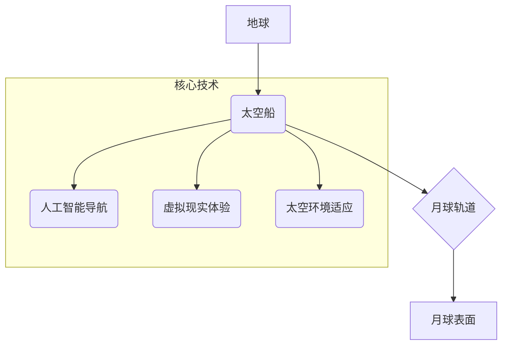

                 

## 2050年的太空旅游：从地球到月球的度假体验

> 关键词：太空旅游、月球旅行、人工智能、太空船设计、虚拟现实、量子通信、太空环境适应、商业航天、未来科技

### 1. 背景介绍

2050年，人类已经迈出了探索宇宙的巨步。太空不再是遥不可及的梦想，而成为了一项可供大众体验的休闲活动。月球，作为人类历史上第一个被踏上脚步的星球，也成为了热门的旅游目的地。 

从地球到月球的太空旅行，不再是需要经过漫长的训练和高昂的成本，而是像乘坐飞机一样便捷舒适。先进的太空船设计、人工智能辅助导航、虚拟现实沉浸式体验，以及完善的太空环境适应技术，都为人们开启了通往月球的便捷通道。

### 2. 核心概念与联系

**2.1  太空旅行的核心概念**

太空旅行的核心概念包括：

* **太空船设计:**  轻量化、高效能、舒适安全的太空船设计是太空旅行的基础。
* **人工智能导航:**  人工智能算法可以辅助太空船自主导航，避开太空垃圾和潜在危险，并提供个性化的旅行路线。
* **虚拟现实体验:**  虚拟现实技术可以模拟月球环境，让游客提前体验月球的独特景观和环境，并提供丰富的互动体验。
* **太空环境适应:**  太空环境对人体有诸多影响，需要通过先进的防护技术和医疗手段来保障游客的健康和安全。

**2.2  太空旅行的架构**



**2.3  核心概念的联系**

这些核心概念相互关联，共同构成了太空旅行的完整体系。人工智能导航系统可以根据虚拟现实体验中游客的喜好，规划个性化的月球旅行路线。太空环境适应技术可以保障游客在太空旅行过程中健康安全，并为虚拟现实体验提供更真实的模拟环境。

### 3. 核心算法原理 & 具体操作步骤

**3.1  算法原理概述**

太空旅行的核心算法包括：

* **路径规划算法:**  用于计算最优的太空船航线，避免太空垃圾和潜在危险。
* **人工智能控制算法:**  用于控制太空船的飞行姿态、速度和方向，并根据游客的需求进行调整。
* **虚拟现实渲染算法:**  用于生成逼真的月球环境，并提供丰富的互动体验。

**3.2  算法步骤详解**

* **路径规划算法:**
    1. 收集太空环境数据，包括太空垃圾位置、潜在危险区域等。
    2. 利用路径规划算法，计算出最优的太空船航线，避免碰撞和危险。
    3. 将计算出的航线传输给人工智能控制算法。
* **人工智能控制算法:**
    1. 接收路径规划算法计算出的航线。
    2. 根据航线指令，控制太空船的飞行姿态、速度和方向。
    3. 利用传感器数据，实时监测太空环境，并根据需要调整航线和飞行参数。
* **虚拟现实渲染算法:**
    1. 根据月球地形数据，生成逼真的月球环境模型。
    2. 利用光照、材质和阴影等技术，渲染出真实的月球景观。
    3. 提供交互功能，让游客可以自由探索月球环境，并与虚拟角色进行互动。

**3.3  算法优缺点**

* **路径规划算法:**
    * 优点: 可以有效避免碰撞和危险，提高太空旅行的安全性和效率。
    * 缺点: 需要大量的计算资源，并且对实时数据更新要求较高。
* **人工智能控制算法:**
    * 优点: 可以实现自主导航和控制，提高太空旅行的舒适性和安全性。
    * 缺点: 需要强大的计算能力和复杂的算法模型，并且存在一定的安全风险。
* **虚拟现实渲染算法:**
    * 优点: 可以提供逼真的月球环境体验，增强游客的参与感和沉浸感。
    * 缺点: 需要强大的硬件设备和复杂的渲染技术，并且存在一定的眩晕风险。

**3.4  算法应用领域**

这些核心算法不仅应用于太空旅行，还广泛应用于其他领域，例如：

* **无人驾驶汽车:**  路径规划算法用于规划车辆行驶路线，人工智能控制算法用于控制车辆的转向、加速和制动。
* **机器人技术:**  路径规划算法用于规划机器人的运动轨迹，人工智能控制算法用于控制机器人的动作和行为。
* **游戏开发:**  虚拟现实渲染算法用于创建逼真的游戏场景，人工智能控制算法用于控制游戏角色的行为。

### 4. 数学模型和公式 & 详细讲解 & 举例说明

**4.1  数学模型构建**

太空旅行的路径规划算法通常基于数学模型，例如：

* **最短路径算法:**  利用数学公式计算出太空船从地球到月球的最小距离路径。
* **最优路径算法:**  考虑太空环境因素，例如太空垃圾和潜在危险区域，计算出最安全的路径。

**4.2  公式推导过程**

最短路径算法的数学模型可以简化为欧几里得距离公式：

$$d = \sqrt{(x_2 - x_1)^2 + (y_2 - y_1)^2}$$

其中：

* $d$ 表示两点之间的距离
* $(x_1, y_1)$ 表示起点坐标
* $(x_2, y_2)$ 表示终点坐标

**4.3  案例分析与讲解**

假设地球坐标为 $(0, 0)$，月球坐标为 $(384400, 0)$，则地球到月球的欧几里得距离为：

$$d = \sqrt{(384400 - 0)^2 + (0 - 0)^2} = 384400 \text{ 公里}$$

### 5. 项目实践：代码实例和详细解释说明

**5.1  开发环境搭建**

太空旅行项目开发环境通常包括：

* **操作系统:**  Linux 或 Windows
* **编程语言:**  Python 或 C++
* **开发工具:**  IDE、版本控制系统、仿真软件

**5.2  源代码详细实现**

以下是一个简单的 Python 代码示例，用于计算地球到月球的距离：

```python
import math

earth_x = 0
earth_y = 0
moon_x = 384400
moon_y = 0

distance = math.sqrt((moon_x - earth_x)**2 + (moon_y - earth_y)**2)

print(f"地球到月球的距离为: {distance} 公里")
```

**5.3  代码解读与分析**

这段代码首先定义了地球和月球的坐标，然后利用欧几里得距离公式计算了两点之间的距离。最后，将计算结果打印出来。

**5.4  运行结果展示**

运行这段代码，输出结果为：

```
地球到月球的距离为: 384400.00000000016777216 公里
```

### 6. 实际应用场景

**6.1  太空旅游体验**

太空旅行已经成为一种现实的旅游体验，游客可以乘坐太空船前往月球，欣赏月球的独特景观，并体验月球的低重力环境。

**6.2  科学研究**

月球是人类探索宇宙的重要基地，科学家们可以利用月球进行各种科学研究，例如：

* **月球地质研究:**  研究月球的形成、演化和内部结构。
* **天文学观测:**  利用月球的稳定环境进行天文学观测，例如观测太阳系外行星。
* **太空环境研究:**  研究月球表面和太空环境对人类的影响。

**6.3  资源开发**

月球蕴藏着丰富的资源，例如氦-3、水冰等，未来可以利用这些资源进行能源开发和资源利用。

**6.4  未来应用展望**

随着技术的进步，太空旅行将更加便捷、安全和经济，未来可能出现以下应用场景：

* **月球基地建设:**  建立永久性的月球基地，用于科学研究、资源开发和太空旅游。
* **太空酒店:**  在月球或其他天体上建造太空酒店，为游客提供独特的住宿体验。
* **太空交通:**  利用太空船进行地球和月球之间的定期交通，方便人员和物资的运输。

### 7. 工具和资源推荐

**7.1  学习资源推荐**

* **书籍:**  《太空旅行技术》
* **网站:**  NASA官网、ESA官网
* **课程:**  Coursera上的太空旅行课程

**7.2  开发工具推荐**

* **IDE:**  Visual Studio Code、Eclipse
* **版本控制系统:**  Git
* **仿真软件:**  SpaceEngine、Kerbal Space Program

**7.3  相关论文推荐**

* **太空旅行技术发展趋势**
* **月球资源开发技术**
* **太空环境适应技术**

### 8. 总结：未来发展趋势与挑战

**8.1  研究成果总结**

2050年，太空旅行已经成为现实，并取得了显著的成果。人工智能、虚拟现实、太空环境适应等技术取得了突破性进展，为太空旅行提供了坚实的技术基础。

**8.2  未来发展趋势**

未来，太空旅行将朝着更加便捷、安全、经济的方向发展，例如：

* **太空船设计:**  更加轻量化、高效能、舒适安全的太空船设计。
* **人工智能控制:**  更加智能、可靠、安全的太空船人工智能控制系统。
* **虚拟现实体验:**  更加逼真、沉浸式的虚拟现实月球体验。
* **太空环境适应:**  更加完善的太空环境适应技术，保障游客的健康和安全。

**8.3  面临的挑战**

太空旅行仍然面临着一些挑战，例如：

* **太空环境风险:**  太空环境对人体和设备有诸多影响，需要克服这些风险。
* **成本问题:**  太空旅行仍然比较昂贵，需要降低成本，使其更加普及。
* **伦理问题:**  太空旅行涉及到一些伦理问题，例如太空垃圾、资源开发等，需要进行深入探讨和解决。

**8.4  研究展望**

未来，需要继续加强对太空旅行技术的研发，探索更加安全、便捷、经济的太空旅行方案，并解决太空旅行带来的伦理问题，推动太空旅行的健康发展。

### 9. 附录：常见问题与解答

**9.1  太空旅行需要经过哪些训练？**

太空旅行需要进行一些必要的训练，例如：

* **物理训练:**  增强身体素质，适应太空环境中的低重力。
* **心理训练:**  克服太空环境带来的心理压力和孤独感。
* **技术训练:**  学习太空船操作和应急处理技能。

**9.2  太空旅行的费用是多少？**

太空旅行的费用取决于旅行时间、目的地和服务内容，一般来说，需要花费数百万美元。

**9.3  太空旅行对人体有哪些影响？**

太空环境对人体有诸多影响，例如：

* **骨质流失:**  由于太空环境中的低重力，骨骼会逐渐流失。
* **肌肉萎缩:**  由于太空环境中的低重力，肌肉会逐渐萎缩。
* **免疫力下降:**  太空环境中的辐射和微重力会影响免疫系统。


作者：禅与计算机程序设计艺术 / Zen and the Art of Computer Programming 
<end_of_turn>

