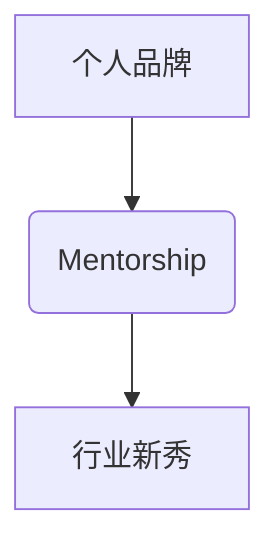

                 

## 建立个人品牌mentorship项目：培养行业新秀

> 关键词：个人品牌，mentorship，行业新秀，技术指导，职业发展，社区建设，知识分享

### 1. 背景介绍

在瞬息万变的科技领域，新技术层出不穷，人才需求也随之不断变化。作为一名资深技术专家，我深切感受到行业新秀的成长与发展对整个科技生态的重要性。然而，许多新秀缺乏经验和指导，难以在激烈的竞争中脱颖而出。

个人品牌mentorship项目应运而生，旨在通过一对一或小组指导，帮助新秀建立个人品牌，提升技术能力，并顺利进入行业。

### 2. 核心概念与联系

#### 2.1 个人品牌

个人品牌是指个人在特定领域或行业内所建立的独特形象和声誉。它涵盖了个人技能、经验、价值观、个性等多方面，并通过各种渠道向外界传播。

#### 2.2 Mentorship

Mentorship 指的是一种经验丰富的导师与有潜力的被指导者之间建立的指导关系。导师通过分享经验、提供建议、建立人脉等方式，帮助被指导者实现个人目标。

#### 2.3 行业新秀

行业新秀是指刚进入科技行业或尚处于职业发展初期的人才。他们通常拥有较强的学习能力和热情，但缺乏经验和行业认知。

**核心概念关系图**



### 3. 核心算法原理 & 具体操作步骤

#### 3.1 算法原理概述

个人品牌mentorship项目的核心算法原理是基于导师-被指导者关系的知识传递和能力提升。通过一对一或小组指导，导师帮助被指导者建立个人品牌，提升技术能力，并顺利进入行业。

#### 3.2 算法步骤详解

1. **导师招募与筛选:** 

    * 确定导师的领域和经验要求。
    * 通过线上平台或线下活动招募潜在导师。
    * 对导师进行筛选，评估其指导能力、行业经验和个人特质。

2. **被指导者申请与匹配:**

    * 新秀通过线上平台提交申请，包括个人简历、技能水平、职业目标等信息。
    * 根据导师的领域和经验，以及新秀的申请信息，进行导师-被指导者匹配。

3. **指导计划制定与执行:**

    * 导师与被指导者共同制定指导计划，包括指导目标、时间安排、沟通方式等。
    * 导师通过分享经验、提供建议、解答疑问等方式，帮助被指导者提升技术能力和职业素养。

4. **项目成果评估与反馈:**

    * 定期评估指导项目的进展情况，并收集导师和被指导者的反馈意见。
    * 根据评估结果，调整指导计划和方法，确保项目效果。

#### 3.3 算法优缺点

**优点:**

* **个性化指导:** 导师可以根据被指导者的具体情况，提供个性化的指导和建议。
* **经验分享:** 导师可以分享其在行业内的经验和教训，帮助被指导者避免走弯路。
* **人脉拓展:** 导师可以帮助被指导者拓展人脉，建立行业关系。

**缺点:**

* **资源匹配:** 找到合适的导师和被指导者可能需要时间和精力。
* **时间成本:** 导师需要投入时间和精力进行指导，这可能对导师的工作造成影响。
* **评估难度:** 评估指导项目的成果可能比较困难，需要考虑多个因素。

#### 3.4 算法应用领域

个人品牌mentorship项目可以应用于各个科技领域，例如软件开发、数据科学、人工智能等。

### 4. 数学模型和公式 & 详细讲解 & 举例说明

#### 4.1 数学模型构建

个人品牌mentorship项目的成功可以看作是一个优化问题，目标是最大化被指导者的个人品牌价值。我们可以用以下数学模型来表示：

$$
V = f(E, S, N)
$$

其中：

* $V$ 代表被指导者的个人品牌价值。
* $E$ 代表导师提供的经验和指导。
* $S$ 代表被指导者的学习能力和努力程度。
* $N$ 代表行业环境和机遇。

#### 4.2 公式推导过程

我们可以进一步推导公式，分析各个因素对个人品牌价值的影响：

$$
\frac{\partial V}{\partial E} > 0
$$

$$
\frac{\partial V}{\partial S} > 0
$$

$$
\frac{\partial V}{\partial N} > 0
$$

这些公式表明，导师提供的经验和指导、被指导者的学习能力和努力程度、以及行业环境和机遇，都对个人品牌价值有正向影响。

#### 4.3 案例分析与讲解

假设有两个新秀，A和B，他们都参加了个人品牌mentorship项目。A的导师经验丰富，指导到位，A自身学习能力强，努力学习。B的导师经验不足，指导不力，B自身学习能力一般，学习态度不够积极。

根据上述公式，我们可以推断，A的个人品牌价值会高于B。

### 5. 项目实践：代码实例和详细解释说明

#### 5.1 开发环境搭建

* 操作系统：Linux/macOS/Windows
* 编程语言：Python
* 开发工具：VS Code/Atom/Sublime Text
* 数据库：MySQL/PostgreSQL

#### 5.2 源代码详细实现

```python
# mentors.py
class Mentor:
    def __init__(self, name, expertise):
        self.name = name
        self.expertise = expertise

    def provide_guidance(self, mentee):
        print(f"{self.name} is providing guidance to {mentee.name} on {self.expertise}")

# mentees.py
class Mentee:
    def __init__(self, name, skills):
        self.name = name
        self.skills = skills

    def learn_from_mentor(self, mentor):
        print(f"{self.name} is learning from {mentor.name}")

# main.py
if __name__ == "__main__":
    mentor = Mentor("John Doe", "Software Development")
    mentee = Mentee("Jane Doe", ["Python", "Java"])

    mentor.provide_guidance(mentee)
    mentee.learn_from_mentor(mentor)
```

#### 5.3 代码解读与分析

* `Mentor` 类代表导师，包含导师姓名和专业领域。
* `Mentee` 类代表被指导者，包含被指导者姓名和技能。
* `provide_guidance()` 方法模拟导师提供指导的行为。
* `learn_from_mentor()` 方法模拟被指导者从导师学习的行为。

#### 5.4 运行结果展示

```
John Doe is providing guidance to Jane Doe on Software Development
Jane Doe is learning from John Doe
```

### 6. 实际应用场景

#### 6.1 开源社区

个人品牌mentorship项目可以帮助开源社区培养新秀，提升社区活跃度和贡献水平。

#### 6.2 企业内部

企业可以建立内部mentorship项目，帮助新员工快速融入团队，提升工作效率和职业发展。

#### 6.3 学术研究

高校可以利用mentorship项目，帮助学生建立个人品牌，提升科研能力和学术竞争力。

#### 6.4 未来应用展望

随着人工智能和虚拟现实技术的不断发展，个人品牌mentorship项目将更加智能化和个性化。未来，我们可以看到：

* 基于人工智能的导师匹配系统，能够更加精准地匹配导师和被指导者。
* 基于虚拟现实技术的沉浸式指导体验，能够更加直观地帮助被指导者理解和掌握知识。

### 7. 工具和资源推荐

#### 7.1 学习资源推荐

* **书籍:**

    * 《The Lean Startup》 by Eric Ries
    * 《Zero to One》 by Peter Thiel
    * 《The Personal MBA》 by Josh Kaufman

* **在线课程:**

    * Coursera
    * edX
    * Udemy

#### 7.2 开发工具推荐

* **代码编辑器:** VS Code, Atom, Sublime Text
* **版本控制系统:** Git
* **项目管理工具:** Trello, Jira

#### 7.3 相关论文推荐

* **Mentoring in the Workplace:** A Review of the Literature
* **The Impact of Mentoring on Career Development**
* **Building a Successful Mentorship Program**

### 8. 总结：未来发展趋势与挑战

#### 8.1 研究成果总结

个人品牌mentorship项目是一个有效的帮助新秀成长和发展的途径。通过导师的指导和经验分享，新秀能够更快地提升技术能力和职业素养，建立个人品牌，并顺利进入行业。

#### 8.2 未来发展趋势

未来，个人品牌mentorship项目将更加智能化、个性化和多元化。人工智能将被广泛应用于导师匹配、指导内容推荐等方面，提供更加精准和有效的指导服务。

#### 8.3 面临的挑战

* **导师资源的获取和管理:** 寻找合适的导师并进行有效管理是一个挑战。
* **项目评估和反馈机制的建立:** 如何评估指导项目的成果并及时反馈给导师和被指导者是一个需要解决的问题。
* **项目的可持续性:** 如何保证项目长期运行和发展是一个需要思考的问题。

#### 8.4 研究展望

未来，我们将继续研究个人品牌mentorship项目的有效性、可持续性和可扩展性，并探索新的应用场景和发展方向。

### 9. 附录：常见问题与解答

* **Q: 如何成为一名导师？**

    * A: 您可以通过线上平台或线下活动报名成为导师。

* **Q: 如何找到合适的导师？**

    * A: 您可以根据自己的领域和需求，在平台上搜索导师信息。

* **Q: 个人品牌mentorship项目对新秀有什么好处？**

    * A: 可以帮助新秀建立个人品牌，提升技术能力，并顺利进入行业。


作者：禅与计算机程序设计艺术 / Zen and the Art of Computer Programming 
<end_of_turn>

