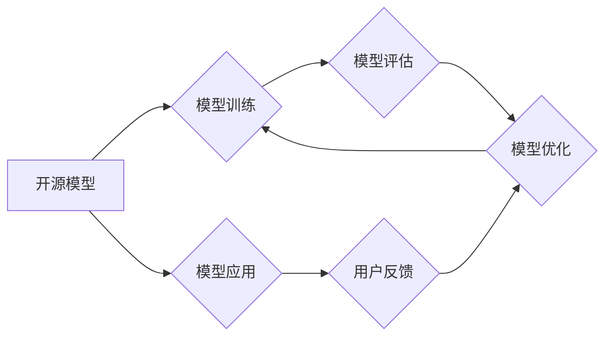

                 

## 开源模型的发展：贾扬清的观点，创新与定制化优势助力开源模型发展

> 关键词：开源模型、深度学习、创新、定制化、贾扬清、模型训练、应用场景

## 1. 背景介绍

近年来，深度学习技术取得了飞速发展，开源模型在人工智能领域扮演着越来越重要的角色。开源模型不仅降低了技术门槛，促进了人工智能技术的普及，也为研究者和开发者提供了丰富的资源和平台，加速了人工智能领域的创新。

贾扬清，一位享誉全球的计算机科学家，深度学习领域的领军人物，对开源模型的发展有着深刻的理解和洞察。他认为，开源模型的未来发展将更加注重创新和定制化，这将推动人工智能技术向更广泛的领域渗透，并为人类社会带来更多福祉。

## 2. 核心概念与联系

**2.1 开源模型**

开源模型是指源代码和模型参数都公开可用的深度学习模型。这些模型通常由研究机构、公司或个人开发，并通过GitHub、HuggingFace等平台共享。

**2.2 深度学习**

深度学习是一种机器学习的子领域，它利用多层神经网络来模拟人类大脑的学习过程。深度学习模型能够从海量数据中自动学习特征，并进行复杂的模式识别和预测。

**2.3 创新与定制化**

创新是指在现有基础上进行新的探索和突破，而定制化是指根据特定需求对开源模型进行修改和调整，使其更适合特定的应用场景。

**2.4 贾扬清的观点**

贾扬清认为，开源模型的发展将遵循以下趋势：

* **模型规模的不断扩大:** 未来将出现更加庞大、更复杂的深度学习模型，这些模型能够处理更复杂的任务，并取得更高的性能。
* **模型训练成本的降低:** 随着硬件设备的进步和训练方法的优化，模型训练的成本将不断降低，使得更多人能够参与到开源模型的开发和应用中。
* **模型应用场景的拓展:** 开源模型将应用于越来越广泛的领域，例如医疗、教育、金融、交通等，为人类社会带来更多价值。
* **创新与定制化的重要性:** 开源模型的发展将更加注重创新和定制化，研究者和开发者将根据特定需求对开源模型进行修改和调整，使其更适合特定的应用场景。

**2.5 架构图**



## 3. 核心算法原理 & 具体操作步骤

**3.1 算法原理概述**

开源模型的训练通常基于深度学习算法，例如卷积神经网络（CNN）、循环神经网络（RNN）和Transformer等。这些算法通过多层神经网络来学习数据中的特征，并进行预测或分类。

**3.2 算法步骤详解**

1. **数据预处理:** 将原始数据进行清洗、转换和格式化，使其适合深度学习模型的训练。
2. **模型构建:** 根据任务需求选择合适的深度学习模型架构，并定义模型参数。
3. **模型训练:** 使用训练数据对模型进行训练，调整模型参数，使其能够准确地预测或分类数据。
4. **模型评估:** 使用测试数据对模型进行评估，衡量模型的性能，例如准确率、召回率和F1-score等。
5. **模型优化:** 根据评估结果对模型进行优化，例如调整模型参数、增加训练数据或改进训练方法等。
6. **模型部署:** 将训练好的模型部署到实际应用场景中，用于进行预测或分类。

**3.3 算法优缺点**

**优点:**

* **高精度:** 深度学习算法能够学习数据中的复杂模式，从而实现高精度的预测或分类。
* **自动化学习:** 深度学习模型能够自动学习特征，无需人工特征工程。
* **可扩展性:** 深度学习模型可以轻松扩展到更大的数据集和更复杂的模型架构。

**缺点:**

* **训练成本高:** 深度学习模型的训练需要大量的计算资源和时间。
* **数据依赖性强:** 深度学习模型的性能取决于训练数据的质量和数量。
* **可解释性差:** 深度学习模型的决策过程难以理解，缺乏可解释性。

**3.4 算法应用领域**

深度学习算法广泛应用于以下领域:

* **图像识别:** 人脸识别、物体检测、图像分类等。
* **自然语言处理:** 机器翻译、文本摘要、情感分析等。
* **语音识别:** 语音转文本、语音合成等。
* **推荐系统:** 商品推荐、内容推荐等。
* **医疗诊断:** 疾病诊断、影像分析等。

## 4. 数学模型和公式 & 详细讲解 & 举例说明

**4.1 数学模型构建**

深度学习模型的数学基础是神经网络。神经网络由多个层组成，每一层包含多个神经元。每个神经元接收来自上一层的输入信号，并通过激活函数进行处理，输出到下一层。

**4.2 公式推导过程**

深度学习模型的训练基于梯度下降算法。梯度下降算法的目标是找到模型参数，使得模型的损失函数最小化。损失函数衡量模型预测结果与真实结果之间的差异。

梯度下降算法的迭代公式如下:

$$
\theta = \theta - \alpha \nabla L(\theta)
$$

其中:

* $\theta$ 是模型参数
* $\alpha$ 是学习率
* $\nabla L(\theta)$ 是损失函数对模型参数的梯度

**4.3 案例分析与讲解**

假设我们训练一个简单的线性回归模型，目标是预测房价。模型的输入特征是房屋面积，输出是房价。

损失函数可以定义为均方误差:

$$
L(\theta) = \frac{1}{n} \sum_{i=1}^{n} (y_i - \hat{y}_i)^2
$$

其中:

* $n$ 是样本数量
* $y_i$ 是第 $i$ 个样本的真实房价
* $\hat{y}_i$ 是模型预测的第 $i$ 个样本的房价

梯度下降算法可以用来更新模型参数，使得损失函数最小化。

## 5. 项目实践：代码实例和详细解释说明

**5.1 开发环境搭建**

* Python 3.7+
* TensorFlow 或 PyTorch 深度学习框架
* Jupyter Notebook 或 VS Code 代码编辑器

**5.2 源代码详细实现**

```python
import tensorflow as tf

# 定义模型
model = tf.keras.models.Sequential([
  tf.keras.layers.Dense(units=1, input_shape=[1])
])

# 编译模型
model.compile(optimizer='sgd', loss='mean_squared_error')

# 训练模型
model.fit(x_train, y_train, epochs=100)

# 评估模型
loss = model.evaluate(x_test, y_test)
print('Loss:', loss)

# 预测房价
new_house_area = [100]
predicted_price = model.predict(new_house_area)
print('Predicted Price:', predicted_price)
```

**5.3 代码解读与分析**

* 代码首先定义了一个简单的线性回归模型，包含一个全连接层。
* 然后，模型被编译，使用随机梯度下降（SGD）优化器和均方误差损失函数。
* 接着，模型使用训练数据进行训练，训练100个 epochs。
* 最后，模型使用测试数据进行评估，并预测一个新房子的价格。

**5.4 运行结果展示**

运行结果将显示模型的损失值和对新房子的价格预测。

## 6. 实际应用场景

开源模型在各个领域都有广泛的应用场景，例如:

* **医疗诊断:** 使用开源模型进行疾病诊断、影像分析等。
* **教育:** 使用开源模型进行智能辅导、个性化学习等。
* **金融:** 使用开源模型进行风险评估、欺诈检测等。
* **交通:** 使用开源模型进行交通预测、自动驾驶等。

**6.4 未来应用展望**

未来，开源模型将应用于更多领域，例如:

* **科学研究:** 使用开源模型进行科学数据分析、药物研发等。
* **艺术创作:** 使用开源模型进行音乐创作、图像生成等。
* **个人生活:** 使用开源模型进行智能家居、个性化推荐等。

## 7. 工具和资源推荐

**7.1 学习资源推荐**

* **深度学习课程:** Coursera、edX、Udacity 等平台提供丰富的深度学习课程。
* **开源模型库:** TensorFlow Hub、PyTorch Hub 等平台提供各种开源模型。
* **技术博客:** 

**7.2 开发工具推荐**

* **Jupyter Notebook:** 用于深度学习模型开发和实验。
* **VS Code:** 代码编辑器，支持深度学习框架的插件。
* **TensorFlow/PyTorch:** 深度学习框架。

**7.3 相关论文推荐**

* **《ImageNet Classification with Deep Convolutional Neural Networks》**
* **《Attention Is All You Need》**
* **《BERT: Pre-training of Deep Bidirectional Transformers for Language Understanding》**

## 8. 总结：未来发展趋势与挑战

**8.1 研究成果总结**

开源模型的发展取得了显著成果，促进了人工智能技术的普及和创新。

**8.2 未来发展趋势**

* 模型规模的不断扩大
* 模型训练成本的降低
* 模型应用场景的拓展
* 创新与定制化的重要性

**8.3 面临的挑战**

* 数据安全和隐私保护
* 模型可解释性和透明度
* 模型公平性和偏见问题
* 伦理和社会影响

**8.4 研究展望**

未来研究将重点关注解决上述挑战，并探索新的开源模型架构和训练方法，推动人工智能技术向更安全、更可靠、更可解释的方向发展。

## 9. 附录：常见问题与解答

**常见问题:**

* 如何选择合适的开源模型？
* 如何对开源模型进行定制化？
* 如何评估开源模型的性能？

**解答:**

* 选择合适的开源模型需要根据具体的应用场景和任务需求进行选择。
* 对开源模型进行定制化可以修改模型架构、调整模型参数、增加训练数据等。
* 评估开源模型的性能可以使用测试数据进行评估，衡量模型的准确率、召回率和F1-score等指标。


作者：禅与计算机程序设计艺术 / Zen and the Art of Computer Programming 
<end_of_turn>

