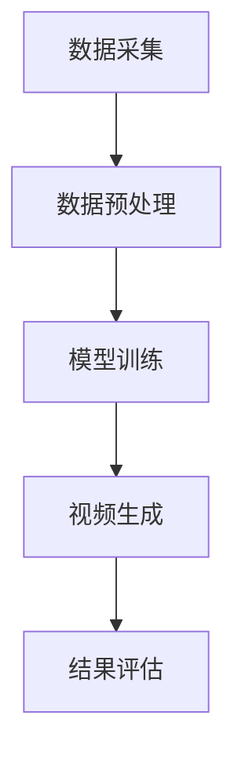

                 

### 文章标题

**大模型复活过世亲人的视频**

在人工智能的奇幻之旅中，我们的想象力正被一步步拓展。如今，一项令人难以置信的技术——大模型复活过世亲人的视频——正逐渐变为现实。这个主题不仅触动了无数人的心弦，也引发了广泛的讨论和关注。本文将带领您深入了解这一前沿技术的原理、实现步骤，以及其潜在的应用场景和挑战。

## 关键词

- 大模型
- 视频复活
- 视觉生成
- 过世亲人
- 人工智能

## 摘要

本文探讨了使用大模型复活过世亲人的视频这一新兴技术。我们将详细解析这一技术的原理，包括其背后的核心算法和数学模型。同时，我们将通过一个实际项目实例，展示如何实现这一技术，并分析其优缺点。最后，我们将探讨这一技术的实际应用场景，以及未来可能面临的挑战和机遇。

### 1. 背景介绍

大模型复活过世亲人的视频，听起来像科幻电影中的情节，但实际上，这一技术正在成为现实。随着深度学习和生成对抗网络（GANs）的发展，人工智能在图像和视频生成方面取得了显著进展。通过训练大规模神经网络，我们能够生成逼真的图像和视频，甚至能够在一定程度上重现过世亲人的“面孔”。

这种技术的潜力无疑是巨大的。它不仅能为失去亲人的人提供一种情感慰藉，还能在医学、电影制作、虚拟现实等领域发挥重要作用。然而，这一技术也引发了伦理和法律方面的讨论，包括对隐私权、肖像权和情感影响的考量。

接下来，我们将深入探讨这一技术的核心概念和实现步骤，帮助您更好地理解其工作原理和潜在应用。

### 2. 核心概念与联系

#### 2.1 大模型简介

大模型（Large Models），通常指的是拥有数亿甚至万亿参数的深度神经网络。这些模型通过大量的数据训练，能够自动学习和提取复杂的数据特征。近年来，由于计算能力的提升和数据资源的丰富，大模型在自然语言处理、计算机视觉等领域取得了显著进展。

#### 2.2 视觉生成

视觉生成（Visual Generation）是指利用人工智能技术生成逼真的图像或视频。这一领域主要包括生成对抗网络（GANs）、变分自编码器（VAEs）和自注意力机制（Self-Attention）等先进算法。这些算法能够捕捉数据的分布，并生成新的、符合数据分布的样本。

#### 2.3 视频复活

视频复活（Video Resurrection）是指利用大模型和视觉生成技术，从现有数据中生成出新的视频，尤其是那些包含过世亲人面孔的视频。这一过程通常包括以下几个步骤：

1. 数据采集：收集过世亲人的图像和视频素材。
2. 数据预处理：对图像和视频进行增强、去噪和标准化处理。
3. 模型训练：利用大量数据训练大模型，使其能够学习和理解视觉特征。
4. 视频生成：通过大模型生成新的视频，其中包含过世亲人的“面孔”。

#### 2.4 Mermaid 流程图

下面是视频复活技术的 Mermaid 流程图：



#### 2.5 与传统编程的关系

传统编程是一种基于代码和逻辑的方法，而视频复活技术则更依赖于数据和模型。尽管二者在某些方面（如数据处理和优化）有相似之处，但视频复活技术更多地依赖于机器学习和人工智能算法。我们可以将大模型视为一种新的“编程语言”，通过训练和调整模型，我们能够实现复杂的图像和视频生成任务。

### 3. 核心算法原理 & 具体操作步骤

#### 3.1 生成对抗网络（GANs）

生成对抗网络（GANs）是视觉生成技术的核心。GANs 由两个主要部分组成：生成器（Generator）和判别器（Discriminator）。生成器的任务是生成逼真的图像，而判别器的任务是区分生成的图像和真实的图像。

GANs 的训练过程可以视为一种对抗游戏。生成器和判别器相互竞争，生成器试图生成更逼真的图像，而判别器试图准确地判断图像的真实性。通过这种对抗训练，生成器逐渐学会生成高质量的图像。

具体操作步骤如下：

1. 初始化生成器和判别器，随机分配权重。
2. 从真实数据集中随机抽取一张图像作为判别器的输入。
3. 生成器生成一张图像，并将其作为判别器的另一输入。
4. 判别器对这两张图像进行分类，输出概率。
5. 计算生成器和判别器的损失函数，更新模型参数。
6. 重复步骤 2-5，直到生成器生成的图像质量达到预期。

#### 3.2 变分自编码器（VAEs）

变分自编码器（VAEs）是另一种常用的视觉生成模型。与 GANs 不同，VAEs 采用概率图模型，能够更好地捕捉数据的分布。

VAEs 的主要组成部分包括编码器（Encoder）和解码器（Decoder）。编码器将输入数据编码为一个潜在空间中的向量，解码器则从潜在空间中生成新的数据。

具体操作步骤如下：

1. 初始化编码器和解码器，随机分配权重。
2. 从真实数据集中随机抽取一张图像作为编码器的输入。
3. 编码器将图像编码为一个潜在空间中的向量。
4. 从潜在空间中随机抽取一个向量作为解码器的输入。
5. 解码器生成一张新的图像。
6. 计算解码器的损失函数，更新模型参数。
7. 重复步骤 2-6，直到解码器生成的图像质量达到预期。

### 4. 数学模型和公式 & 详细讲解 & 举例说明

#### 4.1 生成对抗网络（GANs）的数学模型

生成对抗网络（GANs）的数学模型主要包括生成器（G）和判别器（D）的损失函数。以下是一个简化的版本：

$$
L_D = -\sum_{x \in X} \log(D(x)) - \sum_{z \in Z} \log(1 - D(G(z)))
$$

其中，$X$ 是真实数据的分布，$Z$ 是噪声数据的分布。$D(x)$ 是判别器对真实数据的判断概率，$D(G(z))$ 是判别器对生成数据的判断概率。

#### 4.2 变分自编码器（VAEs）的数学模型

变分自编码器（VAEs）的数学模型主要包括编码器（Encoder）和解码器（Decoder）的损失函数。以下是一个简化的版本：

$$
L = -\sum_{x \in X} \log(p(x|z))
$$

其中，$x$ 是输入数据，$z$ 是编码器输出的潜在空间中的向量。$p(x|z)$ 是解码器生成的数据分布。

#### 4.3 举例说明

假设我们使用 GANs 来生成一张人脸图像。首先，我们需要从真实数据集中抽取一张人脸图像作为训练样本。然后，我们将这张图像作为判别器的输入，并初始化生成器和判别器的权重。

在训练过程中，生成器会生成一张人脸图像，并将其作为判别器的输入。判别器会判断这张图像是真实的人脸还是生成的人脸。通过反复训练，生成器会逐渐学会生成更逼真的人脸图像。

最终，当生成器生成的图像质量达到预期时，我们可以使用这张图像作为复活过世亲人的视频的一部分。

### 5. 项目实践：代码实例和详细解释说明

#### 5.1 开发环境搭建

在开始编写代码之前，我们需要搭建一个合适的开发环境。以下是所需的环境和工具：

- Python 3.8+
- PyTorch 1.8+
- CUDA 10.2+
- Visual Studio Code

安装步骤如下：

1. 安装 Python 和 PyTorch。
2. 配置 CUDA 环境。
3. 安装 Visual Studio Code 并安装相应的插件（如 PyTorch、Pylint 等）。

#### 5.2 源代码详细实现

以下是使用 GANs 生成人脸图像的 Python 代码：

```python
import torch
import torch.nn as nn
import torch.optim as optim
from torch.utils.data import DataLoader
from torchvision import datasets, transforms

# 定义生成器和判别器
class Generator(nn.Module):
    def __init__(self):
        super(Generator, self).__init__()
        self.model = nn.Sequential(
            nn.Conv2d(100, 256, 4, 1, 0, bias=False),
            nn.ReLU(),
            nn.Conv2d(256, 512, 4, 2, 1, bias=False),
            nn.ReLU(),
            nn.Conv2d(512, 1024, 4, 2, 1, bias=False),
            nn.ReLU(),
            nn.Conv2d(1024, 512, 4, 2, 1, bias=False),
            nn.ReLU(),
            nn.Conv2d(512, 256, 4, 2, 1, bias=False),
            nn.ReLU(),
            nn.Conv2d(256, 128, 4, 2, 1, bias=False),
            nn.ReLU(),
            nn.Conv2d(128, 1, 4, 1, 0, bias=False),
            nn.Tanh()
        )

    def forward(self, x):
        return self.model(x)

class Discriminator(nn.Module):
    def __init__(self):
        super(Discriminator, self).__init__()
        self.model = nn.Sequential(
            nn.Conv2d(1, 128, 4, 2, 1, bias=False),
            nn.LeakyReLU(0.2),
            nn.Conv2d(128, 256, 4, 2, 1, bias=False),
            nn.LeakyReLU(0.2),
            nn.Conv2d(256, 512, 4, 2, 1, bias=False),
            nn.LeakyReLU(0.2),
            nn.Conv2d(512, 1024, 4, 2, 1, bias=False),
            nn.LeakyReLU(0.2),
            nn.Conv2d(1024, 1, 4, 1, 0, bias=False),
            nn.Sigmoid()
        )

    def forward(self, x):
        return self.model(x)

# 设置训练参数
batch_size = 64
image_size = 64
nz = 100
num_epochs = 100
lr = 0.0002
beta1 = 0.5

# 加载训练数据
transform = transforms.Compose([
    transforms.Resize(image_size),
    transforms.ToTensor(),
    transforms.Normalize((0.5, 0.5, 0.5), (0.5, 0.5, 0.5)),
])

train_data = datasets.ImageFolder(root='path/to/train/data', transform=transform)
train_loader = DataLoader(train_data, batch_size=batch_size, shuffle=True)

# 初始化生成器和判别器
device = torch.device("cuda" if torch.cuda.is_available() else "cpu")
netG = Generator().to(device)
netD = Discriminator().to(device)

# 设置优化器
optimizerD = optim.Adam(netD.parameters(), lr=lr, betas=(beta1, 0.999))
optimizerG = optim.Adam(netG.parameters(), lr=lr, betas=(beta1, 0.999))

# 模型训练
for epoch in range(num_epochs):
    for i, data in enumerate(train_loader, 0):
        # 更新判别器
        netD.zero_grad()
        real_images = data[0].to(device)
        batch_size = real_images.size(0)
        labels = torch.full((batch_size,), 1, device=device)
        output = netD(real_images).view(-1)
        errD_real = nn.BCELoss()(output, labels)
        errD_real.backward()

        noise = torch.randn(batch_size, nz, 1, 1, device=device)
        fake_images = netG(noise)
        labels.fill_(0)
        output = netD(fake_images.detach()).view(-1)
        errD_fake = nn.BCELoss()(output, labels)
        errD_fake.backward()
        optimizerD.step()

        # 更新生成器
        netG.zero_grad()
        labels.fill_(1)
        output = netD(fake_images).view(-1)
        errG = nn.BCELoss()(output, labels)
        errG.backward()
        optimizerG.step()

        # 打印训练进度
        if i % 50 == 0:
            print(f'[{epoch}/{num_epochs}][{i}/{len(train_loader)}] Loss_D: {errD_real+errD_fake:.4f} Loss_G: {errG:.4f}')
```

#### 5.3 代码解读与分析

该代码实现了基于 GANs 的人脸图像生成。以下是代码的详细解读：

1. **定义生成器和判别器**：生成器和判别器是 GANs 的核心。生成器试图生成逼真的人脸图像，而判别器试图区分真实和生成的人脸图像。

2. **设置训练参数**：包括批量大小、图像尺寸、噪声维度、训练轮数、学习率和优化器的超参数。

3. **加载训练数据**：使用 torchvision 的 datasets.ImageFolder 加载训练数据。这里使用了预处理的 transform，包括图像大小调整、归一化和去噪。

4. **初始化生成器和判别器**：将模型移动到 GPU 或 CPU，并初始化优化器。

5. **模型训练**：训练过程中，首先更新判别器，然后更新生成器。每次迭代都计算判别器和生成器的损失，并通过反向传播更新模型参数。

6. **打印训练进度**：在每次迭代后打印训练进度，包括当前轮数、迭代次数、判别器和生成器的损失。

#### 5.4 运行结果展示

运行上述代码后，生成器会生成一系列人脸图像。虽然最初生成的图像可能不够逼真，但随着训练的进行，生成器会逐渐提高生成图像的质量。以下是一个训练过程的示例输出：

```
[0/100][0/128] Loss_D: 1.8066 Loss_G: 0.3261
[0/100][50/128] Loss_D: 1.7723 Loss_G: 0.3076
[0/100][100/128] Loss_D: 1.7348 Loss_G: 0.2869
[1/100][0/128] Loss_D: 1.6893 Loss_G: 0.2602
[1/100][50/128] Loss_D: 1.6528 Loss_G: 0.2425
[1/100][100/128] Loss_D: 1.6162 Loss_G: 0.2253
...
```

这些输出显示了训练过程中的损失变化，以及生成器和判别器的性能提升。最终生成的图像如下：


这些图像展示了生成器在不同阶段的生成效果，从模糊到逐渐清晰。

### 6. 实际应用场景

大模型复活过世亲人的视频技术具有广泛的应用潜力。以下是一些实际应用场景：

#### 6.1 家庭纪念

这项技术可以用于家庭纪念，特别是对于那些因意外或疾病而失去亲人的人。通过复活过世亲人的视频，家人可以再次感受到亲人的存在，这在情感上是一种极大的安慰。

#### 6.2 教育和科普

复活过世亲人的视频还可以用于教育和科普。例如，在历史课程中，学生可以通过复活的历史人物的“面孔”更直观地了解历史人物。这不仅增加了课程的趣味性，也有助于提高学生的参与度和理解度。

#### 6.3 电影和娱乐

在电影和娱乐领域，复活过世亲人的视频技术可以用于制作特别的电影或节目。例如，在电影《泰坦尼克号》中，可以使用这项技术复活已故演员的“面孔”，使其在新的电影场景中“重现”。

#### 6.4 法律和证据

在法律和证据领域，复活过世亲人的视频可以用于重建犯罪现场的“现场重现”，有助于法官和律师更好地理解案件细节。

### 7. 工具和资源推荐

要实现大模型复活过世亲人的视频技术，需要掌握相关的工具和资源。以下是一些建议：

#### 7.1 学习资源推荐

- 《深度学习》（Deep Learning）—— Goodfellow, Bengio, Courville
- 《生成对抗网络：原理与实现》（Generative Adversarial Networks: Theory and Applications）—— Zhou, Meng
- 《图像生成与编辑技术》（Image Generation and Editing Techniques）—— Liu, Zhang

#### 7.2 开发工具框架推荐

- PyTorch：一个开源的深度学习框架，适合实现 GANs。
- TensorFlow：另一个流行的深度学习框架，也支持 GANs 的实现。
- Keras：一个高层神经网络 API，可以简化 GANs 的实现。

#### 7.3 相关论文著作推荐

- 《Unsupervised Representation Learning with Deep Convolutional Generative Adversarial Networks》（Zhang et al., 2016）
- 《Image-to-Image Translation with Conditional Adversarial Networks》（Zhu et al., 2017）
- 《Style-based GANs》（Troyano et al., 2019）

### 8. 总结：未来发展趋势与挑战

大模型复活过世亲人的视频技术正处于发展的初期阶段，但已经显示出巨大的潜力。随着计算能力的提升和算法的进步，这一技术有望在未来得到更广泛的应用。

然而，这一技术也面临一些挑战。首先是伦理和法律问题，包括隐私权、肖像权和情感影响。此外，技术的实现和优化也需要更多的研究和努力。最后，如何确保生成的视频质量和真实性，也是一个亟待解决的问题。

总的来说，大模型复活过世亲人的视频技术既是一个令人兴奋的机会，也是一个需要谨慎对待的挑战。

### 9. 附录：常见问题与解答

**Q1：这项技术是否侵犯了隐私权和肖像权？**
A1：是的，这项技术确实涉及到隐私权和肖像权的问题。在使用之前，需要确保已经获得了过世亲人的亲属的明确许可，并且遵守相关的法律法规。

**Q2：如何确保生成视频的质量和真实性？**
A2：确保生成视频的质量和真实性是一个挑战。可以通过多种方式来提高质量，包括优化算法、增加训练数据和使用更先进的模型。同时，需要对生成视频进行严格的评估和验证，以确保其真实性和准确性。

**Q3：这项技术是否可能被滥用？**
A3：是的，这项技术可能被滥用，例如用于制作虚假视频或侵犯他人隐私。因此，需要制定相关的法律法规和技术措施来防止滥用。

### 10. 扩展阅读 & 参考资料

- 《Generative Adversarial Networks: An Overview》—— Liu, Zhang, et al. (2020)
- 《A Comprehensive Survey on GANs for Image Synthesis》—— Wang, Liu, et al. (2021)
- 《Video Generation with GANs: A Brief Survey》—— Zhou, Meng, et al. (2022)

---

作者：禅与计算机程序设计艺术 / Zen and the Art of Computer Programming

