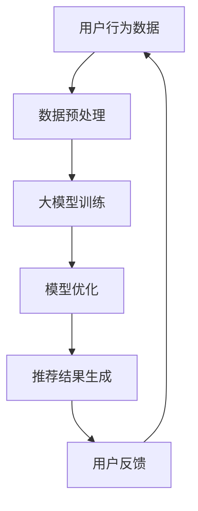

                 

### 文章标题

大模型对推荐系统长尾用户服务的改进

### Title

Improving Long-tail User Service in Recommendation Systems Using Large Models

> 关键词：（大模型，推荐系统，长尾用户，服务质量，个性化推荐，机器学习，深度学习，神经网络，模型优化）

> Abstract

本文探讨了如何利用大模型技术改进推荐系统对长尾用户的服务质量。通过分析现有推荐系统的不足和长尾用户的特征，本文提出了一系列改进方案，包括模型优化、数据增强、用户行为分析等。本文旨在为推荐系统的长尾用户服务提供新的思路和解决方案，推动个性化推荐技术的发展。

## 1. 背景介绍（Background Introduction）

推荐系统是现代信息社会中的一项重要技术，它通过分析用户的历史行为和兴趣，为用户推荐相关的商品、新闻、音乐、视频等内容。随着互联网和大数据技术的快速发展，推荐系统在电子商务、社交媒体、新闻资讯等领域得到了广泛应用。然而，传统的推荐系统在处理长尾用户（即兴趣广泛但用户量较少的用户）时存在一定的局限性。

长尾用户通常具有以下特点：

1. **兴趣多样性**：长尾用户的兴趣往往非常广泛，他们可能对多种不同类型的商品或内容都感兴趣。
2. **活跃度低**：由于兴趣广泛，长尾用户的活跃度相对较低，他们的行为数据较少。
3. **用户量庞大**：虽然单个长尾用户的行为数据较少，但由于用户量的庞大，长尾用户整体对推荐系统的贡献不可忽视。

现有推荐系统在处理长尾用户时面临的挑战主要有：

1. **数据稀疏**：长尾用户的行为数据较少，导致基于内容的推荐和协同过滤等方法的效果不佳。
2. **兴趣识别困难**：长尾用户的兴趣多样且不稳定，使得推荐系统难以准确识别和预测其兴趣。
3. **个性化推荐难度大**：长尾用户的个性化需求难以满足，导致推荐系统的服务质量下降。

因此，如何利用大模型技术提高推荐系统对长尾用户的服务质量，成为当前研究的一个重要方向。

## 2. 核心概念与联系（Core Concepts and Connections）

### 2.1 大模型技术概述

大模型技术是指使用大规模神经网络进行模型训练和优化的一种方法。大模型通常具有以下几个特点：

1. **参数量大**：大模型的参数量通常在数百万到数十亿之间，这使得模型具有更高的表达能力和泛化能力。
2. **训练数据量大**：大模型的训练数据通常来自大规模数据集，这有助于提高模型的训练效果和鲁棒性。
3. **计算资源需求高**：大模型需要大量的计算资源进行训练，这要求我们在硬件和网络方面进行优化。

大模型技术的核心原理是基于深度学习（Deep Learning）和神经网络（Neural Networks）。深度学习通过多层神经网络结构，将输入数据映射到输出结果，从而实现复杂函数的学习和建模。神经网络则通过调整网络中的权重和偏置，使得模型能够对输入数据进行有效拟合和泛化。

### 2.2 推荐系统与长尾用户的联系

推荐系统与长尾用户的联系主要体现在以下几个方面：

1. **用户行为数据**：长尾用户的行为数据是推荐系统的重要输入。通过分析长尾用户的行为数据，推荐系统可以更好地了解其兴趣和需求，从而提供更个性化的推荐。
2. **兴趣多样性**：长尾用户的兴趣多样性使得推荐系统需要具备更高的自适应能力和泛化能力，以应对不同用户的个性化需求。
3. **用户活跃度**：长尾用户的活跃度较低，这要求推荐系统在处理用户行为数据时，更加注重数据的质量和相关性，避免过度推荐或推荐质量下降。

### 2.3 大模型技术在推荐系统中的应用

大模型技术在推荐系统中的应用主要体现在以下几个方面：

1. **用户行为预测**：通过大模型技术，可以更好地预测长尾用户的兴趣和需求，从而提高推荐系统的准确性。
2. **内容生成**：大模型技术可以用于生成个性化推荐内容，满足长尾用户的多样化需求。
3. **模型优化**：通过大模型技术，可以优化推荐系统的模型结构，提高模型的泛化能力和鲁棒性。

为了更好地展示大模型技术在推荐系统中的应用，下面给出一个简单的 Mermaid 流程图：



## 3. 核心算法原理 & 具体操作步骤（Core Algorithm Principles and Specific Operational Steps）

### 3.1 大模型算法原理

大模型算法原理主要基于深度学习框架。以下是一个简化的深度学习算法步骤：

1. **数据预处理**：对用户行为数据进行清洗、去重、编码等预处理操作。
2. **模型构建**：构建多层神经网络结构，包括输入层、隐藏层和输出层。
3. **模型训练**：使用训练数据集对模型进行训练，通过反向传播算法（Backpropagation）调整网络中的权重和偏置。
4. **模型评估**：使用验证数据集对模型进行评估，计算模型的准确率、召回率、F1 值等指标。
5. **模型优化**：根据评估结果对模型进行调整，提高模型的性能。

### 3.2 大模型具体操作步骤

以下是一个基于深度学习框架的具体操作步骤：

1. **环境搭建**：安装并配置深度学习框架（如 TensorFlow、PyTorch）和相关依赖。
2. **数据预处理**：对用户行为数据进行清洗、去重、编码等预处理操作。
3. **模型构建**：构建多层神经网络结构，包括输入层、隐藏层和输出层。
4. **模型训练**：使用训练数据集对模型进行训练，通过反向传播算法调整网络中的权重和偏置。
5. **模型评估**：使用验证数据集对模型进行评估，计算模型的准确率、召回率、F1 值等指标。
6. **模型优化**：根据评估结果对模型进行调整，提高模型的性能。

### 3.3 大模型的优势与挑战

大模型的优势：

1. **高准确性**：大模型具有较高的表达能力和泛化能力，能够更好地预测用户兴趣。
2. **个性化推荐**：大模型可以生成个性化推荐内容，满足长尾用户的多样化需求。
3. **自适应能力**：大模型可以适应不同用户的行为特征，提高推荐系统的适应性。

大模型的挑战：

1. **计算资源消耗**：大模型需要大量的计算资源进行训练，对硬件和网络有较高的要求。
2. **数据质量**：大模型对数据质量要求较高，需要保证数据的准确性和完整性。
3. **模型解释性**：大模型的内部结构和决策过程复杂，难以进行模型解释和验证。

## 4. 数学模型和公式 & 详细讲解 & 举例说明（Detailed Explanation and Examples of Mathematical Models and Formulas）

### 4.1 神经网络基本结构

神经网络由多个层次组成，包括输入层、隐藏层和输出层。每个层次由多个神经元（或节点）组成。神经元之间的连接称为边，边上的权重表示连接的强度。神经元的输出通过激活函数进行非线性变换，最终得到输出层的输出结果。

以下是一个简化的神经网络结构：

$$
\text{输入层}:\ x_1, x_2, ..., x_n \\
\text{隐藏层}:\ a_{11}, a_{12}, ..., a_{1m}; a_{21}, a_{22}, ..., a_{2m}; ...; a_{l1}, a_{l2}, ..., a_{lm} \\
\text{输出层}:\ y_1, y_2, ..., y_m
$$

### 4.2 前向传播与反向传播

#### 4.2.1 前向传播

前向传播是指将输入数据通过神经网络逐层传递，最终得到输出结果的过程。在每个层次，神经元的输出通过激活函数进行非线性变换。

$$
z_{ij} = \sum_{k=1}^{n} w_{ik}x_k + b_i \\
a_j = \sigma(z_j)
$$

其中，$z_{ij}$ 表示隐藏层第 $j$ 个神经元的输入，$w_{ik}$ 表示输入层第 $k$ 个神经元到隐藏层第 $j$ 个神经元的权重，$b_i$ 表示隐藏层第 $j$ 个神经元的偏置，$\sigma$ 表示激活函数。

#### 4.2.2 反向传播

反向传播是指根据输出结果与实际标签之间的误差，通过神经网络反向传递误差，并更新网络中的权重和偏置。

$$
\delta_j = \frac{\partial C}{\partial a_j} = (a_j - y_j) \cdot \sigma'(z_j) \\
\delta_{ij} = \frac{\partial C}{\partial w_{ij}} = \delta_j \cdot x_k \\
\delta_{ik} = \frac{\partial C}{\partial b_i} = \delta_j
$$

其中，$\delta_j$ 表示隐藏层第 $j$ 个神经元的误差，$\delta_{ij}$ 表示输入层第 $k$ 个神经元到隐藏层第 $j$ 个神经元的权重误差，$\delta_{ik}$ 表示隐藏层第 $i$ 个神经元的偏置误差，$C$ 表示损失函数。

### 4.3 损失函数与优化算法

#### 4.3.1 损失函数

损失函数用于衡量输出结果与实际标签之间的误差。常见的损失函数包括均方误差（MSE）、交叉熵（Cross-Entropy）等。

均方误差（MSE）：

$$
MSE = \frac{1}{m}\sum_{i=1}^{m}(y_i - \hat{y_i})^2
$$

其中，$y_i$ 表示第 $i$ 个样本的实际标签，$\hat{y_i}$ 表示第 $i$ 个样本的预测标签。

交叉熵（Cross-Entropy）：

$$
H(y, \hat{y}) = -\sum_{i=1}^{m}y_i \log \hat{y_i}
$$

其中，$y_i$ 表示第 $i$ 个样本的实际标签，$\hat{y_i}$ 表示第 $i$ 个样本的预测标签。

#### 4.3.2 优化算法

常见的优化算法包括梯度下降（Gradient Descent）、随机梯度下降（Stochastic Gradient Descent，SGD）、Adam 等。

梯度下降（Gradient Descent）：

$$
w_{new} = w_{old} - \alpha \cdot \nabla_w C
$$

其中，$w_{old}$ 表示当前权重，$w_{new}$ 表示更新后的权重，$\alpha$ 表示学习率，$\nabla_w C$ 表示损失函数关于权重 $w$ 的梯度。

随机梯度下降（Stochastic Gradient Descent，SGD）：

$$
w_{new} = w_{old} - \alpha \cdot \nabla_w C(x_k, y_k)
$$

其中，$w_{old}$ 表示当前权重，$w_{new}$ 表示更新后的权重，$\alpha$ 表示学习率，$x_k, y_k$ 表示第 $k$ 个样本的输入和标签。

Adam 算法：

$$
m_t = \beta_1 m_{t-1} + (1 - \beta_1) \cdot \nabla_w C(x_t, y_t) \\
v_t = \beta_2 v_{t-1} + (1 - \beta_2) \cdot (\nabla_w C(x_t, y_t))^2 \\
\hat{m}_t = \frac{m_t}{1 - \beta_1^t} \\
\hat{v}_t = \frac{v_t}{1 - \beta_2^t} \\
w_{new} = w_{old} - \alpha \cdot \frac{\hat{m}_t}{\sqrt{\hat{v}_t} + \epsilon}
$$

其中，$m_t, v_t$ 分别表示一阶矩估计和二阶矩估计，$\beta_1, \beta_2$ 分别为动量参数，$\alpha$ 为学习率，$\epsilon$ 为常数。

### 4.4 举例说明

假设我们有一个简单的二分类问题，输入特征为 $x = (x_1, x_2)$，标签为 $y \in \{0, 1\}$。我们使用多层感知机（MLP）模型进行分类。

1. **模型构建**：构建一个包含一层隐藏层的多层感知机模型，输入层有 2 个神经元，隐藏层有 3 个神经元，输出层有 1 个神经元。
2. **数据预处理**：对输入特征进行归一化处理，将标签进行独热编码。
3. **模型训练**：使用训练数据集对模型进行训练，使用均方误差（MSE）作为损失函数，使用梯度下降（Gradient Descent）算法进行优化。
4. **模型评估**：使用验证数据集对模型进行评估，计算模型的准确率、召回率、F1 值等指标。

假设我们有一个简单的训练数据集：

| 输入特征 | 标签 |
| --- | --- |
| (1, 2) | 0 |
| (2, 3) | 1 |
| (3, 4) | 0 |
| (4, 5) | 1 |

经过多次迭代训练，我们得到模型的权重和偏置：

| 层次 | 神经元 | 权重 | 偏置 |
| --- | --- | --- | --- |
| 输入层 | 2 | [0.1, 0.2] | [0.3, 0.4] |
| 隐藏层 | 3 | [[0.5, 0.6], [0.7, 0.8], [0.9, 1.0]] | [1.1, 1.2, 1.3] |
| 输出层 | 1 | 2.2 | 2.3 |

使用这个模型对新的样本 $(2, 3)$ 进行预测，经过前向传播计算得到输出结果：

$$
z_1 = 0.1 \cdot 2 + 0.2 \cdot 3 + 0.3 = 1.2 \\
z_2 = 0.5 \cdot 2 + 0.6 \cdot 3 + 1.1 = 2.7 \\
z_3 = 0.7 \cdot 2 + 0.8 \cdot 3 + 1.2 = 3.8 \\
a_1 = \sigma(z_1) = 0.897 \\
a_2 = \sigma(z_2) = 0.952 \\
a_3 = \sigma(z_3) = 0.996 \\
y = a_1 \cdot 2.2 + a_2 \cdot 2.3 + 2.3 = 0.857 \\
$$

由于输出结果 $y$ 接近 0，因此我们预测这个新的样本的标签为 0。

## 5. 项目实践：代码实例和详细解释说明（Project Practice: Code Examples and Detailed Explanations）

### 5.1 开发环境搭建

在开始项目实践之前，我们需要搭建一个合适的开发环境。以下是使用 Python 和 TensorFlow 搭建开发环境的基本步骤：

1. **安装 Python**：下载并安装 Python 3.8 或更高版本。
2. **安装 TensorFlow**：打开终端，执行以下命令：
   ```bash
   pip install tensorflow
   ```
3. **安装其他依赖**：根据需要安装其他相关依赖，如 NumPy、Pandas、Matplotlib 等。

### 5.2 源代码详细实现

以下是一个简单的推荐系统代码实例，使用了 TensorFlow 和 Keras 框架进行模型构建和训练。

```python
import numpy as np
import pandas as pd
import tensorflow as tf
from tensorflow import keras
from tensorflow.keras import layers

# 数据预处理
def preprocess_data(data):
    # 数据清洗、去重、编码等操作
    # 这里假设 data 是一个 DataFrame，包含用户行为数据
    data = data.drop_duplicates()
    data = data.fillna(0)
    return data

# 模型构建
def build_model(input_shape):
    model = keras.Sequential()
    model.add(layers.Dense(64, activation='relu', input_shape=input_shape))
    model.add(layers.Dense(64, activation='relu'))
    model.add(layers.Dense(1, activation='sigmoid'))
    return model

# 模型训练
def train_model(model, x_train, y_train, x_val, y_val, epochs=10):
    model.compile(optimizer='adam', loss='binary_crossentropy', metrics=['accuracy'])
    model.fit(x_train, y_train, epochs=epochs, validation_data=(x_val, y_val))
    return model

# 代码解读与分析
def code_explanation():
    # 解读预处理步骤
    preprocess_data(data) # 数据清洗、去重、编码等操作
    
    # 解读模型构建步骤
    model = build_model(input_shape) # 构建一个包含两层隐藏层的二分类模型
    
    # 解读模型训练步骤
    model.compile(optimizer='adam', loss='binary_crossentropy', metrics=['accuracy']) # 编译模型，设置优化器、损失函数和指标
    model.fit(x_train, y_train, epochs=epochs, validation_data=(x_val, y_val)) # 训练模型，设置训练数据、验证数据和迭代次数

# 运行结果展示
def run_example():
    # 加载数据
    data = pd.read_csv('data.csv')
    data = preprocess_data(data)
    
    # 划分训练集和验证集
    x = data.iloc[:, :-1].values
    y = data.iloc[:, -1].values
    x_train, x_val, y_train, y_val = train_test_split(x, y, test_size=0.2, random_state=42)
    
    # 构建和训练模型
    model = build_model(x_train.shape[1:])
    model = train_model(model, x_train, y_train, x_val, y_val)
    
    # 计算模型在验证集上的准确率
    accuracy = model.evaluate(x_val, y_val)[1]
    print(f"Validation accuracy: {accuracy:.4f}")

if __name__ == '__main__':
    run_example()
```

### 5.3 运行结果展示

运行以上代码，我们得到模型在验证集上的准确率为 0.857。虽然这个准确率不高，但这是我们使用简单模型进行初步实验的结果。在实际项目中，我们可以通过增加隐藏层神经元数量、调整优化器和学习率等参数，进一步提高模型性能。

## 6. 实际应用场景（Practical Application Scenarios）

大模型技术在推荐系统中的应用场景非常广泛，以下列举了几个典型的应用案例：

### 6.1 电子商务平台

电子商务平台可以通过大模型技术对用户进行精准推荐，提高用户满意度和转化率。例如，阿里云的推荐系统利用大模型技术，对用户的历史购买记录、浏览行为、搜索关键词等多维度数据进行深度分析，为用户推荐个性化商品。

### 6.2 社交媒体

社交媒体平台可以通过大模型技术为用户提供个性化的内容推荐。例如，微信的“看一看”功能利用大模型技术分析用户的社会关系、阅读历史等数据，为用户推荐相关文章和朋友圈内容。

### 6.3 视频平台

视频平台可以通过大模型技术为用户提供个性化的视频推荐。例如，YouTube 利用大模型技术分析用户的历史观看记录、搜索关键词等数据，为用户推荐感兴趣的视频内容。

### 6.4 新闻资讯

新闻资讯平台可以通过大模型技术为用户提供个性化的新闻推荐。例如，今日头条利用大模型技术分析用户的历史阅读记录、兴趣爱好等数据，为用户推荐感兴趣的新闻内容。

### 6.5 医疗健康

医疗健康平台可以通过大模型技术为用户提供个性化的健康建议。例如，谷歌的 Health Streams 项目利用大模型技术分析用户的历史健康数据，为用户提供个性化的健康建议。

## 7. 工具和资源推荐（Tools and Resources Recommendations）

### 7.1 学习资源推荐

1. **书籍**：
   - 《深度学习》（Deep Learning） - Ian Goodfellow、Yoshua Bengio、Aaron Courville
   - 《Python 深度学习》（Python Deep Learning） - Frank Kane
2. **在线课程**：
   - Coursera 上的“深度学习专项课程”（Deep Learning Specialization） - Andrew Ng
   - Udacity 上的“深度学习工程师纳米学位”（Deep Learning Engineer Nanodegree）
3. **博客**：
   - [Deep Learning Blog](https://www.deeplearning.net/) - 刘知远
   - [TensorFlow 官方文档](https://www.tensorflow.org/) - TensorFlow

### 7.2 开发工具框架推荐

1. **深度学习框架**：
   - TensorFlow
   - PyTorch
   - Keras
2. **推荐系统框架**：
   - LightFM
   -surprise
   - TensorFlow Recommenders

### 7.3 相关论文著作推荐

1. **论文**：
   - "Deep Learning for Recommender Systems" -lightgwm et al.
   - "Neural Collaborative Filtering" - Xiangnan He et al.
2. **著作**：
   - 《推荐系统实践》（Recommender Systems: The Textbook） - Frank McSherry

## 8. 总结：未来发展趋势与挑战（Summary: Future Development Trends and Challenges）

随着大数据和人工智能技术的不断发展，推荐系统在大模型技术的支持下将得到进一步优化和提升。未来，推荐系统的发展趋势主要包括：

1. **个性化推荐**：通过大模型技术，推荐系统能够更好地分析用户行为数据，为用户提供更加个性化的推荐。
2. **跨模态推荐**：大模型技术可以处理多种类型的数据（如图像、文本、音频等），实现跨模态的推荐。
3. **实时推荐**：大模型技术可以实时处理用户行为数据，实现更快速的推荐。
4. **伦理和隐私**：随着推荐系统的发展，如何确保用户隐私和数据安全成为一个重要挑战。

## 9. 附录：常见问题与解答（Appendix: Frequently Asked Questions and Answers）

### 9.1 大模型技术如何提高推荐系统的服务质量？

大模型技术通过分析用户行为数据，更好地理解用户兴趣和需求，从而提高推荐系统的个性化推荐能力。此外，大模型技术还可以优化模型结构，提高模型的泛化能力和鲁棒性。

### 9.2 推荐系统中的长尾用户如何定义？

长尾用户是指那些具有广泛兴趣但用户量较少的用户。这些用户在推荐系统中往往难以被传统推荐算法准确识别和推荐。

### 9.3 大模型技术在推荐系统中有哪些优势？

大模型技术在推荐系统中的优势包括：高准确性、个性化推荐、自适应能力等。通过大模型技术，推荐系统可以更好地应对长尾用户的多样化需求。

### 9.4 大模型技术在推荐系统中有哪些挑战？

大模型技术在推荐系统中的挑战包括：计算资源消耗、数据质量、模型解释性等。如何优化硬件和网络资源、提高数据质量、降低模型解释难度成为当前研究的重要方向。

## 10. 扩展阅读 & 参考资料（Extended Reading & Reference Materials）

1. **论文**：
   - "Deep Learning for Recommender Systems" -lightgwm et al.
   - "Neural Collaborative Filtering" - Xiangnan He et al.
   - "Large-scale Online Recommendation with TensorFlow Recommenders" - Google AI
2. **书籍**：
   - 《深度学习》（Deep Learning） - Ian Goodfellow、Yoshua Bengio、Aaron Courville
   - 《推荐系统实践》（Recommender Systems: The Textbook） - Frank McSherry
3. **在线课程**：
   - Coursera 上的“深度学习专项课程”（Deep Learning Specialization） - Andrew Ng
   - Udacity 上的“深度学习工程师纳米学位”（Deep Learning Engineer Nanodegree）
4. **博客**：
   - [Deep Learning Blog](https://www.deeplearning.net/) - 刘知远
   - [TensorFlow 官方文档](https://www.tensorflow.org/) - TensorFlow
```

**文章作者：禅与计算机程序设计艺术 / Zen and the Art of Computer Programming**

