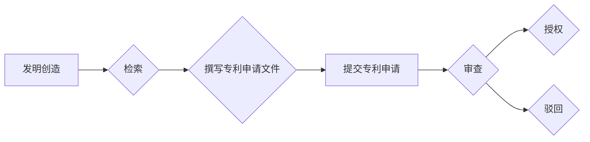

                 

## 技术创新与专利申请：程序员指南

> 关键词：技术创新、专利申请、程序员、软件开发、知识产权、算法、发明、保护

## 1. 背景介绍

在当今科技飞速发展的时代，软件创新日新月异。程序员作为软件开发的基石，往往会产生独创的算法、架构和解决方案。然而，如何有效地保护这些创新成果，使其得到充分的认可和回报，成为了一个重要的议题。专利申请作为一种知识产权保护手段，为程序员提供了有效的方式来保障其技术创新的权益。

然而，对于许多程序员来说，专利申请流程复杂，专业知识要求高，往往感到困惑和畏惧。本指南旨在为程序员提供一个清晰易懂的专利申请指南，帮助他们理解专利申请的流程、核心概念和注意事项，并最终成功申请专利，保护自己的技术创新成果。

## 2. 核心概念与联系

**2.1  知识产权**

知识产权是指个人或组织对知识、创造和发明享有的专属权利。它包括专利权、版权、商标权、商业秘密等多种形式。

**2.2  专利**

专利是一种知识产权，授予发明人对发明进行独占使用的权利。专利申请需要满足一定的条件，例如新颖性、创造性和工业应用性。

**2.3  程序员与专利**

程序员在软件开发过程中，往往会创造出新的算法、数据结构、软件架构等技术创新。这些创新成果可以申请专利保护，保障程序员的知识产权。

**2.4  专利申请流程**

专利申请流程一般包括以下步骤：

1. **发明创造**: 程序员需要进行技术创新，创造出具有新颖性、创造性和工业应用性的发明。
2. **检索**: 程序员需要对已有的技术进行检索，确保其发明是新颖的，没有被他人公开发表过。
3. **撰写专利申请文件**: 程序员需要根据专利申请要求，撰写包括发明说明书、权利要求书和附图等内容的专利申请文件。
4. **提交专利申请**: 程序员将专利申请文件提交至专利局。
5. **审查**: 专利局会对提交的专利申请文件进行审查，判断其是否符合专利申请要求。
6. **授权**: 如果专利申请通过审查，专利局会颁发专利证书，授予程序员专利权。

**2.5  Mermaid 流程图**

## 3. 核心算法原理 & 具体操作步骤

**3.1  算法原理概述**

算法是一种解决特定问题的步骤或规则集合。在软件开发中，程序员会设计和实现各种算法来处理数据、执行操作和实现功能。

**3.2  算法步骤详解**

1. **定义问题**: 首先需要明确要解决的问题是什么。
2. **设计算法**: 根据问题特点，设计出解决问题的步骤或规则。
3. **实现算法**: 将设计好的算法用编程语言实现。
4. **测试算法**: 对实现的算法进行测试，确保其能够正确解决问题。
5. **优化算法**: 如果算法效率不高，可以进行优化，提高其性能。

**3.3  算法优缺点**

不同的算法具有不同的优缺点，需要根据具体问题选择合适的算法。

**3.4  算法应用领域**

算法广泛应用于各个领域，例如：

* **数据处理**: 排序、查找、聚类等
* **人工智能**: 机器学习、深度学习等
* **网络安全**: 加密、解密、身份验证等
* **图形处理**: 渲染、动画等

## 4. 数学模型和公式 & 详细讲解 & 举例说明

**4.1  数学模型构建**

数学模型可以用来描述和分析算法的性能。例如，可以使用时间复杂度和空间复杂度来衡量算法的效率。

**4.2  公式推导过程**

时间复杂度是指算法执行时间随输入规模变化的趋势。例如，线性时间复杂度表示算法执行时间与输入规模成正比。

**时间复杂度公式**:

$$T(n) = O(n)$$

其中，T(n)表示算法执行时间，n表示输入规模。

**4.3  案例分析与讲解**

例如，查找一个元素在排序数组中的算法，其时间复杂度为 O(log n)，因为算法每次将搜索范围缩小一半。

## 5. 项目实践：代码实例和详细解释说明

**5.1  开发环境搭建**

程序员需要选择合适的开发环境，例如：

* **操作系统**: Windows、Linux、macOS等
* **编程语言**: Java、Python、C++等
* **IDE**: Eclipse、IntelliJ IDEA、Visual Studio Code等

**5.2  源代码详细实现**

程序员需要根据算法设计，编写源代码实现算法的功能。

**5.3  代码解读与分析**

程序员需要对编写好的代码进行解读和分析，确保代码能够正确执行算法，并达到预期效果。

**5.4  运行结果展示**

程序员需要运行代码，并观察运行结果，验证算法的正确性和效率。

## 6. 实际应用场景

**6.1  搜索引擎**

搜索引擎使用算法来分析网页内容，并根据用户查询关键词返回相关结果。

**6.2  推荐系统**

推荐系统使用算法来分析用户行为数据，并推荐用户可能感兴趣的内容。

**6.3  图像识别**

图像识别系统使用算法来识别图像中的物体、场景和人物。

**6.4  未来应用展望**

随着人工智能技术的不断发展，算法将在更多领域得到应用，例如：

* **医疗诊断**: 使用算法分析医学影像数据，辅助医生诊断疾病。
* **自动驾驶**: 使用算法控制车辆行驶，实现自动驾驶功能。
* **个性化教育**: 使用算法根据学生的学习情况，提供个性化的学习方案。

## 7. 工具和资源推荐

**7.1  学习资源推荐**

* **书籍**: 《算法导论》、《数据结构与算法分析》
* **在线课程**: Coursera、edX、Udemy等平台提供算法相关课程。
* **网站**: GeeksforGeeks、LeetCode等网站提供算法练习题和学习资源。

**7.2  开发工具推荐**

* **编程语言**: Python、Java、C++等
* **IDE**: Eclipse、IntelliJ IDEA、Visual Studio Code等
* **版本控制系统**: Git

**7.3  相关论文推荐**

* **时间复杂度**: Big O Notation
* **空间复杂度**: Space Complexity
* **算法分析**: Algorithm Analysis

## 8. 总结：未来发展趋势与挑战

**8.1  研究成果总结**

本指南介绍了程序员如何理解和应用专利申请，并提供了算法设计、实现和分析的步骤和工具推荐。

**8.2  未来发展趋势**

随着人工智能、大数据等技术的不断发展，程序员需要不断学习新的算法和技术，并将其应用于实际问题中。

**8.3  面临的挑战**

程序员需要克服算法设计、实现和分析的挑战，并不断提升自己的技术水平。

**8.4  研究展望**

未来，程序员需要更加注重算法的创新和应用，并将其转化为实际的商业价值。

## 9. 附录：常见问题与解答

**9.1  Q: 如何判断我的发明是否具有专利申请价值？**

**A:** 

* **新颖性**: 你的发明是否与现有技术完全不同？
* **创造性**: 你的发明是否需要非显而易见的技术突破？
* **工业应用性**: 你的发明是否可以被实际应用于工业生产或商业领域？

**9.2  Q: 专利申请需要花费多少时间和费用？**

**A:** 专利申请的时间和费用取决于多种因素，例如发明复杂度、申请国家等。一般来说，专利申请需要花费几个月到几年时间，费用也可能从几千元到几万元不等。

**9.3  Q: 我可以自己申请专利吗？**

**A:** 

程序员可以自行申请专利，但建议咨询专业的专利代理机构，以获得更专业的指导和服务。

**9.4  Q: 专利申请成功后，我拥有哪些权利？**

**A:** 专利申请成功后，你将获得对发明进行独占使用的权利，可以阻止他人未经授权使用、复制或销售你的发明。

作者：禅与计算机程序设计艺术 / Zen and the Art of Computer Programming 
<end_of_turn>

