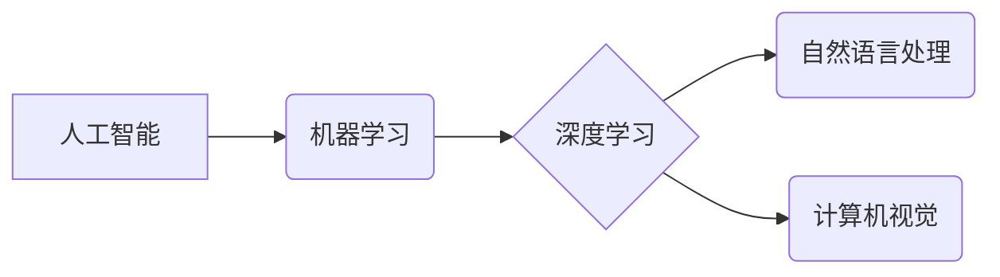

                 

## 技能提升：适应人类计算时代的新需求

> 关键词：人工智能、机器学习、深度学习、自然语言处理、计算机视觉、云计算、大数据

### 1. 背景介绍

人类正处于一个前所未有的技术变革时代。人工智能（AI）的飞速发展，特别是深度学习技术的突破，正在深刻地改变着我们生活和工作的方式。从智能手机的语音助手到自动驾驶汽车，AI已经渗透到我们生活的方方面面。随着技术的不断进步，AI将扮演越来越重要的角色，对未来社会产生深远的影响。

在这个时代，传统的技能体系已经不再适用。为了适应人类计算时代的新需求，我们需要不断学习和提升自己的技能，才能在激烈的竞争中脱颖而出。

### 2. 核心概念与联系

**2.1 人类计算时代**

人类计算时代是指人类与计算机深度融合的时代，人类的智慧和创造力与计算机的计算能力相结合，共同推动社会进步。在这个时代，人工智能将成为重要的工具，帮助人类解决复杂问题，提高工作效率，创造新的价值。

**2.2 核心概念**

* **人工智能 (AI)**：人工智能是指模拟人类智能的计算机系统。它包括各种技术，例如机器学习、深度学习、自然语言处理和计算机视觉等。
* **机器学习 (ML)**：机器学习是人工智能的一个子领域，它使计算机能够从数据中学习，并根据学习到的知识做出预测或决策。
* **深度学习 (DL)**：深度学习是机器学习的一个子领域，它使用多层神经网络来模拟人类大脑的学习过程。深度学习在图像识别、语音识别和自然语言处理等领域取得了突破性的进展。
* **自然语言处理 (NLP)**：自然语言处理是指使计算机能够理解和处理人类语言的技术。NLP应用广泛，例如机器翻译、聊天机器人和文本分析等。
* **计算机视觉 (CV)**：计算机视觉是指使计算机能够“看”和理解图像的技术。计算机视觉应用于图像识别、物体检测和视频分析等领域。

**2.3 核心概念联系**

这些核心概念相互关联，共同构成了人类计算时代的技术基础。例如，深度学习可以用于训练机器学习模型，而机器学习模型可以用于实现自然语言处理和计算机视觉等应用。



### 3. 核心算法原理 & 具体操作步骤

**3.1 算法原理概述**

深度学习算法的核心是多层神经网络。神经网络由许多相互连接的神经元组成，每个神经元接收输入信号，对其进行处理，并输出信号。通过调整神经元之间的连接权重，深度学习算法可以学习数据中的模式和关系。

**3.2 算法步骤详解**

1. **数据预处理**: 将原始数据转换为深度学习算法可以理解的格式。
2. **网络结构设计**: 根据具体任务选择合适的网络结构，例如卷积神经网络（CNN）或循环神经网络（RNN）。
3. **参数初始化**: 为神经网络中的参数赋予初始值。
4. **前向传播**: 将输入数据通过神经网络传递，计算输出结果。
5. **反向传播**: 计算输出结果与真实值的误差，并根据误差调整神经网络的参数。
6. **优化**: 使用优化算法，例如梯度下降，不断调整参数，降低误差。
7. **模型评估**: 使用测试数据评估模型的性能。

**3.3 算法优缺点**

**优点**:

* 能够学习复杂的数据模式。
* 性能优于传统机器学习算法。
* 可用于各种应用领域。

**缺点**:

* 需要大量的训练数据。
* 训练时间长，计算资源消耗大。
* 模型解释性差。

**3.4 算法应用领域**

* **图像识别**: 自动驾驶、医疗诊断、人脸识别等。
* **语音识别**: 语音助手、语音搜索、语音翻译等。
* **自然语言处理**: 机器翻译、聊天机器人、文本摘要等。
* **推荐系统**: 产品推荐、内容推荐、个性化服务等。

### 4. 数学模型和公式 & 详细讲解 & 举例说明

**4.1 数学模型构建**

深度学习算法的核心是神经网络，神经网络可以看作是一个复杂的数学模型。每个神经元可以表示为一个函数，该函数接收多个输入信号，并输出一个信号。神经网络的输出结果是多个神经元输出信号的组合。

**4.2 公式推导过程**

深度学习算法的训练过程是一个优化过程，目标是找到最优的参数，使模型的输出结果与真实值尽可能接近。常用的优化算法是梯度下降算法。梯度下降算法通过计算误差的梯度，不断调整参数，降低误差。

**梯度下降公式**:

$$
\theta = \theta - \alpha \nabla J(\theta)
$$

其中：

* $\theta$ 是模型的参数。
* $\alpha$ 是学习率，控制参数更新的步长。
* $\nabla J(\theta)$ 是损失函数 $J(\theta)$ 的梯度。

**4.3 案例分析与讲解**

假设我们有一个简单的线性回归问题，目标是预测房价。我们可以使用一个单层神经网络来解决这个问题。

* 输入：房屋面积
* 输出：房价

神经网络的结构如下：

* 输入层：一个神经元，接收房屋面积的输入。
* 输出层：一个神经元，输出房价的预测值。

损失函数可以选用均方误差函数：

$$
J(\theta) = \frac{1}{2} \sum_{i=1}^{n} (y_i - \hat{y}_i)^2
$$

其中：

* $y_i$ 是真实房价。
* $\hat{y}_i$ 是模型预测的房价。

使用梯度下降算法，我们可以不断调整神经网络的参数，降低损失函数的值，最终得到一个能够准确预测房价的模型。

### 5. 项目实践：代码实例和详细解释说明

**5.1 开发环境搭建**

为了进行深度学习项目实践，我们需要搭建一个开发环境。常用的开发环境包括：

* **Python**: 深度学习的编程语言。
* **TensorFlow**: 深度学习框架。
* **Keras**: TensorFlow的高级API。
* **PyTorch**: 深度学习框架。

**5.2 源代码详细实现**

以下是一个使用Keras构建一个简单的图像分类模型的代码示例：

```python
from keras.models import Sequential
from keras.layers import Conv2D, MaxPooling2D, Flatten, Dense

# 创建模型
model = Sequential()
model.add(Conv2D(32, (3, 3), activation='relu', input_shape=(28, 28, 1)))
model.add(MaxPooling2D((2, 2)))
model.add(Conv2D(64, (3, 3), activation='relu'))
model.add(MaxPooling2D((2, 2)))
model.add(Flatten())
model.add(Dense(10, activation='softmax'))

# 编译模型
model.compile(optimizer='adam', loss='categorical_crossentropy', metrics=['accuracy'])

# 训练模型
model.fit(x_train, y_train, epochs=10, batch_size=32)

# 评估模型
loss, accuracy = model.evaluate(x_test, y_test)
print('Test loss:', loss)
print('Test accuracy:', accuracy)
```

**5.3 代码解读与分析**

这段代码构建了一个简单的卷积神经网络，用于图像分类任务。

* `Sequential()` 创建了一个顺序模型，层级结构清晰。
* `Conv2D()` 添加卷积层，提取图像特征。
* `MaxPooling2D()` 添加最大池化层，降低特征图尺寸，提高模型鲁棒性。
* `Flatten()` 将多维特征图转换为一维向量。
* `Dense()` 添加全连接层，进行分类。
* `compile()` 编译模型，指定优化器、损失函数和评价指标。
* `fit()` 训练模型，使用训练数据进行训练。
* `evaluate()` 评估模型，使用测试数据评估模型性能。

**5.4 运行结果展示**

训练完成后，我们可以使用测试数据评估模型的性能。模型的准确率越高，说明模型的分类能力越强。

### 6. 实际应用场景

**6.1 自动驾驶**

深度学习算法在自动驾驶领域发挥着重要作用，例如：

* **图像识别**: 识别道路、交通信号灯、行人等。
* **物体检测**: 检测周围环境中的物体，例如车辆、行人、障碍物等。
* **路径规划**: 根据周围环境信息规划行驶路径。

**6.2 医疗诊断**

深度学习算法可以辅助医生进行医疗诊断，例如：

* **图像分析**: 分析X光片、CT扫描图像等，识别肿瘤、骨折等异常。
* **疾病预测**: 根据患者的病史、症状等信息，预测疾病风险。

**6.3 人工智能客服**

深度学习算法可以用于构建人工智能客服系统，例如：

* **自然语言理解**: 理解用户的自然语言输入。
* **对话生成**: 生成自然流畅的对话回复。
* **情感分析**: 分析用户的语气和情绪。

**6.4 未来应用展望**

随着人工智能技术的不断发展，深度学习算法将在更多领域得到应用，例如：

* **个性化教育**: 根据学生的学习情况，提供个性化的学习方案。
* **金融风险管理**: 识别金融风险，降低损失。
* **科学研究**: 加速科学研究，发现新的知识。

### 7. 工具和资源推荐

**7.1 学习资源推荐**

* **在线课程**: Coursera、edX、Udacity等平台提供深度学习相关的在线课程。
* **书籍**: 《深度学习》、《动手学深度学习》等书籍对深度学习有深入的讲解。
* **博客**: TensorFlow官方博客、Keras官方博客等博客提供深度学习的最新资讯和技术分享。

**7.2 开发工具推荐**

* **TensorFlow**: Google开发的开源深度学习框架。
* **Keras**: TensorFlow的高级API，易于使用。
* **PyTorch**: Facebook开发的开源深度学习框架，灵活度高。

**7.3 相关论文推荐**

* **AlexNet**: 《ImageNet Classification with Deep Convolutional Neural Networks》
* **VGGNet**: 《Very Deep Convolutional Networks for Large-Scale Image Recognition》
* **ResNet**: 《Deep Residual Learning for Image Recognition》

### 8. 总结：未来发展趋势与挑战

**8.1 研究成果总结**

近年来，深度学习算法取得了显著的进展，在图像识别、语音识别、自然语言处理等领域取得了突破性的成果。

**8.2 未来发展趋势**

* **模型更深更复杂**: 研究更深更复杂的深度学习模型，提高模型的表达能力和泛化能力。
* **数据更丰富更多样**: 收集和利用更多的数据，包括文本、图像、视频等多种数据类型。
* **算法更高效更鲁棒**: 研究更高效、更鲁棒的深度学习算法，降低训练时间和资源消耗，提高模型的可靠性。

**8.3 面临的挑战**

* **数据隐私**: 深度学习算法需要大量数据进行训练，如何保护数据隐私是一个重要的挑战。
* **模型解释性**: 深度学习模型的决策过程难以解释，如何提高模型的解释性是一个重要的研究方向。
* **公平性与偏见**: 深度学习模型可能存在公平性问题和偏见问题，如何构建公平、公正的深度学习模型是一个重要的挑战。

**8.4 研究展望**

未来，深度学习技术将继续发展，在更多领域发挥重要作用。我们需要不断探索新的算法、新的模型、新的应用场景，推动深度学习技术向更安全、更可靠、更普惠的方向发展。

### 9. 附录：常见问题与解答

**9.1 什么是深度学习？**

深度学习是一种机器学习的子领域，它使用多层神经网络来模拟人类大脑的学习过程。

**9.2 深度学习有哪些应用？**

深度学习应用广泛，例如图像识别、语音识别、自然语言处理、推荐系统等。

**9.3 如何学习深度学习？**

可以通过在线课程、书籍、博客等方式学习深度学习。

**9.4 深度学习有哪些挑战？**

深度学习面临着数据隐私、模型解释性、公平性与偏见等挑战。


作者：禅与计算机程序设计艺术 / Zen and the Art of Computer Programming 
<end_of_turn>

