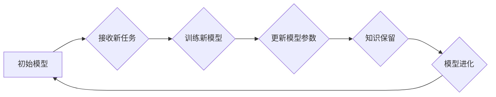

                 

## 持续学习：如何让AI模型不断进化

> 关键词：持续学习、AI模型、模型进化、迁移学习、微调学习、数据增强、在线学习、元学习

## 1. 背景介绍

人工智能（AI）技术近年来取得了飞速发展，深度学习模型在图像识别、自然语言处理、语音识别等领域取得了突破性进展。然而，这些模型通常在训练时需要大量的数据和计算资源，并且在部署后难以适应新的数据分布或任务变化。因此，如何让AI模型不断进化，持续学习新的知识和技能，成为一个重要的研究方向。

持续学习（Continual Learning）是指让AI模型在不断接收到新数据的过程中，能够保留之前学习到的知识，并能够有效地学习新的知识，从而不断提升模型的性能。与传统的监督学习不同，持续学习需要模型具备以下特性：

* **知识保留:** 模型在学习新知识时，能够保留之前学习到的知识，避免知识遗忘。
* **泛化能力:** 模型能够将学习到的知识应用到新的数据和任务中。
* **效率:** 模型的学习过程高效，能够在有限的资源下不断进化。

## 2. 核心概念与联系

持续学习的核心概念包括：

* **任务:** AI模型需要学习的任务，例如图像分类、文本摘要等。
* **数据:** AI模型学习的输入数据，可以是图像、文本、音频等多种形式。
* **模型:** AI模型的结构和参数，例如卷积神经网络、循环神经网络等。
* **知识:** AI模型学习到的知识，可以是特征表示、决策规则等。

持续学习的目标是让模型能够在不断接收到新任务和新数据的过程中，不断更新其知识，并保持其在所有任务上的性能。

**Mermaid 流程图**



## 3. 核心算法原理 & 具体操作步骤

### 3.1  算法原理概述

持续学习算法主要分为以下几类：

* **经验回放:** 在训练新模型时，从之前学习到的数据中随机抽取一部分数据进行训练，帮助模型保留之前学习到的知识。
* **参数隔离:** 将模型参数分为不同的模块，每个模块负责学习不同的任务，避免新任务的学习对旧任务的学习造成干扰。
* **正则化:** 在训练新模型时，使用正则化技术来惩罚模型对旧知识的遗忘，例如Elastic Weight Consolidation (EWC) 和 Synaptic Intelligence (SI)。
* **元学习:** 通过学习如何学习，让模型能够更有效地适应新的任务和数据。

### 3.2  算法步骤详解

以经验回放算法为例，其具体操作步骤如下：

1. **初始化模型:** 训练一个初始模型，并将其用于完成第一个任务。
2. **存储历史数据:** 将训练过程中使用的所有数据存储起来，作为历史数据。
3. **接收新任务:** 当接收到新的任务时，首先使用历史数据进行训练，以帮助模型保留之前学习到的知识。
4. **训练新模型:** 使用新任务的数据和历史数据进行训练，更新模型参数。
5. **评估模型性能:** 使用测试数据评估模型在所有任务上的性能。
6. **重复步骤3-5:** 持续接收新任务和新数据，并重复上述步骤，让模型不断进化。

### 3.3  算法优缺点

**经验回放算法的优点:**

* 简单易实现。
* 可以有效地保留之前学习到的知识。

**经验回放算法的缺点:**

* 容易出现过拟合问题，因为模型可能会过度依赖历史数据。
* 随着任务数量的增加，历史数据的规模会不断增长，存储和处理历史数据会带来挑战。

### 3.4  算法应用领域

持续学习算法在以下领域具有广泛的应用前景:

* **机器人学习:** 允许机器人从不断收集的新数据中学习新的技能和知识，从而更好地适应不同的环境和任务。
* **个性化推荐:** 根据用户的历史行为和偏好，不断更新推荐模型，提供更个性化的推荐服务。
* **医疗诊断:** 允许医疗模型从不断收集的新病例数据中学习新的诊断知识，提高诊断准确率。

## 4. 数学模型和公式 & 详细讲解 & 举例说明

### 4.1  数学模型构建

持续学习算法的数学模型通常基于优化问题，目标是找到一个模型参数，能够在所有任务上取得最佳性能。

假设我们有N个任务，每个任务都有其对应的训练数据和测试数据。模型参数为θ，损失函数为L，则持续学习的目标可以表示为：

$$
\min_{\theta} \sum_{i=1}^{N} L_i(\theta)
$$

其中，$L_i(\theta)$表示第i个任务的损失函数。

### 4.2  公式推导过程

为了实现知识保留，持续学习算法通常会引入正则化项，惩罚模型对旧知识的遗忘。例如，EWC算法的正则化项可以表示为：

$$
\Omega(\theta) = \sum_{j=1}^{M} \lambda_j \left\| \frac{\partial L_j(\theta)}{\partial \theta_j} \right\|^2
$$

其中，$M$是模型参数的数量，$\lambda_j$是每个参数的权重，$\frac{\partial L_j(\theta)}{\partial \theta_j}$是第j个参数对第j个任务损失函数的梯度。

### 4.3  案例分析与讲解

假设我们有一个图像分类模型，需要学习多个不同的图像类别。

使用EWC算法进行持续学习时，在学习新类别时，模型会根据之前学习到的类别的重要性，调整参数更新的幅度，从而避免对旧知识的遗忘。

## 5. 项目实践：代码实例和详细解释说明

### 5.1  开发环境搭建

持续学习算法的开发环境通常需要以下软件：

* Python 3.x
* TensorFlow 或 PyTorch 等深度学习框架
* NumPy、Pandas 等数据处理库

### 5.2  源代码详细实现

以下是一个使用TensorFlow实现经验回放算法的简单代码示例：

```python
import tensorflow as tf

# 定义模型
model = tf.keras.models.Sequential([
    tf.keras.layers.Flatten(input_shape=(28, 28)),
    tf.keras.layers.Dense(128, activation='relu'),
    tf.keras.layers.Dense(10, activation='softmax')
])

# 定义损失函数和优化器
loss_fn = tf.keras.losses.SparseCategoricalCrossentropy()
optimizer = tf.keras.optimizers.Adam()

# 定义经验回放算法
def train_with_replay(model, X_train, y_train, X_replay, y_replay):
    with tf.GradientTape() as tape:
        logits = model(X_train)
        loss = loss_fn(y_train, logits)
    grads = tape.gradient(loss, model.trainable_variables)
    optimizer.apply_gradients(zip(grads, model.trainable_variables))

    logits = model(X_replay)
    replay_loss = loss_fn(y_replay, logits)
    return loss, replay_loss

# 训练模型
for epoch in range(10):
    for batch in range(len(X_train) // 32):
        loss, replay_loss = train_with_replay(model, X_train[batch * 32:(batch + 1) * 32], y_train[batch * 32:(batch + 1) * 32], X_replay, y_replay)
    print(f'Epoch {epoch+1}, Loss: {loss.numpy()}, Replay Loss: {replay_loss.numpy()}')

```

### 5.3  代码解读与分析

该代码示例演示了如何使用TensorFlow实现经验回放算法。

* 首先定义了模型、损失函数和优化器。
* 然后定义了`train_with_replay`函数，该函数接受模型、训练数据、回放数据以及对应的标签作为输入，并使用经验回放算法进行训练。
* 最后，使用循环迭代训练模型，并打印训练过程中的损失值。

### 5.4  运行结果展示

运行该代码示例后，会输出训练过程中的损失值，可以观察到模型在训练过程中损失值逐渐降低，说明模型正在学习。

## 6. 实际应用场景

### 6.1  智能客服

持续学习可以帮助智能客服系统不断学习新的对话技巧和知识，从而提供更自然、更准确的回复。

### 6.2  个性化教育

持续学习可以帮助个性化教育系统根据学生的学习进度和风格，不断调整教学内容和方法，提高学生的学习效率。

### 6.3  医疗诊断

持续学习可以帮助医疗诊断系统从不断收集的新病例数据中学习新的诊断知识，提高诊断准确率。

### 6.4  未来应用展望

持续学习技术在未来将有更广泛的应用前景，例如：

* **自动驾驶:** 允许自动驾驶系统从不断收集的新数据中学习新的驾驶规则和环境知识，提高驾驶安全性。
* **工业自动化:** 允许工业机器人从不断收集的新数据中学习新的操作技能，提高生产效率。
* **金融风险管理:** 允许金融模型从不断收集的新数据中学习新的风险模式，提高风险管理能力。

## 7. 工具和资源推荐

### 7.1  学习资源推荐

* **书籍:**
    * Continual Learning: A Comprehensive Introduction
    * Deep Learning for Continual Learning

* **论文:**
    * Continual Learning with Deep Neural Networks: A Survey
    * Elastic Weight Consolidation: A Simple, Effective, and Theoretically Sound Method for Continual Learning

### 7.2  开发工具推荐

* **TensorFlow:** https://www.tensorflow.org/
* **PyTorch:** https://pytorch.org/

### 7.3  相关论文推荐

* **EWC:** https://arxiv.org/abs/1707.08756
* **SI:** https://arxiv.org/abs/1803.05407
* **GEM:** https://arxiv.org/abs/1906.08994

## 8. 总结：未来发展趋势与挑战

### 8.1  研究成果总结

持续学习技术近年来取得了显著进展，已经发展出多种有效的算法和方法。

### 8.2  未来发展趋势

未来持续学习技术的发展趋势包括:

* **更有效的知识保留方法:** 探索新的方法来帮助模型更有效地保留之前学习到的知识。
* **更鲁棒的模型:** 开发更鲁棒的模型，能够更好地适应新的数据分布和任务变化。
* **更广泛的应用场景:** 将持续学习技术应用到更多领域，例如自动驾驶、工业自动化、金融风险管理等。

### 8.3  面临的挑战

持续学习技术仍然面临一些挑战:

* **知识遗忘问题:** 即使使用最新的算法，模型仍然可能在学习新知识时遗忘之前学习到的知识。
* **数据效率问题:** 持续学习模型通常需要大量的训练数据，这在实际应用中可能难以满足。
* **模型复杂度问题:** 持续学习模型通常比传统的模型更复杂，这会增加模型训练和部署的难度。

### 8.4  研究展望

未来研究将继续探索更有效的持续学习算法和方法，以解决上述挑战，并推动持续学习技术在更多领域得到应用。

## 9. 附录：常见问题与解答

### 9.1  Q: 什么是知识蒸馏？

**A:** 知识蒸馏是一种将知识从一个大型模型（教师模型）转移到一个小型模型（学生模型）的技术。

### 9.2  Q: 持续学习和迁移学习有什么区别？

**A:** 持续学习是指模型在不断接收到新数据和新任务时，能够保留之前学习到的知识，并不断进化。而迁移学习是指将一个模型在某个任务上的知识转移到另一个相关任务上。

### 9.3  Q: 如何评估持续学习模型的性能？

**A:** 持续学习模型的性能通常使用以下指标进行评估：

* **准确率:** 模型在测试数据上的分类准确率。
* **召回率:** 模型在测试数据中正确识别出所有正例的比例。
* **F1-score:** 准确率和召回率的调和平均值。
* **遗忘率:** 模型在学习新任务后，在旧任务上的性能下降幅度。


作者：禅与计算机程序设计艺术 / Zen and the Art of Computer Programming 
<end_of_turn>

