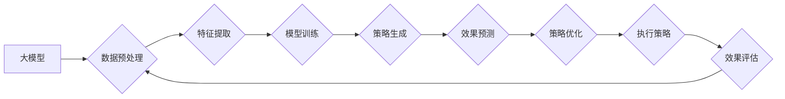

                 

## 探索基于大模型的电商智能营销策略生成与效果预测系统

> 关键词：大模型、电商营销、智能策略生成、效果预测、深度学习、自然语言处理

## 1. 背景介绍

电子商务行业竞争日益激烈，商家需要不断探索新的营销策略以提升销量和用户粘性。传统的营销策略制定往往依赖于经验和数据分析，效率低下，难以适应快速变化的市场环境。近年来，随着深度学习和自然语言处理技术的飞速发展，大模型技术为电商智能营销策略生成与效果预测提供了新的可能性。

大模型，是指在海量数据上训练的具有强大泛化能力的深度学习模型，能够理解和生成复杂的文本、图像和音频内容。其强大的语义理解和文本生成能力，为电商智能营销策略生成提供了强大的工具。

## 2. 核心概念与联系

### 2.1  电商智能营销策略生成

电商智能营销策略生成是指利用大模型技术，根据电商平台的数据和用户行为，自动生成个性化、高效的营销策略，例如：

* **商品推荐:** 根据用户的浏览历史、购买记录和兴趣偏好，推荐合适的商品。
* **广告投放:** 根据用户的画像和行为特征，精准投放广告，提高广告转化率。
* **促销活动策划:** 根据市场趋势和用户需求，策划个性化的促销活动，吸引用户参与。
* **内容营销:** 根据用户兴趣和需求，生成个性化的内容，例如产品介绍、购物指南、优惠信息等。

### 2.2  电商智能营销效果预测

电商智能营销效果预测是指利用大模型技术，预测营销策略的效果，例如：

* **点击率预测:** 预估营销策略的点击率，帮助商家优化广告投放策略。
* **转化率预测:** 预估营销策略的转化率，帮助商家评估营销策略的有效性。
* **销售额预测:** 预估营销策略带来的销售额，帮助商家制定营销预算和目标。

### 2.3  核心架构



## 3. 核心算法原理 & 具体操作步骤

### 3.1  算法原理概述

电商智能营销策略生成与效果预测系统主要基于以下核心算法：

* **自然语言处理 (NLP):** 用于理解和处理用户文本数据，例如用户评论、搜索词等。
* **深度学习 (DL):** 用于训练模型，例如生成策略、预测效果等。
* **强化学习 (RL):** 用于优化策略，例如根据效果反馈调整策略参数。

### 3.2  算法步骤详解

1. **数据收集与预处理:** 收集电商平台的数据，例如用户行为数据、商品信息、市场趋势等，并进行清洗、转换和格式化。
2. **特征提取:** 从数据中提取有价值的特征，例如用户画像、商品属性、营销活动信息等。
3. **模型训练:** 利用深度学习算法，训练模型，例如生成策略模型、效果预测模型等。
4. **策略生成:** 根据用户数据和模型预测，生成个性化的营销策略。
5. **效果预测:** 利用效果预测模型，预测营销策略的效果。
6. **策略优化:** 利用强化学习算法，根据效果反馈，优化策略参数，提高策略效果。
7. **执行策略:** 将优化后的策略执行到电商平台，例如投放广告、推荐商品等。
8. **效果评估:** 评估策略的效果，例如点击率、转化率、销售额等，并反馈到模型训练中，不断优化策略。

### 3.3  算法优缺点

**优点:**

* **自动化:** 自动化营销策略生成和效果预测，提高效率。
* **个性化:** 根据用户数据生成个性化策略，提高用户体验。
* **数据驱动:** 基于数据分析，优化策略，提高效果。

**缺点:**

* **数据依赖:** 需要大量高质量的数据进行训练。
* **模型复杂:** 模型训练和部署需要一定的技术难度。
* **解释性:** 大模型的决策过程难以解释，需要进一步研究。

### 3.4  算法应用领域

* **电商平台:** 个性化商品推荐、精准广告投放、促销活动策划等。
* **营销公司:** 为客户提供智能营销解决方案。
* **品牌企业:** 提升品牌知名度和用户粘性。

## 4. 数学模型和公式 & 详细讲解 & 举例说明

### 4.1  数学模型构建

电商智能营销策略生成与效果预测系统可以构建以下数学模型：

* **策略生成模型:** 可以使用生成式对抗网络 (GAN) 或变分自编码器 (VAE) 等模型，生成个性化的营销策略。
* **效果预测模型:** 可以使用回归模型或分类模型，预测营销策略的效果。

### 4.2  公式推导过程

例如，可以使用线性回归模型预测点击率：

$$
ClickRate = \beta_0 + \beta_1 * Feature1 + \beta_2 * Feature2 + ... + \beta_n * FeatureN + \epsilon
$$

其中：

* ClickRate: 点击率
* Feature1, Feature2, ..., FeatureN: 特征变量
* $\beta_0, \beta_1, \beta_2, ..., \beta_n$: 模型参数
* $\epsilon$: 随机误差

模型参数可以通过最小化均方误差 (MSE) 来训练：

$$
MSE = \frac{1}{N} \sum_{i=1}^{N} (ClickRate_i - \hat{ClickRate}_i)^2
$$

其中：

* $ClickRate_i$: 实际点击率
* $\hat{ClickRate}_i$: 模型预测的点击率

### 4.3  案例分析与讲解

假设我们想要预测某条广告的点击率，特征变量包括广告标题长度、广告内容关键词数量、用户年龄等。通过训练线性回归模型，我们可以得到模型参数，例如：

* $\beta_0 = 0.1$
* $\beta_1 = 0.05$ (广告标题长度)
* $\beta_2 = 0.02$ (广告内容关键词数量)
* $\beta_3 = -0.01$ (用户年龄)

根据这些参数，我们可以预测不同广告的点击率。例如，如果广告标题长度为100字，广告内容关键词数量为5个，用户年龄为30岁，则预测的点击率为：

$$
ClickRate = 0.1 + 0.05 * 100 + 0.02 * 5 - 0.01 * 30 = 0.65
$$

## 5. 项目实践：代码实例和详细解释说明

### 5.1  开发环境搭建

* Python 3.7+
* TensorFlow 2.0+
* PyTorch 1.0+
* Numpy
* Pandas
* Scikit-learn

### 5.2  源代码详细实现

```python
# 导入必要的库
import tensorflow as tf
from tensorflow.keras.models import Sequential
from tensorflow.keras.layers import Dense

# 定义模型
model = Sequential()
model.add(Dense(64, activation='relu', input_shape=(10,)))
model.add(Dense(32, activation='relu'))
model.add(Dense(1))

# 编译模型
model.compile(optimizer='adam', loss='mse')

# 训练模型
model.fit(X_train, y_train, epochs=10)

# 预测点击率
predictions = model.predict(X_test)
```

### 5.3  代码解读与分析

* 首先，我们导入必要的库。
* 然后，我们定义一个简单的深度学习模型，包含三个全连接层。
* 接着，我们编译模型，使用 Adam 优化器和均方误差损失函数。
* 然后，我们训练模型，使用训练数据进行训练。
* 最后，我们使用训练好的模型预测测试数据的点击率。

### 5.4  运行结果展示

训练完成后，我们可以评估模型的性能，例如使用均方根误差 (RMSE) 来衡量预测结果与实际结果之间的差异。

## 6. 实际应用场景

### 6.1  电商平台商品推荐

利用大模型分析用户浏览历史、购买记录和兴趣偏好，生成个性化的商品推荐，提高用户转化率。

### 6.2  精准广告投放

根据用户画像和行为特征，精准投放广告，提高广告点击率和转化率。

### 6.3  促销活动策划

根据市场趋势和用户需求，策划个性化的促销活动，吸引用户参与。

### 6.4  未来应用展望

随着大模型技术的不断发展，电商智能营销策略生成与效果预测系统将有更广泛的应用场景，例如：

* **个性化内容营销:** 根据用户兴趣和需求，生成个性化的内容，例如产品介绍、购物指南、优惠信息等。
* **智能客服:** 利用大模型技术，开发智能客服系统，自动回答用户问题，提高客户服务效率。
* **预测用户行为:** 利用大模型预测用户的购买行为、浏览行为等，帮助商家制定更有效的营销策略。

## 7. 工具和资源推荐

### 7.1  学习资源推荐

* **书籍:**
    * 《深度学习》
    * 《自然语言处理》
    * 《强化学习》
* **在线课程:**
    * Coursera
    * edX
    * Udacity

### 7.2  开发工具推荐

* **TensorFlow:** 开源深度学习框架
* **PyTorch:** 开源深度学习框架
* **HuggingFace:** 提供预训练的大模型和工具

### 7.3  相关论文推荐

* **BERT:** Pre-training of Deep Bidirectional Transformers for Language Understanding
* **GPT-3:** Language Models are Few-Shot Learners
* **AlphaFold:** Highly accurate protein structure prediction with AlphaFold

## 8. 总结：未来发展趋势与挑战

### 8.1  研究成果总结

电商智能营销策略生成与效果预测系统基于大模型技术，能够自动生成个性化策略，提高营销效率和效果。

### 8.2  未来发展趋势

* **模型规模和能力提升:** 大模型规模将继续扩大，模型能力将进一步提升，能够处理更复杂的任务。
* **多模态融合:** 将文本、图像、音频等多模态数据融合，构建更全面的用户画像和营销策略。
* **解释性增强:** 研究大模型的决策过程，提高模型的解释性。
* **隐私保护:** 研究隐私保护技术，保障用户数据安全。

### 8.3  面临的挑战

* **数据质量和可用性:** 大模型训练需要大量高质量的数据，数据获取和清洗是一个挑战。
* **模型训练成本:** 大模型训练成本高昂，需要强大的计算资源。
* **模型解释性:** 大模型的决策过程难以解释，需要进一步研究。
* **伦理问题:** 大模型的应用可能带来伦理问题，例如算法偏见、数据隐私等，需要谨慎考虑。

### 8.4  研究展望

未来，电商智能营销策略生成与效果预测系统将朝着更智能、更个性化、更安全的方向发展，为电商行业带来更大的变革。


## 9. 附录：常见问题与解答

**Q1: 大模型训练需要多少数据？**

A1: 大模型训练需要海量数据，通常需要百万甚至数十亿条数据。

**Q2: 大模型训练需要多少计算资源？**

A2: 大模型训练需要强大的计算资源，例如GPU集群。

**Q3: 如何评估大模型的性能？**

A3: 可以使用各种指标来评估大模型的性能，例如准确率、召回率、F1-score等。

**Q4: 如何解决大模型的解释性问题？**

A4: 可以使用可解释机器学习 (XAI) 技术，例如LIME、SHAP等，来解释大模型的决策过程。

**Q5: 大模型的应用可能带来哪些伦理问题？**

A5: 大模型的应用可能带来算法偏见、数据隐私等伦理问题，需要谨慎考虑。


作者：禅与计算机程序设计艺术 / Zen and the Art of Computer Programming 
<end_of_turn>

