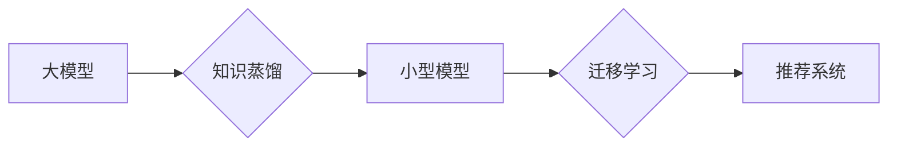

                 

## 推荐系统中的大模型知识蒸馏迁移应用

> 关键词：推荐系统、大模型、知识蒸馏、迁移学习、模型压缩、效率优化

## 1. 背景介绍

推荐系统作为信息过滤和个性化内容展示的重要工具，在电商、社交媒体、视频平台等领域发挥着越来越重要的作用。随着用户需求的不断变化和数据量的激增，推荐系统的准确性和效率面临着新的挑战。大型语言模型（LLM）凭借其强大的语义理解和生成能力，展现出巨大的潜力，可以为推荐系统带来更精准、更个性化的体验。然而，LLM通常具有参数量庞大、计算资源消耗高、部署成本高等缺点，限制了其在实际应用中的推广。

知识蒸馏是一种模型压缩技术，通过将大型模型的知识迁移到小型模型中，可以有效降低模型大小和计算复杂度，同时保持较高的性能。迁移学习则是将预训练模型在源任务上的知识迁移到目标任务，可以加速模型训练和提高模型泛化能力。将知识蒸馏与迁移学习相结合，可以为推荐系统提供一种高效的解决方案，利用大模型的优势，同时克服其局限性。

## 2. 核心概念与联系

### 2.1  知识蒸馏

知识蒸馏是一种模型压缩技术，其核心思想是将大型模型（教师模型）的知识迁移到小型模型（学生模型）中。教师模型通常是一个经过充分训练的复杂模型，拥有丰富的知识和表达能力。学生模型则是一个参数量更小、计算复杂度更低的模型。通过训练学生模型来模仿教师模型的输出，可以将教师模型的知识有效地传递给学生模型。

### 2.2  迁移学习

迁移学习是一种机器学习范式，其核心思想是将预训练模型在源任务上的知识迁移到目标任务。源任务和目标任务通常具有某种相似性，例如图像分类任务和目标检测任务。预训练模型在源任务上经过充分训练，已经学习到了一些通用的特征和知识。通过将预训练模型的权重作为初始值，在目标任务上进行微调，可以加速模型训练和提高模型泛化能力。

### 2.3  知识蒸馏迁移学习

将知识蒸馏与迁移学习相结合，可以为推荐系统提供一种高效的解决方案。

**流程图：**



## 3. 核心算法原理 & 具体操作步骤

### 3.1  算法原理概述

知识蒸馏迁移学习算法的基本原理是：

1. **预训练大模型：** 使用大量的文本数据预训练一个大型语言模型，使其具备强大的语义理解和生成能力。
2. **知识蒸馏：** 将预训练大模型的知识迁移到小型模型中。可以使用交叉熵损失函数，将学生模型的输出与教师模型的输出进行比较，并通过调整学生模型的权重来最小化两者之间的差异。
3. **迁移学习：** 将知识蒸馏后的小型模型作为初始模型，在目标推荐任务上进行微调。可以使用目标任务的数据进行训练，并根据目标任务的具体需求调整模型结构和超参数。

### 3.2  算法步骤详解

1. **数据准备：** 收集并预处理推荐系统所需的训练数据，包括用户行为数据、商品信息数据等。
2. **大模型预训练：** 使用预训练模型库或自行训练一个大型语言模型，例如BERT、GPT等。
3. **知识蒸馏：**
    * 选择一个合适的学生模型架构，例如Transformer、CNN等。
    * 使用交叉熵损失函数，将学生模型的输出与教师模型的输出进行比较。
    * 通过反向传播算法，调整学生模型的权重，使其输出更接近教师模型的输出。
4. **迁移学习：**
    * 将知识蒸馏后的小型模型作为初始模型，加载到目标推荐任务的训练环境中。
    * 使用目标任务的数据进行微调，调整模型结构和超参数。
    * 评估模型性能，并根据评估结果进行进一步的调整和优化。

### 3.3  算法优缺点

**优点：**

* **模型压缩：** 可以有效降低模型大小和计算复杂度，降低部署成本和资源消耗。
* **性能提升：** 可以利用大模型的知识，提高小型模型的性能，例如推荐准确率、召回率等。
* **快速训练：** 可以利用预训练模型的知识，加速模型训练速度，节省时间和资源。

**缺点：**

* **知识迁移效率：** 知识蒸馏的效率取决于教师模型和学生模型的架构和训练方法。
* **数据依赖性：** 知识蒸馏和迁移学习都需要大量的训练数据，否则模型性能可能无法达到预期。
* **模型泛化能力：** 如果源任务和目标任务之间差异较大，模型的泛化能力可能受到影响。

### 3.4  算法应用领域

知识蒸馏迁移学习算法在推荐系统领域具有广泛的应用前景，例如：

* **个性化推荐：** 利用知识蒸馏迁移学习算法，可以构建更精准的个性化推荐模型，为用户推荐更符合其兴趣和需求的内容。
* **冷启动推荐：** 对于新用户或新商品，可以使用知识蒸馏迁移学习算法，利用已有数据的知识，快速构建推荐模型，缓解冷启动问题。
* **跨平台推荐：** 可以将不同平台的用户行为数据进行融合，利用知识蒸馏迁移学习算法，构建跨平台的推荐模型，提供更全面的用户体验。

## 4. 数学模型和公式 & 详细讲解 & 举例说明

### 4.1  数学模型构建

知识蒸馏迁移学习算法的核心数学模型是教师模型和学生模型之间的知识传递过程。

**教师模型输出：**

$$
y_t = f_T(x)
$$

其中：

* $y_t$ 是教师模型的输出，是一个概率分布，表示对输入数据 $x$ 的预测。
* $f_T(x)$ 是教师模型的预测函数。

**学生模型输出：**

$$
y_s = f_S(x)
$$

其中：

* $y_s$ 是学生模型的输出，也是一个概率分布。
* $f_S(x)$ 是学生模型的预测函数。

**知识蒸馏损失函数：**

$$
L_{KD} = KL(y_s || y_t)
$$

其中：

* $KL(y_s || y_t)$ 是KL散度，用于衡量学生模型输出与教师模型输出之间的差异。

### 4.2  公式推导过程

KL散度公式如下：

$$
KL(P || Q) = \sum_x P(x) \log \frac{P(x)}{Q(x)}
$$

其中：

* $P$ 和 $Q$ 是两个概率分布。

将教师模型输出 $y_t$ 和学生模型输出 $y_s$ 代入KL散度公式，即可得到知识蒸馏损失函数。

### 4.3  案例分析与讲解

假设我们有一个电影推荐系统，使用BERT模型作为教师模型，并将其知识蒸馏到一个小型Transformer模型中作为学生模型。

* **教师模型：** 使用大量的电影评论数据预训练BERT模型，使其能够理解电影的语义信息。
* **学生模型：** 使用知识蒸馏损失函数，训练小型Transformer模型来模仿BERT模型的输出。
* **迁移学习：** 将知识蒸馏后的小型Transformer模型作为初始模型，在电影评分数据上进行微调，构建最终的电影推荐模型。

通过这种方式，可以利用BERT模型的知识，构建一个更精准、更高效的电影推荐模型。

## 5. 项目实践：代码实例和详细解释说明

### 5.1  开发环境搭建

* **操作系统：** Ubuntu 20.04
* **Python 版本：** 3.8
* **深度学习框架：** PyTorch 1.8
* **其他依赖库：** transformers, numpy, pandas等

### 5.2  源代码详细实现

```python
import torch
import torch.nn as nn
from transformers import BertModel

class StudentModel(nn.Module):
    def __init__(self, embedding_dim, hidden_dim, num_classes):
        super(StudentModel, self).__init__()
        self.embedding = nn.Embedding(num_embeddings=vocab_size, embedding_dim=embedding_dim)
        self.transformer = nn.Transformer(d_model=embedding_dim, nhead=8, num_encoder_layers=2, num_decoder_layers=2)
        self.fc = nn.Linear(embedding_dim, num_classes)

    def forward(self, x):
        x = self.embedding(x)
        x = self.transformer(x)
        x = self.fc(x[:, 0, :])
        return x

# 加载预训练的BERT模型
teacher_model = BertModel.from_pretrained('bert-base-uncased')

# 初始化学生模型
student_model = StudentModel(embedding_dim=768, hidden_dim=512, num_classes=10)

# 定义知识蒸馏损失函数
criterion = nn.KLDivLoss(reduction='batchmean')

# 训练学生模型
optimizer = torch.optim.Adam(student_model.parameters(), lr=1e-5)
for epoch in range(num_epochs):
    for batch in dataloader:
        inputs, labels = batch
        # 获取教师模型的输出
        teacher_outputs = teacher_model(inputs)
        # 获取学生模型的输出
        student_outputs = student_model(inputs)
        # 计算知识蒸馏损失
        loss = criterion(student_outputs.log_softmax(dim=1), teacher_outputs.softmax(dim=1))
        # 反向传播并更新模型参数
        optimizer.zero_grad()
        loss.backward()
        optimizer.step()

```

### 5.3  代码解读与分析

* **模型架构：** 代码中定义了一个学生模型，其架构基于Transformer，并包含嵌入层、Transformer编码器和分类层。
* **知识蒸馏：** 使用KL散度作为知识蒸馏损失函数，将学生模型的输出与教师模型的输出进行比较。
* **训练过程：** 使用Adam优化器对学生模型进行训练，并使用交叉熵损失函数作为标准损失函数。

### 5.4  运行结果展示

训练完成后，可以评估学生模型的性能，例如准确率、召回率等。

## 6. 实际应用场景

### 6.1  电商推荐

知识蒸馏迁移学习算法可以用于构建更精准的电商商品推荐模型，例如：

* **个性化商品推荐：** 根据用户的浏览历史、购买记录等数据，推荐更符合其兴趣和需求的商品。
* **新品推荐：** 利用知识蒸馏迁移学习算法，可以快速构建新品推荐模型，帮助用户发现新商品。
* **跨平台推荐：** 将不同电商平台的用户行为数据进行融合，构建跨平台的推荐模型，提供更全面的用户体验。

### 6.2  社交媒体推荐

知识蒸馏迁移学习算法可以用于构建更精准的社交媒体内容推荐模型，例如：

* **个性化内容推荐：** 根据用户的兴趣爱好、社交关系等数据，推荐更符合其兴趣的内容。
* **热点话题推荐：** 利用知识蒸馏迁移学习算法，可以快速识别和推荐热门话题，提高用户参与度。
* **广告推荐：** 根据用户的兴趣爱好和行为数据，推荐更精准的广告，提高广告转化率。

### 6.3  视频平台推荐

知识蒸馏迁移学习算法可以用于构建更精准的视频平台内容推荐模型，例如：

* **个性化视频推荐：** 根据用户的观看历史、点赞记录等数据，推荐更符合其兴趣的视频。
* **热门视频推荐：** 利用知识蒸馏迁移学习算法，可以快速识别和推荐热门视频，提高用户粘性。
* **相关视频推荐：** 根据用户观看的视频内容，推荐相关视频，提高用户观看体验。

### 6.4  未来应用展望

随着大模型技术的不断发展，知识蒸馏迁移学习算法在推荐系统领域的应用前景更加广阔。未来，我们可以期待以下应用场景：

* **多模态推荐：** 将文本、图像、音频等多模态数据融合，构建更智能、更全面的推荐模型。
* **实时推荐：** 利用知识蒸馏迁移学习算法，构建实时推荐模型，为用户提供更及时、更精准的推荐服务。
* **个性化解释推荐：** 为用户提供推荐结果的个性化解释，帮助用户理解推荐背后的逻辑，提高用户信任度。

## 7. 工具和资源推荐

### 7.1  学习资源推荐

* **书籍：**
    * Deep Learning by Ian Goodfellow, Yoshua Bengio, and Aaron Courville
    * Natural Language Processing with PyTorch by Yoav Goldberg
* **在线课程：**
    * Stanford CS224N: Natural Language Processing with Deep Learning
    * DeepLearning.AI TensorFlow Specialization
* **博客和论坛：**
    * Towards Data Science
    * Machine Learning Mastery
    * Reddit r/MachineLearning

### 7.2  开发工具推荐

* **深度学习框架：** PyTorch, TensorFlow
* **自然语言处理库：** transformers, spaCy, NLTK
* **数据处理工具：** pandas, NumPy

### 7.3  相关论文推荐

* **Knowledge Distillation** by Geoffrey Hinton et al. (2015)
* **Transfer Learning** by Yoshua Bengio et al. (2006)
* **BERT: Pre-training of Deep Bidirectional Transformers for Language Understanding** by Jacob Devlin et al. (2018)

## 8. 总结：未来发展趋势与挑战

### 8.1  研究成果总结

知识蒸馏迁移学习算法在推荐系统领域取得了显著的成果，可以有效降低模型大小和计算复杂度，同时提高模型性能。

### 8.2  未来发展趋势

* **多模态知识蒸馏：** 将文本、图像、音频等多模态数据融合，构建更智能、更全面的推荐模型。
* **联邦学习知识蒸馏：** 在保护用户隐私的前提下，利用联邦学习技术进行知识蒸馏，构建更安全、更可靠的推荐系统。
* **动态知识蒸馏：** 根据用户行为和环境变化，动态调整知识蒸馏策略，构建更灵活、更适应性的推荐模型。

### 8.3  面临的挑战

* **知识蒸馏效率：** 如何提高知识蒸馏的效率，使其能够更快速、更有效地将大模型的知识迁移到小型模型中。
* **数据依赖性：** 知识蒸馏和迁移学习都需要大量的训练数据，如何解决数据稀缺问题，提高模型泛化能力。
* **模型解释性：** 如何提高知识蒸馏迁移学习模型的解释性，帮助用户理解推荐背后的逻辑，提高用户信任度。

### 8.4  研究展望

未来，我们将继续探索知识蒸馏迁移学习算法在推荐系统领域的应用，并致力于解决上述挑战，构建更智能、更安全、更可靠的推荐系统。

## 9. 附录：常见问题与解答

**Q1：知识蒸馏迁移学习算法的适用场景有哪些？**

**A1：** 知识蒸馏迁移学习算法适用于各种需要利用大模型知识的场景，例如推荐系统、图像分类、自然语言处理等。

**Q2：知识蒸馏迁移学习算法有哪些优缺点？**

**A2：** 优点：模型压缩、性能提升、快速训练。缺点：知识迁移效率、数据依赖性、模型泛化能力。

**Q3：如何选择合适的知识蒸馏迁移学习算法？**

**A3：** 选择合适的算法需要根据具体任务需求、数据规模、模型架构等因素进行综合考虑。

**Q4：知识蒸馏迁移学习算法的未来发展趋势是什么？**

**A4：** 未来发展趋势包括多模态知识蒸馏、联邦学习知识蒸馏、动态知识蒸馏等。


作者：禅与计算机程序设计艺术 / Zen and the Art of Computer Programming<end_of_turn>

