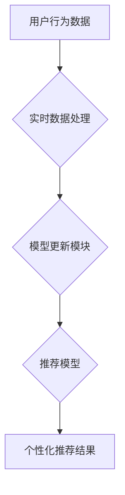

                 

## 推荐系统的实时个性化：AI大模型的动态调整策略

> 关键词：推荐系统、个性化、AI大模型、动态调整、实时性、用户行为、反馈机制、模型更新

## 1. 背景介绍

推荐系统作为互联网时代的重要技术支柱，旨在根据用户的历史行为、偏好和上下文信息，精准推荐符合其需求的内容或商品。传统的推荐系统主要依赖于基于内容的过滤、协同过滤等静态方法，难以满足用户日益增长的个性化需求和实时性要求。

随着人工智能技术的飞速发展，基于深度学习的推荐系统逐渐成为主流趋势。这些系统能够学习用户复杂的特征和潜在需求，提供更精准、更个性化的推荐结果。然而，传统的基于深度学习的推荐系统通常采用静态的模型训练方式，无法及时适应用户行为和偏好的动态变化。

## 2. 核心概念与联系

**2.1  核心概念**

* **实时个性化:** 指的是推荐系统能够根据用户实时行为和上下文信息，动态调整推荐策略，提供个性化且符合当前需求的推荐结果。
* **AI大模型:** 指的是拥有海量参数和强大的学习能力的深度学习模型，例如Transformer、BERT等。
* **动态调整策略:** 指的是根据用户反馈和行为变化，实时更新推荐模型参数和策略，以提高推荐效果。

**2.2  架构图**



**2.3  联系**

实时个性化推荐系统的核心是将AI大模型与动态调整策略相结合。通过实时收集用户行为数据，并将其输入模型更新模块，可以根据用户反馈和行为变化，动态调整推荐模型的参数和策略，从而实现个性化且符合当前需求的推荐结果。

## 3. 核心算法原理 & 具体操作步骤

**3.1  算法原理概述**

动态调整策略的核心是利用机器学习算法，根据用户行为数据不断更新推荐模型的参数。常用的算法包括：

* **在线学习:**  在线学习算法能够实时更新模型参数，并根据新的数据不断调整模型，使其能够适应用户行为的变化。
* **强化学习:** 强化学习算法可以将推荐系统视为一个马尔可夫决策过程，通过奖励机制引导模型学习最优的推荐策略。

**3.2  算法步骤详解**

1. **数据收集:** 收集用户行为数据，例如点击、浏览、购买等行为。
2. **数据预处理:** 对收集到的数据进行清洗、转换和特征工程，使其能够被模型所理解。
3. **模型训练:** 使用在线学习或强化学习算法，训练推荐模型。
4. **模型评估:** 定期评估模型的性能，例如准确率、召回率等指标。
5. **模型更新:** 根据模型评估结果，调整模型参数，使其能够更好地适应用户行为变化。

**3.3  算法优缺点**

* **优点:** 能够实时适应用户行为变化，提供更个性化和精准的推荐结果。
* **缺点:** 需要大量的用户行为数据进行训练，模型更新过程可能比较复杂。

**3.4  算法应用领域**

* **电商推荐:** 根据用户的购买历史和浏览记录，推荐商品。
* **内容推荐:** 根据用户的阅读习惯和兴趣爱好，推荐文章、视频等内容。
* **社交推荐:** 根据用户的社交关系和兴趣爱好，推荐好友、群组等。

## 4. 数学模型和公式 & 详细讲解 & 举例说明

**4.1  数学模型构建**

假设我们有一个推荐系统，它需要根据用户的历史行为数据，预测用户对某个物品的评分。我们可以使用以下数学模型来表示：

$$
r_{ui} = f(h_u, i, \theta)
$$

其中：

* $r_{ui}$ 表示用户 $u$ 对物品 $i$ 的评分。
* $h_u$ 表示用户 $u$ 的历史行为特征向量。
* $i$ 表示物品 $i$ 的特征向量。
* $\theta$ 表示模型参数向量。
* $f$ 表示模型函数，例如线性回归、神经网络等。

**4.2  公式推导过程**

为了训练模型，我们需要使用损失函数来衡量模型预测结果与真实评分之间的差异。常用的损失函数包括均方误差 (MSE) 和交叉熵损失 (Cross-Entropy Loss)。

* **均方误差 (MSE):**

$$
MSE = \frac{1}{N} \sum_{u=1}^{N} \sum_{i=1}^{M} (r_{ui} - \hat{r}_{ui})^2
$$

其中：

* $N$ 表示用户数量。
* $M$ 表示物品数量。
* $\hat{r}_{ui}$ 表示模型预测的用户 $u$ 对物品 $i$ 的评分。

* **交叉熵损失 (Cross-Entropy Loss):**

$$
Cross-Entropy Loss = -\frac{1}{N} \sum_{u=1}^{N} \sum_{i=1}^{M} r_{ui} \log(\hat{r}_{ui}) + (1-r_{ui}) \log(1-\hat{r}_{ui})
$$

通过使用梯度下降算法，我们可以根据损失函数的梯度，不断更新模型参数 $\theta$，使其能够最小化损失函数的值。

**4.3  案例分析与讲解**

假设我们有一个电商平台，需要推荐商品给用户。我们可以使用上述数学模型，根据用户的历史购买记录和浏览记录，预测用户对某个商品的评分。

例如，如果用户 $u$ 之前购买过类似的商品，并且对这些商品的评分较高，那么模型会预测用户 $u$ 对该商品的评分也较高。反之，如果用户 $u$ 之前购买过类似的商品，并且对这些商品的评分较低，那么模型会预测用户 $u$ 对该商品的评分也较低。

## 5. 项目实践：代码实例和详细解释说明

**5.1  开发环境搭建**

* Python 3.6+
* TensorFlow/PyTorch
* Jupyter Notebook

**5.2  源代码详细实现**

```python
import tensorflow as tf

# 定义模型
model = tf.keras.Sequential([
    tf.keras.layers.Embedding(input_dim=vocab_size, output_dim=embedding_dim),
    tf.keras.layers.Flatten(),
    tf.keras.layers.Dense(units=1, activation='sigmoid')
])

# 定义损失函数和优化器
model.compile(loss='binary_crossentropy', optimizer='adam')

# 训练模型
model.fit(x_train, y_train, epochs=10)

# 预测评分
predictions = model.predict(x_test)
```

**5.3  代码解读与分析**

* 该代码示例使用 TensorFlow 库构建了一个简单的推荐模型。
* 模型输入用户和物品的特征向量，输出用户对物品的评分预测。
* 模型使用嵌入层将用户和物品的ID转换为稠密的向量表示。
* 模型使用全连接层和 sigmoid 激活函数进行评分预测。
* 模型使用二元交叉熵损失函数和 Adam 优化器进行训练。

**5.4  运行结果展示**

训练完成后，我们可以使用测试数据评估模型的性能，例如计算准确率、召回率等指标。

## 6. 实际应用场景

**6.1  电商推荐**

* 根据用户的购买历史和浏览记录，推荐商品。
* 根据用户的兴趣爱好和购买偏好，推荐个性化商品套餐。

**6.2  内容推荐**

* 根据用户的阅读习惯和兴趣爱好，推荐文章、视频等内容。
* 根据用户的浏览历史和阅读时长，推荐个性化内容订阅服务。

**6.3  社交推荐**

* 根据用户的社交关系和兴趣爱好，推荐好友、群组等。
* 根据用户的互动行为和社交偏好，推荐个性化社交活动。

**6.4  未来应用展望**

随着人工智能技术的不断发展，实时个性化推荐系统将应用于更广泛的领域，例如：

* **医疗保健:** 根据用户的病史和症状，推荐合适的医疗服务和药物。
* **教育:** 根据学生的学习进度和兴趣爱好，推荐个性化学习内容和课程。
* **金融:** 根据用户的财务状况和风险偏好，推荐个性化的理财产品和投资策略。

## 7. 工具和资源推荐

**7.1  学习资源推荐**

* **书籍:**
    * 《深度学习》 by Ian Goodfellow, Yoshua Bengio, and Aaron Courville
    * 《推荐系统实践》 by  K. Bharat
* **在线课程:**
    * Coursera: Machine Learning by Andrew Ng
    * Udacity: Deep Learning Nanodegree

**7.2  开发工具推荐**

* **TensorFlow:** https://www.tensorflow.org/
* **PyTorch:** https://pytorch.org/
* **Scikit-learn:** https://scikit-learn.org/

**7.3  相关论文推荐**

* **BERT: Pre-training of Deep Bidirectional Transformers for Language Understanding**
* **Attention Is All You Need**
* **Recurrent Neural Network for Sequence Learning**

## 8. 总结：未来发展趋势与挑战

**8.1  研究成果总结**

实时个性化推荐系统是人工智能领域的重要研究方向，取得了显著的成果。AI大模型的应用使得推荐系统能够学习用户更复杂的特征和潜在需求，动态调整策略能够提高推荐效果。

**8.2  未来发展趋势**

* **更强大的AI模型:** 研究更强大的AI模型，例如Transformer、GPT等，以更好地理解用户行为和偏好。
* **更精准的个性化推荐:** 利用用户更细粒度的行为数据，实现更精准的个性化推荐。
* **更实时化的推荐:** 利用实时数据流和边缘计算技术，实现更实时化的推荐。
* **更可解释的推荐:** 研究更可解释的推荐算法，帮助用户理解推荐结果背后的逻辑。

**8.3  面临的挑战**

* **数据隐私保护:** 如何保护用户隐私数据，同时实现个性化推荐是一个重要的挑战。
* **模型可解释性:** 如何提高推荐模型的可解释性，帮助用户理解推荐结果背后的逻辑是一个重要的挑战。
* **算法公平性:** 如何避免推荐算法产生偏见，确保推荐结果公平公正是一个重要的挑战。

**8.4  研究展望**

未来，实时个性化推荐系统将朝着更智能、更精准、更可解释的方向发展。研究者将继续探索更强大的AI模型、更精准的个性化推荐方法、更实时化的推荐技术，以及更可解释的推荐算法，以更好地服务于用户需求。

## 9. 附录：常见问题与解答

**9.1  Q: 如何收集用户行为数据？**

**A:** 可以通过以下方式收集用户行为数据：

* 网站和应用程序的日志记录
* 用户反馈和评论
* 用户调查和问卷

**9.2  Q: 如何处理用户行为数据？**

**A:** 需要对收集到的数据进行清洗、转换和特征工程，使其能够被模型所理解。

**9.3  Q: 如何评估推荐模型的性能？**

**A:** 可以使用以下指标评估推荐模型的性能：

* **准确率:** 推荐结果与真实评分的匹配程度。
* **召回率:** 推荐结果包含真实评分的比例。
* **NDCG:** 归一化折扣累计增益，衡量推荐结果的排序质量。

**9.4  Q: 如何保证推荐结果的公平性？**

**A:** 需要避免推荐算法产生偏见，确保推荐结果公平公正。可以采用以下方法：

* 使用公平性指标评估推荐算法。
* 对推荐算法进行调优，以减少偏见。
* 采用多模型融合技术，降低单一模型的偏见影响。


作者：禅与计算机程序设计艺术 / Zen and the Art of Computer Programming 
<end_of_turn>

