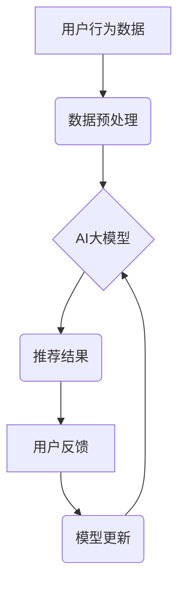

                 

## 推荐系统的时效性：AI大模型的动态调整策略

> 关键词：推荐系统、AI大模型、动态调整、时效性、冷启动、数据漂移、模型更新、在线学习

## 1. 背景介绍

推荐系统作为互联网时代的重要组成部分，在电商、社交媒体、内容平台等领域发挥着越来越重要的作用。传统的推荐系统主要依赖于基于内容、协同过滤等静态算法，但随着用户行为的复杂性和数据规模的不断增长，这些算法逐渐难以满足用户的个性化需求和推荐系统的时效性要求。

近年来，基于深度学习的AI大模型在推荐系统领域取得了显著的成果，其强大的学习能力和泛化能力能够更好地捕捉用户兴趣和物品特征，从而提供更精准、个性化的推荐结果。然而，AI大模型的训练通常需要海量数据和大量的计算资源，并且模型一旦训练完成，其性能会随着时间推移而下降，这主要是因为用户行为和物品信息在不断变化，导致模型与实际情况的偏差逐渐增大。

因此，如何保证AI大模型在推荐系统中的时效性，使其能够适应不断变化的用户需求和数据环境，成为一个重要的研究课题。

## 2. 核心概念与联系

**2.1 核心概念**

* **推荐系统:** 利用数据挖掘、机器学习等技术，根据用户的历史行为、偏好等信息，预测用户可能感兴趣的物品，并将其推荐给用户。
* **AI大模型:** 指规模庞大、参数数量众多、训练数据量巨大的深度学习模型，例如Transformer、BERT等。
* **动态调整:** 指根据实时数据和用户反馈，对推荐系统进行动态更新和优化，以提高推荐系统的时效性和准确性。

**2.2 架构关系**



**2.3 核心联系**

AI大模型在推荐系统中扮演着核心角色，其强大的学习能力能够捕捉用户兴趣和物品特征，生成精准的推荐结果。然而，AI大模型的训练数据和模型结构都是静态的，无法及时适应用户行为和数据环境的变化。因此，需要通过动态调整策略，根据实时数据和用户反馈，不断更新和优化AI大模型，以保证推荐系统的时效性和准确性。

## 3. 核心算法原理 & 具体操作步骤

**3.1 算法原理概述**

动态调整策略的核心是利用在线学习算法，实时更新AI大模型的参数，使其能够适应不断变化的用户需求和数据环境。在线学习算法的特点是：

* **迭代更新:**  根据每次接收到的新数据，对模型参数进行微调更新。
* **实时性:**  能够实时处理新数据，并及时更新模型，从而保证推荐系统的时效性。
* **资源效率:**  相比于批量更新，在线学习算法对计算资源的需求更低。

**3.2 算法步骤详解**

1. **数据收集:**  实时收集用户行为数据，例如点击、浏览、购买等行为。
2. **数据预处理:**  对收集到的数据进行清洗、转换和特征提取，使其能够被AI大模型理解。
3. **模型训练:**  利用在线学习算法，根据预处理后的数据，对AI大模型的参数进行迭代更新。
4. **推荐生成:**  利用更新后的AI大模型，生成推荐结果并展示给用户。
5. **用户反馈收集:**  收集用户对推荐结果的反馈，例如点击、评分、购买等行为。
6. **模型评估:**  根据用户反馈，评估模型的性能，并根据评估结果调整模型训练参数。

**3.3 算法优缺点**

* **优点:**  能够实时适应用户需求和数据环境的变化，提高推荐系统的时效性和准确性。
* **缺点:**  需要实时收集和处理大量数据，对系统资源要求较高。

**3.4 算法应用领域**

* **电商推荐:**  根据用户的购买历史、浏览记录等信息，推荐相关的商品。
* **内容推荐:**  根据用户的阅读习惯、兴趣爱好等信息，推荐相关的文章、视频等内容。
* **社交推荐:**  根据用户的社交关系、兴趣爱好等信息，推荐相关的用户或群组。

## 4. 数学模型和公式 & 详细讲解 & 举例说明

**4.1 数学模型构建**

假设我们有一个推荐系统，其目标是预测用户 $u$ 对物品 $i$ 的评分 $r_{ui}$。我们可以使用以下数学模型来表示：

$$r_{ui} = f(u, i, \theta)$$

其中：

* $r_{ui}$ 是用户 $u$ 对物品 $i$ 的评分。
* $u$ 是用户 $u$ 的特征向量。
* $i$ 是物品 $i$ 的特征向量。
* $\theta$ 是模型参数向量。
* $f$ 是一个映射函数，用于将用户特征、物品特征和模型参数映射到评分。

**4.2 公式推导过程**

在线学习算法通常使用梯度下降法来更新模型参数。梯度下降法的核心思想是：沿着梯度的负方向更新模型参数，从而使得模型的损失函数最小化。

损失函数通常定义为预测评分与真实评分之间的差值，例如均方误差 (MSE)：

$$L(\theta) = \frac{1}{N} \sum_{u, i} (r_{ui} - f(u, i, \theta))^2$$

其中：

* $N$ 是训练样本的数量。

梯度下降法的更新规则为：

$$\theta = \theta - \alpha \nabla L(\theta)$$

其中：

* $\alpha$ 是学习率，控制着参数更新的步长。
* $\nabla L(\theta)$ 是损失函数 $L(\theta)$ 的梯度。

**4.3 案例分析与讲解**

假设我们使用协同过滤算法构建推荐系统，并使用梯度下降法进行在线学习。

* 用户特征：用户年龄、性别、职业等。
* 物品特征：物品类别、价格、评分等。
* 模型参数：用户-物品评分矩阵。

每次收到新的用户行为数据，例如用户 $u$ 对物品 $i$ 的评分，我们就可以利用梯度下降法更新用户-物品评分矩阵的参数，从而提高模型的预测准确性。

## 5. 项目实践：代码实例和详细解释说明

**5.1 开发环境搭建**

* Python 3.6+
* TensorFlow/PyTorch
* Jupyter Notebook

**5.2 源代码详细实现**

```python
import tensorflow as tf

# 定义模型
model = tf.keras.Sequential([
    tf.keras.layers.Embedding(input_dim=vocab_size, output_dim=embedding_dim),
    tf.keras.layers.Dot(axes=1),
    tf.keras.layers.Activation('sigmoid')
])

# 定义损失函数和优化器
loss_fn = tf.keras.losses.BinaryCrossentropy()
optimizer = tf.keras.optimizers.Adam(learning_rate=0.001)

# 定义训练循环
def train_step(data):
    with tf.GradientTape() as tape:
        predictions = model(data)
        loss = loss_fn(data['label'], predictions)
    gradients = tape.gradient(loss, model.trainable_variables)
    optimizer.apply_gradients(zip(gradients, model.trainable_variables))

# 加载数据并训练模型
# ...

# 预测评分
def predict_rating(user_id, item_id):
    # ...
```

**5.3 代码解读与分析**

* 代码首先定义了一个基于嵌入层的推荐模型，该模型将用户和物品映射到低维向量空间，并使用点积计算用户对物品的评分。
* 然后定义了损失函数和优化器，用于训练模型。
* 训练循环使用梯度下降法更新模型参数。
* 预测评分函数根据用户和物品的ID，预测用户对物品的评分。

**5.4 运行结果展示**

* 通过训练模型并测试其预测准确率，可以评估模型的性能。
* 可以使用指标如RMSE、MAE等来衡量模型的预测精度。

## 6. 实际应用场景

**6.1 电商推荐**

* 根据用户的购买历史、浏览记录等信息，推荐相关的商品。
* 个性化推荐商品，提高用户购买意愿。

**6.2 内容推荐**

* 根据用户的阅读习惯、兴趣爱好等信息，推荐相关的文章、视频等内容。
* 个性化推荐内容，提高用户阅读体验。

**6.3 社交推荐**

* 根据用户的社交关系、兴趣爱好等信息，推荐相关的用户或群组。
* 帮助用户发现新的朋友和兴趣爱好。

**6.4 未来应用展望**

* 结合多模态数据，例如文本、图像、音频等，构建更精准的推荐模型。
* 利用强化学习算法，优化推荐策略，提高推荐效果。
* 将推荐系统与其他人工智能技术结合，例如自然语言处理、计算机视觉等，构建更智能的应用场景。

## 7. 工具和资源推荐

**7.1 学习资源推荐**

* **书籍:**
    * 《推荐系统》 -  Koren, Yehuda
    * 《深度学习》 -  Goodfellow, Bengio, Courville
* **在线课程:**
    * Coursera: Machine Learning
    * Udacity: Deep Learning Nanodegree
* **博客和网站:**
    * Towards Data Science
    * Machine Learning Mastery

**7.2 开发工具推荐**

* **Python:**  Python 是推荐系统开发的常用语言，拥有丰富的机器学习库和工具。
* **TensorFlow/PyTorch:** TensorFlow 和 PyTorch 是流行的深度学习框架，可以用于构建推荐模型。
* **Scikit-learn:** Scikit-learn 是 Python 的机器学习库，提供了一些常用的推荐算法。

**7.3 相关论文推荐**

* **Collaborative Filtering for Implicit Feedback Datasets** -  Rendle, S., et al.
* **Deep Learning for Recommender Systems** -  Wang, Z., et al.
* **Neural Collaborative Filtering** -  Koren, Y., & Bell, R.

## 8. 总结：未来发展趋势与挑战

**8.1 研究成果总结**

近年来，AI大模型在推荐系统领域取得了显著的成果，能够提供更精准、个性化的推荐结果。动态调整策略能够有效地保证AI大模型的时效性，使其能够适应不断变化的用户需求和数据环境。

**8.2 未来发展趋势**

* **多模态推荐:**  结合文本、图像、音频等多模态数据，构建更精准的推荐模型。
* **个性化推荐:**  利用用户行为、兴趣爱好等信息，提供更个性化的推荐结果。
* **解释性推荐:**  解释推荐结果背后的逻辑，提高用户对推荐系统的信任度。

**8.3 面临的挑战**

* **数据稀疏性:**  用户行为数据往往是稀疏的，难以训练出准确的推荐模型。
* **数据漂移:**  用户行为和数据环境在不断变化，需要不断更新模型以保持推荐效果。
* **模型可解释性:**  AI大模型的决策过程往往是复杂的，难以解释推荐结果背后的逻辑。

**8.4 研究展望**

未来研究将继续探索如何解决以上挑战，构建更精准、个性化、可解释的推荐系统。


## 9. 附录：常见问题与解答

**9.1 如何解决数据稀疏性问题？**

* 使用协同过滤算法，利用用户的相似性进行推荐。
* 使用矩阵分解技术，将用户-物品评分矩阵分解成低维向量空间。
* 使用迁移学习技术，利用其他领域的知识迁移到推荐系统中。

**9.2 如何应对数据漂移问题？**

* 使用在线学习算法，实时更新模型参数。
* 使用迁移学习技术，利用历史数据训练模型，并使用新数据进行微调。
* 定期评估模型性能，并根据评估结果进行模型更新。

**9.3 如何提高模型的可解释性？**

* 使用可解释性机器学习算法，例如LIME、SHAP等。
* 使用注意力机制，突出模型在决策过程中的重要特征。
* 使用规则引擎，将模型决策过程转化为可理解的规则。


作者：禅与计算机程序设计艺术 / Zen and the Art of Computer Programming 
<end_of_turn>

