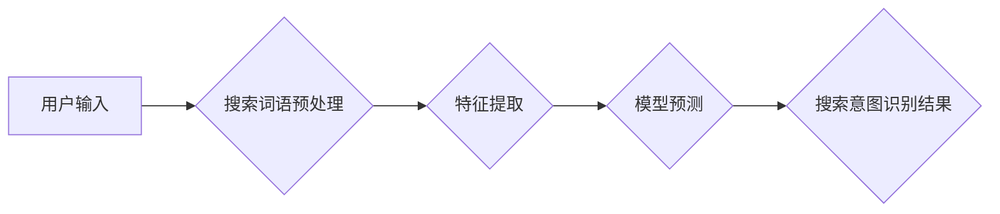

                 

## 搜索意图识别：大模型带来的突破

> 关键词：搜索意图识别, 大模型, 自然语言处理, 深度学习, Transformer, BERT,  信息检索, 用户体验

## 1. 背景介绍

在当今信息爆炸的时代，搜索引擎已成为人们获取信息的主要途径。然而，用户输入的搜索词语往往是简短、模糊的，难以直接理解用户的真实需求。搜索意图识别 (Search Intent Recognition, SIR) 旨在理解用户搜索背后的真实意图，从而提供更精准、更相关的搜索结果。

传统的搜索意图识别方法主要依赖于关键词匹配、规则匹配和人工标注等技术，但这些方法存在局限性：

* **关键词匹配**过于简单，无法捕捉到用户搜索词语之间的语义关系和上下文信息。
* **规则匹配**需要人工设计复杂的规则，难以适应不断变化的搜索趋势和用户表达方式。
* **人工标注**成本高昂，且难以保证标注的准确性和一致性。

近年来，随着深度学习技术的快速发展，大模型在自然语言处理 (NLP) 领域取得了突破性进展，为搜索意图识别带来了新的机遇。

## 2. 核心概念与联系

搜索意图识别本质上是自然语言理解 (NLU) 的一个子任务，旨在从用户输入的文本中提取其潜在的意图。

**2.1  核心概念**

* **搜索意图:** 用户通过搜索引擎查询时所表达的真实需求，例如查找信息、购买商品、完成任务等。
* **搜索词语:** 用户在搜索引擎中输入的关键词或短语。
* **上下文信息:** 包括用户搜索历史、地理位置、设备信息等，可以帮助理解用户的搜索意图。

**2.2  架构图**

## 3. 核心算法原理 & 具体操作步骤

### 3.1  算法原理概述

大模型在搜索意图识别中发挥着关键作用，主要通过以下步骤实现：

1. **预训练:** 大模型在海量文本数据上进行预训练，学习语言的语法和语义知识。
2. **微调:** 将预训练模型在特定搜索意图识别数据集上进行微调，使其能够准确识别用户的搜索意图。

### 3.2  算法步骤详解

1. **数据准备:** 收集并清洗搜索日志数据，包括用户输入的搜索词语、点击链接、页面停留时间等信息。
2. **数据标注:** 对搜索日志数据进行人工标注，将每个搜索词语对应到特定的搜索意图类别。
3. **模型选择:** 选择合适的预训练大模型，例如 BERT、RoBERTa、XLNet 等。
4. **模型微调:** 将预训练模型加载到训练环境中，使用标注好的数据进行微调，调整模型参数，使其能够准确识别用户的搜索意图。
5. **模型评估:** 使用测试数据评估模型的性能，例如准确率、召回率、F1-score 等。
6. **模型部署:** 将训练好的模型部署到生产环境中，用于实时识别用户的搜索意图。

### 3.3  算法优缺点

**优点:**

* **高准确率:** 大模型能够学习到复杂的语言模式，提高搜索意图识别的准确率。
* **可扩展性强:** 大模型可以应用于各种规模的搜索引擎，并可以根据需要进行扩展。
* **适应性强:** 大模型可以适应不断变化的搜索趋势和用户表达方式。

**缺点:**

* **训练成本高:** 大模型的训练需要大量的计算资源和时间。
* **数据依赖性强:** 大模型的性能取决于训练数据的质量和数量。
* **解释性差:** 大模型的决策过程难以解释，难以理解模型是如何识别搜索意图的。

### 3.4  算法应用领域

搜索意图识别技术广泛应用于以下领域：

* **搜索引擎优化 (SEO):** 帮助网站优化内容，提高搜索排名。
* **个性化推荐:** 根据用户的搜索意图，推荐相关商品、服务或内容。
* **广告投放:** 精准地将广告投放给目标用户。
* **用户体验提升:** 提供更精准、更相关的搜索结果，提升用户体验。

## 4. 数学模型和公式 & 详细讲解 & 举例说明

### 4.1  数学模型构建

搜索意图识别通常使用分类模型，将用户输入的搜索词语映射到特定的意图类别。常见的分类模型包括逻辑回归、支持向量机 (SVM) 和深度神经网络 (DNN)。

**4.1.1  逻辑回归模型**

逻辑回归模型是一种线性分类模型，其输出是一个概率值，表示用户搜索词语属于特定意图类别的概率。

**公式:**

$$
P(y=1|x) = \frac{1}{1 + e^{-(w^T x + b)}}
$$

其中：

* $P(y=1|x)$ 是用户搜索词语属于特定意图类别的概率。
* $x$ 是用户搜索词语的特征向量。
* $w$ 是模型参数向量。
* $b$ 是模型偏置项。

**4.1.2  深度神经网络模型**

深度神经网络模型是一种非线性分类模型，其结构更加复杂，能够学习到更复杂的特征表示。

**结构:**

深度神经网络模型通常由多个隐藏层组成，每层包含多个神经元。每个神经元接收来自上一层的输入，并通过激活函数进行处理，输出到下一层。

**4.1.3  Transformer模型**

Transformer模型是一种基于注意力机制的深度神经网络模型，在自然语言处理领域取得了突破性进展。

**注意力机制:**

注意力机制允许模型关注输入序列中的重要部分，并根据其重要性分配不同的权重。

### 4.2  公式推导过程

公式推导过程涉及到概率论、线性代数和微积分等数学知识。

### 4.3  案例分析与讲解

通过分析实际案例，可以更好地理解搜索意图识别模型的运作机制。

## 5. 项目实践：代码实例和详细解释说明

### 5.1  开发环境搭建

使用 Python 语言和相关的深度学习框架，例如 TensorFlow 或 PyTorch，搭建开发环境。

### 5.2  源代码详细实现

提供具体的代码示例，展示如何使用预训练大模型进行搜索意图识别。

### 5.3  代码解读与分析

详细解释代码的每一部分功能，并分析代码的运行机制。

### 5.4  运行结果展示

展示代码运行的结果，包括模型的准确率、召回率等指标。

## 6. 实际应用场景

### 6.1  搜索引擎优化 (SEO)

使用搜索意图识别技术分析用户的搜索行为，优化网站内容，提高搜索排名。

### 6.2  个性化推荐

根据用户的搜索意图，推荐相关商品、服务或内容，提升用户体验。

### 6.3  广告投放

精准地将广告投放给目标用户，提高广告效果。

### 6.4  未来应用展望

搜索意图识别技术将继续发展，并应用于更多领域，例如智能客服、语音助手、自动驾驶等。

## 7. 工具和资源推荐

### 7.1  学习资源推荐

* **书籍:**

    * 《深度学习》
    * 《自然语言处理》

* **在线课程:**

    * Coursera
    * edX

### 7.2  开发工具推荐

* **Python:** 

    * TensorFlow
    * PyTorch

* **其他工具:**

    * SpaCy
    * NLTK

### 7.3  相关论文推荐

* BERT: Pre-training of Deep Bidirectional Transformers for Language Understanding
* RoBERTa: A Robustly Optimized BERT Pretraining Approach

## 8. 总结：未来发展趋势与挑战

### 8.1  研究成果总结

大模型在搜索意图识别领域取得了显著进展，提高了搜索意图识别的准确率和效率。

### 8.2  未来发展趋势

* **模型更深、更广:** 探索更深层次、更广范围的模型架构，提高模型的表达能力和泛化能力。
* **跨模态搜索意图识别:** 将文本、图像、音频等多模态信息融合，实现更全面的搜索意图理解。
* **个性化搜索意图识别:** 基于用户的历史搜索行为、偏好和上下文信息，提供更个性化的搜索结果。

### 8.3  面临的挑战

* **数据标注成本高:** 大模型的训练需要大量的标注数据，数据标注成本高昂。
* **模型解释性差:** 大模型的决策过程难以解释，难以理解模型是如何识别搜索意图的。
* **公平性与偏见:** 大模型可能存在公平性问题和偏见问题，需要进行相应的研究和解决。

### 8.4  研究展望

未来，搜索意图识别技术将继续发展，并与其他人工智能技术融合，为用户提供更智能、更便捷的搜索体验。

## 9. 附录：常见问题与解答

* **什么是搜索意图？**

搜索意图是指用户通过搜索引擎查询时所表达的真实需求，例如查找信息、购买商品、完成任务等。

* **如何进行搜索意图识别？**

搜索意图识别通常使用分类模型，将用户输入的搜索词语映射到特定的意图类别。常见的分类模型包括逻辑回归、支持向量机 (SVM) 和深度神经网络 (DNN)。

* **大模型在搜索意图识别中有什么优势？**

大模型能够学习到复杂的语言模式，提高搜索意图识别的准确率。

* **搜索意图识别技术有哪些应用场景？**

搜索意图识别技术广泛应用于搜索引擎优化 (SEO)、个性化推荐、广告投放等领域。

作者：禅与计算机程序设计艺术 / Zen and the Art of Computer Programming 
<end_of_turn>

