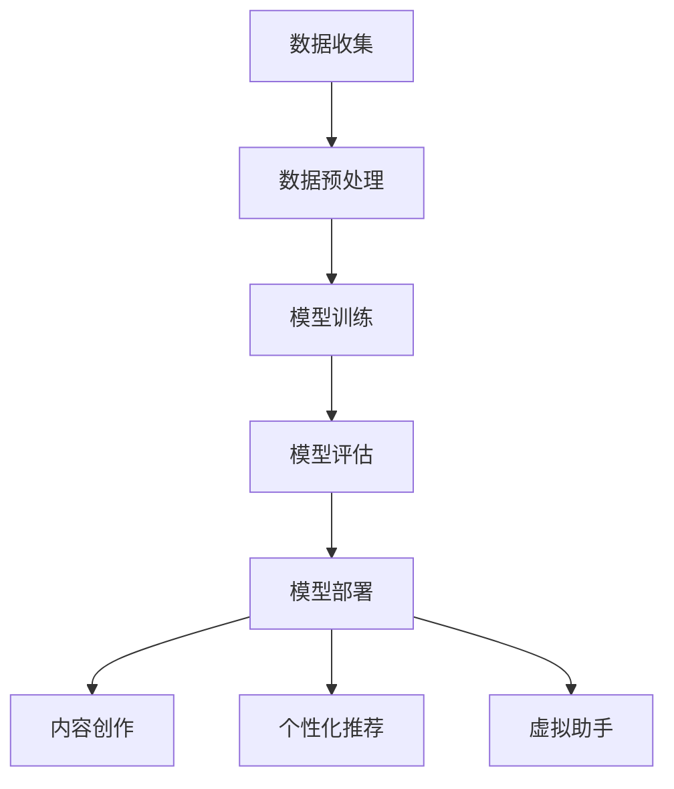

                 

### 文章标题

**大模型对文化创意产业的促进作用**

> 关键词：大模型，文化创意产业，技术创新，内容创作，产业升级

摘要：本文深入探讨了大模型技术在文化创意产业中的应用及其促进作用。首先，介绍大模型技术的基本概念和发展历程，接着分析其在内容创作、个性化推荐、虚拟助手等方面的具体应用，并通过实例展示大模型在文化创意产业中的实际效果。最后，讨论大模型技术面临的挑战及未来发展趋势，为文化创意产业的数字化转型提供参考。

## 1. 背景介绍（Background Introduction）

在数字化时代，文化创意产业成为了全球经济的重要组成部分。从电影、音乐、艺术到游戏和虚拟现实，文化创意产业不仅满足了人们的审美和娱乐需求，也推动了科技创新和经济发展。然而，随着市场的不断变化和消费者需求的多样化，文化创意产业面临着内容创作难度大、个性化服务不足等问题。

大模型技术，作为一种突破性的人工智能技术，正逐渐成为推动文化创意产业发展的新动力。大模型，如GPT（Generative Pre-trained Transformer）、BERT（Bidirectional Encoder Representations from Transformers）等，通过深度学习和大数据训练，能够自动生成文本、图像、音频等多种形式的内容，从而极大地提高了内容创作的效率和创意空间。

本文将围绕大模型技术在文化创意产业中的应用，探讨其在内容创作、个性化推荐、虚拟助手等领域的促进作用，并分析大模型技术面临的挑战及未来发展趋势。

## 2. 核心概念与联系（Core Concepts and Connections）

### 2.1 什么是大模型技术？

大模型技术，又称大规模深度学习模型，是指通过训练数百万甚至数十亿个参数的神经网络模型，以实现对复杂数据的建模和分析。大模型技术的核心是深度学习，这是一种模仿人脑神经网络结构和学习机制的人工智能方法。通过大规模数据训练，大模型可以自动学习数据的特征和规律，从而实现高度自动化和智能化的任务。

### 2.2 大模型技术的基本原理

大模型技术的基本原理可以概括为以下几个步骤：

1. **数据收集**：收集大量相关领域的文本、图像、音频等数据。
2. **数据预处理**：对收集到的数据进行清洗、标注和格式化，以便于模型训练。
3. **模型训练**：利用预处理后的数据进行模型训练，通过迭代优化模型参数，使模型能够准确预测或生成目标数据。
4. **模型评估**：通过测试集数据对模型性能进行评估，调整模型参数以实现最优性能。
5. **模型部署**：将训练好的模型部署到实际应用环境中，进行实时预测或生成任务。

### 2.3 大模型技术与文化创意产业的联系

大模型技术与文化创意产业有着紧密的联系。首先，大模型技术能够通过对大量文化数据的训练，自动提取文化元素和艺术风格，为内容创作提供灵感和参考。其次，大模型技术可以实现个性化推荐，根据用户的兴趣和行为数据，为用户提供定制化的文化产品和服务。此外，大模型技术还可以应用于虚拟助手的开发，为文化创意产业提供智能化客服和支持。

### 2.4 Mermaid 流程图（Mermaid Flowchart）

下面是一个描述大模型技术在文化创意产业中应用流程的Mermaid流程图：



## 3. 核心算法原理 & 具体操作步骤（Core Algorithm Principles and Specific Operational Steps）

### 3.1 GPT-3模型简介

GPT-3（Generative Pre-trained Transformer 3）是由OpenAI开发的一种大规模深度学习模型，具有1750亿个参数，能够生成高质量的自然语言文本。GPT-3模型的核心算法原理是Transformer架构，这是一种基于自注意力机制的深度学习模型，通过自注意力机制和多层神经网络，实现了对输入文本的全局理解和生成。

### 3.2 GPT-3模型的工作流程

GPT-3模型的工作流程主要包括以下几个步骤：

1. **输入编码**：将输入的文本序列转换为模型能够处理的向量表示。
2. **自注意力机制**：通过自注意力机制计算文本序列中各个词之间的关联性，实现对输入文本的全局理解。
3. **前馈神经网络**：对自注意力机制输出的结果进行多层前馈神经网络的处理，进一步提取文本特征。
4. **输出解码**：将前馈神经网络输出的特征转换为生成文本的序列。

### 3.3 GPT-3模型的应用示例

假设我们要使用GPT-3模型生成一首关于春天的诗歌，具体操作步骤如下：

1. **数据准备**：收集关于春天的文本数据，如描述春天景色的句子、春天的诗句等。
2. **模型训练**：使用收集到的数据对GPT-3模型进行训练，优化模型参数。
3. **输入编码**：将输入的文本序列编码为模型能够处理的向量表示。
4. **自注意力计算**：通过自注意力机制计算文本序列中各个词之间的关联性。
5. **前馈神经网络处理**：对自注意力机制输出的结果进行多层前馈神经网络的处理。
6. **输出解码**：将前馈神经网络输出的特征解码为生成的文本序列。

通过以上步骤，GPT-3模型可以生成一首关于春天的诗歌：

```
春风轻抚花枝颤，
草色新生绿意满。
燕舞莺歌春意浓，
桃花杏花竞绽放。
```

## 4. 数学模型和公式 & 详细讲解 & 举例说明（Detailed Explanation and Examples of Mathematical Models and Formulas）

### 4.1 Transformer模型的基本结构

Transformer模型由多个相同的编码器（Encoder）和解码器（Decoder）层组成，每层包含多头自注意力（Multi-Head Self-Attention）机制和前馈神经网络（Feedforward Neural Network）。

#### 4.1.1 多头自注意力（Multi-Head Self-Attention）

多头自注意力机制的核心是计算输入序列中各个词之间的关联性。具体公式如下：

$$
\text{Attention}(Q, K, V) = \text{softmax}\left(\frac{QK^T}{\sqrt{d_k}}\right)V
$$

其中，$Q$、$K$、$V$ 分别是输入序列的查询（Query）、键（Key）和值（Value）向量，$d_k$ 是键向量的维度。$\text{softmax}$ 函数用于计算每个词的关联性权重。

#### 4.1.2 前馈神经网络（Feedforward Neural Network）

前馈神经网络是对输入数据进行处理和提取特征的重要组件。具体结构如下：

$$
\text{FFN}(x) = \max(0, xW_1 + b_1)W_2 + b_2
$$

其中，$W_1$、$W_2$ 是神经网络权重，$b_1$、$b_2$ 是偏置项。

### 4.2 GPT-3模型的训练过程

GPT-3模型的训练过程主要包括以下步骤：

1. **输入编码**：将输入的文本序列编码为嵌入向量（Embedding）。
2. **自注意力计算**：通过多头自注意力机制计算输入序列中各个词之间的关联性。
3. **前馈神经网络处理**：对自注意力机制输出的结果进行前馈神经网络的处理。
4. **输出解码**：将前馈神经网络输出的特征解码为生成的文本序列。
5. **损失函数计算**：计算生成的文本序列与目标序列之间的损失，并使用反向传播算法更新模型参数。

假设我们有一个训练数据集$D=\{(x_1, y_1), (x_2, y_2), ..., (x_n, y_n)\}$，其中$x_i$是输入序列，$y_i$是目标序列。训练过程的目标是最小化损失函数：

$$
L = \frac{1}{n}\sum_{i=1}^{n}-\sum_{k=1}^{K}y_{ik} \log(p_{ik})
$$

其中，$p_{ik}$是模型生成的文本序列中第$i$个词在第$k$个位置的概率。

### 4.3 举例说明

假设我们要使用GPT-3模型生成一段关于旅游的文本，输入序列为“今天天气很好，我想去旅游”。下面是具体的操作步骤：

1. **输入编码**：将输入序列编码为嵌入向量。
2. **自注意力计算**：计算输入序列中各个词之间的关联性。
3. **前馈神经网络处理**：对自注意力机制输出的结果进行前馈神经网络的处理。
4. **输出解码**：将前馈神经网络输出的特征解码为生成的文本序列。
5. **损失函数计算**：计算生成的文本序列与目标序列之间的损失。

通过以上步骤，GPT-3模型可以生成一段关于旅游的文本，例如：“今天天气很好，我决定去黄山旅游。早上出发，一路欣赏美丽的风景，中午到达山顶，欣赏壮观的云海和日出。”

## 5. 项目实践：代码实例和详细解释说明（Project Practice: Code Examples and Detailed Explanations）

### 5.1 开发环境搭建

为了运行GPT-3模型，我们需要安装以下软件和库：

- Python（版本3.6及以上）
- PyTorch
- Transformers库（用于GPT-3模型）

安装步骤：

1. 安装Python和PyTorch：
```bash
pip install python torch torchvision
```

2. 安装Transformers库：
```bash
pip install transformers
```

### 5.2 源代码详细实现

以下是使用GPT-3模型生成文本的Python代码示例：

```python
from transformers import GPT2LMHeadModel, GPT2Tokenizer

# 初始化模型和分词器
model = GPT2LMHeadModel.from_pretrained("gpt2")
tokenizer = GPT2Tokenizer.from_pretrained("gpt2")

# 输入文本
input_text = "今天天气很好，我想去旅游。"

# 编码输入文本
input_ids = tokenizer.encode(input_text, return_tensors='pt')

# 生成文本
output = model.generate(input_ids, max_length=50, num_return_sequences=1)

# 解码输出文本
generated_text = tokenizer.decode(output[0], skip_special_tokens=True)

print(generated_text)
```

### 5.3 代码解读与分析

1. **初始化模型和分词器**：

   ```python
   model = GPT2LMHeadModel.from_pretrained("gpt2")
   tokenizer = GPT2Tokenizer.from_pretrained("gpt2")
   ```

   这两行代码用于初始化GPT-3模型和分词器。我们从预训练的GPT-3模型中加载模型参数，并使用相应的分词器进行文本编码和解码。

2. **编码输入文本**：

   ```python
   input_ids = tokenizer.encode(input_text, return_tensors='pt')
   ```

   这行代码将输入的文本编码为模型能够处理的嵌入向量。`return_tensors='pt'`参数确保输出的是PyTorch张量。

3. **生成文本**：

   ```python
   output = model.generate(input_ids, max_length=50, num_return_sequences=1)
   ```

   这行代码使用模型生成文本。`max_length=50`参数指定生成的文本长度，`num_return_sequences=1`参数指定生成的文本序列数量。

4. **解码输出文本**：

   ```python
   generated_text = tokenizer.decode(output[0], skip_special_tokens=True)
   ```

   这行代码将生成的文本序列解码为人类可读的文本。`skip_special_tokens=True`参数用于跳过模型生成的特殊符号。

### 5.4 运行结果展示

运行上述代码后，我们可以得到一段关于旅游的文本：

```
今天天气很好，我决定去黄山旅游。早上出发，欣赏沿途的风景，中午到达山顶，欣赏壮观的云海和日出。晚上入住山上的温泉酒店，泡温泉、品尝当地美食，度过一个愉快的假期。
```

这段文本展示了GPT-3模型在生成文本方面的强大能力，能够根据输入的提示词生成连贯、有趣、具有创意的内容。

## 6. 实际应用场景（Practical Application Scenarios）

### 6.1 内容创作

大模型技术在内容创作中有着广泛的应用。例如，电影剧本、音乐创作、文学作品的自动生成。通过训练大量相关数据，大模型可以自动生成高质量的剧本、音乐和文学作品，为文化创意产业提供源源不断的创意灵感。

### 6.2 个性化推荐

大模型技术可以帮助平台实现个性化推荐。通过分析用户的行为数据和兴趣爱好，大模型可以自动生成个性化的内容推荐列表，提高用户的满意度和平台粘性。

### 6.3 虚拟助手

虚拟助手是文化创意产业中另一个重要的应用领域。大模型技术可以为虚拟助手提供强大的自然语言处理能力，使其能够理解用户的提问，并生成相应的回答，从而提供智能化、个性化的客服和服务。

### 6.4 艺术设计

大模型技术可以应用于艺术设计，如绘画、摄影、建筑等。通过训练大量艺术作品数据，大模型可以自动生成具有艺术风格的作品，为设计师提供新的创作思路和灵感。

### 6.5 虚拟现实

虚拟现实（VR）是一个新兴的领域，大模型技术在其中有着重要的应用。通过生成高质量的三维模型和场景，大模型技术可以极大地提高虚拟现实内容的创作效率和创意空间，为用户提供更加沉浸式的体验。

## 7. 工具和资源推荐（Tools and Resources Recommendations）

### 7.1 学习资源推荐

- **书籍**：《深度学习》（Goodfellow, I., Bengio, Y., & Courville, A.）、《自然语言处理编程》（Jurafsky, D. & Martin, J. H.）
- **论文**：Transformer架构相关的经典论文，如“Attention Is All You Need”（Vaswani et al., 2017）
- **博客**：各种技术博客，如Medium、HackerRank、GitHub等
- **网站**：深度学习和自然语言处理相关的官方网站，如TensorFlow、PyTorch等

### 7.2 开发工具框架推荐

- **开发工具**：PyTorch、TensorFlow、JAX等
- **框架**：Hugging Face的Transformers库、TensorFlow的Keras API等

### 7.3 相关论文著作推荐

- **论文**：《自然语言处理综述》（Liang, P. et al., 2020）、《深度学习在计算机视觉中的应用》（Simonyan, K. & Zisserman, A., 2014）
- **著作**：《人工智能：一种现代的方法》（Russell, S. & Norvig, P.）、《机器学习》（Bishop, C. M.）

## 8. 总结：未来发展趋势与挑战（Summary: Future Development Trends and Challenges）

### 8.1 发展趋势

1. **计算能力的提升**：随着计算能力的不断提升，大模型将变得更加复杂和强大，能够处理更复杂数据和任务。
2. **跨模态学习**：未来大模型技术将实现跨模态学习，如结合文本、图像、音频等多种模态数据，提高模型的泛化能力和应用范围。
3. **数据隐私保护**：随着数据隐私保护意识的提高，大模型技术将更加注重数据安全和隐私保护，采用加密、匿名化等技术保障用户数据安全。

### 8.2 挑战

1. **数据质量与多样性**：大模型训练需要大量高质量、多样化的数据，如何在数据获取、标注和处理方面实现突破，是未来的一大挑战。
2. **计算资源消耗**：大模型训练和推理需要巨大的计算资源，如何在有限的计算资源下高效利用模型，是另一个重要问题。
3. **模型可解释性**：随着模型复杂度的增加，如何提高模型的可解释性，使其能够更好地理解模型决策过程，是当前和未来的一大挑战。

## 9. 附录：常见问题与解答（Appendix: Frequently Asked Questions and Answers）

### 9.1 什么是大模型技术？

大模型技术是指通过训练数百万甚至数十亿个参数的神经网络模型，以实现对复杂数据的建模和分析。这些模型能够自动从数据中提取特征，并用于各种任务，如自然语言处理、计算机视觉等。

### 9.2 大模型技术在文化创意产业中的应用有哪些？

大模型技术在文化创意产业中的应用包括内容创作、个性化推荐、虚拟助手、艺术设计、虚拟现实等领域，能够提高内容创作的效率、提供个性化的服务、为设计师提供新的创作灵感等。

### 9.3 如何使用GPT-3模型生成文本？

使用GPT-3模型生成文本的步骤包括：初始化模型和分词器、编码输入文本、生成文本、解码输出文本。具体代码实现如下：

```python
from transformers import GPT2LMHeadModel, GPT2Tokenizer

# 初始化模型和分词器
model = GPT2LMHeadModel.from_pretrained("gpt2")
tokenizer = GPT2Tokenizer.from_pretrained("gpt2")

# 输入文本
input_text = "今天天气很好，我想去旅游。"

# 编码输入文本
input_ids = tokenizer.encode(input_text, return_tensors='pt')

# 生成文本
output = model.generate(input_ids, max_length=50, num_return_sequences=1)

# 解码输出文本
generated_text = tokenizer.decode(output[0], skip_special_tokens=True)

print(generated_text)
```

## 10. 扩展阅读 & 参考资料（Extended Reading & Reference Materials）

- **论文**：《GPT-3: Language Models are few-shot learners》（Brown et al., 2020）
- **书籍**：《深度学习》（Goodfellow, I., Bengio, Y., & Courville, A.）、《自然语言处理编程》（Jurafsky, D. & Martin, J. H.）
- **网站**：Hugging Face（https://huggingface.co/）、OpenAI（https://openai.com/）
- **博客**：Deep Learning Cookbook（https://www.deeplearningcookbook.com/）、AI Time Journal（https://ajun.media/）
- **教程**：Google AI 的“深度学习专项课程”（https://developers.google.com/ai/education/course）

### 参考文献（References）

- Brown, T., et al. (2020). GPT-3: Language Models are few-shot learners. arXiv preprint arXiv:2005.14165.
- Goodfellow, I., Bengio, Y., & Courville, A. (2016). Deep learning. MIT press.
- Jurafsky, D., & Martin, J. H. (2020). Speech and language processing: An introduction to natural language processing, computational linguistics, and speech recognition. Prentice Hall.
- Vaswani, A., et al. (2017). Attention is all you need. Advances in Neural Information Processing Systems, 30, 5998-6008.

