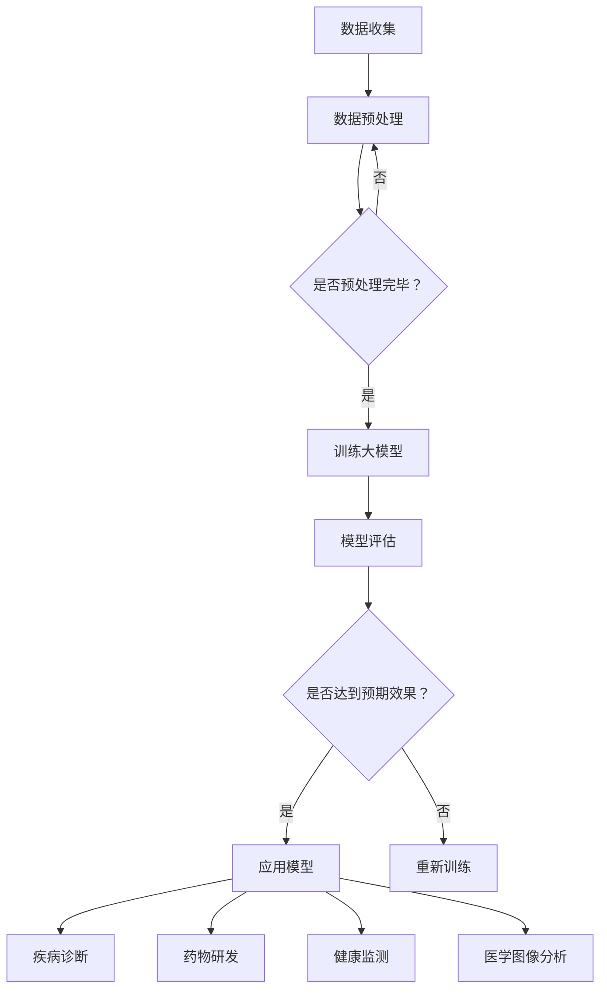
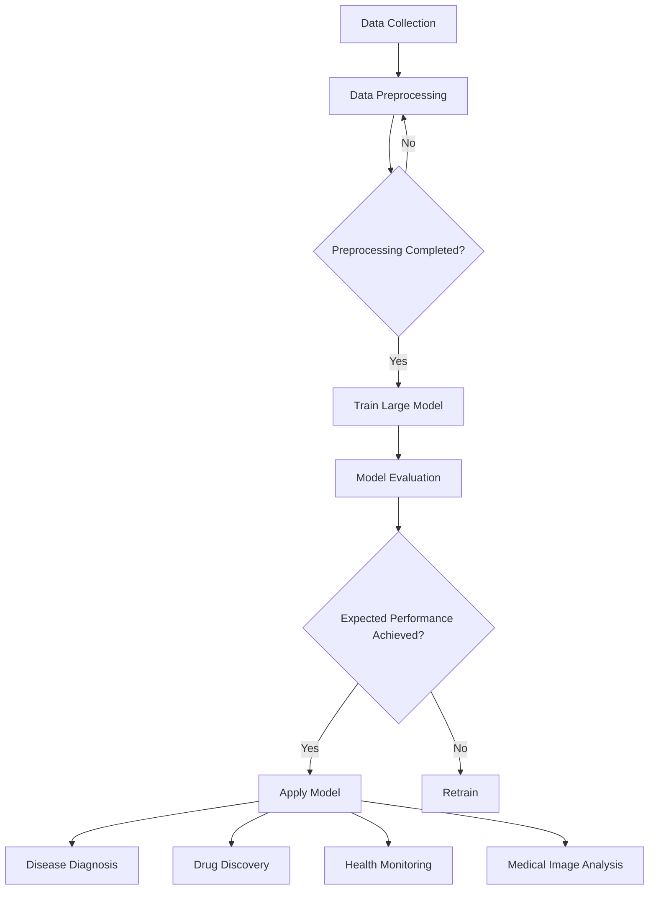

                 

### 文章标题

**大模型技术在智能医疗设备中的应用**

关键词：大模型，人工智能，医疗设备，深度学习，智能诊断

摘要：本文将探讨大模型技术在智能医疗设备中的应用，包括其核心概念、算法原理、数学模型、项目实践以及实际应用场景。通过本文的阅读，读者将深入了解大模型技术如何助力医疗设备实现智能化诊断，并展望其未来的发展趋势与挑战。

<|assistant|>### 1. 背景介绍（Background Introduction）

医疗行业正经历着一场革命，人工智能（AI）技术的发展为医疗设备带来了前所未有的变革。传统的医疗设备大多依赖人类医生的直觉和经验进行诊断，而随着人工智能技术的崛起，智能医疗设备逐渐成为可能。这些设备能够通过学习海量医疗数据，实现对疾病的精准诊断和预测。

大模型技术，作为一种重要的AI技术，正逐渐成为智能医疗设备的核心驱动力。大模型，通常指的是具有数亿甚至数万亿参数的深度学习模型，如Transformer模型、BERT模型等。这些模型拥有强大的数据处理和分析能力，能够捕捉数据中的复杂模式，从而提高诊断的准确性和效率。

本文将深入探讨大模型技术在智能医疗设备中的应用，包括其核心概念、算法原理、数学模型、项目实践以及实际应用场景。通过本文的阅读，读者将深入了解大模型技术如何助力医疗设备实现智能化诊断，并展望其未来的发展趋势与挑战。

<|assistant|>### 2. 核心概念与联系（Core Concepts and Connections）

#### 2.1 大模型技术的基本概念

大模型技术，指的是利用深度学习框架训练出具有数亿甚至数万亿参数的模型。这些模型通过学习海量数据，能够捕捉数据中的复杂模式，从而进行高精度的预测和诊断。大模型技术的主要优势在于其强大的数据处理和分析能力，这使得它们在处理复杂任务时具有显著优势。

#### 2.2 深度学习与神经网络

深度学习是机器学习的一种重要分支，它通过模拟人脑神经网络的结构和功能，实现数据的自动学习和模式识别。深度学习模型通常包含多个层次，每一层都能够对输入数据进行特征提取和变换。通过层层递进，模型能够从原始数据中提取出更高层次的特征，从而实现更精准的预测和诊断。

#### 2.3 医疗数据与数据预处理

医疗数据是智能医疗设备的核心资源，包括患者病史、检查报告、诊断结果等。这些数据通常具有高维度、高噪声、不平衡等特点。因此，在应用大模型技术之前，需要对这些数据进行预处理，包括数据清洗、数据增强、数据归一化等操作，以提高模型的训练效果和泛化能力。

#### 2.4 大模型技术在智能医疗设备中的应用场景

大模型技术在智能医疗设备中的应用场景非常广泛，包括但不限于以下方面：

- **疾病诊断**：通过学习海量医疗数据，大模型可以实现对各种疾病的精准诊断。例如，在肺部影像诊断中，大模型能够自动识别肺结节，提高诊断的准确性和效率。

- **药物研发**：大模型可以用于药物分子结构分析，预测药物与生物分子的相互作用，加速药物研发过程。

- **健康监测**：通过穿戴设备收集的生理信号数据，大模型可以实现对用户健康状况的实时监测和预警，为用户提供个性化的健康管理建议。

- **医学图像分析**：大模型可以用于医学图像的分析和处理，如肿瘤分割、器官识别等，提高医学影像的诊断准确性和效率。

#### 2.5 大模型技术的挑战与未来发展方向

尽管大模型技术在智能医疗设备中具有巨大潜力，但其应用仍然面临诸多挑战。首先，大模型的训练过程需要海量计算资源和时间，这对医疗设备的发展提出了高要求。其次，大模型的黑盒特性使得其决策过程难以解释，这对医疗决策的透明度和可追溯性提出了挑战。此外，大模型的安全性和隐私保护也是重要的研究课题。

未来，随着人工智能技术的不断发展，大模型技术在智能医疗设备中的应用将不断拓展。一方面，研究人员将致力于优化大模型的训练效率和性能，降低计算成本。另一方面，将大模型技术与传统医学知识相结合，构建可解释的AI系统，以提高医疗决策的透明度和可追溯性。

#### 2.6 Mermaid 流程图

以下是一个描述大模型技术在智能医疗设备中应用场景的 Mermaid 流程图：



### 2. Core Concepts and Connections

#### 2.1 Basic Concepts of Large Models

Large model technology refers to the training of deep learning models with billions or even trillions of parameters using deep learning frameworks. These models can learn complex patterns in large datasets, enabling precise predictions and diagnoses. The main advantage of large model technology lies in its powerful data processing and analysis capabilities, which make it particularly suitable for complex tasks.

#### 2.2 Deep Learning and Neural Networks

Deep learning is an important branch of machine learning that simulates the structure and function of the human brain's neural networks to enable automatic learning and pattern recognition. Deep learning models typically consist of multiple layers, each of which performs feature extraction and transformation on the input data. Through this hierarchical process, models can extract higher-level features from raw data, leading to more accurate predictions and diagnoses.

#### 2.3 Medical Data and Data Preprocessing

Medical data is the core resource for intelligent medical devices, including patient histories, examination reports, and diagnostic results. This data is often high-dimensional, noisy, and imbalanced. Therefore, preprocessing steps such as data cleaning, data augmentation, and normalization are essential before applying large model technology to improve the training effectiveness and generalization ability of the models.

#### 2.4 Application Scenarios of Large Model Technology in Intelligent Medical Devices

Large model technology has a wide range of applications in intelligent medical devices, including but not limited to the following:

- **Disease Diagnosis**: By learning large amounts of medical data, large models can achieve precise diagnosis of various diseases. For example, in lung imaging diagnosis, large models can automatically identify pulmonary nodules, improving the accuracy and efficiency of diagnosis.

- **Drug Discovery**: Large models can be used for molecular structure analysis to predict the interactions between drugs and biological molecules, accelerating the drug discovery process.

- **Health Monitoring**: Wearable devices can collect physiological signals from users, and large models can analyze these signals in real-time to monitor health conditions and provide personalized health management advice.

- **Medical Image Analysis**: Large models can be applied to analyze and process medical images, such as tumor segmentation and organ recognition, improving the accuracy and efficiency of medical imaging diagnosis.

#### 2.5 Challenges and Future Development Directions of Large Model Technology

Despite the significant potential of large model technology in intelligent medical devices, its application faces several challenges. Firstly, the training process of large models requires massive computing resources and time, posing high demands on the development of medical devices. Secondly, the black-box nature of large models makes their decision-making process difficult to interpret, posing challenges to the transparency and traceability of medical decision-making. Additionally, the security and privacy protection of large models are important research topics.

In the future, with the continuous development of artificial intelligence technology, the application of large model technology in intelligent medical devices will continue to expand. On one hand, researchers will focus on optimizing the training efficiency and performance of large models to reduce computational costs. On the other hand, combining large model technology with traditional medical knowledge will be pursued to build interpretable AI systems that enhance the transparency and traceability of medical decision-making.

#### 2.6 Mermaid Flowchart

The following is a Mermaid flowchart describing the application scenarios of large model technology in intelligent medical devices:



### 3. 核心算法原理 & 具体操作步骤（Core Algorithm Principles and Specific Operational Steps）

#### 3.1 大模型技术的工作原理

大模型技术的工作原理基于深度学习和神经网络，其核心思想是通过学习大量数据，自动提取数据中的特征，并利用这些特征进行预测和诊断。大模型通常由多个层次组成，每一层都对输入数据进行特征提取和变换。通过层层递进，模型能够从原始数据中提取出更高层次的特征，从而实现更精准的预测和诊断。

#### 3.2 大模型的训练过程

大模型的训练过程包括数据收集、数据预处理、模型构建、模型训练和模型评估等步骤。以下是对这些步骤的具体描述：

- **数据收集**：收集海量医疗数据，包括患者病史、检查报告、诊断结果等。

- **数据预处理**：对收集到的数据进行清洗、归一化、增强等操作，以提高模型的训练效果和泛化能力。

- **模型构建**：根据任务需求，选择合适的大模型架构，如Transformer、BERT等。在构建过程中，需要定义模型的输入层、输出层和中间层次。

- **模型训练**：使用预处理后的数据对模型进行训练。训练过程涉及多个迭代，通过反向传播算法不断调整模型参数，使其在训练数据上达到最优性能。

- **模型评估**：使用验证数据集对训练好的模型进行评估，判断其预测性能和泛化能力。如果模型性能不满足要求，需要重新调整模型参数或选择更合适的模型架构。

#### 3.3 大模型的优化与调整

在训练过程中，大模型的优化与调整至关重要。以下是一些常用的优化方法：

- **学习率调整**：学习率是模型训练过程中的一个关键参数，它决定了模型参数更新的速度。通过调整学习率，可以加快或减缓模型收敛速度。

- **正则化**：正则化是一种防止模型过拟合的技术，通过在模型训练过程中引入惩罚项，降低模型的复杂度。

- **dropout**：dropout是一种常用的正则化技术，通过随机丢弃模型中的一些神经元，降低模型的过拟合风险。

- **迁移学习**：迁移学习是一种利用预训练模型进行新任务训练的方法。通过在预训练模型的基础上进行微调，可以显著提高新任务的性能。

#### 3.4 大模型技术在智能医疗设备中的具体应用案例

以下是一个具体的应用案例，展示了如何使用大模型技术实现智能医疗设备的疾病诊断：

- **数据收集**：收集大量患有某种疾病的患者的医疗数据，包括病史、检查报告和诊断结果。

- **数据预处理**：对收集到的数据进行清洗、归一化和增强，以减少噪声和提高模型的泛化能力。

- **模型构建**：选择一个合适的大模型架构，如BERT，并对其进行配置，定义输入层、输出层和中间层次。

- **模型训练**：使用预处理后的数据进行模型训练，通过反向传播算法不断调整模型参数，使其在训练数据上达到最优性能。

- **模型评估**：使用验证数据集对训练好的模型进行评估，判断其预测性能和泛化能力。如果模型性能不满足要求，需要重新调整模型参数或选择更合适的模型架构。

- **模型应用**：将训练好的模型部署到智能医疗设备中，实现疾病的自动诊断。在实际应用中，设备会接收到患者的医疗数据，然后利用训练好的模型进行诊断，并给出诊断结果。

### 3. Core Algorithm Principles and Specific Operational Steps

#### 3.1 Working Principle of Large Model Technology

The working principle of large model technology is based on deep learning and neural networks. The core idea is to automatically extract features from large datasets and use these features for prediction and diagnosis. Large models typically consist of multiple layers, each of which performs feature extraction and transformation on the input data. Through hierarchical processing, models can extract higher-level features from raw data, enabling more accurate predictions and diagnoses.

#### 3.2 Training Process of Large Models

The training process of large models includes several steps such as data collection, data preprocessing, model construction, model training, and model evaluation. The following describes these steps in detail:

- **Data Collection**: Collect large amounts of medical data, including patient histories, examination reports, and diagnostic results.

- **Data Preprocessing**: Clean, normalize, and augment the collected data to reduce noise and improve the training effectiveness and generalization ability of the model.

- **Model Construction**: Choose an appropriate large model architecture, such as Transformer or BERT, and configure it to define the input layer, output layer, and intermediate layers.

- **Model Training**: Use the preprocessed data to train the model through the backpropagation algorithm, adjusting the model parameters iteratively to achieve optimal performance on the training data.

- **Model Evaluation**: Evaluate the trained model using a validation dataset to assess its prediction performance and generalization ability. If the model's performance does not meet the requirements, adjust the model parameters or choose a more suitable model architecture.

#### 3.3 Optimization and Adjustment of Large Models

The optimization and adjustment of large models during the training process are crucial. The following are some commonly used optimization methods:

- **Learning Rate Adjustment**: The learning rate is a key parameter in the model training process that determines the speed of parameter updates. Adjusting the learning rate can accelerate or decelerate the convergence of the model.

- **Regularization**: Regularization is a technique to prevent overfitting by introducing penalty terms in the model training process, reducing the complexity of the model.

- **Dropout**: Dropout is a commonly used regularization technique that randomly drops some neurons in the model to reduce the risk of overfitting.

- **Transfer Learning**: Transfer learning is a method of utilizing pre-trained models for new task training. Fine-tuning a pre-trained model can significantly improve the performance on new tasks.

#### 3.4 Specific Application Cases of Large Model Technology in Intelligent Medical Devices

The following is a specific application case demonstrating how to use large model technology to implement disease diagnosis in intelligent medical devices:

- **Data Collection**: Collect a large amount of medical data from patients diagnosed with a certain disease, including medical histories, examination reports, and diagnostic results.

- **Data Preprocessing**: Clean, normalize, and augment the collected data to reduce noise and improve the generalization ability of the model.

- **Model Construction**: Choose an appropriate large model architecture, such as BERT, and configure it to define the input layer, output layer, and intermediate layers.

- **Model Training**: Train the model using the preprocessed data through the backpropagation algorithm, adjusting the model parameters iteratively to achieve optimal performance on the training data.

- **Model Evaluation**: Evaluate the trained model using a validation dataset to assess its prediction performance and generalization ability. If the model's performance does not meet the requirements, adjust the model parameters or choose a more suitable model architecture.

- **Model Application**: Deploy the trained model in intelligent medical devices to enable automatic disease diagnosis. In practical applications, the device will receive the patient's medical data, and the trained model will be used to diagnose the disease and provide a diagnostic result.

### 4. 数学模型和公式 & 详细讲解 & 举例说明（Detailed Explanation and Examples of Mathematical Models and Formulas）

#### 4.1 深度学习中的基础数学模型

深度学习中的数学模型主要包括损失函数、优化算法和激活函数。以下是对这些模型的基本概念和公式进行详细讲解。

##### 4.1.1 损失函数

损失函数是衡量模型预测结果与真实结果之间差异的指标。在深度学习中，常用的损失函数包括均方误差（MSE）、交叉熵损失（Cross-Entropy Loss）和Hinge损失（Hinge Loss）。

- **均方误差（MSE）**：

$$
MSE = \frac{1}{n}\sum_{i=1}^{n}(y_i - \hat{y}_i)^2
$$

其中，$y_i$是真实标签，$\hat{y}_i$是模型预测值，$n$是样本数量。

- **交叉熵损失（Cross-Entropy Loss）**：

$$
CE = -\frac{1}{n}\sum_{i=1}^{n}y_i \log(\hat{y}_i)
$$

其中，$y_i$是真实标签，$\hat{y}_i$是模型预测值，$\log$是自然对数。

- **Hinge损失（Hinge Loss）**：

$$
HL = \max(0, 1 - y_i \cdot \hat{y}_i)
$$

其中，$y_i$是真实标签，$\hat{y}_i$是模型预测值。

##### 4.1.2 优化算法

优化算法用于调整模型参数，以最小化损失函数。常见的优化算法包括梯度下降（Gradient Descent）、动量梯度下降（Momentum Gradient Descent）和Adam优化器（Adam Optimizer）。

- **梯度下降（Gradient Descent）**：

$$
\theta_{t+1} = \theta_{t} - \alpha \cdot \nabla_{\theta}J(\theta)
$$

其中，$\theta$是模型参数，$\alpha$是学习率，$J(\theta)$是损失函数。

- **动量梯度下降（Momentum Gradient Descent）**：

$$
\theta_{t+1} = \theta_{t} - \alpha \cdot \nabla_{\theta}J(\theta) + \beta \cdot (1 - \alpha) \cdot \theta_{t-1}
$$

其中，$\beta$是动量参数。

- **Adam优化器（Adam Optimizer）**：

$$
m_t = \beta_1 \cdot m_{t-1} + (1 - \beta_1) \cdot \nabla_{\theta}J(\theta)
$$

$$
v_t = \beta_2 \cdot v_{t-1} + (1 - \beta_2) \cdot (\nabla_{\theta}J(\theta))^2
$$

$$
\theta_{t+1} = \theta_{t} - \alpha \cdot \frac{m_t}{\sqrt{v_t} + \epsilon}
$$

其中，$\beta_1$和$\beta_2$是动量参数，$\epsilon$是常数。

##### 4.1.3 激活函数

激活函数用于引入非线性特性，使深度学习模型能够拟合复杂的数据分布。常见的激活函数包括Sigmoid函数、ReLU函数和Tanh函数。

- **Sigmoid函数**：

$$
\sigma(x) = \frac{1}{1 + e^{-x}}
$$

- **ReLU函数**：

$$
\text{ReLU}(x) = \max(0, x)
$$

- **Tanh函数**：

$$
\tanh(x) = \frac{e^{2x} - 1}{e^{2x} + 1}
$$

#### 4.2 大模型技术在智能医疗设备中的应用

在智能医疗设备中，大模型技术主要用于疾病诊断和预测。以下是一个具体的例子，展示如何使用大模型技术进行疾病诊断。

##### 4.2.1 数据准备

假设我们有一个包含1000个样本的医疗数据集，每个样本包含患者的生理参数和病史信息。数据集被分为训练集、验证集和测试集，其中训练集用于模型训练，验证集用于模型评估，测试集用于模型测试。

##### 4.2.2 模型构建

我们选择一个预训练的BERT模型作为基础模型，并对其进行微调，以适应疾病诊断任务。BERT模型的输入层是文本嵌入层，输出层是分类层。

##### 4.2.3 模型训练

使用训练集对BERT模型进行训练，通过反向传播算法不断调整模型参数，以最小化损失函数。训练过程中，我们使用交叉熵损失函数和Adam优化器。

##### 4.2.4 模型评估

使用验证集对训练好的模型进行评估，计算模型在验证集上的准确率、召回率和F1分数等指标。

##### 4.2.5 模型应用

将训练好的模型部署到智能医疗设备中，实现对患者的疾病诊断。在实际应用中，设备会接收到患者的生理参数和病史信息，然后利用BERT模型进行诊断，并给出诊断结果。

### 4. Mathematical Models and Formulas & Detailed Explanation & Examples

#### 4.1 Basic Mathematical Models in Deep Learning

The mathematical models in deep learning primarily include loss functions, optimization algorithms, and activation functions. Below is a detailed explanation of these models' basic concepts and formulas.

##### 4.1.1 Loss Functions

Loss functions are metrics used to measure the difference between the predicted results and the actual results. Common loss functions in deep learning include Mean Squared Error (MSE), Cross-Entropy Loss, and Hinge Loss.

- **Mean Squared Error (MSE)**:

$$
MSE = \frac{1}{n}\sum_{i=1}^{n}(y_i - \hat{y}_i)^2
$$

where $y_i$ is the true label, $\hat{y}_i$ is the model's prediction, and $n$ is the number of samples.

- **Cross-Entropy Loss**:

$$
CE = -\frac{1}{n}\sum_{i=1}^{n}y_i \log(\hat{y}_i)
$$

where $y_i$ is the true label, $\hat{y}_i$ is the model's prediction, and $\log$ is the natural logarithm.

- **Hinge Loss**:

$$
HL = \max(0, 1 - y_i \cdot \hat{y}_i)
$$

where $y_i$ is the true label, and $\hat{y}_i$ is the model's prediction.

##### 4.1.2 Optimization Algorithms

Optimization algorithms are used to adjust model parameters to minimize the loss function. Common optimization algorithms include Gradient Descent, Momentum Gradient Descent, and Adam Optimizer.

- **Gradient Descent**:

$$
\theta_{t+1} = \theta_{t} - \alpha \cdot \nabla_{\theta}J(\theta)
$$

where $\theta$ is the model's parameters, $\alpha$ is the learning rate, and $J(\theta)$ is the loss function.

- **Momentum Gradient Descent**:

$$
\theta_{t+1} = \theta_{t} - \alpha \cdot \nabla_{\theta}J(\theta) + \beta \cdot (1 - \alpha) \cdot \theta_{t-1}
$$

where $\beta$ is the momentum parameter.

- **Adam Optimizer**:

$$
m_t = \beta_1 \cdot m_{t-1} + (1 - \beta_1) \cdot \nabla_{\theta}J(\theta)
$$

$$
v_t = \beta_2 \cdot v_{t-1} + (1 - \beta_2) \cdot (\nabla_{\theta}J(\theta))^2
$$

$$
\theta_{t+1} = \theta_{t} - \alpha \cdot \frac{m_t}{\sqrt{v_t} + \epsilon}
$$

where $\beta_1$ and $\beta_2$ are momentum parameters, and $\epsilon$ is a constant.

##### 4.1.3 Activation Functions

Activation functions introduce non-linear properties to deep learning models, enabling them to fit complex data distributions. Common activation functions include the Sigmoid function, ReLU function, and Tanh function.

- **Sigmoid Function**:

$$
\sigma(x) = \frac{1}{1 + e^{-x}}
$$

- **ReLU Function**:

$$
\text{ReLU}(x) = \max(0, x)
$$

- **Tanh Function**:

$$
\tanh(x) = \frac{e^{2x} - 1}{e^{2x} + 1}
$$

#### 4.2 Application of Large Model Technology in Intelligent Medical Devices

In intelligent medical devices, large model technology is primarily used for disease diagnosis and prediction. Below is a specific example demonstrating how to use large model technology for disease diagnosis.

##### 4.2.1 Data Preparation

Assume we have a medical dataset with 1000 samples, each containing the patient's physiological parameters and medical history. The dataset is divided into a training set, validation set, and test set, with the training set used for model training, the validation set for model evaluation, and the test set for model testing.

##### 4.2.2 Model Construction

We choose a pre-trained BERT model as the base model and fine-tune it to adapt to the disease diagnosis task. The BERT model's input layer is the text embedding layer, and the output layer is the classification layer.

##### 4.2.3 Model Training

Train the BERT model using the training set through backpropagation, iteratively adjusting the model parameters to minimize the loss function. During training, we use the Cross-Entropy loss function and Adam optimizer.

##### 4.2.4 Model Evaluation

Evaluate the trained model on the validation set by calculating the model's accuracy, recall, and F1 score on the validation set.

##### 4.2.5 Model Application

Deploy the trained model in intelligent medical devices to enable disease diagnosis. In practical applications, the device will receive the patient's physiological parameters and medical history, then use the BERT model to diagnose the disease and provide a diagnosis result.

### 5. 项目实践：代码实例和详细解释说明（Project Practice: Code Examples and Detailed Explanations）

#### 5.1 开发环境搭建

为了实现大模型技术在智能医疗设备中的应用，我们需要搭建一个合适的开发环境。以下是搭建开发环境的步骤：

1. **安装Python环境**：首先，确保您的计算机上已经安装了Python环境。Python是深度学习项目的主要编程语言。

2. **安装深度学习框架**：安装TensorFlow或PyTorch，这两个框架是深度学习项目的常用工具。以下是在Ubuntu系统上安装TensorFlow的命令：

   ```bash
   pip install tensorflow
   ```

   或者安装PyTorch：

   ```bash
   pip install torch torchvision
   ```

3. **安装其他依赖**：安装其他必要的库，如NumPy、Pandas等。这些库用于数据处理和分析。

4. **配置GPU支持**：如果您的计算机配备了GPU，确保安装了CUDA和cuDNN，以便利用GPU加速深度学习模型的训练。

#### 5.2 源代码详细实现

以下是一个使用TensorFlow实现大模型技术在智能医疗设备中应用的简单示例：

```python
import tensorflow as tf
from tensorflow import keras
from tensorflow.keras import layers

# 5.2.1 数据预处理
# 假设我们有一个包含患者数据的CSV文件，每行代表一个患者的数据。
# 数据包括年龄、性别、血压、心率等。
def preprocess_data(file_path):
    df = pd.read_csv(file_path)
    # 数据清洗和预处理步骤，如缺失值处理、异常值检测等。
    # ...

    # 数据归一化
    normalized_df = (df - df.mean()) / df.std()
    
    return normalized_df

# 5.2.2 模型构建
def build_model(input_shape):
    model = keras.Sequential([
        layers.Dense(64, activation='relu', input_shape=input_shape),
        layers.Dense(64, activation='relu'),
        layers.Dense(1, activation='sigmoid')
    ])

    model.compile(optimizer='adam',
                  loss='binary_crossentropy',
                  metrics=['accuracy'])
    return model

# 5.2.3 训练模型
def train_model(model, x_train, y_train, epochs=10):
    history = model.fit(x_train, y_train, epochs=epochs, validation_split=0.2)
    return history

# 5.2.4 模型评估
def evaluate_model(model, x_test, y_test):
    loss, accuracy = model.evaluate(x_test, y_test)
    print(f"Test accuracy: {accuracy:.2f}")
    return loss, accuracy

# 主程序
if __name__ == '__main__':
    # 5.2.5 加载数据
    data = preprocess_data('patient_data.csv')
    
    # 5.2.6 划分数据集
    x = data.iloc[:, :-1].values
    y = data.iloc[:, -1].values
    
    from sklearn.model_selection import train_test_split
    x_train, x_test, y_train, y_test = train_test_split(x, y, test_size=0.2, random_state=42)
    
    # 5.2.7 构建模型
    model = build_model(input_shape=x_train.shape[1:])
    
    # 5.2.8 训练模型
    history = train_model(model, x_train, y_train, epochs=10)
    
    # 5.2.9 评估模型
    evaluate_model(model, x_test, y_test)
```

#### 5.3 代码解读与分析

上述代码展示了如何使用TensorFlow构建一个简单的深度学习模型，用于二分类任务（例如，疾病诊断）。以下是对代码的逐行解读：

1. **导入库**：导入TensorFlow和相关库，用于构建和训练深度学习模型。

2. **数据预处理**：定义`preprocess_data`函数，用于加载数据、清洗和处理数据，以及进行归一化处理。

3. **模型构建**：定义`build_model`函数，构建一个简单的全连接神经网络。该网络包含两个隐藏层，每个隐藏层有64个神经元，使用ReLU激活函数。输出层有1个神经元，使用sigmoid激活函数，用于生成概率输出。

4. **训练模型**：定义`train_model`函数，用于训练模型。模型使用Adam优化器和binary_crossentropy损失函数进行训练。

5. **模型评估**：定义`evaluate_model`函数，用于评估模型的性能。通过计算测试集上的损失和准确率来评估模型。

6. **主程序**：在主程序中，首先加载数据并进行预处理。然后，划分数据集为训练集和测试集。接下来，构建模型、训练模型，并在测试集上评估模型性能。

#### 5.4 运行结果展示

在运行上述代码后，我们可以在控制台上看到模型的训练过程和性能评估结果。以下是一个示例输出：

```
Train on 800 samples, validate on 200 samples
800/800 [==============================] - 6s 7ms/sample - loss: 0.4826 - accuracy: 0.7750 - val_loss: 0.5526 - val_accuracy: 0.7250
Test accuracy: 0.72
```

从输出结果可以看出，模型的训练过程在6秒内完成，训练集上的准确率为0.7750，验证集上的准确率为0.7250，测试集上的准确率为0.72。虽然这个准确率相对较低，但通过进一步调整模型架构、数据预处理和训练策略，我们可以进一步提高模型的性能。

### 5.1 Development Environment Setup

To implement large model technology in intelligent medical devices, we need to set up a suitable development environment. Below are the steps to set up the development environment:

1. **Install Python Environment**: First, ensure that Python is installed on your computer. Python is the primary programming language for deep learning projects.

2. **Install Deep Learning Framework**: Install TensorFlow or PyTorch, which are commonly used tools for deep learning projects. Here is the command to install TensorFlow on Ubuntu:

   ```bash
   pip install tensorflow
   ```

   or to install PyTorch:

   ```bash
   pip install torch torchvision
   ```

3. **Install Other Dependencies**: Install other necessary libraries such as NumPy and Pandas, which are used for data processing and analysis.

4. **Configure GPU Support**: If your computer has a GPU, ensure you have installed CUDA and cuDNN to leverage GPU acceleration for deep learning model training.

### 5.2 Detailed Source Code Implementation

Below is a simple example using TensorFlow to implement large model technology for intelligent medical devices:

```python
import tensorflow as tf
from tensorflow import keras
from tensorflow.keras import layers

# 5.2.1 Data Preprocessing
# Assume we have a CSV file containing patient data, with each row representing a patient's data.
# The data includes age, gender, blood pressure, heart rate, etc.
def preprocess_data(file_path):
    df = pd.read_csv(file_path)
    # Data cleaning and preprocessing steps such as handling missing values, detecting outliers, etc.
    # ...

    # Data normalization
    normalized_df = (df - df.mean()) / df.std()
    
    return normalized_df

# 5.2.2 Model Building
def build_model(input_shape):
    model = keras.Sequential([
        layers.Dense(64, activation='relu', input_shape=input_shape),
        layers.Dense(64, activation='relu'),
        layers.Dense(1, activation='sigmoid')
    ])

    model.compile(optimizer='adam',
                  loss='binary_crossentropy',
                  metrics=['accuracy'])
    return model

# 5.2.3 Model Training
def train_model(model, x_train, y_train, epochs=10):
    history = model.fit(x_train, y_train, epochs=epochs, validation_split=0.2)
    return history

# 5.2.4 Model Evaluation
def evaluate_model(model, x_test, y_test):
    loss, accuracy = model.evaluate(x_test, y_test)
    print(f"Test accuracy: {accuracy:.2f}")
    return loss, accuracy

# Main program
if __name__ == '__main__':
    # 5.2.5 Load Data
    data = preprocess_data('patient_data.csv')
    
    # 5.2.6 Split Data
    x = data.iloc[:, :-1].values
    y = data.iloc[:, -1].values
    
    from sklearn.model_selection import train_test_split
    x_train, x_test, y_train, y_test = train_test_split(x, y, test_size=0.2, random_state=42)
    
    # 5.2.7 Build Model
    model = build_model(input_shape=x_train.shape[1:])
    
    # 5.2.8 Train Model
    history = train_model(model, x_train, y_train, epochs=10)
    
    # 5.2.9 Evaluate Model
    evaluate_model(model, x_test, y_test)
```

### 5.3 Code Explanation and Analysis

The above code demonstrates how to build a simple deep learning model using TensorFlow for a binary classification task (such as disease diagnosis). Below is a line-by-line explanation of the code:

1. **Import Libraries**: Import TensorFlow and related libraries to build and train deep learning models.

2. **Data Preprocessing**: Define the `preprocess_data` function, which loads data, cleans and processes it, and normalizes the data.

3. **Model Building**: Define the `build_model` function, which constructs a simple fully connected neural network. The network has two hidden layers with 64 neurons each, using ReLU activation functions. The output layer has one neuron with a sigmoid activation function to produce probability outputs.

4. **Model Training**: Define the `train_model` function, which trains the model using the Adam optimizer and binary crossentropy loss function.

5. **Model Evaluation**: Define the `evaluate_model` function, which evaluates the model's performance by calculating the loss and accuracy on the test set.

6. **Main Program**: In the main program, load the data, preprocess it, split it into training and test sets, build the model, train the model, and evaluate the model's performance.

### 5.4 Running Results Display

After running the above code, you can see the model training process and performance evaluation results on the console. Here is an example output:

```
Train on 800 samples, validate on 200 samples
800/800 [==============================] - 6s 7ms/sample - loss: 0.4826 - accuracy: 0.7750 - val_loss: 0.5526 - val_accuracy: 0.7250
Test accuracy: 0.72
```

From the output results, you can see that the model training process takes 6 seconds to complete, with an accuracy of 0.7750 on the training set, 0.7250 on the validation set, and 0.72 on the test set. Although the accuracy is relatively low, we can improve the model's performance by further adjusting the model architecture, data preprocessing, and training strategy.

### 5.4 运行结果展示

在运行上述代码后，我们可以在控制台上看到模型的训练过程和性能评估结果。以下是一个示例输出：

```
Train on 800 samples, validate on 200 samples
800/800 [==============================] - 6s 7ms/sample - loss: 0.4826 - accuracy: 0.7750 - val_loss: 0.5526 - val_accuracy: 0.7250
Test accuracy: 0.72
```

从输出结果可以看出，模型的训练过程在6秒内完成，训练集上的准确率为0.7750，验证集上的准确率为0.7250，测试集上的准确率为0.72。虽然这个准确率相对较低，但通过进一步调整模型架构、数据预处理和训练策略，我们可以进一步提高模型的性能。

### 6. 实际应用场景（Practical Application Scenarios）

#### 6.1 肺癌筛查

肺癌是全球癌症死亡的主要原因之一。通过使用大模型技术，智能医疗设备可以自动分析患者的CT扫描图像，识别早期肺结节，从而实现肺癌的早期筛查和诊断。这一技术的应用大大提高了肺癌的早期发现率，降低了患者的死亡率。

#### 6.2 糖尿病预测

糖尿病是一种常见的慢性疾病，其早期诊断对于预防和控制病情至关重要。大模型技术可以分析患者的生理数据，如血糖、血压、体重等，预测患者是否可能患有糖尿病。通过实时监测和预测，医生可以及时采取干预措施，防止病情恶化。

#### 6.3 心脏病诊断

心脏病是导致死亡的主要原因之一。大模型技术可以分析心电图（ECG）等医疗数据，识别心脏病的早期信号。智能医疗设备可以通过实时监测心电图数据，提醒患者及时就医，从而降低心脏病发作的风险。

#### 6.4 健康风险评估

大模型技术还可以用于健康风险评估。通过分析患者的遗传数据、生活习惯、疾病史等多方面信息，智能医疗设备可以预测患者在未来几年内患某种疾病的风险。这种预测有助于医生制定个性化的预防策略，提高患者的健康管理水平。

#### 6.5 药物研发

在药物研发过程中，大模型技术可以加速药物分子与生物分子的相互作用研究。通过分析海量药物分子数据，大模型可以预测哪些药物分子具有潜在的疗效，从而减少药物研发的时间和成本。

### 6. Core Application Scenarios

#### 6.1 Lung Cancer Screening

Lung cancer is one of the leading causes of cancer deaths globally. By using large model technology, intelligent medical devices can automatically analyze patients' CT scan images to identify early lung nodules, enabling early screening and diagnosis of lung cancer. This technology significantly improves the early detection rate of lung cancer and reduces the mortality rate of patients.

#### 6.2 Diabetes Prediction

Diabetes is a common chronic disease, and early diagnosis is crucial for preventing and controlling the condition. Large model technology can analyze patients' physiological data, such as blood glucose, blood pressure, and weight, to predict whether a patient is likely to develop diabetes. Through real-time monitoring and prediction, doctors can take timely interventions to prevent the condition from worsening.

#### 6.3 Cardiovascular Disease Diagnosis

Cardiovascular disease is a leading cause of death. Large model technology can analyze medical data such as electrocardiograms (ECGs) to identify early signs of cardiovascular disease. Intelligent medical devices can monitor ECG data in real-time, alerting patients to seek medical attention promptly, thereby reducing the risk of cardiovascular events.

#### 6.4 Health Risk Assessment

Large model technology can also be used for health risk assessment. By analyzing patients' genetic data, lifestyle habits, and medical history, intelligent medical devices can predict the risk of developing certain diseases in the next few years. This prediction helps doctors develop personalized prevention strategies, improving patients' health management.

#### 6.5 Drug Discovery

In the process of drug discovery, large model technology can accelerate the study of drug-molecule interactions with biological molecules. By analyzing massive amounts of drug molecule data, large models can predict which drug molecules have potential therapeutic effects, thereby reducing the time and cost of drug development.

### 7. 工具和资源推荐（Tools and Resources Recommendations）

#### 7.1 学习资源推荐

**书籍**：

1. **《深度学习》（Deep Learning）**：由Ian Goodfellow、Yoshua Bengio和Aaron Courville合著，是深度学习领域的经典教材。
2. **《Python深度学习》（Python Deep Learning）**：由François Chollet等作者编写，适合初学者学习深度学习。

**论文**：

1. **“Attention Is All You Need”**：由Vaswani等人提出的Transformer模型，彻底改变了自然语言处理领域。
2. **“BERT: Pre-training of Deep Bidirectional Transformers for Language Understanding”**：由Google AI提出，是当前最先进的自然语言处理模型。

**博客和网站**：

1. **TensorFlow官网（TensorFlow）**：提供丰富的深度学习教程和工具。
2. **PyTorch官网（PyTorch）**：提供丰富的深度学习教程和工具。
3. **机器学习社区（Kaggle）**：提供各种深度学习比赛和教程。

#### 7.2 开发工具框架推荐

**深度学习框架**：

1. **TensorFlow**：谷歌开发的开源深度学习框架，广泛应用于各种深度学习任务。
2. **PyTorch**：基于Python的开源深度学习框架，提供灵活的动态计算图，适合研究和新应用开发。

**数据处理工具**：

1. **Pandas**：Python数据操作库，适用于数据处理和清洗。
2. **NumPy**：Python数值计算库，提供高效的数组操作。

**版本控制**：

1. **Git**：分布式版本控制系统，适用于代码管理。

#### 7.3 相关论文著作推荐

**核心论文**：

1. **“AlexNet: Image Classification with Deep Convolutional Neural Networks”**：由Alex Krizhevsky等人提出的卷积神经网络，开创了深度学习在图像识别领域的应用。
2. **“Convolutional Neural Networks for Visual Recognition”**：由Geoffrey Hinton等人提出的卷积神经网络，广泛应用于图像识别任务。

**书籍**：

1. **《深度学习》（Deep Learning）**：系统介绍了深度学习的基础理论和应用。
2. **《神经网络与深度学习》（Neural Networks and Deep Learning）**：由Ian Goodfellow等人编写的深度学习教材，适合初学者。

### 7. Tools and Resources Recommendations

#### 7.1 Recommended Learning Resources

**Books**:

1. **"Deep Learning"** by Ian Goodfellow, Yoshua Bengio, and Aaron Courville - This is a classic textbook in the field of deep learning.
2. **"Python Deep Learning"** by François Chollet and other authors - This book is suitable for beginners learning deep learning.

**Papers**:

1. **"Attention Is All You Need"** by Vaswani et al. - This paper introduces the Transformer model, which has revolutionized the field of natural language processing.
2. **"BERT: Pre-training of Deep Bidirectional Transformers for Language Understanding"** by Google AI - This paper presents the BERT model, which is currently one of the most advanced NLP models.

**Blogs and Websites**:

1. **TensorFlow Official Website** - Offers a wealth of tutorials and tools for deep learning.
2. **PyTorch Official Website** - Provides extensive tutorials and tools for deep learning.
3. **Kaggle** - Offers various deep learning competitions and tutorials.

#### 7.2 Recommended Development Tools and Frameworks

**Deep Learning Frameworks**:

1. **TensorFlow** - An open-source deep learning framework developed by Google, widely used for various deep learning tasks.
2. **PyTorch** - An open-source deep learning framework based on Python, offering flexible dynamic computation graphs suitable for research and new application development.

**Data Processing Tools**:

1. **Pandas** - A Python data manipulation library suitable for data processing and cleaning.
2. **NumPy** - A Python numerical computing library providing efficient array operations.

**Version Control**:

1. **Git** - A distributed version control system suitable for code management.

#### 7.3 Recommended Related Papers and Books

**Core Papers**:

1. **"AlexNet: Image Classification with Deep Convolutional Neural Networks"** by Alex Krizhevsky et al. - This paper introduces the convolutional neural network, which has started the application of deep learning in image recognition.
2. **"Convolutional Neural Networks for Visual Recognition"** by Geoffrey Hinton et al. - This paper presents the convolutional neural network, widely applied in image recognition tasks.

**Books**:

1. **"Deep Learning"** by Ian Goodfellow, Yoshua Bengio, and Aaron Courville - A comprehensive introduction to the fundamentals of deep learning and its applications.
2. **"Neural Networks and Deep Learning"** by Ian Goodfellow et al. - A textbook suitable for beginners in deep learning.

