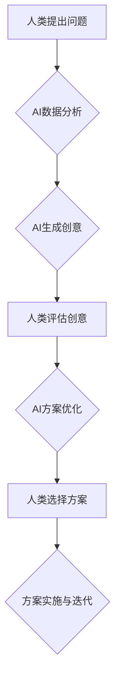

                 

## 数字创造力激发器：AI驱动的创新思维培养

> 关键词：人工智能、创新思维、算法、数学模型、代码实践、应用场景、未来趋势

## 1. 背景介绍

在当今科技飞速发展的时代，人工智能（AI）正以惊人的速度改变着我们生活的方方面面。从自动驾驶汽车到智能语音助手，从医疗诊断到艺术创作，AI技术的应用无处不在。然而，AI技术的进步不仅仅在于其强大的计算能力，更在于其对人类创造力的激发。

传统的创新思维往往依赖于人类的经验、直觉和灵感，而AI技术的介入则为我们提供了全新的视角和工具，能够帮助我们突破思维定式，激发更具创造性的想法。

## 2. 核心概念与联系

### 2.1  创新思维

创新思维是指能够产生新颖、独特、有价值的思想和解决方案的能力。它需要具备以下特征：

* **开放性:** 愿意接受新的信息和观点，打破固有的思维模式。
* **联想性:** 能够将看似无关的概念进行联想，发现新的联系和可能性。
* **批判性:** 能够对现有想法进行质疑和分析，寻找改进和优化的方法。
* **行动力:** 将想法付诸实践，不断迭代和完善。

### 2.2  人工智能

人工智能是指模拟人类智能行为的计算机系统。其核心技术包括机器学习、深度学习、自然语言处理等。

AI技术能够通过学习海量数据，识别模式和规律，并根据这些规律进行预测和决策。

### 2.3  AI驱动的创新思维

AI驱动的创新思维是指利用人工智能技术辅助人类进行创新思维活动。

AI可以帮助我们：

* **生成创意:** 通过分析大量数据和案例，AI可以生成新的创意和想法。
* **优化方案:** AI可以根据不同的参数和条件，优化现有方案，找到更优的解决方案。
* **加速迭代:** AI可以自动执行重复性任务，加速创新思维的迭代过程。

**AI驱动的创新思维流程图:**



## 3. 核心算法原理 & 具体操作步骤

### 3.1  算法原理概述

AI驱动的创新思维主要依赖于以下核心算法：

* **生成对抗网络 (GAN):** GAN由两个神经网络组成，一个是生成器，负责生成新的数据；另一个是鉴别器，负责判断数据是否为真实数据。通过相互竞争，GAN可以生成越来越逼真的数据，包括文本、图像、音频等。
* **变分自编码器 (VAE):** VAE是一种无监督学习算法，它可以学习数据的潜在表示。通过压缩和重建数据，VAE可以提取数据的关键特征，并用于生成新的数据。
* **强化学习 (RL):** RL是一种基于奖励机制的学习算法，它可以训练智能体在特定环境中做出最优决策。RL可以用于优化创新思维过程，例如选择最具创意的方案。

### 3.2  算法步骤详解

以GAN为例，其训练过程可以分为以下步骤：

1. **初始化生成器和鉴别器:** 生成器和鉴别器都是神经网络，需要进行初始化。
2. **生成器生成数据:** 生成器根据随机噪声生成新的数据。
3. **鉴别器判断数据真实性:** 鉴别器对生成的数据和真实数据进行判断，并输出判断结果。
4. **更新生成器和鉴别器:** 根据鉴别器的判断结果，更新生成器的参数，使其生成的數據更接近真实数据。同时，也更新鉴别器的参数，使其能够更好地区分真实数据和生成数据。
5. **重复步骤2-4:** 重复以上步骤，直到生成器能够生成与真实数据几乎 indistinguishable 的数据。

### 3.3  算法优缺点

**GAN:**

* **优点:** 可以生成高质量、逼真的数据。
* **缺点:** 训练过程复杂，容易陷入局部最优解。

**VAE:**

* **优点:** 可以学习数据的潜在表示，并用于生成新的数据。
* **缺点:** 生成的数据质量可能不如GAN。

**RL:**

* **优点:** 可以训练智能体在特定环境中做出最优决策。
* **缺点:** 需要大量的训练数据和奖励机制设计。

### 3.4  算法应用领域

* **创意写作:** 生成诗歌、小说、剧本等创意文本。
* **艺术创作:** 生成绘画、音乐、舞蹈等艺术作品。
* **产品设计:** 生成新的产品概念和设计方案。
* **商业创新:** 发现新的市场机会和商业模式。

## 4. 数学模型和公式 & 详细讲解 & 举例说明

### 4.1  数学模型构建

GAN的训练过程可以看作是一个博弈过程，生成器和鉴别器之间相互竞争。

我们可以用以下数学模型来描述GAN的训练过程：

* **生成器损失函数:** $L_G(D, G) = E_{z \sim p_z(z)}[log(1 - D(G(z)))]$
* **鉴别器损失函数:** $L_D(D, G) = E_{x \sim p_{data}(x)}[log(D(x))] + E_{z \sim p_z(z)}[log(1 - D(G(z)))]$

其中：

* $G(z)$ 是生成器生成的样本，$z$ 是随机噪声。
* $D(x)$ 是鉴别器对样本 $x$ 的判断结果，取值范围为 $[0, 1]$。
* $p_{data}(x)$ 是真实数据分布。
* $p_z(z)$ 是随机噪声分布。

### 4.2  公式推导过程

生成器损失函数的目的是最大化鉴别器对生成样本的判断错误率，即希望生成器生成的样本能够被鉴别器误判为真实样本。

鉴别器损失函数的目的是最小化对真实样本和生成样本的判断错误率，即希望鉴别器能够准确区分真实样本和生成样本。

### 4.3  案例分析与讲解

例如，在图像生成领域，GAN可以用来生成逼真的图像。

训练过程中，生成器会不断生成新的图像，鉴别器则会判断这些图像是否为真实图像。

通过不断迭代，生成器最终能够生成与真实图像几乎 indistinguishable 的图像。

## 5. 项目实践：代码实例和详细解释说明

### 5.1  开发环境搭建

* Python 3.x
* TensorFlow 或 PyTorch
* CUDA 和 cuDNN (可选，用于GPU加速)

### 5.2  源代码详细实现

以下是一个简单的GAN代码示例，使用TensorFlow框架实现：

```python
import tensorflow as tf

# 定义生成器网络
def generator(z):
  # ...

# 定义鉴别器网络
def discriminator(x):
  # ...

# 定义损失函数和优化器
optimizer_G = tf.keras.optimizers.Adam(learning_rate=0.0002)
optimizer_D = tf.keras.optimizers.Adam(learning_rate=0.0002)
loss_fn = tf.keras.losses.BinaryCrossentropy()

# 训练循环
for epoch in range(num_epochs):
  for batch in dataset:
    # 生成样本
    z = tf.random.normal([batch_size, latent_dim])
    fake_images = generator(z)

    # 训练鉴别器
    with tf.GradientTape() as tape_D:
      real_output = discriminator(real_images)
      fake_output = discriminator(fake_images)
      d_loss_real = loss_fn(tf.ones_like(real_output), real_output)
      d_loss_fake = loss_fn(tf.zeros_like(fake_output), fake_output)
      d_loss = d_loss_real + d_loss_fake

    gradients_D = tape_D.gradient(d_loss, discriminator.trainable_variables)
    optimizer_D.apply_gradients(zip(gradients_D, discriminator.trainable_variables))

    # 训练生成器
    with tf.GradientTape() as tape_G:
      fake_output = discriminator(fake_images)
      g_loss = loss_fn(tf.ones_like(fake_output), fake_output)

    gradients_G = tape_G.gradient(g_loss, generator.trainable_variables)
    optimizer_G.apply_gradients(zip(gradients_G, generator.trainable_variables))

# 保存模型
generator.save("generator_model.h5")
discriminator.save("discriminator_model.h5")
```

### 5.3  代码解读与分析

* 代码首先定义了生成器和鉴别器网络结构。
* 然后定义了损失函数和优化器。
* 训练循环中，首先使用真实数据训练鉴别器，然后使用生成器生成的样本训练鉴别器。
* 最后，使用鉴别器对生成器生成的样本进行判断，并根据判断结果更新生成器的参数。

### 5.4  运行结果展示

训练完成后，可以将生成器模型用于生成新的图像。

生成的图像可以与真实图像进行比较，评估生成器的性能。

## 6. 实际应用场景

### 6.1  创意写作

AI可以帮助作家克服写作瓶颈，生成新的故事构思、人物设定、情节发展等。例如，可以使用GAN生成不同风格的诗歌、小说、剧本等创意文本。

### 6.2  艺术创作

AI可以帮助艺术家探索新的艺术形式，生成独特的绘画、音乐、舞蹈等艺术作品。例如，可以使用VAE生成抽象艺术作品，可以使用RL训练智能体创作音乐作品。

### 6.3  产品设计

AI可以帮助设计师快速生成产品概念和设计方案，并根据用户反馈进行优化。例如，可以使用GAN生成不同形状和功能的产品模型，可以使用RL训练智能体设计更符合用户需求的产品。

### 6.4  未来应用展望

随着AI技术的不断发展，其在创新思维领域的应用将更加广泛和深入。

未来，AI可能能够帮助我们：

* 更深入地理解人类的创造思维过程。
* 开发更强大的AI工具，辅助人类进行更复杂和创新的思维活动。
* 创造出全新的艺术形式和文化现象。

## 7. 工具和资源推荐

### 7.1  学习资源推荐

* **书籍:**
    * 《深度学习》
    * 《人工智能：一种现代方法》
    * 《生成对抗网络》
* **在线课程:**
    * Coursera: 深度学习
    * edX: 人工智能
    * fast.ai: 深度学习课程

### 7.2  开发工具推荐

* **TensorFlow:** 开源深度学习框架
* **PyTorch:** 开源深度学习框架
* **Keras:** 高级深度学习API

### 7.3  相关论文推荐

* **Generative Adversarial Networks**
* **Variational Autoencoders for Generation**
* **Deep Reinforcement Learning**

## 8. 总结：未来发展趋势与挑战

### 8.1  研究成果总结

AI驱动的创新思维已经取得了显著的成果，在创意写作、艺术创作、产品设计等领域展现出巨大的潜力。

### 8.2  未来发展趋势

未来，AI驱动的创新思维将朝着以下方向发展：

* **更强大的AI模型:** 随着算法和计算能力的提升，AI模型将能够生成更逼真、更具创意的输出。
* **更个性化的创新体验:** AI将能够根据用户的个人喜好和需求，提供更个性化的创新体验。
* **跨领域融合:** AI驱动的创新思维将与其他领域，例如生物学、物理学等，进行跨领域融合，产生新的创新成果。

### 8.3  面临的挑战

AI驱动的创新思维也面临着一些挑战：

* **伦理问题:** AI生成的创意是否具有原创性？如何避免AI被用于恶意目的？
* **数据偏见:** AI模型的训练数据可能存在偏见，导致生成的创意缺乏多样性和包容性。
* **可解释性:** AI的决策过程往往难以理解，这可能会阻碍人们对AI生成的创意的信任。

### 8.4  研究展望

未来，我们需要加强对AI驱动的创新思维的伦理、社会和技术方面的研究，确保其能够安全、有效地应用于人类社会。

## 9. 附录：常见问题与解答

**Q1: AI是否会取代人类的创造力？**

A1: AI可以辅助人类进行创新思维，但它并不会取代人类的创造力。人类的创造力源于其独特的经验、情感和直觉，这些是AI无法替代的。

**Q2: 如何使用AI工具进行创新思维？**

A2: 可以通过以下方式使用AI工具进行创新思维：

* **寻找灵感:** 使用AI工具生成创意文本、图像、音乐等，作为灵感来源。
* **优化方案:** 使用AI工具分析现有方案，并提出改进建议。
* **加速迭代:** 使用AI工具自动执行重复性任务，加速创新思维的迭代过程。

**Q3: 如何评估AI生成的创意的质量？**

A3: 评估AI生成的创意的质量是一个复杂的问题，需要综合考虑多个因素，例如创意的新颖性、实用性、美学价值等。

作者：禅与计算机程序设计艺术 / Zen and the Art of Computer Programming


<end_of_turn>

