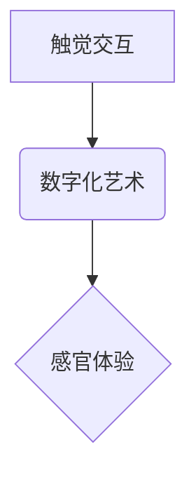

                 

##  数字化触觉艺术创业：新型感官体验的创作平台

> 关键词：触觉交互、数字化艺术、感官体验、人工智能、机器学习、触觉反馈、虚拟现实

## 1. 背景介绍

随着科技的飞速发展，人类对感官体验的需求日益增长。视觉和听觉已经成为主流的数字媒体体验方式，而触觉作为人类感知世界的重要途径，却在数字领域中相对滞后。触觉交互技术的发展为打破这一现状提供了新的可能性，它能够为用户带来更加沉浸式、真实的数字体验。

数字化触觉艺术创业正处于萌芽阶段，但其潜力巨大。通过结合人工智能、机器学习、触觉反馈等技术，我们可以创造出全新的艺术形式，让用户通过触觉感知艺术作品的质感、温度、形状等信息，从而获得更深层次的艺术体验。

## 2. 核心概念与联系

### 2.1  触觉交互

触觉交互是指用户通过触碰、按压、滑动等物理动作与数字系统进行交互，并获得相应的触觉反馈。它可以模拟现实世界中的触觉感受，例如物体的大小、形状、质地、温度等，从而增强用户与数字世界的连接。

### 2.2  数字化艺术

数字化艺术是指利用数字技术创作和呈现的艺术作品。它打破了传统艺术的媒介限制，可以以多种形式存在，例如图像、声音、视频、交互式体验等。数字化艺术的创作媒介和表达方式更加多元化，也更加注重用户参与和互动。

### 2.3  感官体验

感官体验是指人类通过五官感知世界并从中获得信息的过程。视觉、听觉、嗅觉、味觉和触觉都是感官体验的重要组成部分。感官体验是人类理解和体验世界的重要方式，也是艺术创作和欣赏的基础。

**核心概念关系流程图**



## 3. 核心算法原理 & 具体操作步骤

### 3.1  算法原理概述

数字化触觉艺术的创作平台需要利用算法将艺术作品的视觉、听觉等信息转化为触觉反馈。常用的算法包括：

* **触觉映射算法:** 将艺术作品的视觉、听觉等信息映射到触觉反馈的强度、频率、方向等参数。
* **触觉合成算法:** 将多个触觉信号合成，创造出更复杂的触觉体验。
* **触觉反馈控制算法:** 控制触觉反馈设备的运动轨迹和力度，实现触觉交互的精准度和流畅度。

### 3.2  算法步骤详解

以触觉映射算法为例，其具体操作步骤如下：

1. **数据采集:** 收集艺术作品的视觉、听觉等数据。
2. **特征提取:** 从数据中提取与触觉体验相关的特征，例如颜色、形状、节奏、音调等。
3. **映射规则定义:** 根据艺术作品的特点和触觉反馈设备的特性，定义触觉映射规则，将特征映射到触觉反馈的强度、频率、方向等参数。
4. **触觉信号生成:** 根据映射规则，生成触觉信号。
5. **触觉反馈输出:** 将触觉信号输出到触觉反馈设备，实现触觉交互。

### 3.3  算法优缺点

**优点:**

* 可以将艺术作品的多元化信息转化为触觉体验，丰富用户的感官体验。
* 可以根据用户的喜好和需求，定制触觉反馈，实现个性化体验。

**缺点:**

* 触觉映射算法的复杂度较高，需要大量的实验和测试才能获得最佳效果。
* 触觉反馈设备的精度和舒适度还存在一定局限性。

### 3.4  算法应用领域

触觉映射算法在数字化触觉艺术创作平台之外，还可应用于以下领域：

* **游戏开发:** 为游戏玩家提供更加沉浸式的触觉体验。
* **医疗保健:** 用于治疗失明或失聪患者，帮助他们感知周围环境。
* **教育培训:** 用于模拟现实世界中的触觉体验，提高学习效果。

## 4. 数学模型和公式 & 详细讲解 & 举例说明

### 4.1  数学模型构建

触觉映射算法可以利用数学模型来描述触觉反馈与艺术作品信息的映射关系。例如，我们可以使用以下数学模型来描述颜色与触觉强度的映射关系：

$$
F(C) = k * C
$$

其中：

* $F(C)$ 表示触觉强度
* $C$ 表示颜色值
* $k$ 是一个比例系数，用于调整触觉强度的范围

### 4.2  公式推导过程

该公式的推导过程如下：

1. 假设颜色值 $C$ 范围为 $[0, 255]$，触觉强度 $F(C)$ 范围为 $[0, 100]$。
2. 为了保证映射关系的线性性，我们可以使用比例系数 $k$ 来调整触觉强度的范围。
3. 通过实验和测试，我们可以确定合适的比例系数 $k$ 值。

### 4.3  案例分析与讲解

假设我们想要将红色映射到触觉强度 100，绿色映射到触觉强度 50，蓝色映射到触觉强度 0。

* 对于红色，$C = 255$，$F(C) = k * 255 = 100$，因此 $k = 100 / 255 = 0.392$。
* 对于绿色，$C = 128$，$F(C) = k * 128 = 50$，因此 $k$ 值与红色相同。
* 对于蓝色，$C = 0$，$F(C) = k * 0 = 0$，因此 $k$ 值与红色和绿色相同。

通过以上分析，我们可以确定 $k$ 值为 0.392，从而实现颜色与触觉强度的映射关系。

## 5. 项目实践：代码实例和详细解释说明

### 5.1  开发环境搭建

本项目使用 Python 语言开发，需要安装以下软件：

* Python 3.x
* Pygame 库
* TensorFlow 库

### 5.2  源代码详细实现

```python
import pygame
import numpy as np

# 初始化 Pygame
pygame.init()

# 设置窗口大小
screen_width = 800
screen_height = 600
screen = pygame.display.set_mode((screen_width, screen_height))

# 设置标题
pygame.display.set_caption("数字化触觉艺术")

# 加载艺术作品数据
# ...

# 定义触觉映射函数
def map_color_to_force(color):
    # ...

# 游戏循环
running = True
while running:
    for event in pygame.event.get():
        if event.type == pygame.QUIT:
            running = False

    # 获取鼠标位置
    mouse_x, mouse_y = pygame.mouse.get_pos()

    # 获取鼠标颜色
    color = screen.get_at((mouse_x, mouse_y))

    # 将颜色映射到触觉强度
    force = map_color_to_force(color)

    # 控制触觉反馈设备
    # ...

    # 更新显示
    pygame.display.flip()

# 退出 Pygame
pygame.quit()
```

### 5.3  代码解读与分析

* 代码首先初始化 Pygame 库，设置窗口大小和标题。
* 然后加载艺术作品数据，并定义触觉映射函数 `map_color_to_force()`，该函数将颜色值映射到触觉强度。
* 游戏循环中，获取鼠标位置和颜色，并将颜色映射到触觉强度。
* 最后，控制触觉反馈设备，并更新显示。

### 5.4  运行结果展示

运行该代码后，用户可以将鼠标移动到屏幕上，并感受到不同颜色对应的触觉反馈。

## 6. 实际应用场景

数字化触觉艺术创业平台可以应用于以下场景：

### 6.1  艺术展览

* 通过触觉交互，让观众更深入地体验艺术作品的质感、温度、形状等信息。
* 创造出沉浸式的艺术体验，增强观众的参与感和互动性。

### 6.2  教育培训

* 用于模拟现实世界中的触觉体验，例如模拟不同材质的物体、模拟人体器官的触感等。
* 提高学生的学习兴趣和理解能力。

### 6.3  娱乐休闲

* 开发触觉交互游戏，为玩家提供更加沉浸式的游戏体验。
* 创造出全新的娱乐方式，满足用户的个性化需求。

### 6.4  未来应用展望

随着触觉交互技术的不断发展，数字化触觉艺术创业平台将有更广泛的应用场景，例如：

* **医疗保健:** 用于治疗失明或失聪患者，帮助他们感知周围环境。
* **产品设计:** 用于模拟产品的外观、质感和功能，帮助设计师进行产品设计和改进。
* **虚拟现实:** 用于增强虚拟现实体验，让用户在虚拟世界中感受到更加真实的触觉反馈。

## 7. 工具和资源推荐

### 7.1  学习资源推荐

* **书籍:**
    * 《触觉交互设计》
    * 《人工智能与机器学习》
* **在线课程:**
    * Coursera: 人工智能
    * edX: 机器学习
* **网站:**
    * IEEE Haptics
    * ACM SIGGRAPH

### 7.2  开发工具推荐

* **Python:** 
    * Pygame
    * TensorFlow
* **C++:** 
    * OpenHaptics
* **Unity:** 
    * Haptic Feedback Plugin

### 7.3  相关论文推荐

* **触觉交互技术综述**
* **基于深度学习的触觉映射算法**
* **数字化触觉艺术创作平台的设计与实现**

## 8. 总结：未来发展趋势与挑战

### 8.1  研究成果总结

数字化触觉艺术创业平台是一个充满潜力的新兴领域，它将触觉交互技术与艺术创作相结合，创造出全新的艺术体验。

### 8.2  未来发展趋势

* **触觉交互技术的进步:** 触觉反馈设备的精度、舒适度和多样性将不断提高。
* **人工智能技术的应用:** 人工智能技术将被用于更智能、更个性化的触觉映射算法的开发。
* **多感官交互的融合:** 数字化触觉艺术将与其他感官交互技术融合，创造出更加沉浸式的体验。

### 8.3  面临的挑战

* **触觉反馈设备的成本:** 目前触觉反馈设备的成本较高，限制了其普及率。
* **触觉映射算法的复杂性:** 触觉映射算法的开发需要大量的实验和测试，难度较高。
* **用户体验的优化:** 需要不断优化触觉交互体验，使其更加自然、舒适和直观。

### 8.4  研究展望

未来，数字化触觉艺术创业平台将继续发展，并为人们带来更加丰富、更加沉浸式的感官体验。

## 9. 附录：常见问题与解答

**Q1: 如何选择合适的触觉反馈设备？**

**A1:** 选择触觉反馈设备时，需要考虑以下因素：

* **精度:** 触觉反馈设备的精度越高，触觉体验越真实。
* **舒适度:** 触觉反馈设备需要舒适易用，避免用户感到疲劳或不适。
* **多样性:** 触觉反馈设备应能够模拟多种触觉感受，例如压力、振动、温度等。
* **成本:** 触觉反馈设备的成本需要根据实际需求进行选择。

**Q2: 如何开发触觉映射算法？**

**A2:** 开发触觉映射算法需要以下步骤：

1. **收集艺术作品数据:** 收集艺术作品的视觉、听觉等数据。
2. **提取特征:** 从数据中提取与触觉体验相关的特征。
3. **定义映射规则:** 根据艺术作品的特点和触觉反馈设备的特性，定义触觉映射规则。
4. **测试和优化:** 通过实验和测试，不断优化触觉映射算法。


作者：禅与计算机程序设计艺术 / Zen and the Art of Computer Programming 
<end_of_turn>

