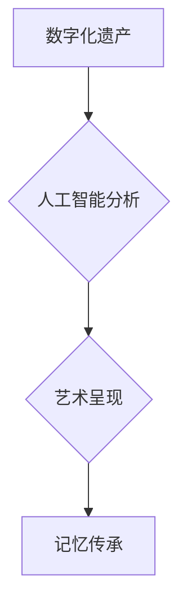

                 

## 数字化遗产艺术创业：逝者记忆的艺术呈现

> 关键词：数字化遗产、人工智能、艺术呈现、记忆传承、虚拟现实、区块链、数据可视化

## 1. 背景介绍

随着科技的飞速发展，数字化技术已深刻地改变着人们的生活方式，也为文化遗产的传承与创新提供了新的机遇。数字化遗产是指利用数字技术对传统文化遗产进行记录、保存、展示和传播的成果。其中，艺术创业作为一种创新型商业模式，正在探索利用数字化技术，赋予逝者记忆新的生命力，并将其转化为具有艺术价值和商业价值的文化产品。

传统文化遗产的传承面临着诸多挑战，例如：

* **物理损耗：** 许多文化遗产是易碎的文物，容易受到时间、环境等因素的影响而损耗。
* **地域限制：** 许多文化遗产集中在特定地域，难以被广泛传播和了解。
* **信息流失：** 随着时间的推移，许多文化遗产相关的历史信息和文化背景可能会被遗忘或流失。

数字化技术为文化遗产的传承提供了新的解决方案：

* **数字化保存：** 利用高精度扫描、3D建模等技术，可以对文化遗产进行数字化保存，避免物理损耗。
* **虚拟展示：** 通过虚拟现实、增强现实等技术，可以构建沉浸式的虚拟展示环境，让用户身临其境地体验文化遗产。
* **跨地域传播：** 数字化文化遗产可以轻松地通过网络进行传播，打破地域限制，让更多人了解和欣赏文化遗产。

## 2. 核心概念与联系

数字化遗产艺术创业的核心概念包括：

* **数字化遗产：** 利用数字技术对传统文化遗产进行记录、保存、展示和传播的成果。
* **人工智能：** 利用机器学习、自然语言处理等技术，对数字化遗产进行分析、理解和生成。
* **艺术呈现：** 将数字化遗产以艺术的形式呈现出来，例如：虚拟展览、数字艺术作品、交互式体验等。
* **记忆传承：** 通过数字化遗产的艺术呈现，传承逝者的记忆和文化精神。

**核心概念架构：**



## 3. 核心算法原理 & 具体操作步骤

### 3.1  算法原理概述

数字化遗产艺术创业的核心算法主要包括：

* **图像识别与分析算法：** 用于识别和分析数字化遗产中的图像信息，例如：人物、场景、纹理等。
* **自然语言处理算法：** 用于分析数字化遗产中的文本信息，例如：历史文献、日记、信件等。
* **数据可视化算法：** 用于将数字化遗产中的数据以直观易懂的方式呈现出来，例如：图表、地图、动画等。

### 3.2  算法步骤详解

**以图像识别与分析算法为例，其具体操作步骤如下：**

1. **图像采集：** 利用高精度扫描仪或相机采集数字化遗产的图像数据。
2. **图像预处理：** 对图像数据进行预处理，例如：去噪、去模糊、色彩校正等。
3. **特征提取：** 利用图像识别算法提取图像中的特征信息，例如：边缘、纹理、形状等。
4. **图像分类：** 利用机器学习算法对提取的特征信息进行分类，识别图像中的物体或场景。
5. **图像分析：** 对分类结果进行分析，提取图像中的关键信息，例如：人物关系、场景描述、时间信息等。

### 3.3  算法优缺点

**图像识别与分析算法的优缺点：**

* **优点：**

    * 自动化程度高，可以快速处理大量图像数据。
    * 识别精度高，可以准确识别图像中的物体或场景。
    * 可以提取图像中的关键信息，为文化遗产的理解和研究提供新的视角。

* **缺点：**

    * 需要大量的训练数据，才能达到较高的识别精度。
    * 对图像质量要求较高，图像模糊或噪声较多时，识别精度会降低。
    * 难以识别一些抽象或模糊的图像内容。

### 3.4  算法应用领域

图像识别与分析算法在数字化遗产艺术创业领域具有广泛的应用前景，例如：

* **虚拟展览：** 利用图像识别技术，识别文物中的关键信息，并将其融入虚拟展览场景中，为用户提供更丰富的交互体验。
* **数字艺术作品：** 利用图像识别技术，提取文物中的纹理、图案等元素，并将其用于创作数字艺术作品。
* **文化遗产保护：** 利用图像识别技术，对文物进行监控和分析，及时发现文物损坏或盗窃等情况。

## 4. 数学模型和公式 & 详细讲解 & 举例说明

### 4.1  数学模型构建

在数字化遗产艺术创业中，可以使用数学模型来描述和分析文化遗产的特征和关系。例如，可以使用图论模型来表示文物之间的关联关系，可以使用统计模型来分析文物分布的规律，可以使用机器学习模型来预测文物价值。

### 4.2  公式推导过程

以文物价值预测为例，可以使用线性回归模型来预测文物价值。

**线性回归模型公式：**

$$
y = \beta_0 + \beta_1 x_1 + \beta_2 x_2 + ... + \beta_n x_n + \epsilon
$$

其中：

* $y$：文物价值
* $x_1, x_2, ..., x_n$：文物特征变量，例如：年代、材质、尺寸、历史背景等
* $\beta_0, \beta_1, \beta_2, ..., \beta_n$：回归系数，表示每个特征变量对文物价值的影响程度
* $\epsilon$：随机误差项

**公式推导过程：**

1. 收集文物数据，包括文物特征变量和文物价值。
2. 使用最小二乘法估计回归系数，使得模型预测值与实际值之间的误差最小。
3. 将估计出的回归系数代入公式，即可得到文物价值的预测模型。

### 4.3  案例分析与讲解

假设我们收集了100件文物的特征数据和价值数据，并使用线性回归模型进行训练。训练结果表明，文物年代、材质和历史背景对文物价值有显著的影响。

**预测模型：**

$$
y = 1000 + 50 * x_1 + 200 * x_2 + 100 * x_3 + \epsilon
$$

其中：

* $y$：文物价值
* $x_1$：文物年代（以年份为单位）
* $x_2$：文物材质（例如：陶瓷、玉器、金属等，使用数值编码表示）
* $x_3$：文物历史背景（例如：朝代、文化流派等，使用数值编码表示）

我们可以使用这个预测模型来预测新文物价值。例如，如果一个文物年代为1000年，材质为陶瓷，历史背景为唐朝，那么其价值可以预测为：

$$
y = 1000 + 50 * 1000 + 200 * 1 + 100 * 1 + \epsilon
$$

$$
y = 50200 + \epsilon
$$

## 5. 项目实践：代码实例和详细解释说明

### 5.1  开发环境搭建

数字化遗产艺术创业项目可以使用多种开发环境，例如：

* **本地开发环境：** 使用个人电脑或服务器搭建开发环境，可以更好地控制开发环境和数据安全。
* **云平台开发环境：** 使用云平台提供的开发资源，例如：AWS、Azure、GCP等，可以快速搭建开发环境，并享受云平台提供的服务和支持。

### 5.2  源代码详细实现

以下是一个使用Python语言实现图像识别与分析算法的简单代码示例：

```python
import cv2

# 加载图像
image = cv2.imread('heritage.jpg')

# 转换图像格式
gray = cv2.cvtColor(image, cv2.COLOR_BGR2GRAY)

# 使用边缘检测算法检测图像边缘
edges = cv2.Canny(gray, 100, 200)

# 显示图像
cv2.imshow('Edges', edges)
cv2.waitKey(0)
cv2.destroyAllWindows()
```

**代码解释：**

1. 使用OpenCV库加载图像文件。
2. 将图像转换为灰度图像。
3. 使用Canny边缘检测算法检测图像边缘。
4. 显示检测到的边缘图像。

### 5.3  代码解读与分析

这个代码示例演示了如何使用OpenCV库进行图像处理和边缘检测。

* `cv2.imread()` 函数用于加载图像文件。
* `cv2.cvtColor()` 函数用于将图像转换为灰度图像。
* `cv2.Canny()` 函数用于检测图像边缘。
* `cv2.imshow()` 函数用于显示图像。
* `cv2.waitKey(0)` 函数用于等待用户按下任意键。
* `cv2.destroyAllWindows()` 函数用于关闭所有窗口。

### 5.4  运行结果展示

运行这个代码示例后，会显示一个检测到的边缘图像。

## 6. 实际应用场景

数字化遗产艺术创业的应用场景非常广泛，例如：

* **虚拟博物馆：** 利用虚拟现实技术，构建沉浸式的虚拟博物馆，让用户身临其境地体验文物和历史文化。
* **数字艺术展览：** 利用数字艺术技术，将文物和历史文化融入艺术作品中，举办数字艺术展览，吸引更多人关注文化遗产。
* **文化遗产教育：** 利用数字化技术，开发文化遗产教育软件和游戏，让用户在互动体验中学习文化遗产知识。
* **文化旅游：** 利用数字化技术，开发文化旅游路线和产品，让用户在旅游中体验文化遗产的魅力。

### 6.4  未来应用展望

数字化遗产艺术创业的未来应用前景十分广阔，例如：

* **人工智能驱动的文化遗产分析：** 利用人工智能技术，对文化遗产进行更深入的分析，挖掘更多文化内涵和历史价值。
* **增强现实文化遗产体验：** 利用增强现实技术，将文物和历史信息叠加到现实世界中，为用户提供更丰富的交互体验。
* **区块链技术保障文化遗产版权：** 利用区块链技术，建立文化遗产的数字版权管理系统，保障文化遗产的知识产权。

## 7. 工具和资源推荐

### 7.1  学习资源推荐

* **在线课程：** Coursera、edX、Udacity等平台提供有关数字化遗产、人工智能、艺术设计等方面的在线课程。
* **书籍：** 《数字遗产：文化遗产的数字化保存与利用》、《人工智能：改变世界的算法》、《数字艺术：创意与技术》等书籍。
* **学术期刊：** 《数字遗产》、《计算机图形学》、《人工智能》等学术期刊。

### 7.2  开发工具推荐

* **图像处理库：** OpenCV、Pillow、Scikit-image等。
* **机器学习库：** TensorFlow、PyTorch、Scikit-learn等。
* **虚拟现实开发平台：** Unity、Unreal Engine等。

### 7.3  相关论文推荐

* **数字化遗产的保存与利用：**

    * "Digital Preservation: A Framework for the Future" by Richard J. Cox
    * "Towards a Framework for Digital Heritage Management" by David Bearman

* **人工智能在文化遗产领域的应用：**

    * "Deep Learning for Cultural Heritage: A Survey" by Francesco Stella et al.
    * "Using Machine Learning to Identify and Classify Cultural Heritage Objects" by Michael J. T. Smith et al.

## 8. 总结：未来发展趋势与挑战

### 8.1  研究成果总结

数字化遗产艺术创业是一个新兴的领域，近年来取得了显著的成果。

* **技术方面：** 图像识别、自然语言处理、数据可视化等技术的进步，为数字化遗产的分析和呈现提供了强大的工具。
* **应用方面：** 虚拟博物馆、数字艺术展览、文化遗产教育等应用场景不断涌现，丰富了文化遗产的传播和体验方式。

### 8.2  未来发展趋势

数字化遗产艺术创业的未来发展趋势包括：

* **人工智能技术的深度融合：** 利用更先进的人工智能技术，对文化遗产进行更深入的分析和理解，挖掘更多文化内涵和历史价值。
* **沉浸式体验技术的应用：** 利用虚拟现实、增强现实等技术，为用户提供更沉浸式的文化遗产体验。
* **跨界融合的创新模式：** 将数字化遗产与其他领域，例如：游戏、音乐、电影等进行融合，创造新的文化产品和服务。

### 8.3  面临的挑战

数字化遗产艺术创业也面临着一些挑战：

* **数据获取和管理：** 文化遗产数据往往分散、碎片化，需要建立统一的数据管理体系。
* **技术标准的制定：** 数字化遗产的标准化和互操作性需要进一步完善。
* **版权和知识产权保护：** 数字化遗产的版权和知识产权保护需要加强。

### 8.4  研究展望

未来，数字化遗产艺术创业将继续发展壮大，为文化遗产的传承和创新做出更大的贡献。

## 9. 附录：常见问题与解答

**常见问题：**

* **数字化遗产的定义是什么？**

数字化遗产是指利用数字技术对传统文化遗产进行记录、保存、展示和传播的成果。

* **数字化遗产艺术创业有哪些应用场景？**

数字化遗产艺术创业的应用场景非常广泛，例如：虚拟博物馆、数字艺术展览、文化遗产教育、文化旅游等。

* **数字化遗产艺术创业有哪些技术挑战？**

数字化遗产艺术创业面临着数据获取和管理、技术标准的制定、版权和知识产权保护等技术挑战。

**解答：**

* **数字化遗产的定义：** 数字化遗产是指利用数字技术对传统文化遗产进行记录、保存、展示和传播的成果。

* **数字化遗产艺术创业有哪些应用场景？**

数字化遗产艺术创业的应用场景非常广泛，例如：虚拟博物馆、数字艺术展览、文化遗产教育、文化旅游等。

* **数字化遗产艺术创业有哪些技术挑战？**

数字化遗产艺术创业面临着数据获取和管理、技术标准的制定、版权和知识产权保护等技术挑战。


作者：禅与计算机程序设计艺术 / Zen and the Art of Computer Programming<end_of_turn>

