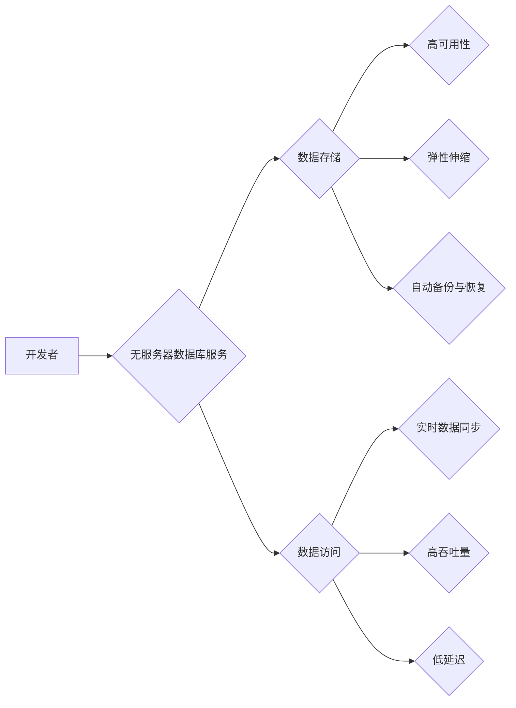

                 

## 无服务器数据库：Firebase Firestore与DynamoDB

> 关键词：无服务器数据库、Firestore、DynamoDB、NoSQL、云数据库、数据存储、应用程序开发

## 1. 背景介绍

随着移动互联网和云计算的蓬勃发展，应用程序的需求量呈指数级增长。传统的数据库架构难以满足这些应用程序对高可用性、弹性伸缩和快速响应的需求。无服务器数据库应运而生，它提供了一种无需手动管理服务器和基础设施的数据库服务，开发者可以专注于应用程序的业务逻辑，而无需担心数据库的维护和管理。

Firebase Firestore和Amazon DynamoDB是目前市场上两款最受欢迎的无服务器数据库服务。它们都提供了强大的功能和高性能，但它们在架构、数据模型和使用场景上存在一些差异。本文将深入探讨Firebase Firestore和DynamoDB的特性、优缺点以及应用场景，帮助开发者选择最适合自己应用程序的无服务器数据库解决方案。

## 2. 核心概念与联系

### 2.1  无服务器数据库的概念

无服务器数据库是一种基于云计算的数据库服务，它由云服务提供商负责管理服务器、存储和网络基础设施。开发者无需关心数据库的物理部署、维护和升级，只需通过API接口访问和操作数据。

### 2.2  Firebase Firestore和DynamoDB的架构

**Firebase Firestore**

Firestore是一个基于文档的NoSQL数据库，数据以JSON格式存储在文档中。它支持实时数据同步，可以轻松构建实时应用程序。

**DynamoDB**

DynamoDB是一个基于键值对的NoSQL数据库，数据以键值对的形式存储。它提供高吞吐量和低延迟，适合处理海量数据和高并发访问场景。

**Mermaid 流程图**



## 3. 核心算法原理 & 具体操作步骤

### 3.1  算法原理概述

Firebase Firestore和DynamoDB都采用了分布式数据库的架构，将数据分片存储在多个节点上，以提高可用性和性能。

**Firestore**

Firestore使用**分片和复制**技术来实现数据分布。数据根据键值进行分片，每个分片存储在不同的节点上。每个分片还会进行复制，以保证数据的高可用性。

**DynamoDB**

DynamoDB使用**主键分区和复制**技术来实现数据分布。数据根据主键进行分区，每个分区存储在不同的节点上。每个分区还会进行复制，以保证数据的高可用性。

### 3.2  算法步骤详解

**Firestore**

1. **数据分片:** 根据数据键值进行分片，将数据分配到不同的节点上。
2. **数据复制:** 每个分片进行复制，存储在多个节点上，以保证数据的高可用性。
3. **数据访问:** 根据数据键值，定位到对应的节点，并访问数据。

**DynamoDB**

1. **数据分区:** 根据数据主键进行分区，将数据分配到不同的节点上。
2. **数据复制:** 每个分区进行复制，存储在多个节点上，以保证数据的高可用性。
3. **数据访问:** 根据数据主键，定位到对应的节点，并访问数据。

### 3.3  算法优缺点

**Firestore**

* **优点:**
    * 数据模型灵活，支持文档和集合结构。
    * 实时数据同步，适合构建实时应用程序。
    * 易于使用，API简单易懂。
* **缺点:**
    * 查询性能相对较低，不支持复杂的查询操作。
    * 数据存储成本相对较高。

**DynamoDB**

* **优点:**
    * 高吞吐量和低延迟，适合处理海量数据和高并发访问场景。
    * 数据存储成本相对较低。
    * 支持多种数据类型，包括字符串、数字、布尔值和二进制数据。
* **缺点:**
    * 数据模型相对简单，只能存储键值对。
    * 不支持实时数据同步。

### 3.4  算法应用领域

**Firestore**

* 实时聊天应用程序
* 社交媒体应用程序
* 游戏应用程序
* 移动应用程序

**DynamoDB**

* 电子商务平台
* 金融交易系统
* 物联网平台
* 大数据分析系统

## 4. 数学模型和公式 & 详细讲解 & 举例说明

### 4.1  数学模型构建

**数据分片算法**

Firestore和DynamoDB都使用分片算法将数据分配到不同的节点上。一个常见的分片算法是**哈希分片算法**，它使用哈希函数将数据键值映射到一个特定的分片上。

**哈希函数:**

$$h(key) = hash(key) \mod n$$

其中：

* $h(key)$ 是哈希函数的结果
* $key$ 是数据键值
* $hash(key)$ 是哈希函数
* $n$ 是分片数量

**举例说明:**

假设我们有一个数据库，包含以下数据：

* 键值: "user1", "user2", "user3"
* 分片数量: 3

我们可以使用以下哈希函数将数据分片到不同的节点上:

$$h(key) = hash(key) \mod 3$$

* 如果 $hash("user1") = 1$，则 "user1" 分片到节点 1
* 如果 $hash("user2") = 2$，则 "user2" 分片到节点 2
* 如果 $hash("user3") = 0$，则 "user3" 分片到节点 0

### 4.2  公式推导过程

**数据复制算法**

Firestore和DynamoDB都使用数据复制算法来保证数据的高可用性。一个常见的复制算法是**主从复制**，它将数据复制到多个节点上，其中一个节点作为主节点，其他节点作为从节点。

**主从复制算法:**

1. 主节点负责处理所有数据写入操作。
2. 主节点将数据写入操作同步到所有从节点。
3. 从节点负责处理所有数据读取操作。

### 4.3  案例分析与讲解

**高可用性案例分析:**

假设Firestore中的主节点出现故障，从节点可以接管主节点的功能，继续处理数据写入和读取操作，保证应用程序的可用性。

## 5. 项目实践：代码实例和详细解释说明

### 5.1  开发环境搭建

* **Firestore:** 需要创建一个Firebase项目，并配置Firestore数据库。
* **DynamoDB:** 需要创建一个AWS账户，并配置DynamoDB数据库。

### 5.2  源代码详细实现

**Firestore代码示例 (JavaScript)**

```javascript
// 获取Firestore数据库实例
const db = firebase.firestore();

// 添加文档
db.collection('users').add({
  name: 'John Doe',
  email: 'john.doe@example.com'
})
.then(() => {
  console.log('Document added successfully!');
})
.catch((error) => {
  console.error('Error adding document:', error);
});

// 读取文档
db.collection('users').doc('user1').get()
.then((doc) => {
  if (doc.exists) {
    console.log('Document data:', doc.data());
  } else {
    console.log('No such document!');
  }
})
.catch((error) => {
  console.error('Error getting document:', error);
});
```

**DynamoDB代码示例 (Python)**

```python
import boto3

# 创建DynamoDB客户端
dynamodb = boto3.client('dynamodb')

# 添加项
response = dynamodb.put_item(
    TableName='users',
    Item={
        'id': {'S': 'user1'},
        'name': {'S': 'John Doe'},
        'email': {'S': 'john.doe@example.com'}
    }
)

# 读取项
response = dynamodb.get_item(
    TableName='users',
    Key={
        'id': {'S': 'user1'}
    }
)

print(response['Item'])
```

### 5.3  代码解读与分析

* **Firestore代码示例:**
    * 使用Firebase SDK访问Firestore数据库。
    * 使用`add()`方法添加文档。
    * 使用`get()`方法读取文档。
* **DynamoDB代码示例:**
    * 使用Boto3 SDK访问DynamoDB数据库。
    * 使用`put_item()`方法添加项。
    * 使用`get_item()`方法读取项。

### 5.4  运行结果展示

* **Firestore代码示例:**
    * 添加成功后，会在Firestore数据库中创建一个新的文档。
    * 读取成功后，会打印出文档的数据。
* **DynamoDB代码示例:**
    * 添加成功后，会在DynamoDB数据库中创建一个新的项。
    * 读取成功后，会打印出项的数据。

## 6. 实际应用场景

### 6.1  实时聊天应用程序

Firestore的实时数据同步特性非常适合构建实时聊天应用程序。当用户发送消息时，Firestore会自动将消息同步到所有连接的客户端，从而实现实时聊天效果。

### 6.2  社交媒体应用程序

Firestore的文档结构和灵活的数据模型非常适合构建社交媒体应用程序。可以将用户、帖子、评论等数据存储在不同的文档中，并使用关系查询来关联数据。

### 6.3  游戏应用程序

Firestore的实时数据同步特性和高可用性非常适合构建游戏应用程序。可以将游戏数据存储在Firestore中，并使用实时数据同步来实现多人游戏和排行榜功能。

### 6.4  未来应用展望

无服务器数据库技术将继续发展，并应用于更多领域。例如：

* **物联网:** 无服务器数据库可以帮助处理海量物联网数据，并提供实时数据分析和决策支持。
* **边缘计算:** 无服务器数据库可以部署在边缘设备上，实现本地数据存储和处理，降低网络延迟和带宽消耗。
* **人工智能:** 无服务器数据库可以提供实时数据流，支持人工智能模型的训练和推理。

## 7. 工具和资源推荐

### 7.1  学习资源推荐

* **Firebase官方文档:** https://firebase.google.com/docs/firestore
* **DynamoDB官方文档:** https://docs.aws.amazon.com/amazondynamodb/latest/developerguide/Welcome.html
* **NoSQL数据库教程:** https://www.tutorialspoint.com/nosql/index.htm

### 7.2  开发工具推荐

* **Firebase CLI:** https://firebase.google.com/docs/cli
* **AWS SDK:** https://aws.amazon.com/sdk/

### 7.3  相关论文推荐

* **Firestore论文:** https://firebase.googleblog.com/2017/05/introducing-firestore-fully-managed.html
* **DynamoDB论文:** https://aws.amazon.com/blogs/aws/introducing-amazon-dynamodb-a-fully-managed-key-value-store/

## 8. 总结：未来发展趋势与挑战

### 8.1  研究成果总结

无服务器数据库技术已经取得了显著的进展，提供了高效、可靠和可扩展的数据存储解决方案。Firebase Firestore和DynamoDB是目前市场上两款最受欢迎的无服务器数据库服务，它们都提供了强大的功能和高性能。

### 8.2  未来发展趋势

* **更强大的数据分析功能:** 无服务器数据库将集成更强大的数据分析功能，支持实时数据分析和机器学习。
* **更完善的安全性:** 无服务器数据库将提供更完善的安全性，包括数据加密、访问控制和审计功能。
* **更广泛的应用场景:** 无服务器数据库将应用于更多领域，例如物联网、边缘计算和人工智能。

### 8.3  面临的挑战

* **数据一致性:** 无服务器数据库需要解决数据一致性问题，确保数据在多个节点上保持一致。
* **数据迁移:** 将现有数据库迁移到无服务器数据库平台可能面临挑战。
* **成本控制:** 无服务器数据库的成本可能比传统数据库更高，需要进行合理的成本控制。

### 8.4  研究展望

未来，无服务器数据库技术将继续发展，并解决当前面临的挑战。研究者将继续探索新的算法和架构，以提高无服务器数据库的性能、可靠性和安全性。


## 9. 附录：常见问题与解答

**Q1: Firestore和DynamoDB哪个更适合我的应用程序？**

**A1:** 

* 如果您的应用程序需要实时数据同步，并且数据模型比较灵活，Firestore是一个不错的选择。
* 如果您的应用程序需要高吞吐量和低延迟，并且数据模型比较简单，DynamoDB是一个更好的选择。

**Q2: 如何将现有数据库迁移到无服务器数据库？**

**A2:** 

* 您可以使用第三方工具或服务来帮助迁移数据。
* 也可以手动将数据导出到CSV文件，然后导入到无服务器数据库中。

**Q3: 无服务器数据库的成本如何计算？**

**A3:** 

* Firestore和DynamoDB的成本计算方式略有不同。
* 您可以在各自的官方文档中找到详细的成本计算说明。


作者：禅与计算机程序设计艺术 / Zen and the Art of Computer Programming 
<end_of_turn>

