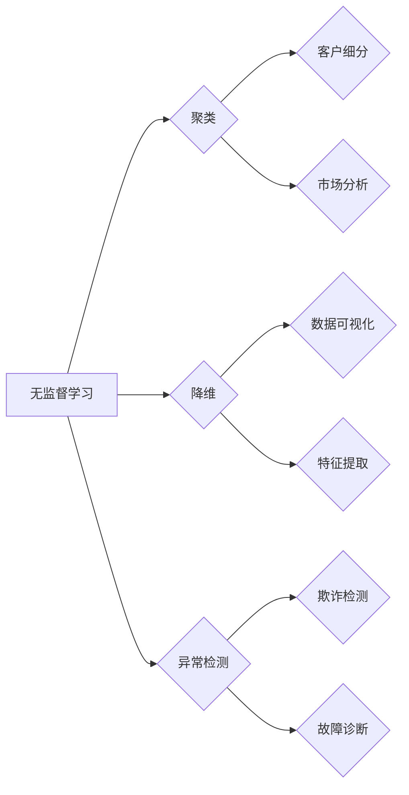

                 

## 无监督学习的评估方法:聚类、降维和异常检测

> 关键词：无监督学习、聚类、降维、异常检测、评估指标、性能分析

## 1. 背景介绍

无监督学习作为机器学习的重要分支，旨在从未标记的数据中学习模式和结构。与监督学习不同，无监督学习没有明确的标签信息，因此评估模型性能更加复杂。本文将深入探讨无监督学习的评估方法，重点关注聚类、降维和异常检测三个常见任务。

随着数据量的爆炸式增长，无监督学习在数据挖掘、模式识别、图像处理等领域发挥着越来越重要的作用。例如，聚类可以用于客户细分、市场分析；降维可以用于数据可视化、特征提取；异常检测可以用于欺诈检测、故障诊断。

然而，由于缺乏标签信息，传统的监督学习评估指标如准确率、召回率等无法直接应用于无监督学习。因此，需要开发专门的评估指标来衡量无监督学习模型的性能。

## 2. 核心概念与联系

无监督学习的评估方法主要围绕着以下三个核心概念：

* **聚类:** 将数据点划分为若干个互斥且相对集中的簇，每个簇包含具有相似特征的数据点。
* **降维:** 将高维数据映射到低维空间，同时尽可能保留数据的原始信息。
* **异常检测:** 识别数据集中与众不同的数据点，这些数据点可能代表异常事件或错误数据。

这三个任务之间存在着密切的联系。例如，降维技术可以作为聚类算法的预处理步骤，提高聚类的效果。异常检测也可以基于聚类结果，识别与其他簇明显不同的数据点。

**Mermaid 流程图:**



## 3. 核心算法原理 & 具体操作步骤

### 3.1  算法原理概述

本文将介绍三种常用的无监督学习算法：K-Means聚类、主成分分析（PCA）降维和基于距离的异常检测。

* **K-Means聚类:** 是一种基于距离的聚类算法，它将数据点划分为K个簇，每个簇的中心点是该簇中所有数据点的平均值。算法迭代地更新簇中心点，直到簇结构不再变化。

* **主成分分析（PCA）降维:** 是一种线性降维技术，它通过寻找数据中方差最大的方向来降低数据维度。PCA将数据投影到这些方向上，保留了数据的最大信息量。

* **基于距离的异常检测:** 这种方法基于数据点的距离分布，将距离均值较大的数据点识别为异常点。常用的距离度量包括欧氏距离、曼哈顿距离等。

### 3.2  算法步骤详解

#### 3.2.1 K-Means聚类

1. **初始化:** 随机选择K个数据点作为初始簇中心。
2. **分配:** 将每个数据点分配到距离其最近的簇中心。
3. **更新:** 计算每个簇的中心点，并将数据点重新分配到新的簇中心。
4. **迭代:** 重复步骤2和3，直到簇结构不再变化。

#### 3.2.2 主成分分析（PCA）降维

1. **数据标准化:** 将数据标准化到均值为0，标准差为1。
2. **协方差矩阵计算:** 计算数据的协方差矩阵。
3. **特征值和特征向量计算:** 计算协方差矩阵的特征值和特征向量。
4. **特征向量排序:** 将特征向量按特征值大小排序。
5. **降维:** 选择前k个特征向量，将数据投影到这些特征向量空间，实现降维。

#### 3.2.3 基于距离的异常检测

1. **计算距离:** 计算每个数据点与其他数据点的距离。
2. **设定阈值:** 根据数据分布，设定一个距离阈值。
3. **识别异常点:** 将距离均值超过阈值的点识别为异常点。

### 3.3  算法优缺点

#### 3.3.1 K-Means聚类

* **优点:** 简单易实现，计算效率高。
* **缺点:** 容易受到初始簇中心的选择影响，对噪声数据敏感。

#### 3.3.2 主成分分析（PCA）降维

* **优点:** 可以有效地降低数据维度，保留数据的最大信息量。
* **缺点:** 只能处理线性关系的数据，对非线性关系的数据效果较差。

#### 3.3.3 基于距离的异常检测

* **优点:** 简单易理解，易于实现。
* **缺点:** 对数据分布敏感，难以处理高维数据。

### 3.4  算法应用领域

* **K-Means聚类:** 客户细分、市场分析、图像分割、文档聚类。
* **主成分分析（PCA）降维:** 数据可视化、特征提取、噪声去除、图像压缩。
* **基于距离的异常检测:** 欺诈检测、故障诊断、网络入侵检测、医疗诊断。

## 4. 数学模型和公式 & 详细讲解 & 举例说明

### 4.1  数学模型构建

#### 4.1.1 K-Means聚类

K-Means聚类的目标是找到K个簇中心，使得每个数据点到其所属簇中心的距离最小。

* **距离度量:** 通常使用欧氏距离作为距离度量。

* **目标函数:**

$$
J(C) = \sum_{i=1}^{K} \sum_{x \in C_i} ||x - \mu_i||^2
$$

其中，$C$ 是簇集合，$K$ 是簇的数量，$C_i$ 是第i个簇，$x$ 是数据点，$\mu_i$ 是第i个簇的中心点。

#### 4.1.2 主成分分析（PCA）降维

PCA的目标是找到数据中方差最大的方向，并将其作为新的坐标轴。

* **协方差矩阵:** 协方差矩阵描述了数据中不同特征之间的相关性。

* **特征值和特征向量:** 特征值表示数据在每个方向上的方差，特征向量表示每个方向。

* **主成分:** 选择前k个特征值对应的特征向量作为主成分，构成新的坐标系。

#### 4.1.3 基于距离的异常检测

基于距离的异常检测方法通常使用距离均值作为异常判断的标准。

* **距离度量:** 欧氏距离、曼哈顿距离等。
* **阈值设定:** 根据数据分布设定一个距离阈值，超过阈值的点被认为是异常点。

### 4.2  公式推导过程

#### 4.2.1 K-Means聚类

K-Means聚类的目标函数$J(C)$的最小化可以通过迭代更新簇中心点来实现。

* **更新公式:**

$$
\mu_i = \frac{\sum_{x \in C_i} x}{|C_i|}
$$

其中，$|C_i|$ 是第i个簇的大小。

#### 4.2.2 主成分分析（PCA）降维

PCA的降维过程可以总结为以下步骤：

1. 计算协方差矩阵。
2. 计算协方差矩阵的特征值和特征向量。
3. 将特征向量按特征值大小排序。
4. 选择前k个特征向量作为主成分。
5. 将数据投影到主成分空间。

#### 4.2.3 基于距离的异常检测

异常检测的阈值设定可以通过以下方法进行：

* **经验法:** 根据经验设定阈值。
* **统计法:** 使用统计方法，例如标准差、百分位数等，设定阈值。

### 4.3  案例分析与讲解

#### 4.3.1 K-Means聚类

假设我们有一组客户数据，包含年龄、收入、消费等特征。我们可以使用K-Means聚类将客户划分为不同的消费群体。

#### 4.3.2 主成分分析（PCA）降维

假设我们有一组高维图像数据，可以使用PCA降维，将图像数据映射到低维空间，从而实现图像压缩和可视化。

#### 4.3.3 基于距离的异常检测

假设我们有一组网络流量数据，可以使用基于距离的异常检测方法识别异常流量，例如网络攻击。

## 5. 项目实践：代码实例和详细解释说明

### 5.1  开发环境搭建

本项目使用Python语言进行开发，所需的库包括：

* scikit-learn: 提供各种机器学习算法，包括K-Means聚类、PCA降维等。
* numpy: 提供数值计算和数组操作。
* matplotlib: 提供数据可视化工具。

### 5.2  源代码详细实现

#### 5.2.1 K-Means聚类

```python
from sklearn.cluster import KMeans
import numpy as np
import matplotlib.pyplot as plt

# 生成随机数据
X = np.random.rand(100, 2)

# 使用K-Means聚类
kmeans = KMeans(n_clusters=3)
kmeans.fit(X)

# 获取聚类结果
labels = kmeans.labels_

# 可视化聚类结果
plt.scatter(X[:, 0], X[:, 1], c=labels)
plt.show()
```

#### 5.2.2 主成分分析（PCA）降维

```python
from sklearn.decomposition import PCA
import numpy as np
import matplotlib.pyplot as plt

# 生成随机数据
X = np.random.rand(100, 5)

# 使用PCA降维
pca = PCA(n_components=2)
X_reduced = pca.fit_transform(X)

# 可视化降维结果
plt.scatter(X_reduced[:, 0], X_reduced[:, 1])
plt.show()
```

#### 5.2.3 基于距离的异常检测

```python
from sklearn.neighbors import LocalOutlierFactor
import numpy as np
import matplotlib.pyplot as plt

# 生成随机数据
X = np.random.rand(100, 2)
# 添加一些异常点
X[50:60, :] = np.random.rand(10, 2) * 3

# 使用LocalOutlierFactor检测异常点
lof = LocalOutlierFactor()
lof.fit(X)

# 获取异常点标签
outlier_labels = lof.negative_outlier_factor_

# 可视化异常点
plt.scatter(X[:, 0], X[:, 1], c=outlier_labels)
plt.show()
```

### 5.3  代码解读与分析

以上代码示例展示了三种无监督学习算法的简单实现。

* K-Means聚类代码使用scikit-learn库中的KMeans类进行聚类，并使用matplotlib库进行可视化。
* PCA降维代码使用scikit-learn库中的PCA类进行降维，并使用matplotlib库进行可视化。
* 基于距离的异常检测代码使用scikit-learn库中的LocalOutlierFactor类进行异常检测，并使用matplotlib库进行可视化。

### 5.4  运行结果展示

运行以上代码将生成相应的可视化结果，展示聚类结果、降维结果和异常点。

## 6. 实际应用场景

### 6.1  聚类

* **客户细分:** 根据客户的消费习惯、年龄、收入等特征，将客户划分为不同的消费群体，以便针对不同群体的需求进行营销推广。
* **市场分析:** 对市场上的产品进行聚类，分析产品的相似性和差异性，为产品开发和市场定位提供参考。
* **图像分割:** 将图像分割成不同的区域，例如将人脸从背景中分离出来。

### 6.2  降维

* **数据可视化:** 将高维数据降维到二维或三维空间，方便可视化和分析。
* **特征提取:** 从高维数据中提取重要的特征，用于后续的机器学习模型训练。
* **噪声去除:** 通过降维，去除数据中的噪声，提高数据的质量。

### 6.3  异常检测

* **欺诈检测:** 检测信用卡交易、网络交易等中的异常行为，识别欺诈交易。
* **故障诊断:** 在工业生产中，检测设备运行中的异常数据，及时发现故障。
* **网络入侵检测:** 检测网络流量中的异常数据，识别网络攻击。

### 6.4  未来应用展望

无监督学习在未来将有更广泛的应用，例如：

* **自动驾驶:** 无监督学习可以用于训练自动驾驶汽车的感知模型，识别道路上的障碍物和行人。
* **医疗诊断:** 无监督学习可以用于分析医学图像，辅助医生进行诊断。
* **个性化推荐:** 无监督学习可以用于分析用户的行为数据，提供个性化的产品推荐。

## 7. 工具和资源推荐

### 7.1  学习资源推荐

* **书籍:**
    * "The Elements of Statistical Learning" by Trevor Hastie, Robert Tibshirani, and Jerome Friedman
    * "Pattern Recognition and Machine Learning" by Christopher M. Bishop
* **在线课程:**
    * Coursera: "Machine Learning" by Andrew Ng
    * edX: "Introduction to Machine Learning" by Columbia University

### 7.2  开发工具推荐

* **Python:** 广泛使用的编程语言，用于机器学习开发。
* **scikit-learn:** Python机器学习库，提供各种算法和工具。
* **TensorFlow:** 开源深度学习框架。
* **PyTorch:** 开源深度学习框架。

### 7.3  相关论文推荐

* "K-Means Clustering" by Stuart Lloyd
* "Principal Component Analysis" by Pearson
* "Local Outlier Factor" by Aggarwal and Hinneburg

## 8. 总结：未来发展趋势与挑战

### 8.1  研究成果总结

无监督学习在过去几十年取得了显著进展，涌现出许多有效的算法和方法。

* **聚类算法:** K-Means、DBSCAN、层次聚类等算法不断改进，提高了聚类的效果。
* **降维算法:** PCA、t-SNE、LDA等算法被广泛应用于数据可视化、特征提取等领域。
* **异常检测算法:** 基于距离、基于概率、基于深度学习等方法不断发展，提高了异常检测的准确率。

### 8.2  未来发展趋势

* **深度学习:** 深度学习方法在无监督学习领域展现出巨大的潜力，例如自编码器、生成对抗网络等。
* **迁移学习:** 将已训练好的模型应用于新的任务，减少数据标注成本。
* **联邦学习:** 在不共享原始数据的情况下，训练共享模型，保护数据隐私。

### 8.3  面临的挑战

* **评估指标:** 无监督学习的评估指标相对复杂，缺乏统一的标准。
* **解释性:** 许多无监督学习算法的决策过程难以解释，缺乏透明度。
* **数据质量:** 无监督学习算法对数据质量要求较高，噪声数据和缺失数据会影响算法性能。

### 8.4  研究展望

未来，无监督学习的研究将继续朝着更智能、更可解释、更鲁棒的方向发展。


## 9. 附录：常见问题与解答

### 9.1  常见问题

* **如何选择合适的聚类算法？**

选择合适的聚类算法需要根据数据的特点和任务需求进行选择。例如，对于数据分布较为均匀的情况，K-Means算法效果较好；对于数据分布较为复杂的情况，DBSCAN算法可能更合适。

* **如何确定聚类的数量？**

聚类的数量可以通过肘部法则、Silhouette分析等方法进行确定。

* **如何评估异常检测算法的性能？**

常用的异常检测算法性能评估指标包括准确率、召回率、F1-score等。

### 9.2  解答

* **如何选择合适的聚类算法？**

选择合适的聚类算法需要根据数据的特点和任务需求进行选择。例如，对于数据分布较为均匀的情况，K-Means算法效果较好；对于数据分布较为复杂的情况，DBSCAN算法可能更合适。

* **如何确定聚类的数量？**

聚类的数量可以通过肘部法则、Silhouette分析等方法进行确定。

* **如何评估异常检测算法的性能？**

常用的异常检测算法性能评估指标包括准确率、召回率、F1-score等。


作者：禅与计算机程序设计艺术 / Zen and the Art of Computer Programming<end_of_turn>

