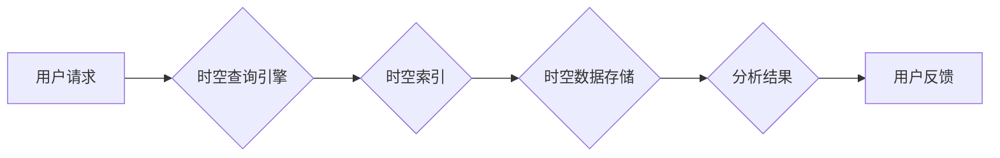

                 

## 时空数据库：管理地理位置和时间数据

> 关键词：时空数据库、地理空间数据、时间序列数据、空间-时间查询、时空分析、数据库管理系统、GIS、Big Data

## 1. 背景介绍

随着物联网、大数据和云计算技术的快速发展，地理位置和时间信息在各个领域都扮演着越来越重要的角色。从智能交通、精准农业到金融风险管理，海量时空数据为我们提供了前所未有的洞察力和决策支持。然而，传统的数据库系统难以有效地存储、管理和分析这种复杂的空间-时间关联数据。

时空数据库应运而生，旨在专门处理地理位置和时间信息。它提供了一种高效、灵活的机制，可以存储、查询、分析和可视化时空数据，满足现代应用对时空信息的处理需求。

## 2. 核心概念与联系

时空数据库的核心概念是将地理位置和时间信息紧密地结合在一起，形成一个统一的空间-时间模型。

**2.1. 空间数据模型**

空间数据模型用于表示地理位置信息。常见的模型包括：

* **矢量模型:** 使用点、线、面等几何图形来表示空间对象。
* **栅格模型:** 将空间划分为规则的网格单元，每个单元都具有特定的属性值。

**2.2. 时间数据模型**

时间数据模型用于表示时间信息。常见的模型包括：

* **离散时间模型:** 使用时间戳或时间间隔来表示时间点或时间段。
* **连续时间模型:** 使用时间函数或时间序列来表示时间变化趋势。

**2.3. 时空索引**

时空索引是时空数据库的关键技术，用于加速时空查询。常见的时空索引包括：

* **R-树:** 用于存储和查询空间数据。
* **时间索引:** 用于存储和查询时间数据。
* **时空索引:** 将空间索引和时间索引结合起来，用于存储和查询时空数据。

**2.4. 时空查询**

时空查询是指根据空间和时间条件检索时空数据。常见的时空查询类型包括：

* **空间查询:** 根据空间位置条件检索数据，例如查询某个区域内的所有数据。
* **时间查询:** 根据时间条件检索数据，例如查询某个时间段内的所有数据。
* **时空查询:** 根据空间和时间条件联合检索数据，例如查询某个区域内某个时间段内的所有数据。

**2.5. 时空分析**

时空分析是指对时空数据进行分析，以发现空间-时间模式和趋势。常见的时空分析方法包括：

* **空间聚类分析:** 将空间数据按照相似性进行分组。
* **空间趋势分析:** 分析空间数据随时间变化的趋势。
* **空间关联分析:** 分析空间数据之间的关联关系。

**2.6. 架构图**



## 3. 核心算法原理 & 具体操作步骤

### 3.1. 算法原理概述

时空数据库的核心算法原理是基于空间-时间索引和查询优化技术。

* **空间-时间索引:** 通过构建空间-时间索引，可以快速定位满足查询条件的数据。
* **查询优化:** 通过分析查询语句，选择最优的查询路径，提高查询效率。

### 3.2. 算法步骤详解

1. **数据预处理:** 将地理位置和时间信息转换为数据库可识别的格式。
2. **空间-时间索引构建:** 根据数据特点选择合适的索引结构，构建空间-时间索引。
3. **查询语句解析:** 解析用户查询语句，提取空间和时间条件。
4. **查询计划生成:** 根据查询条件和索引结构，生成最优的查询计划。
5. **数据检索:** 根据查询计划，从数据存储中检索满足条件的数据。
6. **结果处理:** 对检索到的数据进行处理，例如排序、聚合、过滤等。
7. **结果返回:** 将处理后的结果返回给用户。

### 3.3. 算法优缺点

**优点:**

* **高效查询:** 空间-时间索引可以显著提高时空查询效率。
* **灵活分析:** 支持多种时空查询和分析操作。
* **可扩展性:** 可以扩展到处理海量时空数据。

**缺点:**

* **索引维护成本:** 空间-时间索引需要定期维护，增加系统开销。
* **数据格式限制:** 某些数据格式可能难以转换为数据库可识别的格式。
* **复杂性:** 设计和实现时空数据库系统需要较高的技术水平。

### 3.4. 算法应用领域

时空数据库在各个领域都有广泛的应用，例如：

* **地理信息系统 (GIS):** 用于存储、管理和分析地理空间数据。
* **交通运输:** 用于分析交通流量、预测交通拥堵、规划交通路线。
* **城市规划:** 用于分析城市人口分布、土地利用、环境变化等。
* **精准农业:** 用于分析土壤肥力、作物生长、病虫害发生等。
* **金融风险管理:** 用于分析客户行为、识别欺诈交易、预测风险事件等。

## 4. 数学模型和公式 & 详细讲解 & 举例说明

### 4.1. 数学模型构建

时空数据库的核心数学模型是基于空间和时间距离的度量。

* **空间距离:** 使用欧几里得距离、曼哈顿距离等度量空间对象之间的距离。
* **时间距离:** 使用时间戳之间的差值或时间间隔来度量时间点或时间段之间的距离。

### 4.2. 公式推导过程

**4.2.1. 欧几里得距离:**

$$
d(p_1, p_2) = \sqrt{(x_2 - x_1)^2 + (y_2 - y_1)^2}
$$

其中，$(x_1, y_1)$ 和 $(x_2, y_2)$ 分别是两个空间点的坐标。

**4.2.2. 时间距离:**

$$
d(t_1, t_2) = |t_1 - t_2|
$$

其中，$t_1$ 和 $t_2$ 分别是两个时间点的时刻。

### 4.3. 案例分析与讲解

**4.3.1. 查询最近的咖啡馆:**

假设我们想要查询用户当前位置最近的咖啡馆。我们可以使用欧几里得距离计算用户位置和每个咖啡馆位置之间的距离，然后选择距离最近的咖啡馆。

**4.3.2. 查询过去一周内发生的事件:**

假设我们想要查询过去一周内发生的事件。我们可以使用时间距离计算事件发生时间和当前时间的差值，然后选择差值小于一周的事件。

## 5. 项目实践：代码实例和详细解释说明

### 5.1. 开发环境搭建

* 操作系统: Ubuntu 20.04
* 编程语言: Python 3.8
* 数据库: PostgreSQL 14
* GIS 软件: PostGIS 3.2

### 5.2. 源代码详细实现

```python
# 连接到 PostgreSQL 数据库
import psycopg2

conn = psycopg2.connect(
    host="localhost",
    database="my_spatial_db",
    user="postgres",
    password="password"
)

# 创建游标
cur = conn.cursor()

# 查询最近的咖啡馆
user_location = (40.7128, -74.0060)  # 用户位置
query = """
SELECT *
FROM cafes
ORDER BY ST_DWithin(geom, %s, 1000)
LIMIT 1;
"""
cur.execute(query, (user_location,))
cafe = cur.fetchone()

# 打印查询结果
print(cafe)

# 关闭游标和数据库连接
cur.close()
conn.close()
```

### 5.3. 代码解读与分析

* 代码首先连接到 PostgreSQL 数据库。
* 然后创建游标，用于执行 SQL 查询。
* 查询语句使用 `ST_DWithin()` 函数计算用户位置和每个咖啡馆位置之间的距离，并排序距离最近的咖啡馆。
* 最后打印查询结果。

### 5.4. 运行结果展示

运行代码后，将打印出距离用户最近的咖啡馆的信息，包括咖啡馆名称、地址、经纬度等。

## 6. 实际应用场景

### 6.1. 智能交通

时空数据库可以用于分析交通流量、预测交通拥堵、规划交通路线等。例如，可以根据实时交通数据和历史交通数据，预测未来交通拥堵情况，并为司机提供最佳路线建议。

### 6.2. 精准农业

时空数据库可以用于分析土壤肥力、作物生长、病虫害发生等。例如，可以根据土壤肥力数据和作物生长数据，为农民提供精准施肥建议，提高农业生产效率。

### 6.3. 城市规划

时空数据库可以用于分析城市人口分布、土地利用、环境变化等。例如，可以根据人口分布数据和土地利用数据，规划城市建设，提高城市生活质量。

### 6.4. 未来应用展望

随着物联网、大数据和人工智能技术的不断发展，时空数据库的应用场景将更加广泛。例如，可以用于预测自然灾害、管理公共安全、个性化推荐等。

## 7. 工具和资源推荐

### 7.1. 学习资源推荐

* **书籍:**
    * "Spatial Databases: Principles and Applications" by Michael F. Goodchild
    * "The Art of Spatial Data Analysis" by David J. Maguire
* **在线课程:**
    * Coursera: "Spatial Data Analysis"
    * edX: "Introduction to Geographic Information Systems"

### 7.2. 开发工具推荐

* **PostGIS:** 开源的地理空间数据库扩展，支持 PostgreSQL 数据库。
* **GeoServer:** 开源的地理空间服务器，可以提供 WMS 和 WFS 服务。
* **QGIS:** 开源的地理信息系统软件，可以用于数据处理、分析和可视化。

### 7.3. 相关论文推荐

* "A Survey of Spatial-Temporal Databases" by Jian Pei
* "Efficient Query Processing for Spatio-Temporal Data" by Xiaofeng He

## 8. 总结：未来发展趋势与挑战

### 8.1. 研究成果总结

时空数据库技术已经取得了显著的进展，能够有效地处理海量时空数据，并支持多种时空查询和分析操作。

### 8.2. 未来发展趋势

* **更强大的查询能力:** 支持更复杂的空间-时间查询，例如轨迹分析、事件关联分析等。
* **更智能的分析能力:** 利用人工智能技术，自动发现时空模式和趋势，提供更智能的分析结果。
* **更完善的应用场景:** 将时空数据库应用到更多领域，例如医疗保健、金融风险管理、环境监测等。

### 8.3. 面临的挑战

* **数据质量:** 时空数据的质量直接影响时空分析结果的准确性，需要开发更有效的质量控制机制。
* **数据隐私:** 时空数据包含了用户的隐私信息，需要开发更有效的隐私保护机制。
* **系统性能:** 处理海量时空数据需要更高的系统性能，需要开发更高效的算法和架构。

### 8.4. 研究展望

未来时空数据库的研究将更加注重以下几个方面:

* **融合多源数据:** 将时空数据与其他类型数据融合，例如文本数据、图像数据等，进行更深入的分析。
* **实时处理:** 开发能够实时处理时空数据的系统，满足实时应用的需求。
* **可解释性:** 开发能够解释时空分析结果的系统，提高用户对分析结果的理解和信任。

## 9. 附录：常见问题与解答

**9.1. 什么是时空数据库？**

时空数据库是一种专门用于存储、管理和分析地理位置和时间信息的数据系统。

**9.2. 时空数据库有什么特点？**

时空数据库具有以下特点:

* **空间-时间索引:** 可以快速定位满足查询条件的数据。
* **灵活查询:** 支持多种时空查询和分析操作。
* **可扩展性:** 可以扩展到处理海量时空数据。

**9.3. 时空数据库有哪些应用场景？**

时空数据库在各个领域都有广泛的应用，例如:

* **地理信息系统 (GIS)**
* **交通运输**
* **城市规划**
* **精准农业**
* **金融风险管理**

**9.4. 如何选择合适的时空数据库系统？**

选择合适的时空数据库系统需要考虑以下因素:

* 数据规模
* 查询需求
* 应用场景
* 技术支持


作者：禅与计算机程序设计艺术 / Zen and the Art of Computer Programming 
<end_of_turn>

