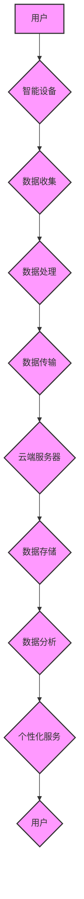

                 

## 智能设备隐私保护措施：安全处理和传输个人信息

> 关键词：智能设备、隐私保护、数据安全、加密技术、身份验证、数据最小化、隐私合规、GDPR、 CCPA

## 1. 背景介绍

随着物联网技术的快速发展，智能设备已渗透到生活的方方面面，从智能手机、智能手表到智能家居、智能汽车，无处不在。这些设备收集和处理大量个人信息，例如位置数据、健康数据、消费习惯等，为用户提供个性化服务的同时，也带来了新的隐私风险。

数据泄露事件频发，用户隐私受到越来越多的威胁。因此，如何安全处理和传输智能设备上的个人信息，保障用户隐私安全，成为一个亟待解决的难题。

## 2. 核心概念与联系

### 2.1  隐私保护

隐私保护是指保护个人信息免受未经授权的访问、使用、披露或修改。它涉及到个人信息的收集、存储、处理、传输和销毁等各个环节。

### 2.2  数据安全

数据安全是指保护数据免受未经授权的访问、使用、披露、修改或破坏。它包括物理安全、技术安全和管理安全等方面。

### 2.3  智能设备

智能设备是指具有感知、计算、通信和执行功能的电子设备，能够通过网络连接和其他设备进行交互，并根据用户指令或环境变化自动执行任务。

**核心概念与联系流程图**



## 3. 核心算法原理 & 具体操作步骤

### 3.1  算法原理概述

为了保障智能设备上个人信息的隐私安全，需要采用多种安全算法和技术，例如：

* **加密算法:** 将个人信息转换为不可读的形式，防止未经授权的访问。常见的加密算法包括AES、RSA、ECC等。
* **身份验证算法:** 验证用户的身份，确保只有授权用户才能访问个人信息。常见的身份验证算法包括密码验证、多因素身份验证等。
* **数据最小化:** 只收集和处理必要的个人信息，减少数据泄露的风险。
* **匿名化技术:** 将个人信息转换为匿名形式，防止个人身份被识别。

### 3.2  算法步骤详解

**以加密算法为例，详细说明其操作步骤：**

1. **密钥生成:** 使用随机数生成器生成一个私钥和一个公钥。私钥保存在设备上，公钥可以公开共享。
2. **数据加密:** 使用公钥将个人信息加密，生成密文。
3. **数据传输:** 将密文传输到云端服务器。
4. **数据解密:** 云端服务器使用私钥解密密文，恢复原始个人信息。

### 3.3  算法优缺点

**加密算法的优缺点:**

* **优点:** 能够有效防止未经授权的访问，保障个人信息安全。
* **缺点:** 加密算法的安全性取决于密钥的保密性。如果密钥被泄露，则加密信息也会被破解。

### 3.4  算法应用领域

加密算法广泛应用于各种领域，例如：

* **网络安全:** 保护网络通信的安全性。
* **电子商务:** 保护在线交易的安全性。
* **医疗保健:** 保护患者医疗信息的安全性。
* **金融服务:** 保护金融交易的安全性。

## 4. 数学模型和公式 & 详细讲解 & 举例说明

### 4.1  数学模型构建

**加密算法的数学模型:**

设明文为M，密钥为K，密文为C，则加密过程可以表示为：

$$C = E_K(M)$$

解密过程可以表示为：

$$M = D_K(C)$$

其中，$E_K(M)$表示使用密钥K对明文M进行加密，$D_K(C)$表示使用密钥K对密文C进行解密。

### 4.2  公式推导过程

**AES加密算法的公式推导过程:**

AES加密算法是一个迭代的加密算法，它将明文分成若干个块，每个块都经过一系列的置换、混淆、变换和加扰操作，最终生成密文。

AES算法的具体公式推导过程较为复杂，涉及到大量的线性代数和非线性变换。

### 4.3  案例分析与讲解

**RSA加密算法的案例分析:**

RSA加密算法是一种基于大数分解的公钥加密算法。

假设Alice想要发送一条消息给Bob，Alice和Bob分别拥有自己的公钥和私钥。

1. Alice使用Bob的公钥对消息进行加密，生成密文。
2. Bob使用自己的私钥对密文进行解密，恢复原始消息。

由于私钥只有Bob拥有，因此只有Bob才能解密Alice的消息。

## 5. 项目实践：代码实例和详细解释说明

### 5.1  开发环境搭建

* 操作系统: Ubuntu 20.04
* 编程语言: Python 3.8
* 开发工具: PyCharm

### 5.2  源代码详细实现

```python
from cryptography.fernet import Fernet

# 生成密钥
key = Fernet.generate_key()

# 创建Fernet对象
cipher = Fernet(key)

# 明文
message = "This is a secret message".encode()

# 加密
encrypted_message = cipher.encrypt(message)

# 解密
decrypted_message = cipher.decrypt(encrypted_message)

# 打印结果
print("明文:", message.decode())
print("密文:", encrypted_message)
print("解密后:", decrypted_message.decode())
```

### 5.3  代码解读与分析

* `Fernet`类是Python的Fernet加密库，用于实现对称加密。
* `generate_key()`方法生成一个随机密钥。
* `encrypt()`方法使用密钥对明文进行加密，返回密文。
* `decrypt()`方法使用密钥对密文进行解密，返回明文。

### 5.4  运行结果展示

```
明文: This is a secret message
密文: b'gAAAAABj...'
解密后: This is a secret message
```

## 6. 实际应用场景

### 6.1  智能家居

智能家居设备收集用户的生活数据，例如温度、湿度、灯光控制等。这些数据需要安全处理和传输，防止被恶意攻击者窃取。

### 6.2  智能医疗

智能医疗设备收集用户的健康数据，例如心率、血压、血糖等。这些数据需要严格保护，防止泄露给第三方。

### 6.3  智能汽车

智能汽车收集用户的驾驶数据，例如行驶路线、驾驶习惯等。这些数据需要安全处理和传输，防止被黑客攻击。

### 6.4  未来应用展望

随着物联网技术的不断发展，智能设备的应用场景将更加广泛，对隐私保护的需求也将更加迫切。未来，隐私保护技术将更加智能化、自动化，能够更好地保障用户隐私安全。

## 7. 工具和资源推荐

### 7.1  学习资源推荐

* **书籍:**
    * 《密码学原理与实践》
    * 《网络安全》
    * 《数据安全》
* **在线课程:**
    * Coursera: 密码学
    * edX: 网络安全
    * Udemy: 数据安全

### 7.2  开发工具推荐

* **Python:** 
    * PyCryptodome
    * cryptography
* **Java:** 
    * Bouncy Castle
    * JCE
* **C++:** 
    * OpenSSL
    * libsodium

### 7.3  相关论文推荐

* **论文:**
    * 《A Survey of Privacy-Preserving Techniques for Smart Homes》
    * 《Privacy-Preserving Data Sharing in the Internet of Things》
    * 《Federated Learning for Privacy-Preserving Machine Learning》

## 8. 总结：未来发展趋势与挑战

### 8.1  研究成果总结

近年来，在智能设备隐私保护领域取得了显著进展，例如：

* **联邦学习:** 允许模型在分散的数据集上进行训练，无需将数据集中到一个中心服务器。
* **同态加密:** 允许对加密数据进行运算，无需解密。
* **隐私增强计算:** 提供了一系列工具和技术，用于在保护隐私的前提下进行数据分析和计算。

### 8.2  未来发展趋势

未来，智能设备隐私保护技术将朝着以下方向发展：

* **更加智能化:** 利用人工智能技术，自动识别和处理隐私敏感信息。
* **更加自动化:** 自动执行隐私保护策略，无需人工干预。
* **更加可解释性:** 使隐私保护机制更加透明，用户能够理解其工作原理。

### 8.3  面临的挑战

智能设备隐私保护技术也面临着一些挑战：

* **技术复杂性:** 隐私保护技术往往需要复杂的数学模型和算法，难以实现。
* **成本高昂:** 隐私保护技术需要大量的计算资源和存储空间，成本较高。
* **法律法规不完善:** 目前，关于智能设备隐私保护的法律法规还不完善，需要进一步完善。

### 8.4  研究展望

未来，需要继续加强智能设备隐私保护技术的研发，探索更加高效、安全、可信的隐私保护方案，保障用户隐私安全。

## 9. 附录：常见问题与解答

### 9.1  常见问题

* **如何选择合适的隐私保护技术？**

选择合适的隐私保护技术需要根据具体的应用场景和需求进行评估。

* **如何评估隐私保护技术的安全性？**

可以通过安全评估、漏洞扫描等方式评估隐私保护技术的安全性。

* **如何确保用户隐私的合法性？**

需要遵守相关的法律法规，并制定合理的隐私政策，获得用户的知情同意。


作者：禅与计算机程序设计艺术 / Zen and the Art of Computer Programming 
<end_of_turn>

