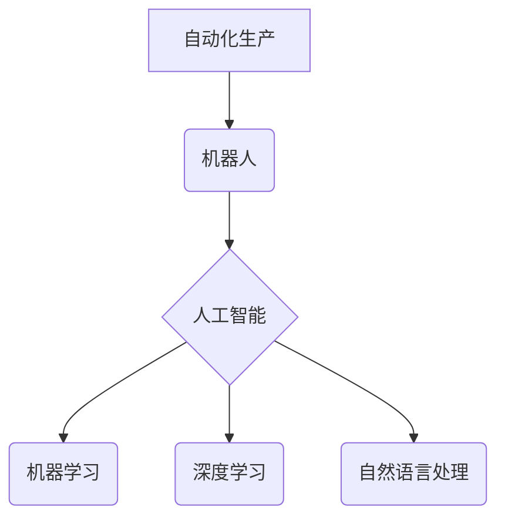

                 

## 机器人创业：自动化生产的未来蓝图

> 关键词：机器人、自动化生产、人工智能、机器学习、深度学习、工业机器人、服务机器人、创业

### 1. 背景介绍

工业革命以来，自动化生产一直是推动经济发展和社会进步的重要力量。从蒸汽机到数控机床，再到如今的智能机器人，自动化技术不断革新，深刻改变着生产方式和生活方式。

当前，人工智能（AI）技术的飞速发展为机器人创业带来了前所未有的机遇。AI赋予机器人更强大的感知、决策和执行能力，使其能够胜任更复杂的任务，并与人类更加协同工作。

机器人创业正处于蓬勃发展的阶段，涌现出许多创新型企业，致力于开发和应用各种类型的机器人，涵盖工业、服务、医疗、农业等多个领域。

### 2. 核心概念与联系

**2.1 核心概念**

* **机器人:** 机器人是一种能够感知环境、自主决策并执行任务的智能机械装置。
* **自动化生产:** 自动化生产是指利用机器和程序代替人工完成生产过程，提高生产效率和质量。
* **人工智能 (AI):** 人工智能是指模拟人类智能行为的计算机科学领域，包括机器学习、深度学习、自然语言处理等技术。

**2.2 架构关系**



**2.3 联系分析**

自动化生产的核心是利用机器代替人工完成生产任务。机器人作为自动化生产的重要工具，能够执行重复性、危险性或高精度性任务，提高生产效率和质量。

人工智能技术为机器人赋予了更强大的智能，使其能够感知环境、理解指令、自主决策并执行复杂任务。机器学习和深度学习算法使机器人能够从数据中学习，不断提升其性能和适应能力。自然语言处理技术使机器人能够理解和响应人类语言，实现更自然的交互。

### 3. 核心算法原理 & 具体操作步骤

**3.1 算法原理概述**

机器人控制算法是机器人运动和行为的核心，它决定了机器人的运动轨迹、动作规划和任务执行方式。常见的机器人控制算法包括：

* **模型预测控制 (MPC):** 基于机器人动力学模型，预测未来状态并规划最优控制策略。
* **强化学习 (RL):** 通过奖励机制，训练机器人学习最优行为策略。
* **路径规划算法:** 寻找机器人从起点到终点的最优路径。

**3.2 算法步骤详解**

以模型预测控制为例，其具体操作步骤如下：

1. **建立机器人动力学模型:** 建立描述机器人运动状态和控制输入关系的数学模型。
2. **预测未来状态:** 根据当前状态和控制输入，利用动力学模型预测未来多个时间步长的机器人状态。
3. **优化控制策略:** 针对预期的未来状态，利用优化算法寻找最优控制策略，使得机器人能够达到预设的目标。
4. **执行控制策略:** 将优化得到的控制策略发送到机器人执行器，控制机器人的运动。
5. **状态反馈:** 采集机器人实际状态信息，反馈到模型预测控制算法中，更新预测模型和优化策略。

**3.3 算法优缺点**

* **优点:** 能够处理复杂的多变量控制问题，具有较强的鲁棒性。
* **缺点:** 需要建立精确的机器人动力学模型，计算量较大，实时性要求高。

**3.4 算法应用领域**

* **工业机器人:** 自动化生产线上的焊接、喷涂、装配等任务。
* **无人驾驶汽车:** 控制车辆的转向、加速、制动等动作。
* **医疗机器人:** 进行手术、康复训练等任务。

### 4. 数学模型和公式 & 详细讲解 & 举例说明

**4.1 数学模型构建**

机器人动力学模型描述了机器人运动状态和控制输入之间的关系。

假设机器人是一个具有 n 个自由度的机械臂，其运动状态可以用关节角度和角速度来表示。机器人动力学方程可以表示为：

$$
\tau = M(q) \ddot{q} + C(q, \dot{q}) \dot{q} + G(q) + F
$$

其中：

* $\tau$ 是关节力矩向量
* $q$ 是关节角度向量
* $\ddot{q}$ 是关节角加速度向量
* $M(q)$ 是惯性矩阵
* $C(q, \dot{q})$ 是离心力和科里奥利力矩阵
* $G(q)$ 是重力力向量
* $F$ 是摩擦力和外部扰动力向量

**4.2 公式推导过程**

机器人动力学方程的推导过程涉及牛顿第二定律和拉格朗日力学等物理学原理。

**4.3 案例分析与讲解**

对于一个简单的两自由度机器人臂，其动力学方程可以简化为：

$$
\begin{bmatrix}
m_1 l_1^2 & m_1 l_1 l_2 \cos(\theta_2) \\
m_1 l_1 l_2 \cos(\theta_2) & m_2 l_2^2
\end{bmatrix}
\begin{bmatrix}
\ddot{\theta}_1 \\
\ddot{\theta}_2
\end{bmatrix}
+
\begin{bmatrix}
-m_1 l_1 l_2 \sin(\theta_2) \dot{\theta}_2^2 \\
-m_2 l_2^2 \dot{\theta}_2^2 - m_1 l_1 l_2 \sin(\theta_2) \dot{\theta}_1^2
\end{bmatrix}
+
\begin{bmatrix}
m_1 g l_1 \sin(\theta_1) \\
m_2 g l_2 \sin(\theta_2)
\end{bmatrix}
=
\begin{bmatrix}
\tau_1 \\
\tau_2
\end{bmatrix}
$$

其中：

* $m_1$ 和 $m_2$ 分别是两个连杆的质量
* $l_1$ 和 $l_2$ 分别是两个连杆的长度
* $\theta_1$ 和 $\theta_2$ 分别是两个关节的角度
* $\tau_1$ 和 $\tau_2$ 分别是两个关节的力矩

### 5. 项目实践：代码实例和详细解释说明

**5.1 开发环境搭建**

* 操作系统：Ubuntu 20.04
* 编程语言：Python 3.8
* 机器人仿真软件：Gazebo
* 机器人控制库：ROS (Robot Operating System)

**5.2 源代码详细实现**

```python
import rospy
from gazebo_msgs.msg import ModelStates

# 定义机器人状态回调函数
def callback(data):
    # 获取机器人关节角度信息
    joint_angles = data.pose[0].position

    # 打印机器人关节角度信息
    print("Joint angles:", joint_angles)

# 初始化ROS节点
rospy.init_node('robot_state_subscriber')

# 创建订阅器，订阅机器人状态话题
sub = rospy.Subscriber('/gazebo/model_states', ModelStates, callback)

# 循环等待消息
rospy.spin()
```

**5.3 代码解读与分析**

* 该代码示例使用ROS框架订阅Gazebo仿真环境中的机器人状态话题。
* `callback()`函数接收机器人状态消息，并提取机器人关节角度信息。
* `rospy.init_node()`初始化ROS节点。
* `rospy.Subscriber()`创建订阅器，订阅`/gazebo/model_states`话题。
* `rospy.spin()`进入循环等待消息。

**5.4 运行结果展示**

运行该代码后，会在控制台打印出机器人关节的角度信息。

### 6. 实际应用场景

**6.1 工业机器人**

* **自动化生产线:** 机器人可以执行焊接、喷涂、装配等重复性、危险性任务，提高生产效率和质量。
* **物流仓储:** 机器人可以自动搬运货物，提高仓库效率和准确性。
* **质量检测:** 机器人可以进行视觉检测、尺寸测量等任务，提高产品质量。

**6.2 服务机器人**

* **酒店服务:** 机器人可以提供客房服务、行李搬运等服务，提高酒店服务效率和客户体验。
* **餐饮服务:** 机器人可以提供点餐、送餐、清盘等服务，提高餐厅服务效率和用餐体验。
* **医疗服务:** 机器人可以协助医生进行手术、康复训练等任务，提高医疗效率和患者体验。

**6.3 其他应用场景**

* **农业机器人:** 自动化种植、收获、施肥等任务，提高农业生产效率和降低人工成本。
* **环境机器人:** 清除垃圾、监测环境污染等任务，保护环境和改善生活质量。
* **探索机器人:** 探索未知环境，例如深海、太空等，获取更多科学知识。

**6.4 未来应用展望**

随着人工智能技术的不断发展，机器人将应用于更多领域，并发挥更重要的作用。未来，机器人将更加智能化、人性化、协同化，与人类更加紧密地合作，共同创造更加美好的未来。

### 7. 工具和资源推荐

**7.1 学习资源推荐**

* **书籍:**
    * 《机器人学导论》
    * 《人工智能：现代方法》
    * 《深度学习》
* **在线课程:**
    * Coursera: 机器人学
    * edX: 人工智能
    * Udacity: 深度学习

**7.2 开发工具推荐**

* **ROS (Robot Operating System):** 开源机器人操作系统，提供丰富的工具和库，用于机器人开发和控制。
* **Gazebo:** 开源机器人仿真软件，可以模拟机器人运动和环境交互。
* **Python:** 通用编程语言，广泛应用于机器人开发。

**7.3 相关论文推荐**

* **AlphaGo:** DeepMind 的 AlphaGo 论文，展示了深度学习在围棋领域的突破。
* **OpenAI Five:** OpenAI 的 OpenAI Five 论文，展示了深度学习在 Dota 2 领域的突破。
* **BERT:** Google 的 BERT 论文，展示了深度学习在自然语言处理领域的突破。

### 8. 总结：未来发展趋势与挑战

**8.1 研究成果总结**

近年来，机器人技术取得了长足进步，人工智能技术的快速发展为机器人创业带来了新的机遇。

**8.2 未来发展趋势**

* **更智能的机器人:** 人工智能技术的不断发展将使机器人更加智能化，能够更好地理解和响应人类指令，并自主完成更复杂的任务。
* **更协同的机器人:** 机器人将更加协同地与人类合作，共同完成任务，提高工作效率和生产力。
* **更广泛的应用场景:** 机器人将应用于更多领域，例如医疗、教育、娱乐等，改变人们的生活方式。

**8.3 面临的挑战**

* **技术挑战:** 机器人技术仍然面临着许多挑战，例如感知、决策、运动控制等方面。
* **伦理挑战:** 机器人技术的应用引发了伦理问题，例如机器人是否具有意识、机器人是否会取代人类工作等。
* **安全挑战:** 机器人技术的应用可能带来安全风险，例如机器人失控、机器人攻击人类等。

**8.4 研究展望**

未来，机器人研究将继续朝着更智能、更协同、更安全的方向发展。我们需要加强基础研究，突破关键技术瓶颈，并积极应对伦理和安全挑战，推动机器人技术健康发展，造福人类社会。

### 9. 附录：常见问题与解答

**9.1 机器人是否会取代人类工作？**

机器人技术的发展可能会改变一些工作岗位，但同时也创造新的工作机会。未来，人类和机器人将更加协同地工作，共同完成更复杂的任务。

**9.2 机器人是否具有意识？**

目前，机器人没有意识。人工智能技术虽然取得了长足进步，但仍然无法完全模拟人类的意识和情感。

**9.3 机器人是否会攻击人类？**

目前，机器人不会攻击人类。机器人技术的应用需要遵循伦理原则，并采取安全措施，确保机器人安全可靠地运行。


作者：禅与计算机程序设计艺术 / Zen and the Art of Computer Programming 
<end_of_turn>

