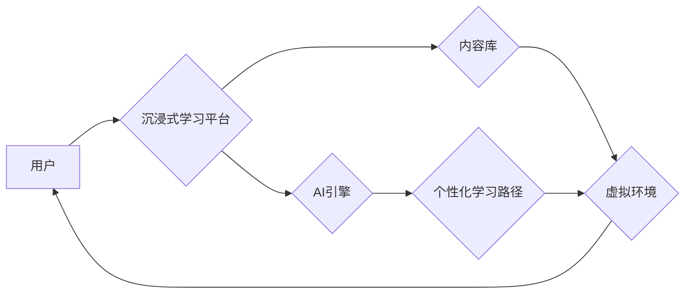

                 

## 沉浸式学习：AI重塑教育体验

> 关键词：人工智能、沉浸式学习、教育科技、个性化学习、虚拟现实、增强现实、机器学习、自然语言处理

### 1. 背景介绍

教育，作为人类文明的基石，一直以来都在不断探索更有效、更生动、更具吸引力的学习方式。传统的教育模式往往以被动接受知识为主，缺乏互动性和趣味性，难以激发学生的学习兴趣和潜能。随着人工智能技术的飞速发展，教育领域迎来了前所未有的变革机遇。

人工智能（AI）的强大算力和学习能力，为构建沉浸式学习体验提供了强大的技术支撑。沉浸式学习是指通过虚拟现实（VR）、增强现实（AR）等技术，将学生置身于模拟环境中，以身临其境的方式体验学习内容，从而提升学习兴趣、理解深度和记忆效果。

### 2. 核心概念与联系

**2.1 沉浸式学习的核心概念**

沉浸式学习的核心概念在于创造一个逼真的虚拟环境，让学生能够身临其境地体验学习内容。这种体验能够激发学生的学习兴趣，增强他们的参与度和记忆力。

**2.2 AI与沉浸式学习的联系**

AI技术为沉浸式学习提供了以下关键支持：

* **个性化学习路径:** AI算法能够根据学生的学习进度、能力和兴趣，定制个性化的学习路径和内容，提高学习效率和效果。
* **智能交互:** AI驱动的虚拟助手能够与学生进行自然语言交互，提供实时反馈和指导，模拟真实的师生互动。
* **内容生成与丰富:** AI能够自动生成各种学习内容，如文本、图像、视频等，丰富沉浸式学习环境，提升学习体验。
* **数据分析与评估:** AI算法能够分析学生的学习行为数据，评估学习效果，并及时调整学习策略，实现精准化教学。

**2.3 沉浸式学习架构**



### 3. 核心算法原理 & 具体操作步骤

**3.1 算法原理概述**

沉浸式学习的核心算法主要包括：

* **机器学习算法:** 用于个性化学习路径推荐、智能交互、内容生成等。
* **自然语言处理算法:** 用于理解和生成自然语言，实现人机交互。
* **计算机视觉算法:** 用于识别和理解图像和视频，构建逼真的虚拟环境。

**3.2 算法步骤详解**

1. **数据收集:** 收集学生的学习行为数据、学习内容数据、个人信息等。
2. **数据预处理:** 对收集到的数据进行清洗、转换、特征提取等预处理工作。
3. **模型训练:** 利用机器学习算法对预处理后的数据进行训练，构建个性化学习路径模型、智能交互模型、内容生成模型等。
4. **模型评估:** 对训练好的模型进行评估，并根据评估结果进行模型优化。
5. **系统部署:** 将训练好的模型部署到沉浸式学习平台，实现个性化学习路径推荐、智能交互、内容生成等功能。

**3.3 算法优缺点**

* **优点:**

    * 个性化学习: 能够根据学生的个体差异提供定制化的学习体验。
    * 提升学习兴趣: 沉浸式学习环境能够激发学生的学习兴趣和参与度。
    * 增强学习效果: 通过身临其境的方式学习，能够提升学生的理解深度和记忆效果。

* **缺点:**

    * 技术门槛高: 构建沉浸式学习平台需要强大的技术支持。
    * 成本高昂: 沉浸式学习设备和软件成本较高。
    * 内容开发难度大: 需要开发高质量的虚拟内容，才能满足学生的学习需求。

**3.4 算法应用领域**

* 教育培训: 提供沉浸式学习体验，提升学习效率和效果。
* 游戏娱乐: 构建逼真的虚拟游戏世界，增强玩家的沉浸感和体验。
* 医疗保健: 提供虚拟手术模拟、疾病科普等服务，提升医护人员的技能和患者的健康意识。
* 工程设计: 提供虚拟环境进行产品设计和测试，提高设计效率和产品质量。

### 4. 数学模型和公式 & 详细讲解 & 举例说明

**4.1 数学模型构建**

沉浸式学习系统可以构建一个数学模型来描述学生学习过程中的状态变化和学习效果。例如，我们可以使用一个状态转移模型来描述学生在虚拟环境中学习的路径和决策，以及一个学习效果评估模型来评估学生的学习成果。

**4.2 公式推导过程**

假设学生在虚拟环境中学习一个知识点，我们可以用以下公式来描述学生学习效果：

$$
Learning\_Effect = f(Engagement, Comprehension, Retention)
$$

其中：

* $Learning\_Effect$ 代表学生的学习效果，可以是分数、知识掌握程度等指标。
* $Engagement$ 代表学生的参与度，可以是学习时间、互动次数等指标。
* $Comprehension$ 代表学生的理解程度，可以是测试成绩、知识解释能力等指标。
* $Retention$ 代表学生的记忆程度，可以是复习测试成绩、知识应用能力等指标。

$f$ 是一个函数，描述了参与度、理解程度和记忆程度对学习效果的影响。

**4.3 案例分析与讲解**

例如，如果一个学生在虚拟环境中学习一个历史事件，我们可以通过以下指标来评估他的学习效果：

* $Engagement$: 学生在虚拟环境中学习的时间、与虚拟角色的互动次数、完成任务的次数等。
* $Comprehension$: 学生对历史事件的描述、解释、分析能力等。
* $Retention$: 学生在复习测试中对历史事件的回忆和应用能力等。

通过分析这些指标，我们可以评估学生的学习效果，并根据学生的学习情况调整学习内容和学习策略。

### 5. 项目实践：代码实例和详细解释说明

**5.1 开发环境搭建**

* 编程语言: Python
* 框架: TensorFlow/PyTorch
* 虚拟环境: conda/virtualenv
* 硬件: GPU加速

**5.2 源代码详细实现**

```python
# 导入必要的库
import tensorflow as tf

# 定义模型结构
model = tf.keras.models.Sequential([
    tf.keras.layers.Dense(64, activation='relu', input_shape=(10,)),
    tf.keras.layers.Dense(32, activation='relu'),
    tf.keras.layers.Dense(1, activation='sigmoid')
])

# 编译模型
model.compile(optimizer='adam', loss='binary_crossentropy', metrics=['accuracy'])

# 加载训练数据
(x_train, y_train), (x_test, y_test) = tf.keras.datasets.mnist.load_data()

# 训练模型
model.fit(x_train, y_train, epochs=10)

# 评估模型
loss, accuracy = model.evaluate(x_test, y_test)
print('Loss:', loss)
print('Accuracy:', accuracy)
```

**5.3 代码解读与分析**

这段代码实现了简单的深度学习模型训练，用于识别手写数字。

* 首先，导入必要的库，包括 TensorFlow 库。
* 然后，定义模型结构，使用两层全连接神经网络，激活函数为 ReLU，输出层为 sigmoid 函数。
* 接着，编译模型，使用 Adam 优化器，损失函数为二元交叉熵，评估指标为准确率。
* 然后，加载 MNIST 手写数字数据集，并将其分为训练集和测试集。
* 最后，训练模型，并评估模型在测试集上的性能。

**5.4 运行结果展示**

训练完成后，模型能够识别手写数字，并输出准确率。

### 6. 实际应用场景

**6.1 教育培训**

* 沉浸式学习平台可以提供虚拟实验室、模拟手术等环境，让学生在安全的环境中进行实践学习。
* AI驱动的虚拟助手可以为学生提供个性化的学习指导和反馈，提升学习效率。

**6.2 游戏娱乐**

* 沉浸式游戏可以提供逼真的游戏体验，增强玩家的参与度和沉浸感。
* AI算法可以生成动态的游戏内容，让游戏更加丰富和有趣。

**6.3 医疗保健**

* 虚拟现实技术可以用于模拟手术、治疗疾病等，帮助医护人员提高技能和经验。
* AI算法可以分析患者的医疗数据，提供个性化的诊断和治疗方案。

**6.4 未来应用展望**

* 随着人工智能技术的不断发展，沉浸式学习将更加智能化、个性化和交互式。
* 沉浸式学习将应用于更多领域，例如艺术、文化、体育等，为人们提供更加丰富多彩的学习体验。

### 7. 工具和资源推荐

**7.1 学习资源推荐**

* **在线课程:** Coursera、edX、Udacity 等平台提供人工智能、虚拟现实、增强现实等领域的在线课程。
* **书籍:** 《深度学习》、《人工智能简史》、《虚拟现实技术》等书籍可以帮助读者深入了解相关知识。
* **开源项目:** TensorFlow、PyTorch、Unity 等开源项目可以帮助读者实践相关技术。

**7.2 开发工具推荐**

* **编程语言:** Python、C++、Java 等编程语言可以用于开发沉浸式学习平台。
* **框架:** TensorFlow、PyTorch、Unity 等框架可以简化开发过程。
* **硬件:** GPU加速器可以提高模型训练速度。

**7.3 相关论文推荐**

* **沉浸式学习:** "Immersive Learning Environments: A Review"
* **人工智能:** "Deep Learning"
* **虚拟现实:** "Virtual Reality: Principles and Applications"

### 8. 总结：未来发展趋势与挑战

**8.1 研究成果总结**

沉浸式学习技术已经取得了显著的进展，为教育、游戏、医疗等领域带来了新的机遇。AI技术为沉浸式学习提供了强大的技术支撑，使得沉浸式学习更加智能化、个性化和交互式。

**8.2 未来发展趋势**

* **更加逼真的虚拟环境:** 随着虚拟现实和增强现实技术的进步，虚拟环境将更加逼真、沉浸感更强。
* **更加智能化的学习体验:** AI算法将更加智能化，能够提供更加个性化的学习路径、更加精准的学习反馈和更加丰富的学习内容。
* **更加广泛的应用场景:** 沉浸式学习将应用于更多领域，例如艺术、文化、体育等，为人们提供更加丰富多彩的学习体验。

**8.3 面临的挑战**

* **技术门槛高:** 构建沉浸式学习平台需要强大的技术支持，开发成本较高。
* **内容开发难度大:** 需要开发高质量的虚拟内容，才能满足学生的学习需求。
* **伦理问题:** 沉浸式学习可能会带来一些伦理问题，例如数据隐私、虚拟现实成瘾等，需要引起重视和探讨。

**8.4 研究展望**

未来，我们需要继续探索沉浸式学习的应用场景，开发更加智能化、个性化和交互式的学习体验，并解决相关技术和伦理问题，让沉浸式学习真正惠及更多人。

### 9. 附录：常见问题与解答

**9.1 沉浸式学习和传统学习相比有什么优势？**

沉浸式学习能够提供更加身临其境、更加互动和更加个性化的学习体验，能够激发学生的学习兴趣，提升学习效率和效果。

**9.2 沉浸式学习有哪些应用场景？**

沉浸式学习可以应用于教育培训、游戏娱乐、医疗保健、工程设计等多个领域。

**9.3 构建沉浸式学习平台需要哪些技术？**

构建沉浸式学习平台需要虚拟现实、增强现实、人工智能、计算机图形学等多方面的技术支持。

**9.4 沉浸式学习有哪些伦理问题？**

沉浸式学习可能会带来一些伦理问题，例如数据隐私、虚拟现实成瘾等，需要引起重视和探讨。


作者：禅与计算机程序设计艺术 / Zen and the Art of Computer Programming 
<end_of_turn>

