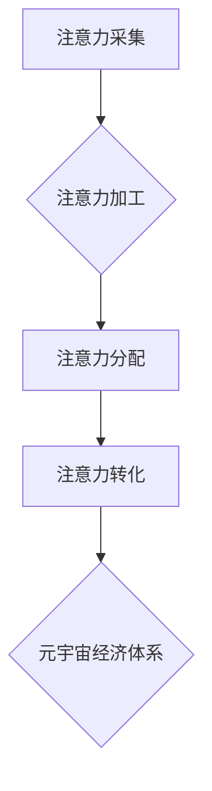

                 

## 注意力产业链：元宇宙经济体系的核心

> 关键词：注意力、元宇宙、经济体系、AI、深度学习、数据驱动、商业模式、用户体验

## 1. 背景介绍

元宇宙概念的兴起，标志着人类进入一个全新的数字世界。这个虚拟世界将融合现实世界的多感官体验，提供沉浸式、交互式的全新生活方式和服务。然而，元宇宙的构建并非仅仅依靠技术，更需要一个完善的经济体系来支撑其发展。而注意力，作为人类认知的核心资源，将成为元宇宙经济体系的基石。

传统互联网时代，注意力被视为一种稀缺资源，广告商通过各种手段争夺用户的注意力。元宇宙时代，注意力将更加宝贵，因为它将成为虚拟世界中用户参与、互动、创造和消费的驱动力。

## 2. 核心概念与联系

### 2.1 注意力机制

注意力机制是深度学习领域的重要突破，它模拟了人类认知过程中的注意力机制，能够帮助模型聚焦于输入数据中最重要的信息，从而提高学习效率和准确性。

### 2.2 元宇宙经济体系

元宇宙经济体系是指在虚拟世界中，用户通过创造、交易、消费等行为进行经济活动的体系。它将包含虚拟资产、数字货币、虚拟服务等多种元素，并通过区块链技术、去中心化自治组织等手段实现去中心化和透明化。

### 2.3 注意力产业链

注意力产业链是指围绕元宇宙用户注意力展开的一系列产业链，包括：

* **注意力采集:** 通过游戏、社交、内容平台等方式获取用户注意力。
* **注意力加工:** 对采集到的注意力进行分析、分类、评估等加工，生成用户画像、行为分析等数据。
* **注意力分配:** 根据用户画像、行为分析等数据，将注意力分配到不同的虚拟世界、虚拟商品、虚拟服务等。
* **注意力转化:** 将注意力转化为经济价值，例如用户在虚拟世界中购买虚拟商品、参与虚拟活动等。

**Mermaid 流程图**



## 3. 核心算法原理 & 具体操作步骤

### 3.1 算法原理概述

注意力机制的核心原理是通过一个加权机制，将输入数据中的重要信息赋予更高的权重，从而提高模型对重要信息的关注度。常见的注意力机制包括：

* **自注意力机制 (Self-Attention):**  模型能够关注自身输入序列中的不同位置，捕捉序列之间的依赖关系。
* **交叉注意力机制 (Cross-Attention):** 模型能够关注两个不同序列之间的关系，例如文本和图像之间的关系。

### 3.2 算法步骤详解

**自注意力机制的具体操作步骤如下:**

1. **计算查询 (Query)、键 (Key) 和值 (Value) 向量:** 将输入序列中的每个词向量分别转换为查询向量、键向量和值向量。
2. **计算注意力权重:** 使用查询向量和键向量之间的相似度计算注意力权重，权重越高表示该词对当前词的关注度越高。
3. **加权求和:** 将值向量与注意力权重相乘，然后求和，得到最终的输出向量。

### 3.3 算法优缺点

**优点:**

* 能够捕捉序列之间的长距离依赖关系。
* 能够提高模型对重要信息的关注度。
* 在自然语言处理、计算机视觉等领域取得了优异的性能。

**缺点:**

* 计算复杂度较高。
* 训练数据量较大。

### 3.4 算法应用领域

注意力机制广泛应用于以下领域:

* **自然语言处理:** 机器翻译、文本摘要、问答系统等。
* **计算机视觉:** 图像分类、目标检测、图像 Captioning 等。
* **语音识别:** 语音转文本、语音合成等。

## 4. 数学模型和公式 & 详细讲解 & 举例说明

### 4.1 数学模型构建

**自注意力机制的数学模型可以表示为:**

$$
\text{Attention}(Q, K, V) = \text{softmax}\left(\frac{Q K^T}{\sqrt{d_k}}\right) V
$$

其中:

* $Q$ 是查询矩阵。
* $K$ 是键矩阵。
* $V$ 是值矩阵。
* $d_k$ 是键向量的维度。
* $\text{softmax}$ 是归一化函数，用于计算注意力权重。

### 4.2 公式推导过程

注意力权重计算公式的推导过程如下:

1. 计算查询向量 $q$ 和键向量 $k$ 之间的点积:

$$
\text{score}(q, k) = q \cdot k
$$

2. 对点积进行归一化，使用 softmax 函数计算注意力权重:

$$
\text{attention}(q, k) = \frac{\text{exp}(\text{score}(q, k))}{\sum_{j} \text{exp}(\text{score}(q, k_j))}
$$

### 4.3 案例分析与讲解

假设我们有一个句子 "The cat sat on the mat"，我们想要计算每个词对 "sat" 的注意力权重。

1. 将每个词向量转换为查询向量、键向量和值向量。
2. 计算每个词的查询向量与 "sat" 的键向量的点积。
3. 对点积进行归一化，得到每个词对 "sat" 的注意力权重。
4. 将注意力权重与 "sat" 的值向量相乘，求和，得到最终的输出向量。

## 5. 项目实践：代码实例和详细解释说明

### 5.1 开发环境搭建

* Python 3.7+
* TensorFlow 2.0+
* PyTorch 1.0+

### 5.2 源代码详细实现

```python
import tensorflow as tf

# 定义自注意力机制
def self_attention(query, key, value, mask=None):
    # 计算注意力权重
    attention_weights = tf.matmul(query, key, transpose_b=True) / tf.math.sqrt(tf.cast(key.shape[-1], tf.float32))
    if mask is not None:
        attention_weights += (mask * -1e9)
    attention_weights = tf.nn.softmax(attention_weights, axis=-1)
    # 加权求和
    output = tf.matmul(attention_weights, value)
    return output

# 示例代码
query = tf.random.normal([3, 4, 64])
key = tf.random.normal([3, 4, 64])
value = tf.random.normal([3, 4, 64])
output = self_attention(query, key, value)
print(output.shape)
```

### 5.3 代码解读与分析

* `self_attention` 函数实现了一个基本的自注意力机制。
* `query`, `key`, `value` 分别代表查询矩阵、键矩阵和值矩阵。
* `mask` 用于屏蔽某些词对的注意力权重，例如在机器翻译中，屏蔽源语言中已经翻译过的词。
* `tf.matmul` 函数用于计算矩阵乘法。
* `tf.nn.softmax` 函数用于计算注意力权重。

### 5.4 运行结果展示

运行上述代码，输出结果为 `(3, 4, 64)`，表示注意力机制的输出维度与值矩阵相同。

## 6. 实际应用场景

### 6.1 元宇宙游戏

在元宇宙游戏中，注意力机制可以用于：

* **NPC 行为预测:** 通过分析玩家行为，预测NPC的下一步行动，提高游戏体验。
* **游戏剧情生成:** 根据玩家的注意力分布，动态生成游戏剧情，提供个性化游戏体验。
* **虚拟物品推荐:** 根据玩家的注意力分布，推荐与玩家兴趣相关的虚拟物品。

### 6.2 元宇宙社交

在元宇宙社交平台，注意力机制可以用于：

* **内容推荐:** 根据用户的注意力分布，推荐与用户兴趣相关的虚拟内容。
* **社交关系分析:** 分析用户之间的注意力互动，挖掘潜在的社交关系。
* **虚拟身份构建:** 根据用户的注意力分布，构建个性化的虚拟身份。

### 6.3 元宇宙教育

在元宇宙教育平台，注意力机制可以用于：

* **个性化学习:** 根据学生的注意力分布，提供个性化的学习内容和学习路径。
* **知识点理解:** 分析学生的注意力分布，判断学生对知识点的理解程度。
* **互动式教学:** 通过注意力机制，增强学生与虚拟老师和虚拟同学的互动。

### 6.4 未来应用展望

随着元宇宙技术的不断发展，注意力机制将在元宇宙中发挥越来越重要的作用。未来，注意力机制可能被应用于：

* **元宇宙商业:** 通过注意力机制，精准地将广告投放给目标用户，提高广告效果。
* **元宇宙医疗:** 通过注意力机制，分析患者的生理数据和行为数据，辅助医生诊断和治疗。
* **元宇宙艺术:** 通过注意力机制，创作更加沉浸式和交互式的虚拟艺术作品。

## 7. 工具和资源推荐

### 7.1 学习资源推荐

* **书籍:**
    * 《深度学习》
    * 《Attention Is All You Need》
* **在线课程:**
    * Coursera: 深度学习
    * Udacity: 自然语言处理
* **博客:**
    * Jay Alammar's Blog: https://jalammar.github.io/

### 7.2 开发工具推荐

* **TensorFlow:** https://www.tensorflow.org/
* **PyTorch:** https://pytorch.org/
* **Hugging Face Transformers:** https://huggingface.co/transformers/

### 7.3 相关论文推荐

* 《Attention Is All You Need》
* 《BERT: Pre-training of Deep Bidirectional Transformers for Language Understanding》
* 《GPT-3: Language Models are Few-Shot Learners》

## 8. 总结：未来发展趋势与挑战

### 8.1 研究成果总结

注意力机制是深度学习领域的重要突破，在元宇宙中将发挥越来越重要的作用。

### 8.2 未来发展趋势

* **更强大的注意力机制:** 研究更强大的注意力机制，例如长距离依赖关系的注意力机制、多模态注意力机制等。
* **注意力机制的应用扩展:** 将注意力机制应用到更多元宇宙场景，例如元宇宙商业、元宇宙医疗等。
* **注意力机制的伦理问题:** 研究注意力机制的伦理问题，例如数据隐私、算法偏见等。

### 8.3 面临的挑战

* **计算复杂度:** 现有的注意力机制计算复杂度较高，难以应用于大规模数据。
* **数据稀缺:** 元宇宙领域的数据稀缺，难以训练出高性能的注意力模型。
* **伦理问题:** 注意力机制可能被用于操纵用户行为，需要解决伦理问题。

### 8.4 研究展望

未来，注意力机制将继续是元宇宙领域的研究热点，我们期待看到更多创新和突破。


## 9. 附录：常见问题与解答

### 9.1 Q: 注意力机制和深度学习有什么关系？

### 9.2 A:

注意力机制是深度学习领域的重要突破，它能够帮助模型聚焦于输入数据中最重要的信息，从而提高学习效率和准确性。

### 9.3 Q: 注意力机制有哪些应用场景？

### 9.4 A:

注意力机制广泛应用于自然语言处理、计算机视觉、语音识别等领域。

### 9.5 Q: 注意力机制的未来发展趋势是什么？

### 9.6 A:

未来，注意力机制将更加强大、更加广泛地应用于元宇宙等领域。

作者：禅与计算机程序设计艺术 / Zen and the Art of Computer Programming 


<end_of_turn>

