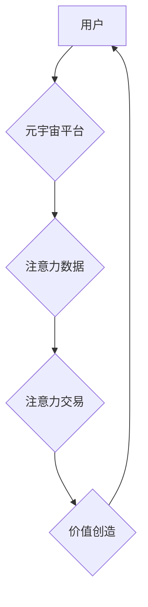

                 

## 注意力市场：元宇宙时代下的信息交易

> 关键词：元宇宙、注意力经济、信息交易、深度学习、注意力机制、数据隐私、伦理问题

## 1. 背景介绍

元宇宙概念的兴起，标志着人类进入一个全新的数字世界。在这个虚拟世界中，人们可以以虚拟身份进行社交、娱乐、工作等活动，并与现实世界紧密相连。元宇宙的构建需要海量数据和计算能力，而用户在元宇宙中的活动也产生着大量的注意力数据。

注意力，作为人类认知的核心要素，在元宇宙时代显得尤为重要。它决定了用户在虚拟世界中的体验、参与度和价值创造。随着元宇宙的不断发展，注意力将成为一种稀缺资源，并逐渐形成一个全新的市场——注意力市场。

## 2. 核心概念与联系

### 2.1 注意力经济

注意力经济是指在信息爆炸时代，人们对注意力资源的争夺和交易。注意力是有限的，而信息却无处不在。为了获取用户的注意力，平台和企业会通过各种手段，例如个性化推荐、内容推送、广告投放等，来吸引用户的关注。

### 2.2 元宇宙与注意力市场

元宇宙为注意力经济提供了新的舞台和机遇。

* **沉浸式体验:** 元宇宙提供沉浸式的虚拟体验，能够更有效地吸引用户的注意力。
* **数据丰富:** 元宇宙中的用户行为数据更加丰富，能够更精准地理解用户的注意力偏好。
* **互动性强:** 元宇宙中的互动性强，能够促进用户之间的注意力互动和传播。

**注意力市场架构**



## 3. 核心算法原理 & 具体操作步骤

### 3.1 算法原理概述

注意力机制是一种模仿人类注意力机制的深度学习算法。它通过学习用户对不同信息元素的关注程度，来提高模型的学习效率和准确性。

### 3.2 算法步骤详解

1. **输入数据:** 将输入数据（例如文本、图像）转换为向量表示。
2. **计算注意力权重:** 使用注意力函数计算每个信息元素的注意力权重，权重表示用户对该元素的关注程度。
3. **加权求和:** 将每个信息元素与其注意力权重相乘，并求和得到最终的输出。

### 3.3 算法优缺点

**优点:**

* 能够学习用户对不同信息元素的关注程度，提高模型的学习效率和准确性。
* 能够处理长序列数据，例如文本和视频。
* 能够解释模型的决策过程，提高模型的可解释性。

**缺点:**

* 计算复杂度较高。
* 需要大量的训练数据。

### 3.4 算法应用领域

注意力机制广泛应用于自然语言处理、计算机视觉、语音识别等领域。

* **自然语言处理:** 文本摘要、机器翻译、情感分析等。
* **计算机视觉:** 图像分类、目标检测、图像 Captioning 等。
* **语音识别:** 语音转文本、语音搜索等。

## 4. 数学模型和公式 & 详细讲解 & 举例说明

### 4.1 数学模型构建

注意力机制的数学模型通常基于一个注意力函数，该函数将输入数据映射到每个信息元素的注意力权重。

**注意力函数:**

$$
\text{Attention}(Q, K, V) = \text{softmax}\left(\frac{Q K^T}{\sqrt{d_k}}\right) V
$$

其中:

* $Q$：查询向量，表示用户对信息的查询。
* $K$：键向量，表示每个信息元素的特征。
* $V$：值向量，表示每个信息元素的内容。
* $d_k$：键向量的维度。
* $\text{softmax}$：softmax 函数，将注意力权重归一化到 [0, 1] 之间。

### 4.2 公式推导过程

注意力函数的推导过程基于以下几个假设：

* 用户对信息元素的关注程度与查询向量和键向量的相似度相关。
* 键向量和值向量之间存在线性关系。

根据这些假设，我们可以得到注意力函数的公式。

### 4.3 案例分析与讲解

**举例说明:**

假设我们有一个句子 "我爱吃苹果"，我们要使用注意力机制来理解用户对每个词语的关注程度。

* $Q$：查询向量表示用户对句子的理解。
* $K$：键向量表示每个词语的特征。
* $V$：值向量表示每个词语的内容。

通过计算注意力函数，我们可以得到每个词语的注意力权重，例如 "苹果" 的注意力权重可能比 "我" 和 "吃" 的注意力权重更高，因为 "苹果" 是句子的核心内容。

## 5. 项目实践：代码实例和详细解释说明

### 5.1 开发环境搭建

* Python 3.x
* TensorFlow 或 PyTorch 深度学习框架
* Jupyter Notebook 或 VS Code 代码编辑器

### 5.2 源代码详细实现

```python
import tensorflow as tf

# 定义注意力函数
def attention_function(query, key, value):
    # 计算注意力权重
    attention_weights = tf.matmul(query, key, transpose_b=True) / tf.math.sqrt(tf.shape(key)[-1])
    attention_weights = tf.nn.softmax(attention_weights, axis=-1)
    # 加权求和
    output = tf.matmul(attention_weights, value)
    return output

# 示例代码
query = tf.constant([[1, 2, 3], [4, 5, 6]])
key = tf.constant([[7, 8, 9], [10, 11, 12]])
value = tf.constant([[13, 14, 15], [16, 17, 18]])

output = attention_function(query, key, value)
print(output)
```

### 5.3 代码解读与分析

* `attention_function` 函数定义了注意力机制的核心逻辑。
* `tf.matmul` 函数计算矩阵乘法，用于计算注意力权重。
* `tf.math.sqrt` 函数计算平方根，用于归一化注意力权重。
* `tf.nn.softmax` 函数将注意力权重归一化到 [0, 1] 之间。
* `tf.matmul` 函数再次计算矩阵乘法，用于加权求和。

### 5.4 运行结果展示

运行上述代码，输出结果为一个形状为 (2, 3) 的张量，表示每个查询向量的加权求和结果。

## 6. 实际应用场景

### 6.1 元宇宙游戏

* **角色扮演:** 注意力机制可以帮助游戏角色更精准地理解玩家的指令和意图，从而提供更沉浸式的游戏体验。
* **任务分配:** 注意力机制可以帮助游戏系统根据玩家的兴趣和技能分配任务，提高玩家的参与度和游戏乐趣。

### 6.2 元宇宙社交

* **个性化推荐:** 注意力机制可以帮助平台根据用户的兴趣和行为推荐更相关的社交内容和好友。
* **情感分析:** 注意力机制可以帮助平台分析用户的聊天内容和表情，从而更好地理解用户的意图和情感。

### 6.3 元宇宙教育

* **个性化学习:** 注意力机制可以帮助教育平台根据学生的学习进度和兴趣推荐个性化的学习内容。
* **知识图谱构建:** 注意力机制可以帮助平台构建知识图谱，从而更好地理解和组织知识。

### 6.4 未来应用展望

注意力市场将随着元宇宙的发展不断壮大，并催生出更多新的应用场景。例如：

* **虚拟资产交易:** 注意力可以作为一种虚拟资产进行交易，例如用户可以购买其他用户的注意力，从而获得更优质的体验。
* **注意力保险:** 用户可以购买注意力保险，以保护自己的注意力不被过度消耗。
* **注意力伦理:** 随着注意力市场的发展，我们需要关注注意力伦理问题，例如如何防止注意力被过度利用和操纵。

## 7. 工具和资源推荐

### 7.1 学习资源推荐

* **书籍:**
    * 《深度学习》
    * 《注意力机制》
* **在线课程:**
    * Coursera 上的深度学习课程
    * Udacity 上的注意力机制课程

### 7.2 开发工具推荐

* **TensorFlow:** 开源深度学习框架
* **PyTorch:** 开源深度学习框架
* **Jupyter Notebook:** 代码编辑器和交互式笔记本

### 7.3 相关论文推荐

* 《Attention Is All You Need》
* 《BERT: Pre-training of Deep Bidirectional Transformers for Language Understanding》

## 8. 总结：未来发展趋势与挑战

### 8.1 研究成果总结

注意力机制在元宇宙时代具有重要的应用价值，能够帮助我们更好地理解和利用用户的注意力资源。

### 8.2 未来发展趋势

* **更强大的注意力模型:** 研究人员将继续开发更强大的注意力模型，例如跨模态注意力模型，能够处理多种类型的数据。
* **更个性化的注意力体验:** 注意力机制将被用于提供更个性化的注意力体验，例如根据用户的兴趣和行为动态调整注意力分配。
* **注意力市场规范:** 随着注意力市场的规模不断扩大，我们需要制定相应的规范和标准，以确保注意力资源的公平分配和合理利用。

### 8.3 面临的挑战

* **数据隐私:** 注意力机制需要收集大量的用户数据，因此我们需要关注数据隐私问题，确保用户数据的安全和隐私。
* **算法可解释性:** 注意力机制的决策过程相对复杂，因此我们需要提高算法的可解释性，以便更好地理解和信任模型的决策。
* **伦理问题:** 注意力市场的发展可能会带来一些伦理问题，例如注意力操纵和注意力剥夺，我们需要认真思考这些问题，并制定相应的解决方案。

### 8.4 研究展望

未来，注意力市场将继续发展壮大，并对我们的生活产生深远的影响。我们需要加强对注意力机制的研究，并积极探索注意力市场的应用场景，以更好地利用注意力资源，创造更美好的未来。

## 9. 附录：常见问题与解答

**Q1: 注意力机制是如何工作的？**

A1: 注意力机制通过学习用户对不同信息元素的关注程度，来提高模型的学习效率和准确性。它使用一个注意力函数计算每个信息元素的注意力权重，然后将这些权重与信息元素的内容相乘，并求和得到最终的输出。

**Q2: 注意力机制有哪些应用场景？**

A2: 注意力机制广泛应用于自然语言处理、计算机视觉、语音识别等领域。例如，它可以用于文本摘要、机器翻译、情感分析、图像分类、目标检测等任务。

**Q3: 注意力市场有哪些挑战？**

A3: 注意力市场面临着数据隐私、算法可解释性和伦理问题等挑战。我们需要认真思考这些问题，并制定相应的解决方案，以确保注意力资源的公平分配和合理利用。


作者：禅与计算机程序设计艺术 / Zen and the Art of Computer Programming 
<end_of_turn>

