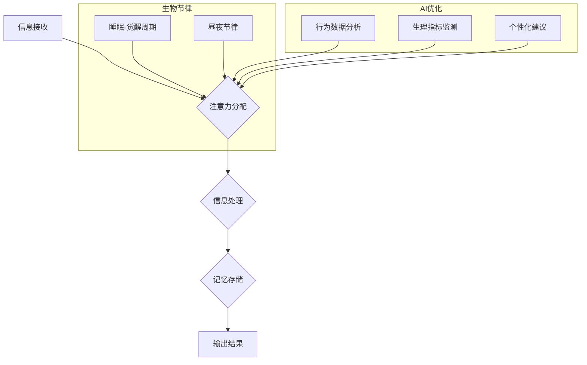

                 

## 注意力的生物节律：AI优化的认知周期

> 关键词：注意力、认知周期、生物节律、AI优化、深度学习、时间管理、效率提升

## 1. 背景介绍

在当今信息爆炸的时代，人类的注意力面临着前所未有的挑战。来自各种渠道的信息纷至沓来，不断地争夺着我们的注意力，导致我们难以集中精力完成任务，效率低下。同时，人工智能（AI）技术飞速发展，深度学习算法的不断进步，为我们提供了新的工具和方法来理解和优化人类认知过程。

注意力是人类认知的核心能力之一，它决定了我们能够有效地处理信息的能力。然而，注意力的分配并非是均匀的，而是受到生物节律的影响。研究表明，人类的注意力水平并非一直保持稳定，而是呈现出周期性的波动，与我们的睡眠-觉醒周期、昼夜节律等生物钟密切相关。

## 2. 核心概念与联系

### 2.1 注意力与认知周期

认知周期是指人类大脑在完成特定任务时所经历的时间段，包括信息接收、处理、记忆和输出等阶段。注意力是认知周期的关键因素，它决定了我们能够有效地处理信息的量和质量。当注意力集中时，我们能够更有效地理解和记忆信息，提高工作效率；而注意力分散时，我们则容易犯错，效率低下。

### 2.2 生物节律与注意力

生物节律是指生物体在一定周期内呈现出的周期性变化，例如睡眠-觉醒周期、体温变化、激素分泌等。这些生物节律与我们的认知能力密切相关，包括注意力水平。研究表明，人类的注意力水平在一天中呈现出明显的波动，通常在早晨和下午的特定时间段内达到峰值，而晚上则相对较低。

### 2.3 AI优化与认知周期

人工智能技术可以帮助我们更好地理解和优化认知周期。通过分析用户的行为数据、生理指标等，AI算法可以识别用户的注意力水平波动规律，并提供个性化的建议，帮助用户更好地管理时间、提高工作效率。

**Mermaid 流程图**



## 3. 核心算法原理 & 具体操作步骤

### 3.1 算法原理概述

注意力优化算法的核心原理是基于对人类认知周期的理解，通过分析用户的行为数据和生理指标，识别用户的注意力水平波动规律，并提供个性化的建议，帮助用户更好地管理时间、提高工作效率。

常见的注意力优化算法包括：

* **时间管理算法：** 
    * 基于番茄工作法、Pomodoro Technique等时间管理方法，将工作时间划分为多个时间段，并在每个时间段内集中注意力完成特定任务。
* **生理指标监测算法：** 
    * 利用心率、脑电波、眼动等生理指标，实时监测用户的注意力水平，并根据注意力水平的变化调整工作内容和节奏。
* **行为数据分析算法：** 
    * 分析用户的行为数据，例如鼠标移动、键盘输入、网页浏览等，识别用户的注意力集中和分散的模式，并提供个性化的建议，帮助用户提高注意力集中时间。

### 3.2 算法步骤详解

1. **数据收集:** 收集用户的行为数据和生理指标数据，例如时间记录、任务完成情况、心率、脑电波等。
2. **数据预处理:** 对收集到的数据进行清洗、转换和归一化，以便于算法的训练和使用。
3. **模型训练:** 利用机器学习算法，训练注意力优化模型，识别用户的注意力水平波动规律。
4. **个性化建议:** 根据训练好的模型，为用户提供个性化的建议，例如调整工作时间、提醒休息、提供注意力提升技巧等。
5. **反馈机制:** 收集用户的反馈信息，不断优化模型的精度和建议的有效性。

### 3.3 算法优缺点

**优点:**

* **提高工作效率:** 通过优化认知周期，帮助用户更好地集中注意力，提高工作效率。
* **减少疲劳感:** 通过合理的休息和工作安排，减少用户的疲劳感，提高工作质量。
* **个性化定制:** 根据用户的不同需求和习惯，提供个性化的建议，提高用户体验。

**缺点:**

* **数据依赖:** 算法的准确性依赖于数据的质量和数量，如果数据不足或质量较差，则算法的精度会降低。
* **隐私问题:** 收集用户的行为数据和生理指标数据可能会涉及隐私问题，需要采取相应的措施保护用户隐私。
* **技术复杂性:** 训练和部署注意力优化模型需要一定的技术门槛，需要专业的技术人员进行开发和维护。

### 3.4 算法应用领域

注意力优化算法在多个领域都有广泛的应用，例如：

* **教育:** 帮助学生提高学习效率，更好地集中注意力，提高学习成绩。
* **企业:** 帮助员工提高工作效率，减少疲劳感，提高工作质量。
* **医疗:** 帮助患者提高注意力，改善认知功能，提高生活质量。
* **游戏:** 帮助玩家更好地集中注意力，提高游戏体验。

## 4. 数学模型和公式 & 详细讲解 & 举例说明

### 4.1 数学模型构建

注意力优化算法通常采用时间序列分析模型，例如ARIMA、LSTM等，来预测用户的注意力水平波动规律。这些模型将用户的行为数据和生理指标数据作为输入，并输出用户的注意力水平预测值。

### 4.2 公式推导过程

ARIMA模型的公式推导过程较为复杂，涉及到时间序列的差分、自回归和移动平均等概念。

**ARIMA(p,d,q)模型的公式如下:**

$$
y_t = c + \phi_1 y_{t-1} + \phi_2 y_{t-2} + ... + \phi_p y_{t-p} + \theta_1 \epsilon_{t-1} + \theta_2 \epsilon_{t-2} + ... + \theta_q \epsilon_{t-q} + \epsilon_t
$$

其中:

* $y_t$ 表示时间t时刻的注意力水平
* $c$ 表示截距项
* $\phi_i$ 表示自回归系数
* $\theta_i$ 表示移动平均系数
* $\epsilon_t$ 表示时间t时刻的随机误差项

### 4.3 案例分析与讲解

假设我们收集到用户的注意力水平数据，并使用ARIMA模型进行预测。通过模型训练，我们可以得到用户的注意力水平波动规律，并预测未来一段时间内的注意力水平。

例如，我们可以发现用户的注意力水平在上午9点到11点之间达到峰值，在下午2点到4点之间则相对较低。根据这个规律，我们可以建议用户在上午9点到11点之间完成需要高度集中注意力的任务，而在下午2点到4点之间进行一些轻松的活动，以避免注意力下降。

## 5. 项目实践：代码实例和详细解释说明

### 5.1 开发环境搭建

* **操作系统:** Linux/macOS/Windows
* **编程语言:** Python
* **库依赖:** pandas, numpy, scikit-learn, statsmodels

### 5.2 源代码详细实现

```python
import pandas as pd
from statsmodels.tsa.arima.model import ARIMA

# 加载数据
data = pd.read_csv('attention_data.csv', index_col='timestamp')

# 数据预处理
data['attention'] = data['attention'].astype(float)

# 训练ARIMA模型
model = ARIMA(data['attention'], order=(5,1,0))
model_fit = model.fit()

# 预测未来10个时间点的注意力水平
forecast = model_fit.predict(start=len(data), end=len(data)+9)

# 打印预测结果
print(forecast)
```

### 5.3 代码解读与分析

* **数据加载:** 使用pandas库加载注意力数据，并设置时间戳作为索引。
* **数据预处理:** 将注意力数据转换为浮点数类型。
* **模型训练:** 使用statsmodels库的ARIMA模型训练注意力水平预测模型。
* **模型预测:** 使用训练好的模型预测未来10个时间点的注意力水平。
* **结果输出:** 打印预测结果。

### 5.4 运行结果展示

运行代码后，将输出未来10个时间点的注意力水平预测值。

## 6. 实际应用场景

### 6.1 教育领域

* **个性化学习计划:** 根据学生的注意力水平波动规律，制定个性化的学习计划，帮助学生更好地集中注意力，提高学习效率。
* **实时反馈和提醒:** 利用注意力监测设备，实时监测学生的注意力水平，并提供及时反馈和提醒，帮助学生保持专注。

### 6.2 企业领域

* **工作效率优化:** 根据员工的注意力水平波动规律，安排工作时间和任务，帮助员工更好地集中注意力，提高工作效率。
* **远程办公协作:** 利用注意力监测设备，帮助远程办公员工保持专注，提高协作效率。

### 6.3 医疗领域

* **认知功能评估:** 利用注意力监测设备，评估患者的认知功能，帮助医生诊断和治疗认知障碍。
* **注意力训练:** 利用注意力训练软件，帮助患者提高注意力水平，改善认知功能。

### 6.4 未来应用展望

随着人工智能技术的不断发展，注意力优化算法将有更广泛的应用场景，例如：

* **智能家居:** 根据用户的注意力水平，智能家居设备可以自动调节灯光、温度等环境，帮助用户更好地放松和休息。
* **自动驾驶:** 利用注意力监测设备，自动驾驶系统可以监测驾驶员的注意力水平，并在驾驶员注意力分散时采取相应的措施，例如发出警报或自动减速。
* **虚拟现实:** 利用注意力优化算法，虚拟现实体验可以更加沉浸和逼真，帮助用户更好地参与虚拟世界。

## 7. 工具和资源推荐

### 7.1 学习资源推荐

* **书籍:**
    * 《深度学习》 - Ian Goodfellow, Yoshua Bengio, Aaron Courville
    * 《机器学习》 - Tom Mitchell
* **在线课程:**
    * Coursera: Machine Learning
    * edX: Deep Learning
* **博客和网站:**
    * Towards Data Science
    * Machine Learning Mastery

### 7.2 开发工具推荐

* **Python:** 
    * Jupyter Notebook
    * PyCharm
* **机器学习库:**
    * scikit-learn
    * TensorFlow
    * PyTorch

### 7.3 相关论文推荐

* **Attention Is All You Need** - Vaswani et al. (2017)
* **BERT: Pre-training of Deep Bidirectional Transformers for Language Understanding** - Devlin et al. (2018)
* **Transformer-XL: Attentive Language Models Beyond a Fixed-Length Context** - Dai et al. (2019)

## 8. 总结：未来发展趋势与挑战

### 8.1 研究成果总结

注意力优化算法在理解和优化人类认知周期方面取得了显著的进展，为提高工作效率、改善认知功能提供了新的工具和方法。

### 8.2 未来发展趋势

* **更精准的预测:** 利用更先进的机器学习算法和数据分析技术，提高注意力水平预测的精度。
* **更个性化的建议:** 根据用户的不同需求和习惯，提供更个性化的注意力优化建议。
* **多模态融合:** 将行为数据、生理指标数据、环境数据等多模态数据融合，构建更全面的注意力模型。

### 8.3 面临的挑战

* **数据隐私保护:** 收集和使用用户的个人数据需要严格遵守隐私保护规定，避免数据泄露和滥用。
* **算法解释性:** 许多深度学习算法的决策过程难以解释，需要开发更可解释的注意力优化算法。
* **技术可普及性:** 

注意力优化算法的应用需要一定的技术门槛，需要降低技术门槛，使其更易于普及。

### 8.4 研究展望

未来，注意力优化算法将继续朝着更精准、更个性化、更可解释的方向发展，为人类提供更有效的认知增强工具，帮助我们更好地理解和优化自己的认知能力。

## 9. 附录：常见问题与解答

**Q1: 注意力优化算法是否适用于所有人？**

A1: 注意力优化算法可以帮助大多数人提高工作效率和学习效率，但并非适用于所有人。个体差异较大，一些人可能不需要或不适合使用注意力优化算法。

**Q2: 注意力优化算法会让人变得过度依赖技术吗？**

A2: 注意力优化算法应该作为辅助工具，而不是替代人类自身的努力和自律。过度依赖技术可能会导致一些负面影响，例如降低人的主动性和创造力。

**Q3: 注意力优化算法的安全性如何？**

A3: 注意力优化算法的安全性取决于数据的收集、存储和使用方式。需要严格遵守隐私保护规定，避免数据泄露和滥用。


作者：禅与计算机程序设计艺术 / Zen and the Art of Computer Programming 
<end_of_turn>

