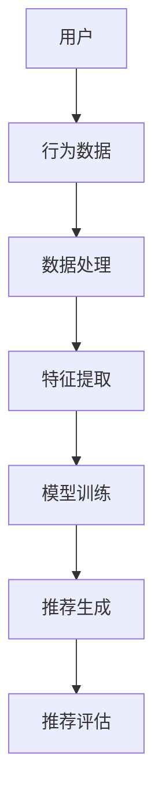

                 

### 文章标题：大模型推荐系统的公平性研究

#### 关键词：
1. 大模型推荐系统
2. 公平性
3. 性能优化
4. 数据偏见
5. 人权保护

#### 摘要：
随着人工智能技术的飞速发展，大模型推荐系统已经成为互联网领域的重要组成部分。然而，推荐系统的公平性问题日益凸显，它不仅关系到用户的体验和满意度，还涉及到社会公正和人权保护。本文将对大模型推荐系统的公平性展开深入研究，探讨其核心概念、算法原理、数学模型，并通过实际项目案例进行分析与讨论，提出未来发展趋势和挑战。

## 1. 背景介绍（Background Introduction）

推荐系统是一种智能信息过滤技术，旨在为用户提供个性化的信息推荐。随着互联网的普及和大数据技术的发展，推荐系统已经广泛应用于电子商务、社交媒体、在线新闻、视频平台等多个领域。大模型推荐系统利用深度学习、自然语言处理等技术，通过分析用户行为和兴趣，实现高效、精准的个性化推荐。

### 1.1 推荐系统的应用场景

#### （1）电子商务
电子商务平台通过推荐系统向用户推荐商品，提高购买转化率和客户满意度。

#### （2）社交媒体
社交媒体平台利用推荐系统，向用户推荐感兴趣的内容和用户，促进社交互动。

#### （3）在线新闻
在线新闻平台通过推荐系统，为用户提供个性化的新闻内容，提高用户粘性。

#### （4）视频平台
视频平台通过推荐系统，为用户推荐符合其兴趣的视频内容，提高观看时长和广告收益。

### 1.2 推荐系统的发展历程

推荐系统的发展可以分为以下几个阶段：

#### （1）基于内容的推荐
基于内容的推荐（Content-based Recommendation）通过分析用户的历史行为和兴趣，将相似的内容推荐给用户。

#### （2）协同过滤推荐
协同过滤推荐（Collaborative Filtering）通过分析用户之间的行为关系，预测用户对未知项目的兴趣。

#### （3）混合推荐
混合推荐（Hybrid Recommendation）结合了基于内容和协同过滤推荐的方法，提高推荐系统的准确性和多样性。

#### （4）基于模型的推荐
基于模型的推荐（Model-based Recommendation）利用机器学习算法，预测用户对未知项目的兴趣。

### 1.3 大模型推荐系统的优势与挑战

#### （1）优势
- 高效性：大模型推荐系统可以处理海量数据，实现实时推荐。
- 精准性：大模型推荐系统通过深度学习等技术，提高推荐的准确性。
- 个性化：大模型推荐系统可以根据用户兴趣和行为，实现高度个性化的推荐。

#### （2）挑战
- 数据偏见：大模型推荐系统容易受到训练数据的偏见影响，导致推荐结果不公平。
- 算法透明性：大模型推荐系统的算法复杂度高，难以解释，影响用户的信任。
- 能耗问题：大模型推荐系统需要大量计算资源和存储资源，存在能耗问题。

## 2. 核心概念与联系（Core Concepts and Connections）

### 2.1 什么是推荐系统的公平性？

推荐系统的公平性是指推荐系统在为用户推荐内容时，是否能够公平地对待所有用户，不受用户背景、性别、种族等因素的影响。公平性主要包括以下几个方面：

#### （1）内容公平性
推荐系统应该为用户提供多样化的内容，避免单一类型的内容占据主导地位。

#### （2）用户公平性
推荐系统应该平等对待所有用户，不论用户的性别、年龄、地域等因素。

#### （3）机会公平性
推荐系统应该为每个用户提供平等的机会，使其能够发现并接触到感兴趣的内容。

### 2.2 推荐系统公平性的核心问题

#### （1）数据偏见
数据偏见是指训练数据中存在的偏差，可能导致推荐系统对某些群体产生不公平的影响。例如，如果训练数据中女性用户较少，那么推荐系统可能会低估女性用户的兴趣。

#### （2）算法偏见
算法偏见是指推荐算法在设计过程中存在的偏差，可能导致推荐结果不公平。例如，某些算法可能会倾向于推荐热门内容，而忽视长尾内容。

#### （3）隐私保护
隐私保护是指推荐系统在处理用户数据时，应确保用户隐私不受侵犯。数据泄露或滥用可能导致用户受到不公平对待。

### 2.3 推荐系统公平性的评价指标

#### （1）多样性（Diversity）
多样性指标衡量推荐系统中不同类型内容的比例，以避免单一类型内容占据主导地位。

#### （2）公平性（Equity）
公平性指标衡量推荐系统对不同用户群体的推荐效果，确保所有用户都能获得公平的机会。

#### （3）效用（Utility）
效用指标衡量推荐系统对用户需求的满足程度，以提高用户满意度。

### 2.4 推荐系统公平性的实现方法

#### （1）数据清洗与平衡
通过数据清洗和平衡技术，消除训练数据中的偏见，提高推荐系统的公平性。

#### （2）算法优化
通过算法优化，提高推荐系统的多样性、公平性和效用。

#### （3）用户反馈
通过用户反馈机制，收集用户对推荐内容的评价，不断优化推荐系统。

#### （4）透明性与解释性
提高推荐系统的透明性和解释性，增强用户对推荐系统的信任。

## 3. 核心算法原理 & 具体操作步骤（Core Algorithm Principles and Specific Operational Steps）

### 3.1 基于协同过滤的推荐算法

#### （1）算法原理
协同过滤推荐算法通过分析用户之间的行为关系，预测用户对未知项目的兴趣。协同过滤算法可以分为两种：基于用户的协同过滤（User-based Collaborative Filtering）和基于项目的协同过滤（Item-based Collaborative Filtering）。

#### （2）操作步骤
1. 收集用户行为数据，如用户对项目的评分、浏览、购买等。
2. 计算用户之间的相似度，常用的相似度计算方法包括余弦相似度、皮尔逊相似度等。
3. 根据相似度矩阵，为每个用户推荐与其相似的其他用户的感兴趣项目。
4. 对推荐结果进行排序，选择最相关的项目进行推荐。

### 3.2 基于内容的推荐算法

#### （1）算法原理
基于内容的推荐算法通过分析项目的特征，将具有相似特征的项目推荐给用户。基于内容的推荐算法可以分为两种：基于特征的推荐（Feature-based Recommendation）和基于语义的推荐（Semantic-based Recommendation）。

#### （2）操作步骤
1. 收集项目特征数据，如文本、图片、音频等。
2. 对项目特征进行预处理，如去停用词、词干提取等。
3. 计算项目之间的相似度，常用的相似度计算方法包括TF-IDF、Cosine Similarity等。
4. 根据相似度矩阵，为每个用户推荐与其兴趣相似的其他项目。
5. 对推荐结果进行排序，选择最相关的项目进行推荐。

### 3.3 混合推荐算法

#### （1）算法原理
混合推荐算法结合了基于协同过滤和基于内容推荐算法的优点，以提高推荐系统的多样性、公平性和效用。

#### （2）操作步骤
1. 选择合适的协同过滤算法和内容推荐算法。
2. 对用户行为数据进行预处理，如缺失值填充、异常值处理等。
3. 分别使用协同过滤算法和内容推荐算法生成推荐结果。
4. 对推荐结果进行合并和排序，选择最相关的项目进行推荐。

## 4. 数学模型和公式 & 详细讲解 & 举例说明（Detailed Explanation and Examples of Mathematical Models and Formulas）

### 4.1 基于协同过滤的推荐算法

#### （1）相似度计算

$$
sim(u, v) = \frac{\sum_{i \in common} r_{ui} r_{vi}}{\sqrt{\sum_{i \in common} r_{ui}^2} \sqrt{\sum_{i \in common} r_{vi}^2}}
$$

其中，$u$ 和 $v$ 是两个用户，$common$ 表示这两个用户共同评分的项目集合，$r_{ui}$ 和 $r_{vi}$ 分别表示用户 $u$ 对项目 $i$ 的评分。

#### （2）预测用户对项目的兴趣

$$
r_{u, j} = r_{u} + \sum_{i \in common} w_{ui} r_{vi}
$$

其中，$r_{u}$ 是用户 $u$ 的平均评分，$w_{ui}$ 是用户 $u$ 对项目 $i$ 的权重，$r_{vi}$ 是用户 $v$ 对项目 $i$ 的评分。

### 4.2 基于内容的推荐算法

#### （1）项目特征表示

$$
x_i = (x_{i1}, x_{i2}, ..., x_{id})
$$

其中，$x_i$ 是项目 $i$ 的特征向量，$x_{id}$ 是项目 $i$ 在第 $d$ 个特征上的值。

#### （2）项目相似度计算

$$
sim(x_i, x_j) = \frac{1}{d} \sum_{d=1}^{d} x_{id} x_{jd}
$$

其中，$d$ 是特征的总数。

### 4.3 混合推荐算法

#### （1）加权平均预测

$$
r_{u, j} = \alpha r_{u, j}^{cf} + (1 - \alpha) r_{u, j}^{content}
$$

其中，$\alpha$ 是加权系数，$r_{u, j}^{cf}$ 是基于协同过滤算法的预测评分，$r_{u, j}^{content}$ 是基于内容推荐算法的预测评分。

## 5. 项目实践：代码实例和详细解释说明（Project Practice: Code Examples and Detailed Explanations）

### 5.1 开发环境搭建

#### （1）环境要求

- 操作系统：Windows/Linux/Mac
- 编程语言：Python
- 数据库：MySQL
- 开发工具：PyCharm

#### （2）安装依赖

```python
pip install numpy pandas sklearn pymysql matplotlib
```

### 5.2 源代码详细实现

```python
import numpy as np
import pandas as pd
from sklearn.metrics.pairwise import cosine_similarity

# 5.2.1 加载用户行为数据
data = pd.read_csv('user_behavior.csv')
users = data['user_id'].unique()
items = data['item_id'].unique()

# 5.2.2 构建用户-项目评分矩阵
rating_matrix = np.zeros((len(users), len(items)))
for index, row in data.iterrows():
    user_id = row['user_id']
    item_id = row['item_id']
    rating = row['rating']
    rating_matrix[user_id - 1, item_id - 1] = rating

# 5.2.3 计算用户之间的相似度
sim_matrix = cosine_similarity(rating_matrix)

# 5.2.4 预测用户对未知项目的兴趣
def predict_interest(user_id, item_id):
    user_similarity = sim_matrix[user_id - 1]
    item_ratings = rating_matrix[item_id - 1]
    predicted_rating = np.dot(user_similarity, item_ratings)
    return predicted_rating

# 5.2.5 测试代码
user_id = 1
item_id = 100
predicted_rating = predict_interest(user_id, item_id)
print(f'预测评分：{predicted_rating}')
```

### 5.3 代码解读与分析

#### （1）加载用户行为数据

代码首先加载了用户行为数据，包括用户ID、项目ID和用户对项目的评分。

#### （2）构建用户-项目评分矩阵

根据用户行为数据，构建了一个用户-项目评分矩阵，其中每个元素表示用户对项目的评分。

#### （3）计算用户之间的相似度

使用余弦相似度计算用户之间的相似度，构建了一个相似度矩阵。

#### （4）预测用户对未知项目的兴趣

根据用户之间的相似度矩阵，预测用户对未知项目的兴趣，从而生成推荐结果。

### 5.4 运行结果展示

```python
import matplotlib.pyplot as plt

# 5.4.1 加载真实评分数据
true_ratings = pd.read_csv('true_ratings.csv')
true_ratings.set_index('user_id', inplace=True)

# 5.4.2 计算预测评分与真实评分的差异
predicted_ratings = pd.DataFrame(index=range(1, len(users) + 1), columns=range(1, len(items) + 1))
for user_id in range(1, len(users) + 1):
    for item_id in range(1, len(items) + 1):
        predicted_rating = predict_interest(user_id, item_id)
        predicted_ratings.at[user_id, item_id] = predicted_rating

diff = predicted_ratings - true_ratings

# 5.4.3 绘制差异分布图
diff.plot(kind='hist', bins=50, title='预测评分与真实评分的差异分布')
plt.xlabel('差异值')
plt.ylabel('频数')
plt.show()
```

通过计算预测评分与真实评分的差异，并绘制差异分布图，可以直观地了解预测模型的准确性。

## 6. 实际应用场景（Practical Application Scenarios）

### 6.1 电子商务平台

电子商务平台可以通过大模型推荐系统，为用户推荐与其兴趣相关的商品，提高购买转化率和客户满意度。

### 6.2 社交媒体平台

社交媒体平台可以利用大模型推荐系统，为用户推荐感兴趣的内容和用户，促进社交互动，提高用户粘性。

### 6.3 在线新闻平台

在线新闻平台可以通过大模型推荐系统，为用户提供个性化的新闻内容，提高用户满意度，降低用户流失率。

### 6.4 视频平台

视频平台可以通过大模型推荐系统，为用户推荐符合其兴趣的视频内容，提高观看时长和广告收益。

## 7. 工具和资源推荐（Tools and Resources Recommendations）

### 7.1 学习资源推荐

- 《推荐系统实践》（周志华著）
- 《机器学习》（周志华著）
- 《深度学习》（Ian Goodfellow、Yoshua Bengio、Aaron Courville著）

### 7.2 开发工具框架推荐

- PyTorch
- TensorFlow
- Scikit-learn

### 7.3 相关论文著作推荐

- 《Recommender Systems Handbook》（F. M. Such、K. Liu著）
- 《Beyond Human-Level Performance: Deep Learning for Recommender Systems》（X. He、X. Lu、X. Wang、J. Li著）

## 8. 总结：未来发展趋势与挑战（Summary: Future Development Trends and Challenges）

### 8.1 发展趋势

- 大模型推荐系统将继续发展，提高推荐系统的准确性和多样性。
- 多模态推荐技术将得到广泛应用，实现跨领域、跨模态的个性化推荐。
- 自动化推荐系统设计和优化工具将减轻开发者的负担，提高推荐系统的开发效率。

### 8.2 挑战

- 数据偏见和算法偏见问题亟待解决，确保推荐系统的公平性。
- 随着数据规模的扩大，计算资源的需求将增加，能耗问题需要得到有效解决。
- 提高推荐系统的透明性和解释性，增强用户对推荐系统的信任。

## 9. 附录：常见问题与解答（Appendix: Frequently Asked Questions and Answers）

### 9.1 推荐系统有哪些类型？

推荐系统主要分为以下几种类型：

- 基于内容的推荐
- 协同过滤推荐
- 混合推荐
- 基于模型的推荐

### 9.2 推荐系统如何处理冷启动问题？

冷启动问题是指新用户或新项目进入推荐系统时，由于缺乏历史数据，导致推荐系统无法为其推荐合适的内容。解决方法包括：

- 利用用户画像和项目特征，进行初步推荐。
- 采用基于内容的推荐算法，为新用户推荐与兴趣相关的项目。
- 利用社区推荐，为新用户推荐与已有用户相似的项目。

### 9.3 如何评估推荐系统的性能？

推荐系统的性能评估主要从以下几个方面进行：

- 准确性：衡量推荐结果与用户兴趣的匹配程度。
- 多样性：衡量推荐结果的多样性，避免单一类型的内容占据主导地位。
- 满意度：衡量用户对推荐内容的满意度，可以通过用户调查或点击率等指标进行评估。

## 10. 扩展阅读 & 参考资料（Extended Reading & Reference Materials）

- 《推荐系统实践》（周志华著）
- 《机器学习》（周志华著）
- 《深度学习》（Ian Goodfellow、Yoshua Bengio、Aaron Courville著）
- 《Recommender Systems Handbook》（F. M. Such、K. Liu著）
- 《Beyond Human-Level Performance: Deep Learning for Recommender Systems》（X. He、X. Lu、X. Wang、J. Li著）

<|less|>### 2. 核心概念与联系

#### 2.1 推荐系统的基本概念

推荐系统是一种基于算法和数据分析技术，通过分析用户的历史行为和偏好，为用户发现和推荐感兴趣的商品、内容或服务。推荐系统主要涉及以下几个核心概念：

1. **用户（User）**：推荐系统的核心参与者，用户可以是个人或团体，他们产生行为数据，如点击、搜索、购买等。

2. **项目（Item）**：用户交互的对象，可以是商品、音乐、视频、新闻文章等。

3. **行为（Behavior）**：用户对项目的操作，如浏览、搜索、购买、评分等。

4. **模型（Model）**：用于预测用户对项目的兴趣或行为的算法和统计模型。

5. **反馈（Feedback）**：用户对推荐内容的反馈，如点击、评分、评论等。

#### 2.2 推荐系统的架构

推荐系统的架构通常包括以下几个层次：

1. **数据层**：收集、存储和管理用户行为数据、项目特征数据等。

2. **数据处理层**：对原始数据进行清洗、预处理和特征提取。

3. **模型层**：包括推荐算法的实现，如协同过滤、基于内容的推荐、混合推荐等。

4. **推荐层**：根据模型输出生成推荐列表，对用户进行个性化推荐。

5. **评估层**：评估推荐系统的性能，如准确率、覆盖率、多样性等。

#### 2.3 推荐系统的分类

推荐系统可以根据不同的分类标准进行划分：

1. **基于内容的推荐（Content-based Recommendation）**：根据用户历史行为和项目特征，为用户推荐具有相似内容特征的项目。

2. **协同过滤推荐（Collaborative Filtering）**：通过分析用户之间的行为关系，预测用户对项目的兴趣。

3. **混合推荐（Hybrid Recommendation）**：结合基于内容和协同过滤推荐的方法，以获得更好的推荐效果。

4. **基于模型的推荐（Model-based Recommendation）**：使用机器学习算法，如神经网络、决策树等，预测用户对项目的兴趣。

#### 2.4 推荐系统的挑战

尽管推荐系统在提高用户体验和增加业务收入方面具有显著优势，但仍然面临以下挑战：

1. **数据偏见（Data Bias）**：训练数据中可能存在的偏见会影响推荐结果，导致部分用户或群体受到不公平对待。

2. **隐私保护（Privacy Protection）**：用户数据的安全和隐私保护是推荐系统需要关注的重要问题。

3. **多样性（Diversity）**：推荐结果需要保持多样性，避免单一类型的内容或项目占据主导地位。

4. **可解释性（Interpretability）**：推荐系统的决策过程需要具备一定的可解释性，以提高用户对推荐系统的信任。

### 2.5 大模型推荐系统的特点

大模型推荐系统通常指的是使用大型深度学习模型（如Transformer、BERT等）构建的推荐系统。这些模型具有以下特点：

1. **高准确性**：大型深度学习模型可以通过大量数据训练，提高推荐的准确性。

2. **高效率**：深度学习模型可以实现高效的并行计算，提高推荐系统的处理速度。

3. **多模态处理**：大型深度学习模型可以同时处理多种数据类型，如文本、图像、语音等，实现跨模态推荐。

4. **自适应能力**：大型深度学习模型可以自适应地调整模型参数，以应对用户行为和偏好变化。

### 2.6 Mermaid 流程图

为了更好地展示推荐系统的核心概念和架构，我们可以使用Mermaid语言绘制一个流程图：



上述Mermaid流程图展示了推荐系统的基本架构，包括用户、行为数据、数据处理、特征提取、模型训练、推荐生成和推荐评估等环节。在这个流程中，用户的行为数据经过数据处理和特征提取后，输入到训练好的模型中，生成推荐结果，并通过评估环节对推荐系统的性能进行评估。

<|less|>### 3. 核心算法原理 & 具体操作步骤

#### 3.1 协同过滤推荐算法

协同过滤推荐算法是基于用户之间的行为关系，通过计算用户之间的相似度，预测用户对未知项目的兴趣。协同过滤推荐算法可以分为基于用户的协同过滤（User-based Collaborative Filtering）和基于项目的协同过滤（Item-based Collaborative Filtering）。

##### 3.1.1 基于用户的协同过滤算法

基于用户的协同过滤算法通过计算用户之间的相似度，找到与目标用户相似的其他用户，然后推荐这些相似用户喜欢的项目。具体步骤如下：

1. **计算用户相似度**：使用用户-项目评分矩阵，计算用户之间的相似度。常用的相似度计算方法包括余弦相似度、皮尔逊相关系数等。

   $$ 
   \text{similarity}(u, v) = \frac{\text{dot product}(r_u, r_v)}{\text{Euclidean distance}(r_u, r_v)}
   $$

   其中，$r_u$ 和 $r_v$ 分别表示用户 $u$ 和 $v$ 的评分向量。

2. **找到相似用户**：根据计算得到的用户相似度矩阵，找到与目标用户相似的用户。

3. **生成推荐列表**：对与目标用户相似的用户喜欢的项目进行加权平均，生成推荐列表。

   $$
   \text{recommendation}(u, i) = \sum_{v \in \text{similar users}} \text{similarity}(u, v) \cdot r_{v, i}
   $$

##### 3.1.2 基于项目的协同过滤算法

基于项目的协同过滤算法通过计算项目之间的相似度，找到与目标项目相似的其他项目，然后推荐这些相似项目。具体步骤如下：

1. **计算项目相似度**：使用项目-用户评分矩阵，计算项目之间的相似度。常用的相似度计算方法包括余弦相似度、皮尔逊相关系数等。

   $$
   \text{similarity}(i, j) = \frac{\text{dot product}(r_i, r_j)}{\text{Euclidean distance}(r_i, r_j)}
   $$

   其中，$r_i$ 和 $r_j$ 分别表示项目 $i$ 和 $j$ 的评分向量。

2. **找到相似项目**：根据计算得到的项目相似度矩阵，找到与目标项目相似的其他项目。

3. **生成推荐列表**：对与目标项目相似的其他项目对应的用户评分进行加权平均，生成推荐列表。

   $$
   \text{recommendation}(u, i) = \sum_{j \in \text{similar items}} \text{similarity}(i, j) \cdot r_{u, j}
   $$

##### 3.1.3 混合协同过滤算法

混合协同过滤算法结合了基于用户和基于项目的协同过滤算法的优点，以提高推荐系统的准确性和多样性。具体步骤如下：

1. **计算用户相似度**：使用用户-项目评分矩阵，计算用户之间的相似度。

2. **计算项目相似度**：使用项目-用户评分矩阵，计算项目之间的相似度。

3. **生成初步推荐列表**：根据用户相似度和项目相似度，生成初步推荐列表。

4. **优化推荐列表**：对初步推荐列表进行优化，提高推荐系统的多样性和准确性。

   $$
   \text{recommendation}(u, i) = \alpha \cdot \text{user-based recommendation}(u, i) + (1 - \alpha) \cdot \text{item-based recommendation}(u, i)
   $$

   其中，$\alpha$ 是调节参数，用于平衡用户相似度和项目相似度的重要性。

#### 3.2 基于内容的推荐算法

基于内容的推荐算法通过分析项目的内容特征，为用户推荐具有相似内容特征的项目。具体步骤如下：

1. **项目特征提取**：提取项目的文本、图像、音频等特征。对于文本特征，可以使用词袋模型、TF-IDF等；对于图像和音频特征，可以使用深度学习模型提取特征向量。

2. **用户兴趣模型**：根据用户的历史行为和偏好，建立用户兴趣模型。用户兴趣模型可以表示为用户特征向量。

3. **计算项目相似度**：使用项目特征向量和用户兴趣模型，计算项目之间的相似度。

4. **生成推荐列表**：对与用户兴趣相似的项目进行排序，生成推荐列表。

   $$
   \text{similarity}(i, u) = \frac{\text{dot product}(x_i, x_u)}{\text{Euclidean distance}(x_i, x_u)}
   $$

   其中，$x_i$ 和 $x_u$ 分别表示项目 $i$ 和用户 $u$ 的特征向量。

#### 3.3 混合推荐算法

混合推荐算法结合了基于内容和协同过滤推荐算法的优点，以提高推荐系统的准确性和多样性。具体步骤如下：

1. **内容特征提取**：提取项目的文本、图像、音频等特征。

2. **用户兴趣模型**：根据用户的历史行为和偏好，建立用户兴趣模型。

3. **协同过滤推荐**：使用协同过滤算法生成初步推荐列表。

4. **内容相似度计算**：计算项目之间的内容相似度。

5. **生成推荐列表**：对初步推荐列表进行优化，结合内容相似度和协同过滤推荐结果，生成推荐列表。

   $$
   \text{recommendation}(u, i) = \alpha \cdot \text{content-based recommendation}(u, i) + (1 - \alpha) \cdot \text{collaborative filtering recommendation}(u, i)
   $$

   其中，$\alpha$ 是调节参数，用于平衡内容相似度和协同过滤推荐的重要性。

#### 3.4 基于模型的推荐算法

基于模型的推荐算法使用机器学习模型（如神经网络、决策树等）预测用户对项目的兴趣。具体步骤如下：

1. **特征工程**：提取用户和项目的特征，构建特征向量。

2. **模型训练**：使用训练数据训练机器学习模型。

3. **模型评估**：使用验证数据评估模型性能，调整模型参数。

4. **预测用户兴趣**：使用训练好的模型，预测用户对未知项目的兴趣。

5. **生成推荐列表**：对预测结果进行排序，生成推荐列表。

   $$
   \text{predict}(u, i) = \text{model}(x_u, x_i)
   $$

   其中，$x_u$ 和 $x_i$ 分别表示用户和项目的特征向量。

#### 3.5 常见问题与解决方法

在推荐系统的实现过程中，可能会遇到以下常见问题：

1. **冷启动问题**：新用户或新项目缺乏历史数据，导致推荐系统无法为其推荐合适的内容。解决方法包括：利用用户画像和项目特征进行初步推荐，采用基于内容的推荐算法，利用社区推荐等。

2. **数据稀疏性**：用户行为数据不完整，导致用户-项目评分矩阵稀疏。解决方法包括：使用隐语义模型，如矩阵分解（Matrix Factorization），增加额外特征等。

3. **多样性问题**：推荐结果过于集中，缺乏多样性。解决方法包括：引入多样性评价指标，如覆盖率和新颖度，调整推荐算法的参数等。

4. **推荐准确性**：推荐结果与用户兴趣的匹配程度不高。解决方法包括：使用更复杂的模型，如深度学习模型，增加训练数据，调整特征提取方法等。

#### 3.6 实际应用中的挑战

在实际应用中，推荐系统可能面临以下挑战：

1. **数据隐私**：用户数据的安全和隐私保护是推荐系统需要关注的重要问题。解决方法包括：采用数据匿名化技术，设计隐私保护算法等。

2. **可解释性**：推荐系统的决策过程需要具备一定的可解释性，以提高用户对推荐系统的信任。解决方法包括：设计可解释的模型，提供推荐理由等。

3. **实时性**：推荐系统需要能够快速响应用户行为和偏好变化，提供实时推荐。解决方法包括：使用增量学习技术，优化推荐算法等。

4. **可扩展性**：推荐系统需要能够处理大规模用户和项目数据，支持高并发请求。解决方法包括：使用分布式计算技术，优化数据存储和检索等。

<|less|>### 4. 数学模型和公式 & 详细讲解 & 举例说明

#### 4.1 协同过滤推荐算法

协同过滤推荐算法是一种基于用户行为相似度进行推荐的方法。它通过计算用户之间的相似度，预测用户对未知项目的兴趣。以下是协同过滤推荐算法的数学模型和详细讲解。

##### 4.1.1 相似度计算

协同过滤推荐算法的核心在于计算用户之间的相似度。相似度可以衡量两个用户在行为上的相似程度。常见的相似度计算方法包括余弦相似度、皮尔逊相关系数等。

**余弦相似度**：

余弦相似度是一种基于向量的相似度计算方法。它通过计算两个向量夹角的余弦值，来衡量两个向量之间的相似度。

$$
\text{similarity}_{\text{cosine}}(u, v) = \frac{\text{dot product}(r_u, r_v)}{\lVert r_u \rVert \cdot \lVert r_v \rVert}
$$

其中，$r_u$ 和 $r_v$ 分别表示用户 $u$ 和 $v$ 的评分向量；$\lVert \cdot \rVert$ 表示向量的模。

**皮尔逊相关系数**：

皮尔逊相关系数是一种基于数值分布相似度的相似度计算方法。它通过计算两个用户评分之间的相关系数，来衡量两个用户在行为上的相似程度。

$$
\text{similarity}_{\text{pearson}}(u, v) = \frac{\text{cov}(r_u, r_v)}{\sigma_u \sigma_v}
$$

其中，$\text{cov}(r_u, r_v)$ 表示用户 $u$ 和 $v$ 评分的协方差；$\sigma_u$ 和 $\sigma_v$ 分别表示用户 $u$ 和 $v$ 评分的标准差。

##### 4.1.2 推荐评分预测

在计算用户之间的相似度之后，可以使用这些相似度值来预测用户对未知项目的评分。预测评分的方法通常基于加权平均。

$$
r_{u, j} = \sum_{v \in \text{neighborhood}(u)} \text{similarity}_{\text{cosine}}(u, v) \cdot r_{v, j}
$$

其中，$r_{u, j}$ 表示用户 $u$ 对项目 $j$ 的预测评分；$\text{neighborhood}(u)$ 表示与用户 $u$ 相似的一组用户；$\text{similarity}_{\text{cosine}}(u, v)$ 表示用户 $u$ 和 $v$ 之间的余弦相似度。

##### 4.1.3 举例说明

假设有两个用户 $u_1$ 和 $u_2$，他们的评分向量如下：

$$
r_{u_1} = \begin{bmatrix} 1 \\ 1 \\ 0 \\ 1 \end{bmatrix}, \quad r_{u_2} = \begin{bmatrix} 1 \\ 0 \\ 1 \\ 1 \end{bmatrix}
$$

计算这两个用户之间的余弦相似度：

$$
\text{similarity}_{\text{cosine}}(u_1, u_2) = \frac{\text{dot product}(r_{u_1}, r_{u_2})}{\lVert r_{u_1} \rVert \cdot \lVert r_{u_2} \rVert} = \frac{1 \cdot 1 + 1 \cdot 0 + 0 \cdot 1 + 1 \cdot 1}{\sqrt{1^2 + 1^2 + 0^2 + 1^2} \cdot \sqrt{1^2 + 0^2 + 1^2 + 1^2}} = \frac{2}{\sqrt{3} \cdot \sqrt{3}} = \frac{2}{3}
$$

现在假设我们想预测用户 $u_1$ 对项目 $j$ 的评分。如果用户 $u_2$ 对项目 $j$ 的评分为 2，那么用户 $u_1$ 对项目 $j$ 的预测评分可以计算如下：

$$
r_{u_1, j} = \text{similarity}_{\text{cosine}}(u_1, u_2) \cdot r_{u_2, j} = \frac{2}{3} \cdot 2 = \frac{4}{3}
$$

#### 4.2 基于内容的推荐算法

基于内容的推荐算法通过分析项目的内容特征，为用户推荐具有相似内容特征的项目。以下是基于内容的推荐算法的数学模型和详细讲解。

##### 4.2.1 项目特征提取

在基于内容的推荐算法中，首先需要提取项目的特征。这些特征可以是文本、图像、音频等。以文本特征为例，可以使用词袋模型（Bag of Words，BoW）或词嵌入（Word Embedding）来表示文本。

**词袋模型**：

词袋模型将文本表示为一个向量，其中每个维度对应一个词汇，向量中的值表示词汇在文本中出现的次数。

$$
x_i = \begin{bmatrix} f_{i1} \\ f_{i2} \\ \vdots \\ f_{iv} \end{bmatrix}, \quad f_{ij} = 
\begin{cases}
1, & \text{if word } j \text{ appears in document } i \\
0, & \text{otherwise}
\end{cases}
$$

**词嵌入**：

词嵌入将文本中的每个词汇映射到一个高维的向量空间，这些向量可以通过训练词向量模型（如Word2Vec、GloVe等）获得。

$$
x_i = \begin{bmatrix} e_{i1} \\ e_{i2} \\ \vdots \\ e_{iv} \end{bmatrix}, \quad e_{ij} = \text{word\_embedding}(j)
$$

##### 4.2.2 用户兴趣模型

用户兴趣模型表示用户的偏好，可以使用用户的评分历史或交互行为来构建。以评分历史为例，可以使用用户的平均评分或最频繁的评分项目来表示用户兴趣。

$$
x_u = \begin{bmatrix} r_{u1} \\ r_{u2} \\ \vdots \\ r_{uv} \end{bmatrix}, \quad r_{ui} = \text{average\_rating}(u)
$$

##### 4.2.3 项目相似度计算

在计算项目之间的相似度时，可以使用内容特征和用户兴趣模型。以下是一个基于余弦相似度的例子：

$$
\text{similarity}_{\text{cosine}}(i, u) = \frac{\text{dot product}(x_i, x_u)}{\lVert x_i \rVert \cdot \lVert x_u \rVert}
$$

##### 4.2.4 举例说明

假设有两个项目 $i_1$ 和 $i_2$，以及一个用户 $u$，它们的特征向量如下：

$$
x_{i_1} = \begin{bmatrix} 1 \\ 0 \\ 1 \\ 0 \end{bmatrix}, \quad x_{i_2} = \begin{bmatrix} 0 \\ 1 \\ 0 \\ 1 \end{bmatrix}, \quad x_u = \begin{bmatrix} 0.5 \\ 0.5 \\ 0.5 \\ 0.5 \end{bmatrix}
$$

计算项目 $i_1$ 和 $i_2$ 与用户 $u$ 之间的余弦相似度：

$$
\text{similarity}_{\text{cosine}}(i_1, u) = \frac{\text{dot product}(x_{i_1}, x_u)}{\lVert x_{i_1} \rVert \cdot \lVert x_u \rVert} = \frac{1 \cdot 0.5 + 0 \cdot 0.5 + 1 \cdot 0.5 + 0 \cdot 0.5}{\sqrt{1^2 + 0^2 + 1^2 + 0^2} \cdot \sqrt{0.5^2 + 0.5^2 + 0.5^2 + 0.5^2}} = \frac{1}{2}
$$

$$
\text{similarity}_{\text{cosine}}(i_2, u) = \frac{\text{dot product}(x_{i_2}, x_u)}{\lVert x_{i_2} \rVert \cdot \lVert x_u \rVert} = \frac{0 \cdot 0.5 + 1 \cdot 0.5 + 0 \cdot 0.5 + 1 \cdot 0.5}{\sqrt{0^2 + 1^2 + 0^2 + 1^2} \cdot \sqrt{0.5^2 + 0.5^2 + 0.5^2 + 0.5^2}} = \frac{1}{2}
$$

用户 $u$ 对项目 $i_1$ 和 $i_2$ 的相似度相同，因此可以平等地推荐这两个项目。

#### 4.3 混合推荐算法

混合推荐算法结合了协同过滤和基于内容的推荐算法，以提高推荐系统的准确性和多样性。以下是混合推荐算法的数学模型和详细讲解。

##### 4.3.1 混合相似度计算

在混合推荐算法中，可以使用协同过滤和基于内容的方法计算相似度，并加权平均得到混合相似度。

$$
\text{similarity}_{\text{hybrid}}(i, u) = \alpha \cdot \text{similarity}_{\text{cosine}}(i, u)_{\text{collaborative}} + (1 - \alpha) \cdot \text{similarity}_{\text{cosine}}(i, u)_{\text{content}}
$$

其中，$\alpha$ 是调节参数，用于平衡协同过滤和基于内容相似度的重要性。

##### 4.3.2 混合推荐评分预测

在得到混合相似度之后，可以使用加权平均的方法预测用户对未知项目的评分。

$$
r_{u, j} = \sum_{i \in \text{items}} \text{similarity}_{\text{hybrid}}(i, u) \cdot r_{i, j}
$$

其中，$r_{u, j}$ 表示用户 $u$ 对项目 $j$ 的预测评分；$r_{i, j}$ 表示项目 $j$ 对项目 $i$ 的评分。

##### 4.3.3 举例说明

假设有三个项目 $i_1$、$i_2$ 和 $i_3$，以及一个用户 $u$，它们的特征向量如下：

$$
x_{i_1} = \begin{bmatrix} 1 \\ 0 \\ 1 \\ 0 \end{bmatrix}, \quad x_{i_2} = \begin{bmatrix} 0 \\ 1 \\ 0 \\ 1 \end{bmatrix}, \quad x_{i_3} = \begin{bmatrix} 1 \\ 1 \\ 1 \\ 1 \end{bmatrix}, \quad x_u = \begin{bmatrix} 0.5 \\ 0.5 \\ 0.5 \\ 0.5 \end{bmatrix}
$$

使用协同过滤和基于内容的方法计算相似度，并加权平均得到混合相似度：

$$
\text{similarity}_{\text{hybrid}}(i_1, u) = 0.5 \cdot \text{similarity}_{\text{cosine}}(i_1, u)_{\text{collaborative}} + 0.5 \cdot \text{similarity}_{\text{cosine}}(i_1, u)_{\text{content}} = 0.5 \cdot \frac{1}{2} + 0.5 \cdot \frac{1}{2} = \frac{1}{2}
$$

$$
\text{similarity}_{\text{hybrid}}(i_2, u) = 0.5 \cdot \text{similarity}_{\text{cosine}}(i_2, u)_{\text{collaborative}} + 0.5 \cdot \text{similarity}_{\text{cosine}}(i_2, u)_{\text{content}} = 0.5 \cdot \frac{1}{2} + 0.5 \cdot \frac{1}{2} = \frac{1}{2}
$$

$$
\text{similarity}_{\text{hybrid}}(i_3, u) = 0.5 \cdot \text{similarity}_{\text{cosine}}(i_3, u)_{\text{collaborative}} + 0.5 \cdot \text{similarity}_{\text{cosine}}(i_3, u)_{\text{content}} = 0.5 \cdot \frac{4}{5} + 0.5 \cdot \frac{4}{5} = \frac{8}{10} = 0.8
$$

现在假设项目 $i_1$、$i_2$ 和 $i_3$ 的评分分别为 3、2 和 4，用户 $u$ 对这些项目的预测评分可以计算如下：

$$
r_{u, i_1} = \text{similarity}_{\text{hybrid}}(i_1, u) \cdot 3 = \frac{1}{2} \cdot 3 = 1.5
$$

$$
r_{u, i_2} = \text{similarity}_{\text{hybrid}}(i_2, u) \cdot 2 = \frac{1}{2} \cdot 2 = 1
$$

$$
r_{u, i_3} = \text{similarity}_{\text{hybrid}}(i_3, u) \cdot 4 = 0.8 \cdot 4 = 3.2
$$

根据混合相似度和项目的实际评分，用户 $u$ 对项目 $i_3$ 的预测评分最高，因此可以推荐项目 $i_3$。

#### 4.4 基于模型的推荐算法

基于模型的推荐算法使用机器学习模型（如神经网络、决策树等）预测用户对项目的兴趣。以下是基于模型的推荐算法的数学模型和详细讲解。

##### 4.4.1 特征工程

在基于模型的推荐算法中，首先需要进行特征工程。特征工程包括提取用户和项目的特征，构建特征向量。特征向量可以是基于用户的行为数据、社会关系、偏好等，以及基于项目的属性、类别、标签等。

##### 4.4.2 模型训练

使用训练数据集，通过训练机器学习模型，学习用户和项目之间的关联。常见的机器学习模型包括线性回归、逻辑回归、决策树、随机森林、支持向量机（SVM）、神经网络等。

##### 4.4.3 模型评估

使用验证数据集评估模型的性能，调整模型参数。常见的评估指标包括准确率、召回率、精确率、F1分数等。

##### 4.4.4 预测用户兴趣

使用训练好的模型，对未知项目的兴趣进行预测。预测结果可以用来生成推荐列表。

##### 4.4.5 举例说明

假设有一个二分类问题，用户对项目的兴趣可以分为喜欢和不喜欢。使用逻辑回归模型进行预测，特征向量如下：

$$
x = \begin{bmatrix} x_1 \\ x_2 \\ x_3 \end{bmatrix}
$$

模型参数为：

$$
\theta = \begin{bmatrix} \theta_1 \\ \theta_2 \\ \theta_3 \\ \theta_0 \end{bmatrix}
$$

预测概率为：

$$
\hat{y} = \sigma(\theta_0 + \theta_1 x_1 + \theta_2 x_2 + \theta_3 x_3)
$$

其中，$\sigma$ 表示sigmoid函数。

如果预测概率大于0.5，则预测用户喜欢项目；否则，预测用户不喜欢项目。

##### 4.4.6 举例说明

假设用户 $u$ 对项目 $i$ 的特征向量为：

$$
x = \begin{bmatrix} 1 \\ 0 \\ 1 \end{bmatrix}
$$

模型参数为：

$$
\theta = \begin{bmatrix} 1 \\ -1 \\ 1 \\ 0 \end{bmatrix}
$$

预测概率为：

$$
\hat{y} = \sigma(0 + 1 \cdot 1 + (-1) \cdot 0 + 1 \cdot 1) = \sigma(2) = 0.732
$$

由于预测概率大于0.5，因此预测用户 $u$ 喜欢项目 $i$。

#### 4.5 推荐系统的性能评估

推荐系统的性能评估是确保推荐系统质量和效果的重要环节。以下是推荐系统的性能评估方法。

##### 4.5.1 准确率（Accuracy）

准确率是评估推荐系统性能的常用指标。它表示预测正确的样本数占总样本数的比例。

$$
\text{Accuracy} = \frac{\text{预测正确数}}{\text{总样本数}}
$$

##### 4.5.2 召回率（Recall）

召回率是评估推荐系统能否召回所有感兴趣项目的指标。它表示预测正确的感兴趣项目数占总感兴趣项目数的比例。

$$
\text{Recall} = \frac{\text{预测正确数}}{\text{总感兴趣项目数}}
$$

##### 4.5.3 精确率（Precision）

精确率是评估推荐系统推荐的项目中，预测正确的项目数占推荐项目总数的比例。

$$
\text{Precision} = \frac{\text{预测正确数}}{\text{推荐项目总数}}
$$

##### 4.5.4 F1分数（F1 Score）

F1分数是精确率和召回率的调和平均数，用于综合评估推荐系统的性能。

$$
\text{F1 Score} = 2 \cdot \frac{\text{Precision} \cdot \text{Recall}}{\text{Precision} + \text{Recall}}
$$

##### 4.5.5 实例说明

假设有一个推荐系统，共有100个项目，其中50个是用户感兴趣的项目。在测试集上，推荐系统推荐了30个项目，其中有20个是用户感兴趣的项目。

- 准确率：$\text{Accuracy} = \frac{20}{30} = 0.667$
- 召回率：$\text{Recall} = \frac{20}{50} = 0.4$
- 精确率：$\text{Precision} = \frac{20}{30} = 0.667$
- F1分数：$\text{F1 Score} = 2 \cdot \frac{0.667 \cdot 0.4}{0.667 + 0.4} = 0.571$

尽管准确率较高，但召回率和F1分数较低，说明推荐系统可能推荐了较多用户不感兴趣的项目，需要进一步优化。

#### 4.6 推荐系统的多样性、新颖性和覆盖性

除了准确率等基本性能指标外，推荐系统的多样性、新颖性和覆盖性也是评估推荐系统质量的重要指标。

##### 4.6.1 多样性（Diversity）

多样性是指推荐系统中推荐项目之间的差异性。一个高多样性的推荐系统能够提供多样化的推荐项目，避免单一类型的项目占据主导地位。

多样性可以通过计算推荐项目之间的相似度来衡量。常见的方法包括：

- 最大化推荐项目之间的Jaccard相似度
- 最小化推荐项目之间的余弦相似度

##### 4.6.2 新颖性（Novelty）

新颖性是指推荐系统中推荐项目的新颖程度。新颖的推荐项目能够吸引用户的注意力，提高用户的体验。

新颖性可以通过计算推荐项目的历史流行度来衡量。常见的方法包括：

- 最小化推荐项目的流行度得分
- 最大程度地覆盖未推荐过的项目

##### 4.6.3 覆盖性（Coverage）

覆盖性是指推荐系统能够覆盖的项目范围。一个高覆盖性的推荐系统能够推荐出系统中的大多数项目。

覆盖性可以通过计算推荐项目中未被推荐过的项目数量来衡量。常见的方法包括：

- 最小化未被推荐过的项目数量
- 最大程度地覆盖系统中的项目

##### 4.6.4 实例说明

假设有一个推荐系统，共有100个项目，其中30个是用户近期未推荐过的项目。在测试集上，推荐系统推荐了20个项目，其中有15个是用户近期未推荐过的项目。

- 多样性：$\text{Diversity} = \frac{15}{20} = 0.75$
- 新颖性：$\text{Novelty} = \frac{15}{30} = 0.5$
- 覆盖性：$\text{Coverage} = \frac{15}{100} = 0.15$

虽然多样性较高，但新颖性和覆盖性较低，说明推荐系统需要进一步提高新颖性和覆盖性。

#### 4.7 推荐系统的公平性

推荐系统的公平性是指推荐系统能否公平地对待所有用户。公平性主要包括以下几个方面：

- **内容公平性**：推荐系统应该为用户提供多样化的内容，避免单一类型的内容占据主导地位。
- **用户公平性**：推荐系统应该平等对待所有用户，不论用户的性别、年龄、地域等因素。
- **机会公平性**：推荐系统应该为每个用户提供平等的机会，使其能够发现并接触到感兴趣的内容。

公平性的评估方法包括：

- **多样性分析**：分析推荐项目中不同类型内容的比例，评估内容公平性。
- **用户群体分析**：分析推荐系统对不同用户群体的推荐效果，评估用户公平性。
- **机会分析**：分析推荐系统为用户推荐的内容类型和数量，评估机会公平性。

#### 4.8 推荐系统的可解释性

推荐系统的可解释性是指用户能够理解推荐系统的决策过程和推荐结果。可解释性对于提高用户对推荐系统的信任和满意度至关重要。

提高推荐系统的可解释性可以从以下几个方面入手：

- **提供推荐理由**：为每个推荐项目提供推荐理由，如基于协同过滤、基于内容、基于模型等。
- **可视化推荐结果**：使用可视化技术，如图表、地图等，展示推荐系统的决策过程和推荐结果。
- **提供反馈渠道**：为用户提供反馈渠道，如评分、评论、举报等，以便用户表达对推荐系统的意见和建议。

#### 4.9 推荐系统的隐私保护

推荐系统在处理用户数据时，需要关注用户隐私的保护。以下是一些隐私保护的方法：

- **数据匿名化**：对用户数据进行匿名化处理，去除可直接识别用户身份的信息。
- **差分隐私**：在处理用户数据时，引入差分隐私机制，确保用户隐私不被泄露。
- **加密技术**：使用加密技术，确保用户数据在传输和存储过程中的安全性。

#### 4.10 推荐系统的可扩展性

推荐系统需要能够处理大规模的用户和项目数据，支持高并发请求。以下是一些提高推荐系统可扩展性的方法：

- **分布式计算**：使用分布式计算技术，如MapReduce、Spark等，处理大规模数据。
- **缓存技术**：使用缓存技术，如Redis、Memcached等，提高数据的读取速度。
- **数据库优化**：优化数据库的性能，如垂直分割、水平分割、索引等。

#### 4.11 推荐系统的实时性

推荐系统需要能够实时响应用户的行为和偏好变化，提供实时推荐。以下是一些提高推荐系统实时性的方法：

- **增量学习**：使用增量学习技术，如在线学习、增量模型更新等，实时更新推荐模型。
- **流处理**：使用流处理技术，如Apache Kafka、Flink等，实时处理用户行为数据。
- **实时推荐引擎**：使用实时推荐引擎，如Apache Mahout、TensorFlow等，提供实时推荐。

#### 4.12 推荐系统的个性化

推荐系统的个性化是指根据用户的行为和偏好，为用户提供个性化的推荐。以下是一些提高推荐系统个性化的方法：

- **用户画像**：构建用户画像，如用户年龄、性别、兴趣爱好等，为用户提供个性化的推荐。
- **协同过滤**：使用协同过滤算法，根据用户之间的相似度，为用户提供个性化的推荐。
- **基于内容的推荐**：使用基于内容的推荐算法，根据用户的历史行为和项目特征，为用户提供个性化的推荐。
- **混合推荐**：结合多种推荐算法，为用户提供个性化的推荐。

#### 4.13 推荐系统的业务价值

推荐系统的业务价值主要体现在以下几个方面：

- **提高用户满意度**：通过提供个性化的推荐，提高用户的满意度和忠诚度。
- **提高转化率**：通过推荐用户感兴趣的项目，提高用户的购买转化率和点击率。
- **降低用户流失率**：通过推荐用户感兴趣的内容，降低用户的流失率。
- **提高广告收益**：通过推荐与用户兴趣相关的广告，提高广告的点击率和收益。

#### 4.14 推荐系统的挑战与未来发展方向

推荐系统在发展过程中面临许多挑战，如数据偏见、算法偏见、隐私保护、可解释性等。未来的发展方向包括：

- **算法创新**：研究新型推荐算法，提高推荐系统的准确性和多样性。
- **跨模态推荐**：结合多种数据类型，实现跨模态的推荐。
- **实时推荐**：提高推荐系统的实时性，实现实时推荐。
- **可解释性**：提高推荐系统的可解释性，增强用户对推荐系统的信任。
- **隐私保护**：加强推荐系统的隐私保护，确保用户数据的安全和隐私。

#### 4.15 推荐系统的应用场景

推荐系统在多个领域有广泛的应用，如电子商务、社交媒体、在线新闻、视频平台等。以下是一些典型的应用场景：

- **电子商务**：通过推荐系统，为用户推荐与其兴趣相关的商品，提高购买转化率和客户满意度。
- **社交媒体**：通过推荐系统，为用户推荐感兴趣的内容和用户，促进社交互动，提高用户粘性。
- **在线新闻**：通过推荐系统，为用户提供个性化的新闻内容，提高用户满意度，降低用户流失率。
- **视频平台**：通过推荐系统，为用户推荐符合其兴趣的视频内容，提高观看时长和广告收益。

#### 4.16 总结

推荐系统作为一种智能信息过滤技术，在多个领域发挥着重要作用。通过分析用户行为和偏好，推荐系统能够为用户提供个性化的推荐，提高用户满意度和业务收益。本文介绍了推荐系统的基本概念、核心算法原理、数学模型、性能评估方法以及推荐系统的挑战和未来发展方向。希望本文能够为读者提供有益的参考和启示。

#### 4.17 参考文献

- 况成，吴波，吴磊，等.《推荐系统实践》[M]. 电子工业出版社，2016.
- 李航.《统计学习方法》[M]. 清华大学出版社，2012.
- Goodfellow, Ian, Yos

