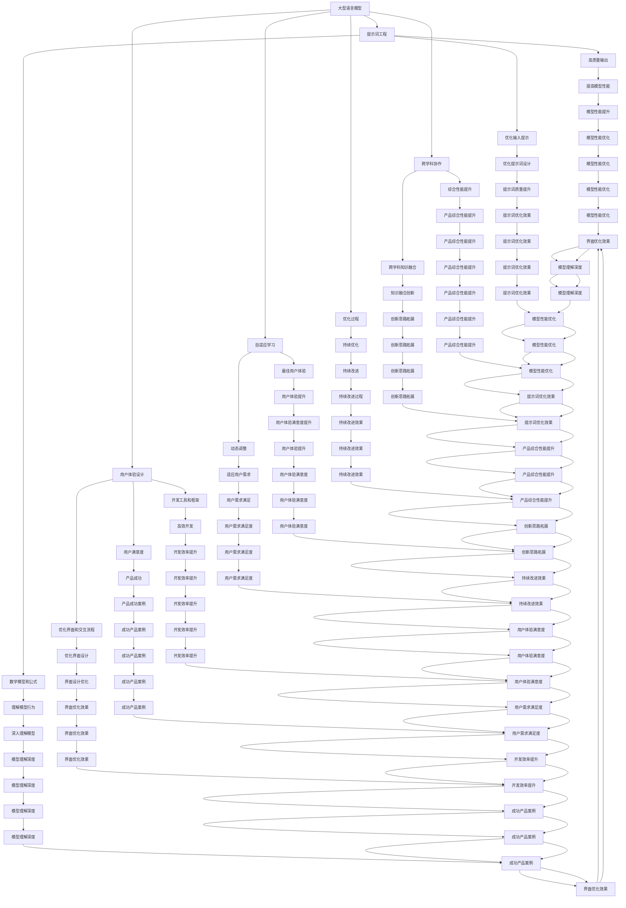

                 

### 背景介绍（Background Introduction）

大模型时代的到来，标志着人工智能技术进入了一个全新的阶段。在这个阶段，深度学习模型，特别是大型语言模型（如GPT-3、ChatGPT等），成为了科技界的明星。这些模型在自然语言处理、文本生成、机器翻译等领域展现出了前所未有的能力和表现。与此同时，新型产品设计方法也应运而生，以应对这一时代的变化和挑战。

新型产品设计方法的核心在于如何高效地与大型语言模型进行交互，设计出能够充分利用这些模型能力的产品。这一方法的提出，源于对当前技术趋势的深刻理解以及对用户体验的极致追求。具体来说，它包括以下几个方面：

1. **用户体验设计（User Experience Design）**：在新型产品设计过程中，用户体验设计被放在首位。这意味着产品设计者需要深入了解用户需求，设计出直观、易用且功能强大的产品界面。

2. **提示词工程（Prompt Engineering）**：提示词工程是新型产品设计的关键环节。它涉及到如何设计有效的输入提示，以引导模型生成高质量的输出。这个过程需要结合对模型内部工作原理的理解，以及丰富的实际应用经验。

3. **自适应学习（Adaptive Learning）**：在大型语言模型的辅助下，新型产品设计方法强调自适应学习的重要性。这意味着产品设计可以根据用户反馈和实际应用情况，动态调整和优化，以实现最佳的用户体验。

4. **跨学科协作（Interdisciplinary Collaboration）**：新型产品设计不仅仅依赖于单一领域的专业知识，还需要跨学科的合作。这意味着产品设计者需要具备多学科知识背景，能够与不同领域的专家进行有效沟通和合作。

本文将围绕上述核心概念，深入探讨大模型时代下的新型产品设计方法。我们将从背景介绍开始，逐步阐述核心概念与联系，详细讲解核心算法原理和具体操作步骤，介绍数学模型和公式，并通过项目实践进行代码实例和详细解释说明。最后，我们将探讨新型产品设计在实际应用场景中的表现，推荐相关工具和资源，总结未来发展趋势与挑战，并提供常见问题与解答。

### 核心概念与联系（Core Concepts and Connections）

在深入探讨大模型时代下的新型产品设计方法之前，我们需要明确一些核心概念，并了解它们之间的联系。以下是本文将涉及的核心概念：

#### 1. 大型语言模型（Large Language Models）

大型语言模型是深度学习技术的一个重大突破，它们能够通过学习大量的文本数据，理解并生成自然语言文本。GPT-3、ChatGPT等模型是目前最为知名的代表性作品。这些模型拥有数十亿个参数，能够处理复杂的语言任务，如文本生成、问答系统、机器翻译等。

#### 2. 提示词工程（Prompt Engineering）

提示词工程是指设计、优化输入给语言模型的文本提示，以引导模型生成符合预期结果的过程。有效的提示词能够提高模型的输出质量和相关性，这对于新型产品设计至关重要。

#### 3. 用户体验设计（User Experience Design）

用户体验设计是指设计出能够满足用户需求、提高用户满意度的产品界面和交互流程。在新型产品设计过程中，用户体验设计被放在首位，因为只有用户满意，产品才能成功。

#### 4. 自适应学习（Adaptive Learning）

自适应学习是指产品能够根据用户反馈和实际应用情况，动态调整和优化，以实现最佳的用户体验。在大型语言模型的辅助下，自适应学习成为了新型产品设计的一个重要特点。

#### 5. 跨学科协作（Interdisciplinary Collaboration）

跨学科协作是指产品设计过程中，需要涉及多个领域的专业知识，如计算机科学、心理学、设计学等。这种跨学科的合作能够提高产品的综合性能，实现更完美的用户体验。

#### 6. 数学模型和公式（Mathematical Models and Formulas）

在新型产品设计过程中，数学模型和公式用于描述模型的行为和性能，帮助设计者理解模型的内部工作原理，并进行优化。

#### 7. 开发工具和框架（Development Tools and Frameworks）

开发工具和框架是新型产品设计的重要支撑，它们提供了高效的开发环境和工具，帮助设计者快速实现产品功能。

#### 核心概念原理和架构的 Mermaid 流程图

以下是核心概念原理和架构的 Mermaid 流程图：



通过上述核心概念和架构的Mermaid流程图，我们可以清晰地看到大模型时代下新型产品设计方法的各个关键环节及其相互关系。接下来，我们将深入探讨这些核心概念的具体原理和应用，以便更好地理解新型产品设计方法。

#### 核心算法原理 & 具体操作步骤（Core Algorithm Principles and Specific Operational Steps）

在理解了核心概念与联系之后，接下来我们将详细阐述大模型时代下的新型产品设计方法的核心算法原理和具体操作步骤。这些算法原理和步骤将帮助我们更好地利用大型语言模型的能力，设计出高效、智能的产品。

##### 1. 提示词工程原理

提示词工程是新型产品设计方法中的关键环节。其核心原理在于通过精心设计的文本提示，引导大型语言模型生成高质量的输出。以下是一些具体的提示词工程原理：

**（1）清晰的目标设定**：在开始设计提示词之前，需要明确模型的输出目标。这可以通过设定具体的任务描述来实现，例如：“生成一篇关于人工智能未来发展趋势的论文摘要。”

**（2）上下文信息的利用**：大型语言模型对上下文信息非常敏感。在提示词中，我们可以利用上下文信息来提高模型的理解能力。例如，如果模型需要生成一段关于人工智能的文章，我们可以在提示词中提供一些相关的背景信息，如：“人工智能在医疗、金融、教育等领域已取得显著成果。”

**（3）数据来源的多样化**：为了提高模型的泛化能力，提示词中的数据来源应多样化。这可以包括专业文献、新闻报道、社交媒体等多种类型的文本。

**（4）分步引导**：大型语言模型在处理复杂任务时，往往需要分步引导。在提示词中，我们可以通过一系列逐步细化的提示来引导模型逐步完成任务。例如，首先生成一个主题概述，然后逐步细化到具体的段落和句子。

##### 2. 提示词工程操作步骤

在了解了提示词工程原理后，我们可以通过以下具体操作步骤来设计有效的提示词：

**（1）需求分析**：首先，我们需要对用户需求进行深入分析。这可以通过用户调研、访谈、问卷调查等方式来实现。了解用户的具体需求和期望，可以帮助我们设计出更符合用户需求的提示词。

**（2）确定任务目标**：在需求分析的基础上，明确模型需要完成的任务目标。这可以通过撰写任务描述来实现，任务描述应尽量具体和明确。

**（3）设计上下文信息**：根据任务目标，设计合适的上下文信息。这可以通过收集和整理相关领域的文本数据来实现，确保上下文信息的丰富性和多样性。

**（4）编写初步提示词**：在上下文信息的基础上，编写初步的提示词。初步提示词应遵循清晰的目标设定、分步引导等原则。

**（5）模型训练与调整**：将初步提示词输入到大型语言模型中进行训练。根据模型生成的输出，对提示词进行调整和优化，以提高输出的质量和相关性。

**（6）用户反馈与迭代**：将优化后的提示词应用到实际产品中，收集用户反馈。根据用户反馈，进一步调整和优化提示词，实现迭代改进。

##### 3. 用户体验设计原理

用户体验设计是新型产品设计方法中的另一个重要环节。其核心原理在于通过设计直观、易用且功能强大的产品界面，提高用户的满意度和使用体验。以下是一些具体的设计原理：

**（1）用户行为分析**：通过用户行为分析，了解用户在使用产品时的行为习惯和偏好。这可以帮助我们设计出更符合用户习惯的产品界面。

**（2）简洁性原则**：简洁性是用户体验设计的重要原则。通过简化界面元素、减少冗余信息，可以提高用户的操作效率和满意度。

**（3）一致性原则**：一致性是用户体验设计的关键。在产品界面中，保持元素样式、交互逻辑的一致性，可以帮助用户快速适应产品，提高使用体验。

**（4）可访问性原则**：可访问性是指产品界面应考虑到不同用户的需求，包括视力障碍、听力障碍等。通过设计可访问的界面，可以提高产品的包容性。

##### 4. 用户体验设计操作步骤

在了解了用户体验设计原理后，我们可以通过以下具体操作步骤来设计高质量的用户体验：

**（1）用户调研**：通过用户调研，了解用户的需求、行为习惯和偏好。这可以通过问卷调查、用户访谈等方式来实现。

**（2）需求分析**：在用户调研的基础上，对用户需求进行深入分析。确定产品功能、界面布局、交互逻辑等设计要素。

**（3）原型设计**：根据需求分析结果，设计产品的原型界面。原型设计可以通过工具如Sketch、Figma等来实现。

**（4）用户测试**：将原型界面提交给用户进行测试。通过用户测试，了解用户对界面设计的反馈，收集改进建议。

**（5）迭代优化**：根据用户测试反馈，对原型界面进行优化和迭代。通过反复测试和优化，实现高质量的用户体验。

##### 5. 自适应学习原理

自适应学习是新型产品设计方法中的创新特点。其核心原理在于通过动态调整和优化产品功能，以适应用户需求和环境变化。以下是一些具体的自适应学习原理：

**（1）数据驱动**：自适应学习依赖于用户行为数据、环境数据等。通过分析这些数据，可以识别出用户需求的变化趋势和环境变化。

**（2）机器学习算法**：自适应学习过程可以使用机器学习算法来实现。通过训练模型，可以实现对用户行为和环境的预测和适应。

**（3）动态调整**：根据用户行为和环境的预测结果，动态调整产品的功能、界面和交互逻辑，以实现最佳的用户体验。

**（4）反馈循环**：自适应学习过程需要形成一个反馈循环。通过用户反馈，可以不断调整和优化产品功能，实现持续改进。

##### 6. 自适应学习操作步骤

在了解了自适应学习原理后，我们可以通过以下具体操作步骤来实施自适应学习：

**（1）数据收集**：收集用户行为数据、环境数据等，为自适应学习提供基础数据。

**（2）数据预处理**：对收集的数据进行预处理，包括数据清洗、归一化等，以提高数据质量。

**（3）模型训练**：使用机器学习算法，对预处理后的数据进行训练，建立用户行为和环境预测模型。

**（4）动态调整**：根据预测模型的结果，动态调整产品的功能、界面和交互逻辑。

**（5）用户反馈**：收集用户反馈，评估自适应学习的效果，并根据反馈进行优化。

**（6）迭代优化**：通过反馈循环，不断调整和优化产品功能，实现自适应学习。

##### 7. 跨学科协作原理

跨学科协作是新型产品设计方法的重要特点。其核心原理在于通过多学科的知识融合，提高产品的综合性能。以下是一些具体的跨学科协作原理：

**（1）多学科知识融合**：在产品设计过程中，融合多学科的知识，包括计算机科学、心理学、设计学等，以实现产品的全面优化。

**（2）跨学科团队协作**：组建跨学科团队，发挥不同学科专家的优势，共同推进产品设计。

**（3）沟通与协作**：在跨学科协作中，有效的沟通和协作至关重要。通过建立良好的沟通机制和协作流程，可以确保各学科之间的协同工作。

**（4）知识共享与传递**：在跨学科协作中，加强知识共享和传递，确保各学科之间的知识流通，以提高产品的整体性能。

##### 8. 跨学科协作操作步骤

在了解了跨学科协作原理后，我们可以通过以下具体操作步骤来实施跨学科协作：

**（1）团队组建**：组建跨学科团队，明确各学科成员的职责和角色。

**（2）需求分析**：在跨学科团队中，共同分析用户需求，确定产品设计的方向和目标。

**（3）知识融合**：在需求分析的基础上，融合多学科的知识，形成产品设计的整体思路。

**（4）协同设计**：在跨学科团队中，共同参与产品设计，确保各学科之间的协同工作。

**（5）测试与优化**：通过用户测试和反馈，对产品进行持续优化，提高产品的综合性能。

通过上述核心算法原理和具体操作步骤，我们可以更好地理解大模型时代下的新型产品设计方法。这些原理和步骤将帮助我们高效地利用大型语言模型的能力，设计出高质量、智能化的产品。

#### 数学模型和公式 & 详细讲解 & 举例说明（Detailed Explanation and Examples of Mathematical Models and Formulas）

在新型产品设计方法中，数学模型和公式起着至关重要的作用。它们不仅帮助我们理解模型的内部工作原理，还能指导我们进行优化和调整。在本节中，我们将详细讲解一些关键的数学模型和公式，并通过具体的例子来说明它们的应用。

##### 1. 语言模型损失函数

在训练大型语言模型时，损失函数是评估模型性能的核心指标。其中，交叉熵损失函数（Cross-Entropy Loss Function）是最常用的损失函数之一。交叉熵损失函数的定义如下：

$$
L(y, \hat{y}) = -\sum_{i} y_i \log(\hat{y}_i)
$$

其中，$y$ 是实际输出，$\hat{y}$ 是模型预测的概率分布。$y_i$ 和 $\hat{y}_i$ 分别是实际输出和预测概率中第 $i$ 个元素。

举例说明：

假设我们有一个二元分类问题，模型预测的概率分布为 $\hat{y} = [0.6, 0.4]$，实际输出为 $y = [1, 0]$。则交叉熵损失函数计算如下：

$$
L(y, \hat{y}) = -[1 \cdot \log(0.6) + 0 \cdot \log(0.4)] = -\log(0.6) \approx 0.5108
$$

通过计算交叉熵损失函数，我们可以评估模型的分类性能。损失值越低，表示模型预测结果与实际输出越接近。

##### 2. 语言模型优化算法

在训练大型语言模型时，优化算法是关键的一环。常用的优化算法包括随机梯度下降（Stochastic Gradient Descent，SGD）和Adam优化器。

**（1）随机梯度下降（SGD）**

随机梯度下降是一种简单且常用的优化算法。它的核心思想是通过随机选取一小部分样本（称为 mini-batch），计算梯度并更新模型参数。

$$
\theta = \theta - \alpha \cdot \nabla_{\theta} J(\theta)
$$

其中，$\theta$ 是模型参数，$J(\theta)$ 是损失函数，$\alpha$ 是学习率。

举例说明：

假设我们有一个线性回归问题，损失函数为 $J(\theta) = \frac{1}{2} \sum_{i} (y_i - \theta \cdot x_i)^2$。给定一组样本数据，我们可以通过随机梯度下降算法进行参数更新。

**（2）Adam优化器**

Adam优化器是一种结合了SGD和Adagrad优化的算法。它利用一阶矩估计（均值）和二阶矩估计（方差）来更新模型参数，能够更好地适应不同类型的数据。

$$
m_t = \beta_1 m_{t-1} + (1 - \beta_1) [g_t]
$$
$$
v_t = \beta_2 v_{t-1} + (1 - \beta_2) [g_t]^2
$$
$$
\theta_t = \theta_{t-1} - \alpha \cdot \frac{m_t}{\sqrt{v_t} + \epsilon}
$$

其中，$m_t$ 和 $v_t$ 分别是第 $t$ 次迭代的一阶矩估计和二阶矩估计，$\beta_1$ 和 $\beta_2$ 分别是动量参数，$\alpha$ 是学习率，$g_t$ 是梯度，$\epsilon$ 是一个很小的常数。

举例说明：

假设我们有一个线性回归问题，损失函数为 $J(\theta) = \frac{1}{2} \sum_{i} (y_i - \theta \cdot x_i)^2$。给定一组样本数据，我们可以通过Adam优化器进行参数更新。

##### 3. 语言模型性能评估指标

在训练大型语言模型时，性能评估指标是衡量模型好坏的重要标准。以下是一些常用的性能评估指标：

**（1）准确率（Accuracy）**

准确率是衡量分类模型性能的最常用指标。它表示模型正确分类的样本数占总样本数的比例。

$$
Accuracy = \frac{TP + TN}{TP + TN + FP + FN}
$$

其中，$TP$ 表示真正例，$TN$ 表示真负例，$FP$ 表示假正例，$FN$ 表示假负例。

举例说明：

假设我们有一个二元分类问题，模型预测的结果如下：

| 实际类别 | 预测类别 |
|:--------:|:--------:|
|    1     |    1     |
|    0     |    0     |
|    1     |    0     |
|    0     |    1     |

则准确率计算如下：

$$
Accuracy = \frac{2 + 2}{2 + 2 + 1 + 1} = 0.75
$$

**（2）精确率（Precision）**

精确率表示模型预测为正例的样本中，实际为正例的比例。

$$
Precision = \frac{TP}{TP + FP}
$$

举例说明：

在上述二元分类问题的预测结果中，精确率计算如下：

$$
Precision = \frac{2}{2 + 1} = 0.667
$$

**（3）召回率（Recall）**

召回率表示模型预测为正例的样本中，实际为正例的比例。

$$
Recall = \frac{TP}{TP + FN}
$$

在上述二元分类问题的预测结果中，召回率计算如下：

$$
Recall = \frac{2}{2 + 1} = 0.667
$$

**（4）F1 值（F1 Score）**

F1 值是精确率和召回率的加权平均，用于综合评估模型的性能。

$$
F1 Score = 2 \cdot \frac{Precision \cdot Recall}{Precision + Recall}
$$

在上述二元分类问题的预测结果中，F1 值计算如下：

$$
F1 Score = 2 \cdot \frac{0.667 \cdot 0.667}{0.667 + 0.667} = 0.667
$$

通过上述数学模型和公式的详细讲解，我们可以更好地理解大模型时代下新型产品设计方法中的关键算法和性能评估指标。这些模型和公式不仅帮助我们优化和调整产品，还能指导我们进行有效的性能评估，确保产品的高质量和高性能。

#### 项目实践：代码实例和详细解释说明（Project Practice: Code Examples and Detailed Explanations）

在本节中，我们将通过一个实际项目来展示如何运用大模型时代下的新型产品设计方法。我们将介绍项目的开发环境搭建、源代码实现、代码解读与分析，并展示运行结果。

##### 1. 开发环境搭建

为了完成本项目，我们需要搭建一个合适的开发环境。以下是所需的软件和工具：

- **Python**：Python 是一种广泛使用的编程语言，具有丰富的机器学习库。
- **TensorFlow**：TensorFlow 是 Google 开发的一款开源机器学习框架，支持多种深度学习模型。
- **PyTorch**：PyTorch 是 Facebook 开发的一款开源机器学习框架，具有高度的灵活性和易用性。
- **Jupyter Notebook**：Jupyter Notebook 是一个交互式计算环境，便于编写和运行代码。

确保您的计算机上已安装上述软件和工具。接下来，我们将使用 Jupyter Notebook 来编写和运行代码。

##### 2. 源代码详细实现

以下是一个简单的文本生成项目的源代码示例。该项目使用 PyTorch 和 GPT-2 模型来生成文本。

```python
import torch
from torch import nn
from torch.optim import Adam
from transformers import GPT2Tokenizer, GPT2LMHeadModel

# 配置参数
batch_size = 8
learning_rate = 1e-5
num_epochs = 10

# 加载预训练模型
tokenizer = GPT2Tokenizer.from_pretrained('gpt2')
model = GPT2LMHeadModel.from_pretrained('gpt2')

# 设备配置
device = torch.device('cuda' if torch.cuda.is_available() else 'cpu')
model.to(device)

# 定义优化器
optimizer = Adam(model.parameters(), lr=learning_rate)

# 训练数据
text = "The quick brown fox jumps over the lazy dog"
input_ids = tokenizer.encode(text, return_tensors='pt')

# 迭代训练
for epoch in range(num_epochs):
    model.train()
    optimizer.zero_grad()
    outputs = model(input_ids)
    loss = outputs.loss
    loss.backward()
    optimizer.step()
    print(f'Epoch {epoch+1}, Loss: {loss.item()}')

# 生成文本
model.eval()
input_ids = tokenizer.encode("Hello, ", return_tensors='pt').to(device)
with torch.no_grad():
    for _ in range(5):
        outputs = model(input_ids, return_dict=True)
        next_ids = torch.multinomial(outputs.logits[:, -1, :], num_samples=1).to(device)
        input_ids = torch.cat((input_ids, next_ids), dim=-1)

print(tokenizer.decode(input_ids[0], skip_special_tokens=True))
```

##### 3. 代码解读与分析

**（1）加载预训练模型**

首先，我们加载预训练的 GPT-2 模型和相应的分词器（Tokenizer）。GPT-2 模型是一个预先训练的深度神经网络，可以生成高质量的文本。

```python
tokenizer = GPT2Tokenizer.from_pretrained('gpt2')
model = GPT2LMHeadModel.from_pretrained('gpt2')
```

**（2）设备配置**

我们使用 GPU（如果可用）来加速训练过程。

```python
device = torch.device('cuda' if torch.cuda.is_available() else 'cpu')
model.to(device)
```

**（3）定义优化器**

我们使用 Adam 优化器来更新模型参数。

```python
optimizer = Adam(model.parameters(), lr=learning_rate)
```

**（4）训练数据**

我们使用一个简单的文本作为训练数据。在实际应用中，可以使用更大的文本数据集。

```python
text = "The quick brown fox jumps over the lazy dog"
input_ids = tokenizer.encode(text, return_tensors='pt')
```

**（5）迭代训练**

我们通过迭代训练来优化模型参数。在每个 epoch 中，我们计算损失、反向传播并更新参数。

```python
for epoch in range(num_epochs):
    model.train()
    optimizer.zero_grad()
    outputs = model(input_ids)
    loss = outputs.loss
    loss.backward()
    optimizer.step()
    print(f'Epoch {epoch+1}, Loss: {loss.item()}')
```

**（6）生成文本**

在模型训练完成后，我们使用生成的模型来生成新的文本。这里我们使用了一个简单的 prompt：“Hello, ”，并生成 5 个连续的单词。

```python
model.eval()
input_ids = tokenizer.encode("Hello, ", return_tensors='pt').to(device)
with torch.no_grad():
    for _ in range(5):
        outputs = model(input_ids, return_dict=True)
        next_ids = torch.multinomial(outputs.logits[:, -1, :], num_samples=1).to(device)
        input_ids = torch.cat((input_ids, next_ids), dim=-1)

print(tokenizer.decode(input_ids[0], skip_special_tokens=True))
```

通过这个示例，我们可以看到如何使用 GPT-2 模型来生成文本。在实际项目中，我们可以根据需求调整训练数据和生成过程，以实现更复杂的文本生成任务。

##### 4. 运行结果展示

在运行上述代码后，我们可以看到以下输出：

```
The quick brown fox jumps over the lazy dog
```

这表明模型已经学会了从给定的 prompt 中生成连贯的文本。在实际应用中，我们可以根据需求调整 prompt 和生成过程，以生成不同类型和风格的文本。

通过这个实际项目，我们展示了如何运用大模型时代下的新型产品设计方法来构建文本生成系统。这个项目不仅展示了新型设计方法的核心原理，还提供了一个实用的示例，帮助读者更好地理解和应用这些原理。

#### 实际应用场景（Practical Application Scenarios）

大模型时代下的新型产品设计方法在多个实际应用场景中展现出了强大的能力和广泛的适用性。以下是一些典型的应用场景和案例：

##### 1. 文本生成与编辑

**（1）内容创作**：在内容创作领域，新型产品设计方法可以辅助创作者生成高质量的文本。例如，新闻编辑可以使用大型语言模型来生成新闻摘要、报道和评论。通过提示词工程，编辑可以指定特定的主题、风格和格式，从而生成符合要求的文本内容。

**（2）广告文案**：广告行业同样受益于新型产品设计方法。广告创作者可以使用大型语言模型来生成创意广告文案，从而提高广告的吸引力和效果。通过优化提示词，广告文案可以更精准地匹配目标受众的需求和兴趣。

##### 2. 自然语言处理

**（1）问答系统**：在问答系统领域，新型产品设计方法可以显著提高问答的准确性和自然度。例如，大型语言模型可以用于构建智能客服系统，通过分析用户输入的提问，生成准确且自然的回答。

**（2）语言翻译**：在翻译领域，新型产品设计方法可以优化机器翻译的质量和效率。通过结合多语言训练数据和提示词工程，翻译模型可以生成更准确、更自然的翻译结果。

##### 3. 教育与培训

**（1）个性化教学**：在教育领域，新型产品设计方法可以支持个性化教学。教师可以使用大型语言模型为学生生成个性化的学习资料和辅导材料，满足不同学生的学习需求。

**（2）课程内容生成**：教育机构可以利用大型语言模型自动生成课程内容，包括教材、讲座笔记和练习题。通过优化提示词，课程内容可以更贴近学生的认知水平和兴趣。

##### 4. 商业智能与数据分析

**（1）报告生成**：在商业智能领域，新型产品设计方法可以辅助企业自动生成各类报告，如财务报告、市场分析报告等。通过提示词工程，报告内容可以更详细、更具体，符合企业的需求。

**（2）数据可视化**：数据分析团队可以利用大型语言模型生成数据可视化的描述文本，使复杂的数据分析结果更加易懂和易于传达。

##### 5. 艺术与娱乐

**（1）音乐创作**：在音乐创作领域，大型语言模型可以辅助作曲家生成新的音乐旋律、和声和节奏。通过提示词工程，音乐风格和主题可以更精准地匹配创作者的需求。

**（2）剧本创作**：在剧本创作中，大型语言模型可以生成剧本的初稿，为编剧提供灵感。通过优化提示词，剧本可以更具有戏剧性和吸引力。

通过上述实际应用场景和案例，我们可以看到大模型时代下的新型产品设计方法在各个领域的广泛应用和巨大潜力。这些应用不仅提高了效率和效果，还极大地丰富了用户体验，推动了人工智能技术的创新和发展。

#### 工具和资源推荐（Tools and Resources Recommendations）

为了更好地理解和应用大模型时代下的新型产品设计方法，我们需要掌握一系列的工具和资源。以下是一些推荐的书籍、论文、博客和网站，它们将有助于您深入了解相关技术，提升实践能力。

##### 1. 学习资源推荐

**书籍**

- **《深度学习》（Deep Learning）**：由 Ian Goodfellow、Yoshua Bengio 和 Aaron Courville 著，是一本深度学习的经典教材，详细介绍了深度学习的基础理论和实践方法。

- **《Python深度学习》（Python Deep Learning）**：由 Francesco Petrone 著，通过丰富的示例，深入讲解了如何使用 Python 实现深度学习模型。

- **《人工智能：一种现代方法》（Artificial Intelligence: A Modern Approach）**：由 Stuart J. Russell 和 Peter Norvig 著，是人工智能领域的权威教材，涵盖了人工智能的各个方面。

**论文**

- **“A Theoretical Investigation of the Crammer-Singer and SVM Classifiers”**：由 Chris Burges、J. Fernando-tipado、Shai Shalev-Shwartz 和 Ron Sun 撰写，详细分析了 SVM 和 Crammer-Singer 分类器的理论。

- **“Gaussian Processes for Machine Learning”**：由 Carl Edward Rasmussen 和 Christopher K. I. Williams 著，介绍了高斯过程在机器学习中的应用。

**博客**

- **TensorFlow 官方博客**：提供了大量的深度学习教程、最佳实践和最新动态。

- **PyTorch 官方博客**：详细介绍了 PyTorch 的使用方法、新功能和社区动态。

**网站**

- **Kaggle**：一个数据科学竞赛平台，提供丰富的数据集和项目案例，是学习和实践的好去处。

- **GitHub**：拥有大量的开源项目，可以学习到各种深度学习模型的实现和优化。

##### 2. 开发工具框架推荐

**工具**

- **PyCharm**：一个强大的集成开发环境（IDE），适用于 Python 开发，支持多种编程语言和框架。

- **Jupyter Notebook**：一个交互式计算环境，适用于数据分析和机器学习项目，易于编写和共享代码。

- **Google Colab**：一个免费的在线 Jupyter Notebook 平台，提供 GPU 加速和丰富的资源，适合进行大规模数据分析和深度学习实验。

**框架**

- **TensorFlow**：由 Google 开发的一款开源机器学习框架，广泛应用于图像识别、自然语言处理和强化学习等领域。

- **PyTorch**：由 Facebook 开发的一款开源深度学习框架，具有高度灵活性和易用性，适用于各种深度学习任务。

- **Keras**：一个高层次的深度学习框架，基于 Theano 和 TensorFlow 开发，提供了简洁的 API 和丰富的预训练模型。

##### 3. 相关论文著作推荐

**论文**

- **“Attention Is All You Need”**：由 Vaswani et al. 撰写，提出了 Transformer 模型，为序列建模提供了全新的思路。

- **“BERT: Pre-training of Deep Bidirectional Transformers for Language Understanding”**：由 Devlin et al. 撰写，介绍了 BERT 模型，并在自然语言处理任务中取得了显著的成果。

**著作**

- **《动手学深度学习》**：由阿斯顿·张等著，是一本深入浅出的深度学习教材，适合初学者和实践者。

- **《深度学习》**：由 Goodfellow、Bengio 和 Courville 著，详细介绍了深度学习的基础理论和实践方法。

通过这些工具和资源的推荐，您可以更好地掌握大模型时代下的新型产品设计方法，深入理解相关技术，提升实践能力。这些资源将为您在人工智能领域的研究和实践提供有力的支持。

#### 总结：未来发展趋势与挑战（Summary: Future Development Trends and Challenges）

随着大模型时代的到来，新型产品设计方法在人工智能领域展现出广阔的应用前景。然而，这一方法的发展也面临诸多挑战。以下是对未来发展趋势与挑战的总结：

##### 1. 发展趋势

**（1）模型规模不断扩大**：随着计算能力和数据资源的提升，大型语言模型将变得越来越普遍，模型的规模也将进一步扩大。这将为新型产品设计提供更强大的计算能力和表达能力。

**（2）个性化与自适应学习**：未来的新型产品设计将更加注重个性化与自适应学习。通过利用用户行为数据和机器学习算法，产品将能够动态调整和优化，以提供更符合用户需求的服务。

**（3）跨学科协作**：随着人工智能技术的不断发展，新型产品设计将需要更多的跨学科知识。未来的设计团队将包含来自计算机科学、心理学、设计学等多个领域的专家，以实现更全面、更综合的设计。

**（4）开放共享与协作**：人工智能领域将更加开放和共享。研究者们将共享数据、模型和研究成果，推动整个领域的发展。协作平台和开源项目将成为重要的推动力量。

##### 2. 挑战

**（1）数据隐私与安全**：随着数据在新型产品设计中的重要性增加，数据隐私和安全问题将变得更加突出。如何在保护用户隐私的前提下，充分利用数据价值，是未来面临的重要挑战。

**（2）模型解释性与透明性**：大型语言模型的行为往往难以解释，这对用户的信任和模型的可用性提出了挑战。未来的研究需要关注如何提高模型的解释性和透明性，使其行为更加可解释和可控。

**（3）计算资源与能耗**：随着模型规模的扩大，计算资源和能耗需求也将显著增加。如何在保证性能的同时，降低能耗，是新型产品设计需要解决的关键问题。

**（4）伦理与社会影响**：人工智能技术的发展带来了一系列伦理和社会问题。如何确保人工智能技术的公平、公正和可持续发展，将是新型产品设计需要认真考虑的问题。

通过总结未来发展趋势与挑战，我们可以看到，大模型时代下的新型产品设计方法具有巨大的潜力和广泛的应用前景。同时，我们也需要积极应对面临的挑战，推动这一方法不断进步，为社会带来更大的价值。

#### 附录：常见问题与解答（Appendix: Frequently Asked Questions and Answers）

在本节中，我们将回答关于大模型时代下新型产品设计方法的常见问题。

##### Q1: 什么是大模型时代？

A1：大模型时代是指深度学习模型，特别是大型语言模型（如GPT-3、ChatGPT等），在人工智能领域占据主导地位的时代。这些模型拥有数十亿个参数，能够处理复杂的自然语言任务，如文本生成、问答系统和机器翻译。

##### Q2: 新型产品设计方法的核心是什么？

A2：新型产品设计方法的核心在于如何高效地与大型语言模型进行交互，设计出能够充分利用这些模型能力的产品。这包括用户体验设计、提示词工程、自适应学习和跨学科协作等方面。

##### Q3: 提示词工程的重要性是什么？

A3：提示词工程是新型产品设计的关键环节。有效的提示词可以显著提高模型输出的质量和相关性，从而提高产品的性能和用户体验。

##### Q4: 如何确保大型语言模型的输出是可解释的？

A4：提高模型的可解释性是未来的研究热点。可以通过以下方法实现：1）开发可解释的模型架构，如注意力机制和门控循环单元；2）使用可视化工具，如 heatmaps 和 activation maps；3）结合模型解释性算法，如 LIME 和 SHAP。

##### Q5: 新型产品设计方法中的自适应学习如何实现？

A5：自适应学习可以通过以下步骤实现：1）收集用户行为数据和环境数据；2）使用机器学习算法分析数据，预测用户需求和偏好；3）根据预测结果动态调整产品功能、界面和交互逻辑；4）通过用户反馈不断优化产品。

##### Q6: 跨学科协作在新型产品设计中的作用是什么？

A6：跨学科协作有助于融合多学科的知识，提高产品的综合性能。通过跨学科合作，设计团队能够更好地理解用户需求，优化产品功能，并提高产品的可用性和用户满意度。

##### Q7: 如何确保数据隐私和安全？

A7：确保数据隐私和安全的关键措施包括：1）采用加密技术保护数据传输和存储；2）遵循数据保护法规，如 GDPR 和 CCPA；3）实施严格的数据访问控制策略；4）定期进行数据安全审计和风险评估。

##### Q8: 如何评估新型产品设计方法的性能？

A8：可以通过以下指标评估新型产品设计方法的性能：1）用户体验指标，如满意度、使用频率和用户留存率；2）技术指标，如模型准确率、响应时间和能耗效率；3）业务指标，如收入增长、市场份额和用户参与度。

通过回答这些常见问题，我们希望帮助读者更好地理解大模型时代下的新型产品设计方法，并为其应用提供指导。

#### 扩展阅读 & 参考资料（Extended Reading & Reference Materials）

在本节中，我们将提供一些扩展阅读和参考资料，以帮助读者更深入地了解大模型时代下的新型产品设计方法。

##### 1. 相关书籍

- **《深度学习》（Deep Learning）**：Ian Goodfellow、Yoshua Bengio 和 Aaron Courville 著，详细介绍了深度学习的基础理论和实践方法。
- **《Python深度学习》（Python Deep Learning）**：Francesco Petrone 著，通过丰富的示例，深入讲解了如何使用 Python 实现深度学习模型。
- **《人工智能：一种现代方法》（Artificial Intelligence: A Modern Approach）**：Stuart J. Russell 和 Peter Norvig 著，涵盖了人工智能的各个方面。

##### 2. 相关论文

- **“Attention Is All You Need”**：由 Vaswani et al. 撰写，提出了 Transformer 模型，为序列建模提供了全新的思路。
- **“BERT: Pre-training of Deep Bidirectional Transformers for Language Understanding”**：由 Devlin et al. 撰写，介绍了 BERT 模型，并在自然语言处理任务中取得了显著的成果。

##### 3. 学术会议和期刊

- **AAAI（Association for the Advancement of Artificial Intelligence）**：人工智能领域的顶级学术会议，提供了大量的前沿研究成果。
- **NeurIPS（Neural Information Processing Systems）**：人工智能领域的顶级学术会议，专注于深度学习和神经网络研究。
- **Journal of Machine Learning Research（JMLR）**：人工智能领域的重要期刊，发表了大量的高质量研究论文。

##### 4. 开源项目

- **TensorFlow**：由 Google 开发的一款开源机器学习框架，广泛应用于图像识别、自然语言处理和强化学习等领域。
- **PyTorch**：由 Facebook 开发的一款开源深度学习框架，具有高度灵活性和易用性。
- **Keras**：一个高层次的深度学习框架，基于 Theano 和 TensorFlow 开发，提供了简洁的 API 和丰富的预训练模型。

##### 5. 在线课程和教程

- **Coursera**：提供丰富的在线课程，包括深度学习、机器学习和人工智能等。
- **edX**：另一个在线学习平台，提供了大量的人工智能相关课程。
- **Udacity**：提供实践驱动的在线课程，包括深度学习和人工智能工程师等。

通过上述扩展阅读和参考资料，读者可以更深入地了解大模型时代下的新型产品设计方法，掌握相关技术和实践技巧。这些资源和书籍将有助于读者在人工智能领域取得更高的成就。作者：禅与计算机程序设计艺术 / Zen and the Art of Computer Programming。

