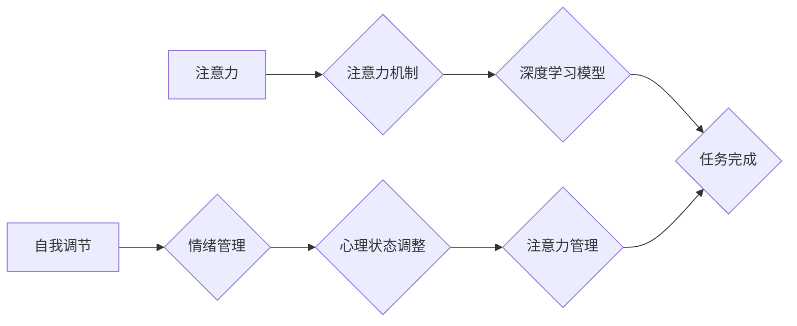

                 

## 1. 背景介绍

在当今信息爆炸的时代，我们每天都被来自各个方向的海量信息所包围。电子邮件、社交媒体、新闻推送、即时通讯软件，无时无刻不在争夺着我们的注意力。这种持续不断的干扰使得专注力成为一种稀缺资源，而专注力则是个人和职业成功的关键要素。

对于程序员而言，专注力尤为重要。编写高质量的代码需要长时间的沉浸式思考和专注，而任何形式的干扰都可能导致错误和降低效率。此外，在快速迭代的软件开发环境中，程序员需要能够快速切换任务，并保持对多个项目和技术的关注。

然而，现代社会对我们的注意力提出了前所未有的挑战。我们习惯于碎片化信息，难以长时间集中精力于单一任务。这不仅影响了我们的工作效率，也损害了我们的身心健康。

## 2. 核心概念与联系

### 2.1 注意力机制

注意力机制是近年来深度学习领域取得重要突破的核心概念之一。它借鉴了人类大脑对重要信息进行筛选和聚焦的机制，赋予了模型选择性地关注输入数据中的关键部分的能力。

注意力机制的应用广泛，包括机器翻译、文本摘要、图像识别等领域。在自然语言处理领域，注意力机制可以帮助模型理解句子中的语义关系，从而提高翻译和摘要的准确性。

### 2.2 自我调节

自我调节是指个体能够根据目标和环境的变化，调整自己的行为、情绪和认知状态的能力。它是一个复杂的心理过程，涉及到自我意识、自我控制、情绪管理等多个方面。

对于程序员而言，自我调节能力至关重要。他们需要能够在面对压力、挑战和挫折时保持冷静和专注，并调整自己的工作方式以提高效率。

### 2.3 注意力管理与自我调节的联系

注意力管理和自我调节是相互关联的两个重要概念。注意力管理是指通过各种方法和技巧，提高对重要信息的关注度，减少对干扰的敏感度。而自我调节则是通过调整自己的心理状态和行为模式，更好地管理注意力，并提高专注力。

**Mermaid 流程图**



## 3. 核心算法原理 & 具体操作步骤

### 3.1 算法原理概述

注意力机制的核心思想是通过赋予模型对输入数据不同部分的权重，从而选择性地关注重要信息。

常见的注意力机制类型包括：

* **自注意力机制 (Self-Attention):**  用于处理序列数据，例如文本，可以捕捉序列中不同元素之间的关系。
* **交叉注意力机制 (Cross-Attention):** 用于处理多个序列数据，例如机器翻译，可以捕捉不同序列之间的关系。

### 3.2 算法步骤详解

**自注意力机制的具体步骤如下：**

1. **计算查询 (Query)、键 (Key) 和值 (Value) 向量:** 将输入序列中的每个元素映射到三个不同的向量空间，分别表示查询、键和值。
2. **计算注意力分数:**  通过计算查询向量与每个键向量的相似度，得到每个元素的注意力分数。
3. **归一化注意力分数:** 将注意力分数进行归一化处理，使其总和为1。
4. **计算加权和:**  将每个元素的值向量与对应的注意力分数相乘，并求和，得到最终的输出向量。

### 3.3 算法优缺点

**优点:**

* 可以捕捉序列数据中的长距离依赖关系。
* 可以有效地提高模型的表达能力。

**缺点:**

* 计算复杂度较高。
* 训练数据量较大。

### 3.4 算法应用领域

注意力机制在自然语言处理、计算机视觉、语音识别等领域都有广泛的应用。

## 4. 数学模型和公式 & 详细讲解 & 举例说明

### 4.1 数学模型构建

**自注意力机制的数学模型可以表示为：**

$$
\text{Attention}(Q, K, V) = \text{softmax}\left(\frac{Q K^T}{\sqrt{d_k}}\right) V
$$

其中：

* $Q$：查询矩阵
* $K$：键矩阵
* $V$：值矩阵
* $d_k$：键向量的维度
* $\text{softmax}$：softmax函数，用于归一化注意力分数

### 4.2 公式推导过程

**softmax函数的定义为：**

$$
\text{softmax}(x_i) = \frac{e^{x_i}}{\sum_{j=1}^{n} e^{x_j}}
$$

其中：

* $x_i$：输入向量中的第i个元素
* $n$：输入向量的维度

**将softmax函数应用于注意力分数，可以得到每个元素的归一化权重。**

### 4.3 案例分析与讲解

**举例说明：**

假设我们有一个句子 "The cat sat on the mat"，将其转换为词向量表示，得到查询矩阵 $Q$、键矩阵 $K$ 和值矩阵 $V$。

通过计算 $QK^T$，得到注意力分数矩阵。然后，对注意力分数矩阵进行 softmax 处理，得到每个词的归一化权重。

最终，将值矩阵 $V$ 与归一化权重相乘，得到最终的输出向量，表示整个句子的语义信息。

## 5. 项目实践：代码实例和详细解释说明

### 5.1 开发环境搭建

* Python 3.6+
* TensorFlow 或 PyTorch 深度学习框架
* Jupyter Notebook 或 VS Code 代码编辑器

### 5.2 源代码详细实现

```python
import tensorflow as tf

# 定义自注意力机制
def self_attention(query, key, value, mask=None):
    # 计算注意力分数
    attention_scores = tf.matmul(query, key, transpose_b=True) / tf.math.sqrt(tf.shape(key)[-1])
    # 应用掩码
    if mask is not None:
        attention_scores += (mask * -1e9)
    # 计算归一化注意力分数
    attention_weights = tf.nn.softmax(attention_scores, axis=-1)
    # 计算加权和
    output = tf.matmul(attention_weights, value)
    return output

# 示例代码
query = tf.random.normal([32, 10, 64])
key = tf.random.normal([32, 10, 64])
value = tf.random.normal([32, 10, 64])

output = self_attention(query, key, value)
print(output.shape)
```

### 5.3 代码解读与分析

* `self_attention` 函数实现了一个基本的自注意力机制。
* `attention_scores` 计算了查询向量与每个键向量的相似度。
* `mask` 用于屏蔽不需要关注的信息，例如在机器翻译中，屏蔽源语言中已经翻译过的词。
* `attention_weights` 是归一化后的注意力分数，表示每个词对输出的贡献度。
* `output` 是最终的输出向量，包含了所有词的加权信息。

### 5.4 运行结果展示

运行上述代码，输出的 `output` 形状为 `(32, 10, 64)`，表示每个样本的每个词都得到了一个64维的向量表示，包含了该词在句子中的语义信息。

## 6. 实际应用场景

### 6.1 程序员注意力管理

* **番茄工作法:** 将工作时间划分为25分钟的间隔，中间休息5分钟，可以帮助程序员集中注意力，提高工作效率。
* **冥想练习:** 每天进行几分钟的冥想练习，可以帮助程序员放松身心，提高专注力。
* **环境控制:** 创建一个安静、舒适的工作环境，减少外界干扰，有利于程序员集中注意力。

### 6.2 软件开发中的注意力机制

* **代码生成:** 利用注意力机制，训练模型生成高质量的代码，提高开发效率。
* **代码理解:** 利用注意力机制，帮助程序员理解复杂的代码，提高代码阅读和维护效率。
* **代码缺陷检测:** 利用注意力机制，识别代码中的潜在缺陷，提高代码质量。

### 6.3 未来应用展望

* **个性化注意力训练:** 根据个人的注意力特点，定制化的注意力训练方案。
* **沉浸式开发环境:** 利用虚拟现实技术，构建沉浸式的开发环境，减少外界干扰，提高专注力。
* **人工智能辅助开发:** 利用人工智能技术，辅助程序员进行代码编写、测试和维护，提高开发效率。

## 7. 工具和资源推荐

### 7.1 学习资源推荐

* **书籍:**
    * 《深度学习》
    * 《Attention Is All You Need》
* **在线课程:**
    * Coursera: 深度学习
    * Udacity: 自然语言处理
* **博客:**
    * Jay Alammar's Blog: https://jalammar.github.io/
    * Distill.pub: https://distill.pub/

### 7.2 开发工具推荐

* **TensorFlow:** https://www.tensorflow.org/
* **PyTorch:** https://pytorch.org/
* **Jupyter Notebook:** https://jupyter.org/

### 7.3 相关论文推荐

* 《Attention Is All You Need》
* 《BERT: Pre-training of Deep Bidirectional Transformers for Language Understanding》
* 《Transformer-XL: Attentive Language Models Beyond a Fixed-Length Context》

## 8. 总结：未来发展趋势与挑战

### 8.1 研究成果总结

注意力机制在深度学习领域取得了显著的成果，并在自然语言处理、计算机视觉等领域得到了广泛应用。

### 8.2 未来发展趋势

* **更强大的注意力机制:** 研究更有效的注意力机制，提高模型的表达能力和泛化能力。
* **注意力机制的应用扩展:** 将注意力机制应用到更多领域，例如时间序列分析、推荐系统等。
* **注意力机制的解释性:** 研究注意力机制的工作原理，提高模型的可解释性。

### 8.3 面临的挑战

* **计算复杂度:** 传统的注意力机制计算复杂度较高，难以应用于大规模数据。
* **训练数据量:** 训练有效的注意力机制模型需要大量的训练数据。
* **可解释性:** 目前注意力机制的解释性较差，难以理解模型是如何做出决策的。

### 8.4 研究展望

未来，注意力机制的研究将继续深入，并取得更多突破。相信注意力机制将在人工智能领域发挥越来越重要的作用，推动人工智能技术的发展。

## 9. 附录：常见问题与解答

* **Q: 注意力机制与RNN有什么区别？**

* **A:** RNN只能处理序列数据中的局部信息，而注意力机制可以捕捉序列数据中的长距离依赖关系。

* **Q: 如何选择合适的注意力机制？**

* **A:** 选择合适的注意力机制取决于具体的应用场景和数据特点。

* **Q: 如何评估注意力机制的性能？**

* **A:** 可以使用BLEU、ROUGE等指标评估注意力机制在机器翻译、文本摘要等任务中的性能。


作者：禅与计算机程序设计艺术 / Zen and the Art of Computer Programming 
<end_of_turn>

