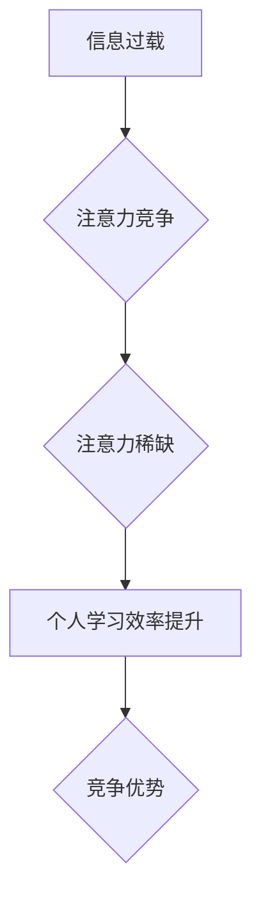

                 

## 1. 背景介绍

在当今信息爆炸的时代，我们每天都被海量的信息所包围。从社交媒体的推送，到新闻网站的滚动条，再到邮件的轰炸，信息无处不在，却并非都值得我们关注。如何有效地筛选信息，集中精力学习，提升个人学习效率，成为了一个亟待解决的问题。

注意力经济的概念应运而生。它指出，在信息过载的时代，人们的注意力成为了稀缺资源，而能够有效地获取和利用注意力的人，将拥有更大的竞争优势。

个人学习效率的提升与注意力经济息息相关。当我们能够有效地集中注意力，过滤掉干扰，专注于学习内容时，学习效率自然会得到提升。

## 2. 核心概念与联系

### 2.1 注意力经济

注意力经济是指在信息时代，人们的注意力成为一种稀缺资源，而能够有效地获取和利用注意力的人，将拥有更大的竞争优势。

**核心原理：**

* **信息过载：** 互联网时代，信息量呈指数级增长，人们面临着信息过载的困境。
* **注意力有限：** 人类的注意力是有限的，无法同时处理大量信息。
* **注意力竞争：** 各种信息平台和应用都在争夺用户的注意力。
* **注意力价值：** 拥有和控制注意力的人，能够获得更大的商业价值和社会影响力。

**架构图：**



### 2.2 个人学习效率

个人学习效率是指在单位时间内完成学习任务的能力。

**核心要素：**

* **注意力集中：** 能够有效地过滤掉干扰，专注于学习内容。
* **记忆力强：** 能够有效地记住学习内容。
* **理解能力强：** 能够理解学习内容的深层含义。
* **学习方法科学：** 能够选择适合自己的学习方法。

**联系：**

注意力经济与个人学习效率密切相关。在信息过载的时代，能够有效地集中注意力，过滤掉干扰，专注于学习内容，才能提高个人学习效率。

## 3. 核心算法原理 & 具体操作步骤

### 3.1 算法原理概述

注意力机制是一种模仿人类注意力机制的算法，它能够帮助模型专注于输入数据中最重要的部分，从而提高学习效率。

**核心思想：**

* **赋予不同输入元素不同的权重：** 注意力机制会为每个输入元素分配一个权重，权重高的元素会被模型更加关注。
* **动态调整权重：** 注意力权重不是固定的，而是会根据模型的学习过程动态调整。

### 3.2 算法步骤详解

1. **计算注意力权重：** 使用一个注意力函数计算每个输入元素的注意力权重。
2. **加权求和：** 将注意力权重与输入元素相乘，然后求和，得到一个加权后的输出。
3. **更新模型参数：** 使用加权后的输出更新模型的参数。

### 3.3 算法优缺点

**优点：**

* **提高学习效率：** 注意力机制能够帮助模型专注于输入数据中最重要的部分，从而提高学习效率。
* **提升模型性能：** 在许多任务中，注意力机制能够显著提升模型的性能。
* **解释性强：** 注意力权重可以帮助我们理解模型是如何学习的。

**缺点：**

* **计算复杂度高：** 计算注意力权重需要大量的计算资源。
* **参数量大：** 注意力机制通常需要大量的参数，这可能会导致模型训练困难。

### 3.4 算法应用领域

注意力机制在许多领域都有广泛的应用，例如：

* **自然语言处理：** 机器翻译、文本摘要、问答系统等。
* **计算机视觉：** 图像识别、目标检测、图像分割等。
* **语音识别：** 语音转文本、语音合成等。

## 4. 数学模型和公式 & 详细讲解 & 举例说明

### 4.1 数学模型构建

注意力机制的数学模型通常基于一个注意力函数，该函数将输入序列映射到每个元素的注意力权重。

**注意力函数：**

$$
\text{Attention}(Q, K, V) = \text{softmax}\left(\frac{Q K^T}{\sqrt{d_k}}\right) V
$$

其中：

* $Q$：查询矩阵
* $K$：键矩阵
* $V$：值矩阵
* $d_k$：键向量的维度
* $\text{softmax}$：softmax函数

### 4.2 公式推导过程

注意力函数的推导过程可以分为以下几个步骤：

1. 计算查询矩阵 $Q$ 和键矩阵 $K$ 的点积。
2. 将点积结果除以 $\sqrt{d_k}$，以规范化权重。
3. 应用 softmax 函数将点积结果转换为概率分布。
4. 将概率分布与值矩阵 $V$ 相乘，得到加权后的输出。

### 4.3 案例分析与讲解

**举例：**

假设我们有一个句子 "我爱学习编程"，我们想要计算每个单词的注意力权重。

* $Q$：查询矩阵
* $K$：键矩阵
* $V$：值矩阵

我们可以使用注意力函数计算每个单词的注意力权重，然后根据权重将句子中的单词进行加权求和，得到一个表示整个句子的向量。

## 5. 项目实践：代码实例和详细解释说明

### 5.1 开发环境搭建

* Python 3.6+
* TensorFlow 或 PyTorch

### 5.2 源代码详细实现

```python
import tensorflow as tf

# 定义注意力机制
def attention_layer(inputs, key_dim):
    # 计算注意力权重
    query = tf.reshape(inputs, [-1, 1, key_dim])
    key = tf.reshape(inputs, [-1, 1, key_dim])
    value = tf.reshape(inputs, [-1, 1, key_dim])
    attention_weights = tf.matmul(query, key, transpose_b=True) / tf.math.sqrt(tf.cast(key_dim, tf.float32))
    attention_weights = tf.nn.softmax(attention_weights, axis=-1)
    # 加权求和
    output = tf.matmul(attention_weights, value)
    return output

# 示例使用
inputs = tf.random.normal([10, 512])
key_dim = 64
output = attention_layer(inputs, key_dim)
print(output.shape)
```

### 5.3 代码解读与分析

* `attention_layer` 函数定义了注意力机制的实现。
* `query`, `key`, `value` 分别表示查询矩阵、键矩阵和值矩阵。
* `tf.matmul` 函数计算矩阵乘法。
* `tf.math.sqrt` 函数计算平方根。
* `tf.nn.softmax` 函数将矩阵元素转换为概率分布。
* `tf.reshape` 函数改变矩阵的形状。

### 5.4 运行结果展示

运行代码后，输出的 `output` 形状为 `(10, 1, 64)`，表示注意力机制将输入序列映射到每个元素的注意力权重。

## 6. 实际应用场景

### 6.1 学习场景

* **个性化学习：** 根据用户的学习习惯和知识点掌握情况，推荐个性化的学习内容和学习方法。
* **主动学习：** 利用注意力机制识别学习过程中需要重点关注的知识点，引导用户主动学习。
* **知识图谱构建：** 利用注意力机制分析文本数据，构建知识图谱，帮助用户更好地理解和记忆知识。

### 6.2 工作场景

* **信息筛选：** 在信息过载的时代，利用注意力机制筛选重要的信息，提高工作效率。
* **任务优先级排序：** 根据任务的重要性，利用注意力机制排序任务，提高工作效率。
* **协作办公：** 利用注意力机制识别团队成员的关键贡献，提高协作效率。

### 6.4 未来应用展望

注意力机制在未来将有更广泛的应用，例如：

* **人工智能辅助决策：** 利用注意力机制分析数据，帮助决策者做出更明智的决策。
* **医疗诊断：** 利用注意力机制分析医学影像，帮助医生更快、更准确地诊断疾病。
* **自动驾驶：** 利用注意力机制分析道路环境，帮助自动驾驶系统做出更安全、更可靠的决策。

## 7. 工具和资源推荐

### 7.1 学习资源推荐

* **书籍：**
    * 《深度学习》
    * 《Attention Is All You Need》
* **在线课程：**
    * Coursera: Deep Learning Specialization
    * Udacity: Deep Learning Nanodegree
* **博客和网站：**
    * TensorFlow Blog
    * PyTorch Blog
    * Towards Data Science

### 7.2 开发工具推荐

* **TensorFlow:** 开源机器学习框架
* **PyTorch:** 开源机器学习框架
* **Keras:** 高级深度学习API

### 7.3 相关论文推荐

* **Attention Is All You Need:** https://arxiv.org/abs/1706.03762
* **BERT: Pre-training of Deep Bidirectional Transformers for Language Understanding:** https://arxiv.org/abs/1810.04805

## 8. 总结：未来发展趋势与挑战

### 8.1 研究成果总结

注意力机制在近年来取得了显著的进展，在自然语言处理、计算机视觉等领域取得了突破性的成果。

### 8.2 未来发展趋势

* **更强大的注意力机制：** 研究更强大的注意力机制，例如长短期记忆注意力机制、自注意力机制等。
* **注意力机制的应用扩展：** 将注意力机制应用到更多领域，例如医疗诊断、自动驾驶等。
* **注意力机制的解释性增强：** 研究如何更好地解释注意力机制的工作原理，提高模型的可解释性。

### 8.3 面临的挑战

* **计算复杂度高：** 训练大型注意力模型需要大量的计算资源。
* **参数量大：** 注意力机制通常需要大量的参数，这可能会导致模型训练困难。
* **数据依赖性强：** 注意力机制的性能依赖于训练数据的质量。

### 8.4 研究展望

未来，注意力机制的研究将继续深入，并取得更多突破性进展。相信注意力机制将在人工智能领域发挥越来越重要的作用，帮助我们更好地理解和利用信息，提升个人学习效率和工作效率。

## 9. 附录：常见问题与解答

**Q1：注意力机制是如何工作的？**

A1：注意力机制通过计算每个输入元素的注意力权重，将模型的注意力集中在最重要的部分。

**Q2：注意力机制有哪些优点？**

A2：注意力机制能够提高学习效率、提升模型性能、解释性强。

**Q3：注意力机制有哪些缺点？**

A3：注意力机制的计算复杂度高、参数量大、数据依赖性强。

**Q4：注意力机制有哪些应用场景？**

A4：注意力机制在学习场景、工作场景、医疗诊断、自动驾驶等领域都有广泛的应用。


作者：禅与计算机程序设计艺术 / Zen and the Art of Computer Programming 
<end_of_turn>

