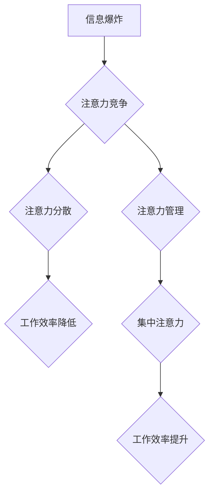

                 

## 1. 背景介绍

在当今信息爆炸的时代，我们每天都被来自各种渠道的海量信息所包围。电子邮件、社交媒体、新闻推送、即时通讯软件等等，无时无刻不在争夺着我们的注意力。然而，人类的注意力资源是有限的，我们无法同时处理所有信息。如何有效地管理注意力，提高工作效率，已成为个人和组织都面临的重大挑战。

注意力经济的概念源于经济学，它认为注意力是一种稀缺的资源，就像时间和金钱一样，需要被珍惜和管理。在数字时代，注意力成为了最宝贵的资产，因为它决定了我们获取信息、做出决策、创造价值的能力。

个人工作效率的提升离不开注意力力的集中和控制。当我们能够专注于当下任务，排除干扰，才能更好地投入工作，提高完成任务的速度和质量。

## 2. 核心概念与联系

### 2.1 注意力经济

注意力经济的核心概念是：注意力是稀缺资源，而获取和控制注意力是重要的经济活动。

在注意力经济中，信息生产者和平台为了吸引用户的注意力，会采用各种手段，例如：

* **个性化推荐:** 根据用户的兴趣和行为，推荐更符合其偏好的内容。
* **推送通知:** 定期发送提醒，提醒用户关注特定内容或活动。
* **社交互动:** 利用社交功能，鼓励用户与他人互动，分享内容。
* **内容碎片化:** 将内容分割成更小的片段，更容易被用户快速浏览和吸收。

这些手段虽然能够有效地吸引用户注意力，但也可能导致用户注意力分散，难以集中精力完成重要任务。

### 2.2 个人工作效率

个人工作效率是指在单位时间内完成工作量的大小。它受多种因素影响，包括：

* **注意力:** 集中注意力是完成任务的关键。
* **时间管理:** 合理安排时间，避免拖延和浪费时间。
* **技能水平:** 掌握相关的技能和知识，提高工作效率。
* **工作环境:** 舒适、安静的工作环境有利于提高工作效率。

注意力是个人工作效率的重要组成部分。当我们能够集中注意力，排除干扰，才能更好地投入工作，提高完成任务的速度和质量。

### 2.3  注意力经济与个人工作效率的关系

注意力经济和个人工作效率之间存在着密切的联系。注意力经济的本质是竞争和控制注意力资源，而个人工作效率则需要集中注意力才能实现。

在注意力经济的背景下，个人需要学会管理自己的注意力，避免被信息洪流淹没，才能提高工作效率。

**Mermaid 流程图**



## 3. 核心算法原理 & 具体操作步骤

### 3.1 算法原理概述

注意力机制是一种模仿人类注意力机制的算法，它能够帮助模型专注于输入数据中最重要的部分，从而提高模型的性能。

注意力机制的核心思想是：给每个输入元素赋予一个权重，权重代表该元素对模型输出的贡献程度。模型在处理输入数据时，会根据这些权重，对不同元素给予不同的关注程度。

### 3.2 算法步骤详解

1. **计算注意力权重:** 对于每个输入元素，计算其与输出的关联程度，得到一个注意力权重。
2. **加权求和:** 将注意力权重与输入元素相乘，然后对所有元素进行加权求和，得到最终的输出。

### 3.3 算法优缺点

**优点:**

* **提高模型性能:** 注意力机制能够帮助模型专注于输入数据中最重要的部分，从而提高模型的准确率、召回率等性能指标。
* **解释性强:** 注意力权重可以直观地反映模型对输入数据的关注程度，有助于理解模型的决策过程。

**缺点:**

* **计算复杂度高:** 计算注意力权重需要进行大量的矩阵运算，计算复杂度较高。
* **参数量大:** 注意力机制需要学习大量的参数，训练时间较长。

### 3.4 算法应用领域

注意力机制在自然语言处理、计算机视觉、机器翻译等领域都有广泛的应用。

* **机器翻译:** 注意力机制可以帮助模型关注翻译过程中重要的词语，提高翻译质量。
* **图像识别:** 注意力机制可以帮助模型关注图像中重要的区域，提高识别准确率。
* **文本摘要:** 注意力机制可以帮助模型识别文本中最重要的句子，生成高质量的摘要。

## 4. 数学模型和公式 & 详细讲解 & 举例说明

### 4.1 数学模型构建

注意力机制的数学模型可以表示为：

$$
\text{Attention}(Q, K, V) = \text{softmax}\left(\frac{Q K^T}{\sqrt{d_k}}\right) V
$$

其中：

* $Q$：查询矩阵
* $K$：键矩阵
* $V$：值矩阵
* $d_k$：键向量的维度
* $\text{softmax}$：softmax函数

### 4.2 公式推导过程

注意力机制的核心是计算每个输入元素与输出的关联程度，即注意力权重。

公式中，$QK^T$ 计算了查询矩阵和键矩阵的点积，表示每个查询向量与每个键向量的相似度。

然后，将点积结果除以 $\sqrt{d_k}$，可以归一化相似度，防止过大的梯度。

最后，使用 softmax 函数将相似度转换为注意力权重，使得权重之和为 1。

### 4.3 案例分析与讲解

假设我们有一个句子：

"The cat sat on the mat."

我们想用注意力机制来理解这句话的含义。

我们可以将句子中的每个词语作为输入元素，并将其转换为向量表示。

然后，我们可以计算每个词语与输出向量的关联程度，得到每个词语的注意力权重。

例如，如果输出向量表示 "猫"，那么 "cat" 的注意力权重会比较高，而其他词语的注意力权重会比较低。

通过分析注意力权重，我们可以了解模型对这句话的理解，例如，模型认为 "cat" 是这句话中最关键的词语。

## 5. 项目实践：代码实例和详细解释说明

### 5.1 开发环境搭建

* Python 3.6+
* TensorFlow 2.0+
* PyTorch 1.0+

### 5.2 源代码详细实现

```python
import tensorflow as tf

# 定义输入数据
input_data = tf.random.normal(shape=(10, 50))

# 定义查询矩阵、键矩阵和值矩阵
query = tf.keras.layers.Dense(units=50, activation='relu')(input_data)
key = tf.keras.layers.Dense(units=50, activation='relu')(input_data)
value = tf.keras.layers.Dense(units=50, activation='relu')(input_data)

# 计算注意力权重
attention_weights = tf.keras.layers.Lambda(lambda x: tf.nn.softmax(tf.matmul(x[0], x[1], transpose_b=True) / tf.math.sqrt(50)))([query, key])

# 加权求和
output = tf.matmul(attention_weights, value)

# 打印输出
print(output)
```

### 5.3 代码解读与分析

* 我们首先定义了输入数据，并将其转换为向量表示。
* 然后，我们定义了查询矩阵、键矩阵和值矩阵，这些矩阵分别表示输入数据的不同方面。
* 计算注意力权重时，我们使用 softmax 函数将点积结果转换为概率分布，使得权重之和为 1。
* 最后，我们使用加权求和的方式，将注意力权重与值矩阵相乘，得到最终的输出。

### 5.4 运行结果展示

运行上述代码，会输出一个形状为 (10, 50) 的张量，表示每个输入元素的注意力加权输出。

## 6. 实际应用场景

### 6.1 工作效率提升

注意力机制可以应用于各种工作场景，例如：

* **邮件管理:** 利用注意力机制，可以优先处理重要的邮件，过滤掉无关信息，提高邮件处理效率。
* **项目管理:** 注意力机制可以帮助项目经理集中精力于关键任务，避免被琐碎事项分散注意力。
* **学习效率:** 利用注意力机制，可以帮助学生集中注意力于学习内容，提高学习效率。

### 6.2 其他应用场景

* **个性化推荐:** 在电商平台、社交媒体等平台，注意力机制可以用于个性化推荐，推荐用户更感兴趣的内容。
* **医疗诊断:** 注意力机制可以帮助医生分析病历，识别重要的症状，提高诊断准确率。
* **金融风险控制:** 注意力机制可以帮助金融机构识别潜在的风险，提高风险控制能力。

### 6.4 未来应用展望

随着注意力机制的不断发展，其应用场景将会更加广泛。

未来，注意力机制可能会被应用于：

* **自动驾驶:** 注意力机制可以帮助自动驾驶系统集中注意力于道路上的关键信息，提高驾驶安全。
* **机器人交互:** 注意力机制可以帮助机器人更好地理解人类的意图，提高人机交互的自然性和流畅性。
* **虚拟现实:** 注意力机制可以帮助虚拟现实系统模拟人类的注意力机制，提高用户沉浸感。

## 7. 工具和资源推荐

### 7.1 学习资源推荐

* **书籍:**
    * "深度学习" by Ian Goodfellow, Yoshua Bengio, and Aaron Courville
    * "Attention Is All You Need" by Vaswani et al.
* **在线课程:**
    * Coursera: "Deep Learning Specialization" by Andrew Ng
    * Udacity: "Deep Learning Nanodegree"
* **博客:**
    * Jay Alammar's Blog: https://jalammar.github.io/
    * Distill.pub: https://distill.pub/

### 7.2 开发工具推荐

* **TensorFlow:** https://www.tensorflow.org/
* **PyTorch:** https://pytorch.org/
* **Keras:** https://keras.io/

### 7.3 相关论文推荐

* "Attention Is All You Need" by Vaswani et al. (2017)
* "BERT: Pre-training of Deep Bidirectional Transformers for Language Understanding" by Devlin et al. (2018)
* "Transformer-XL: Attentive Language Models Beyond a Fixed-Length Context" by Dai et al. (2019)

## 8. 总结：未来发展趋势与挑战

### 8.1 研究成果总结

注意力机制在近年来取得了显著的进展，并在自然语言处理、计算机视觉等领域取得了突破性成果。

注意力机制能够帮助模型更好地理解输入数据，提高模型的性能。

### 8.2 未来发展趋势

未来，注意力机制的研究将朝着以下几个方向发展：

* **更有效的注意力机制:** 研究更有效的注意力机制，提高模型的效率和性能。
* **跨模态注意力机制:** 研究跨模态注意力机制，能够处理不同模态的数据，例如文本、图像、音频等。
* **可解释性更强的注意力机制:** 研究可解释性更强的注意力机制，能够更好地解释模型的决策过程。

### 8.3 面临的挑战

注意力机制也面临着一些挑战：

* **计算复杂度高:** 计算注意力权重需要进行大量的矩阵运算，计算复杂度较高。
* **参数量大:** 注意力机制需要学习大量的参数，训练时间较长。
* **可解释性差:** 目前，注意力机制的决策过程仍然难以解释。

### 8.4 研究展望

尽管面临着挑战，但注意力机制仍然是一个非常有前景的研究方向。

未来，随着研究的深入，注意力机制将会得到更广泛的应用，并为人工智能的发展做出更大的贡献。

## 9. 附录：常见问题与解答

### 9.1 什么是注意力机制？

注意力机制是一种模仿人类注意力机制的算法，它能够帮助模型专注于输入数据中最重要的部分，从而提高模型的性能。

### 9.2 注意力机制的应用场景有哪些？

注意力机制在自然语言处理、计算机视觉、机器翻译等领域都有广泛的应用。

### 9.3 注意力机制的优缺点是什么？

注意力机制的优点是能够提高模型性能和解释性。

缺点是计算复杂度高和参数量大。

### 9.4 如何实现注意力机制？

注意力机制的实现需要使用深度学习框架，例如 TensorFlow 或 PyTorch。

### 9.5 注意力机制的未来发展趋势是什么？

未来，注意力机制的研究将朝着更有效的、跨模态的和可解释性的方向发展。


作者：禅与计算机程序设计艺术 / Zen and the Art of Computer Programming 
<end_of_turn>

