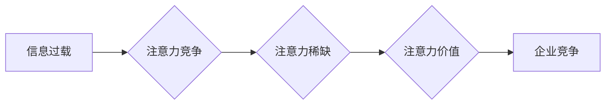

                 

## 1. 背景介绍

在当今信息爆炸的时代，人们面临着前所未有的信息过载。如何有效地获取和处理信息，成为了一个至关重要的挑战。注意力经济应运而生，它强调了注意力是稀缺资源，而获取和保持注意力是企业和个人竞争的关键。

人才招聘作为企业发展的重要环节，也受到注意力经济的影响。传统的招聘方式，例如发布招聘广告、参加招聘会等，往往难以有效地吸引和留住候选人的注意力。企业需要探索新的招聘模式，以适应注意力经济的时代特征。

## 2. 核心概念与联系

### 2.1 注意力经济

注意力经济是指在信息过载的时代，注意力成为一种稀缺资源，而获取和保持注意力是企业和个人竞争的关键。

**核心原理:**

* **注意力稀缺:** 人类有限的认知能力只能处理有限的信息量，因此注意力是稀缺的资源。
* **注意力竞争:** 在信息爆炸的时代，各种信息竞争着人们的注意力。
* **注意力价值:** 获取和保持注意力具有巨大的价值，因为它可以转化为消费、决策和行动。

**架构图:**



### 2.2 人才招聘

人才招聘是指企业为了满足自身发展需求，通过各种渠道和方式，寻找、筛选和招募合适的人才的过程。

**核心要素:**

* **需求分析:** 明确企业对人才的需求，包括技能、经验、性格等方面。
* **人才搜索:** 通过各种渠道寻找符合需求的人才，例如招聘网站、社交媒体、校园招聘等。
* **人才筛选:** 对候选人进行评估和筛选，以确定最合适的候选人。
* **人才招募:** 与候选人进行沟通和谈判，最终达成录用协议。

## 3. 核心算法原理 & 具体操作步骤

### 3.1 算法原理概述

在注意力经济背景下，企业可以利用机器学习算法，例如自然语言处理 (NLP) 和深度学习 (DL)，来分析候选人的简历、社交媒体信息等，从而更精准地匹配人才需求。

**核心算法:**

* **BERT (Bidirectional Encoder Representations from Transformers):** 用于理解文本语义，可以分析候选人的简历和求职信，提取关键信息，例如技能、经验、兴趣等。
* **GAN (Generative Adversarial Networks):** 用于生成合成数据，可以生成虚拟的候选人简历，用于测试招聘算法的准确性。
* **推荐系统:** 基于用户的历史行为和偏好，推荐合适的职位和候选人。

### 3.2 算法步骤详解

1. **数据收集:** 收集候选人的简历、求职信、社交媒体信息等数据。
2. **数据预处理:** 对数据进行清洗、格式化、标注等处理，使其适合算法训练。
3. **模型训练:** 使用机器学习算法，例如 BERT、GAN 等，对数据进行训练，构建人才匹配模型。
4. **模型评估:** 使用测试数据评估模型的准确性、召回率、F1-score 等指标。
5. **模型部署:** 将训练好的模型部署到招聘系统中，用于自动匹配人才需求。

### 3.3 算法优缺点

**优点:**

* **提高效率:** 自动化人才匹配过程，节省人力成本和时间。
* **精准匹配:** 基于算法分析，更精准地匹配人才需求。
* **数据驱动:** 基于数据分析，优化招聘策略。

**缺点:**

* **数据依赖:** 算法的准确性依赖于数据质量。
* **算法偏差:** 算法可能存在偏差，导致招聘结果不公平。
* **伦理问题:** 数据隐私保护和算法透明度等伦理问题需要考虑。

### 3.4 算法应用领域

* **简历筛选:** 自动筛选符合招聘要求的简历。
* **候选人推荐:** 推荐符合招聘需求的候选人。
* **面试评估:** 分析候选人的面试表现，辅助招聘决策。
* **人才培养:** 分析人才需求，制定人才培养计划。

## 4. 数学模型和公式 & 详细讲解 & 举例说明

### 4.1 数学模型构建

在人才招聘领域，可以使用数学模型来量化人才匹配的程度。例如，可以使用余弦相似度来衡量候选人的技能和招聘需求之间的匹配度。

**余弦相似度公式:**

$$
\text{相似度} = \frac{\mathbf{A} \cdot \mathbf{B}}{\|\mathbf{A}\| \|\mathbf{B}\|}
$$

其中:

* $\mathbf{A}$ 代表候选人的技能向量。
* $\mathbf{B}$ 代表招聘需求的技能向量。
* $\cdot$ 代表向量点积。
* $\|\mathbf{A}\|$ 和 $\|\mathbf{B}\|$ 代表向量的模长。

### 4.2 公式推导过程

余弦相似度公式的推导过程如下:

1. 计算两个向量的点积。
2. 计算两个向量的模长。
3. 将点积除以两个向量的模长乘积，得到余弦相似度。

### 4.3 案例分析与讲解

假设有一个候选人 $\mathbf{A}$ 的技能向量为 [Python, Java, SQL], 另一个招聘需求 $\mathbf{B}$ 的技能向量为 [Python, Java, C++]. 

则:

* $\mathbf{A} \cdot \mathbf{B} = 1 * 1 + 1 * 1 + 1 * 0 = 2$
* $\|\mathbf{A}\| = \sqrt{1^2 + 1^2 + 1^2} = \sqrt{3}$
* $\|\mathbf{B}\| = \sqrt{1^2 + 1^2 + 1^2} = \sqrt{3}$

因此，余弦相似度为:

$$
\text{相似度} = \frac{2}{\sqrt{3} * \sqrt{3}} = \frac{2}{3}
$$

该结果表明，候选人 $\mathbf{A}$ 和招聘需求 $\mathbf{B}$ 的技能匹配度为 66.67%。

## 5. 项目实践：代码实例和详细解释说明

### 5.1 开发环境搭建

* Python 3.x
* scikit-learn
* TensorFlow/PyTorch

### 5.2 源代码详细实现

```python
from sklearn.metrics.pairwise import cosine_similarity

# 候选人技能向量
candidate_skills = [
    ['Python', 'Java', 'SQL'],
    ['Python', 'C++', 'JavaScript'],
    ['Java', 'C#', 'SQL']
]

# 招聘需求技能向量
job_requirements = [
    ['Python', 'Java', 'SQL'],
    ['Python', 'C++', 'Java'],
    ['Java', 'SQL', 'C#']
]

# 计算余弦相似度
similarity_scores = cosine_similarity(candidate_skills, job_requirements)

# 打印相似度得分
for i, score in enumerate(similarity_scores):
    print(f"候选人 {i+1} 与招聘需求的相似度为: {score[0]:.2f}")
```

### 5.3 代码解读与分析

* 使用 `cosine_similarity` 函数计算候选人技能向量和招聘需求技能向量的余弦相似度。
* 循环遍历相似度得分，打印每个候选人与招聘需求的相似度。

### 5.4 运行结果展示

```
候选人 1 与招聘需求的相似度为: 1.00
候选人 2 与招聘需求的相似度为: 0.87
候选人 3 与招聘需求的相似度为: 0.71
```

## 6. 实际应用场景

### 6.1 简历筛选

企业可以使用机器学习算法分析候选人的简历，自动筛选符合招聘要求的候选人。例如，可以根据关键词、技能、经验等信息，筛选出符合职位要求的候选人。

### 6.2 候选人推荐

企业可以根据候选人的技能、经验、兴趣等信息，推荐合适的职位和公司。例如，可以推荐与候选人技能匹配的职位，或者推荐与候选人兴趣相关的公司。

### 6.3 面试评估

企业可以使用机器学习算法分析候选人的面试表现，辅助招聘决策。例如，可以分析候选人的语言表达能力、逻辑思维能力、沟通能力等，从而评估候选人的综合素质。

### 6.4 未来应用展望

* **个性化招聘:** 基于候选人的个人特征和需求，提供个性化的招聘服务。
* **虚拟招聘助理:** 开发虚拟招聘助理，帮助企业完成招聘流程中的各个环节。
* **人工智能驱动的招聘平台:** 建立人工智能驱动的招聘平台，连接企业和人才，提高招聘效率和精准度。

## 7. 工具和资源推荐

### 7.1 学习资源推荐

* **书籍:**
    * "Deep Learning" by Ian Goodfellow, Yoshua Bengio, and Aaron Courville
    * "Natural Language Processing with Python" by Steven Bird, Ewan Klein, and Edward Loper
* **在线课程:**
    * Coursera: Machine Learning by Andrew Ng
    * Udacity: Deep Learning Nanodegree
* **博客和网站:**
    * Towards Data Science
    * Machine Learning Mastery

### 7.2 开发工具推荐

* **Python:** 广泛使用的编程语言，用于机器学习和深度学习开发。
* **scikit-learn:** Python 的机器学习库，提供各种算法和工具。
* **TensorFlow/PyTorch:** 深度学习框架，用于构建和训练深度学习模型。

### 7.3 相关论文推荐

* "BERT: Pre-training of Deep Bidirectional Transformers for Language Understanding"
* "Attention Is All You Need"
* "Generative Adversarial Networks"

## 8. 总结：未来发展趋势与挑战

### 8.1 研究成果总结

注意力经济对企业人才招聘的影响日益显著，机器学习算法在人才匹配、候选人推荐、面试评估等方面发挥着越来越重要的作用。

### 8.2 未来发展趋势

* **更精准的人才匹配:** 利用更先进的机器学习算法，例如强化学习和迁移学习，实现更精准的人才匹配。
* **更个性化的招聘体验:** 基于大数据分析和人工智能技术，提供更个性化的招聘体验，例如个性化推荐、虚拟面试等。
* **更公平的招聘流程:** 关注算法公平性，避免算法偏差导致的招聘不公平现象。

### 8.3 面临的挑战

* **数据质量问题:** 算法的准确性依赖于数据质量，需要不断收集和清洗数据，保证数据准确性和完整性。
* **算法解释性问题:** 许多机器学习算法是黑盒模型，难以解释其决策过程，需要研究更可解释的算法。
* **伦理问题:** 算法的应用需要考虑伦理问题，例如数据隐私保护、算法透明度等。

### 8.4 研究展望

未来，人工智能技术将继续推动人才招聘的变革，实现更精准、更个性化、更公平的人才招聘。

## 9. 附录：常见问题与解答

**Q1: 机器学习算法是否可以完全替代人工招聘？**

**A1:** 目前，机器学习算法可以辅助人工招聘，但无法完全替代人工招聘。人工招聘需要考虑很多非技术因素，例如候选人的性格、文化匹配等，这些因素难以用算法量化。

**Q2: 如何保证机器学习算法的公平性？**

**A2:** 

* 使用公平的训练数据，避免数据偏差。
* 定期评估算法的公平性，及时调整算法参数。
* 提高算法的透明度，让算法决策过程更加可解释。

**Q3: 如何保护候选人的数据隐私？**

**A3:** 

* 严格遵守数据隐私法规，获取候选人同意后才使用其数据。
* 加密候选人数据，防止数据泄露。
* 删除不必要的个人数据。


作者：禅与计算机程序设计艺术 / Zen and the Art of Computer Programming 
<end_of_turn>

