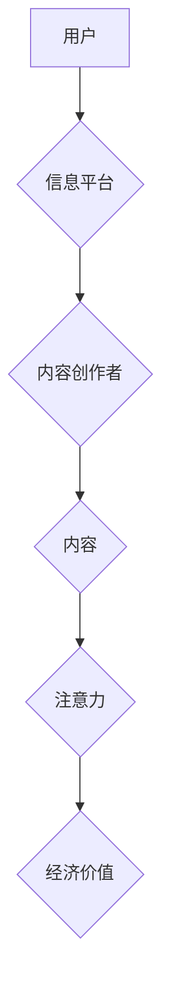

                 

## 1. 背景介绍

在信息爆炸的时代，人们每天接触的海量信息中，如何获取有效信息并保持专注成为了一个巨大的挑战。这催生了“注意力经济”的概念，即将注意力视为一种稀缺资源，并将其商业化。传统媒体，长期以来依靠广告收入和发行量来维持生存，却在注意力经济的冲击下面临着前所未有的挑战。

传统媒体的模式建立在“广播式”传播的基础上，信息推送单向，受众被动接受。然而，注意力经济时代，人们更加追求个性化、碎片化、互动性的信息获取方式。互联网和移动互联网的兴起，为用户提供了海量信息的选择和定制化服务，传统媒体的优势逐渐被削弱。

## 2. 核心概念与联系

### 2.1 注意力经济

注意力经济是指在信息过载的时代，将注意力视为一种稀缺资源，并通过各种方式获取、分配和利用注意力来创造价值的经济模式。

**核心要素：**

* **注意力：** 作为一种稀缺资源，注意力是人们对特定信息或内容的集中和投入。
* **竞争：** 在注意力经济中，各种信息平台和内容创作者都在争夺用户的注意力。
* **价值：**  注意力可以被转化为经济价值，例如广告收入、订阅费用、数据分析等。

**架构：**



### 2.2 传统媒体

传统媒体是指以报纸、杂志、广播、电视等形式传播信息的媒体，其特点是：

* **单向传播：** 信息由媒体机构向受众推送，受众被动接受。
* **规模化生产：** 传统媒体通常面向大众，生产和传播信息量大。
* **广告收入为主：** 传统媒体的主要收入来源是广告。

## 3. 核心算法原理 & 具体操作步骤

### 3.1 算法原理概述

注意力机制是一种模仿人类注意力机制的算法，它能够学习到哪些信息对任务更重要，并对这些信息给予更多的关注。

**核心思想：**

* **权重分配：** 注意力机制通过学习一个权重向量，对输入信息进行加权，将重要信息赋予更高的权重，将不重要信息赋予较低的权重。
* **注意力计算：** 注意力机制通常使用一个注意力函数来计算每个输入信息的权重，该函数通常依赖于输入信息的特征和任务目标。

### 3.2 算法步骤详解

1. **输入数据：** 将输入数据（例如文本、图像）转换为特征向量。
2. **计算注意力权重：** 使用注意力函数计算每个输入信息的权重。
3. **加权求和：** 将输入信息与注意力权重相乘，并求和，得到最终的输出。

### 3.3 算法优缺点

**优点：**

* **提高模型性能：** 注意力机制能够帮助模型学习到更重要的信息，从而提高模型的性能。
* **解释性强：** 注意力权重可以直观地反映模型对输入信息的关注程度，提高模型的解释性。

**缺点：**

* **计算复杂度高：** 注意力机制的计算复杂度较高，训练时间较长。
* **参数量大：** 注意力机制需要学习大量的参数，容易导致过拟合。

### 3.4 算法应用领域

注意力机制在自然语言处理、计算机视觉、机器翻译等领域都有广泛的应用。

## 4. 数学模型和公式 & 详细讲解 & 举例说明

### 4.1 数学模型构建

注意力机制的数学模型通常基于以下公式：

**注意力权重计算：**

$$
a_{ij} = \frac{exp(e_{ij})}{\sum_{k=1}^{n} exp(e_{ik})}
$$

其中：

* $a_{ij}$ 是输入信息 $i$ 对输出信息 $j$ 的注意力权重。
* $e_{ij}$ 是输入信息 $i$ 和输出信息 $j$ 之间的相似度得分。
* $n$ 是输入信息的总数。

**加权求和：**

$$
o_j = \sum_{i=1}^{n} a_{ij} x_i
$$

其中：

* $o_j$ 是输出信息 $j$ 的最终值。
* $x_i$ 是输入信息 $i$ 的特征向量。

### 4.2 公式推导过程

注意力权重计算公式的推导过程基于 softmax 函数，该函数将输入向量映射到一个概率分布，其中每个元素代表了输入向量中对应元素的重要性。

**softmax 函数：**

$$
softmax(x_i) = \frac{exp(x_i)}{\sum_{j=1}^{n} exp(x_j)}
$$

### 4.3 案例分析与讲解

例如，在机器翻译任务中，注意力机制可以帮助模型关注源语言中与目标语言中对应词语相关的部分，从而提高翻译的准确性。

## 5. 项目实践：代码实例和详细解释说明

### 5.1 开发环境搭建

* Python 3.x
* TensorFlow 或 PyTorch

### 5.2 源代码详细实现

```python
import tensorflow as tf

# 定义注意力机制层
class AttentionLayer(tf.keras.layers.Layer):
    def __init__(self, units):
        super(AttentionLayer, self).__init__()
        self.W1 = tf.keras.layers.Dense(units)
        self.W2 = tf.keras.layers.Dense(units)
        self.V = tf.keras.layers.Dense(1)

    def call(self, inputs):
        # 计算注意力权重
        scores = self.V(tf.tanh(self.W1(inputs[0]) + self.W2(inputs[1])))
        attention_weights = tf.nn.softmax(scores, axis=-1)
        # 加权求和
        context_vector = tf.matmul(attention_weights, inputs[0])
        return context_vector

# 示例代码
inputs = tf.random.normal((10, 50, 128))
attention_layer = AttentionLayer(units=64)
output = attention_layer([inputs, inputs])
print(output.shape)
```

### 5.3 代码解读与分析

* `AttentionLayer` 类定义了一个注意力机制层，包含三个稠密层：`W1`、`W2` 和 `V`。
* `call` 方法计算注意力权重并进行加权求和。
* `tf.tanh` 函数用于计算激活函数。
* `tf.nn.softmax` 函数将得分转换为概率分布。
* `tf.matmul` 函数用于矩阵乘法。

### 5.4 运行结果展示

运行上述代码将输出一个形状为 `(10, 64)` 的张量，表示注意力机制后的输出。

## 6. 实际应用场景

### 6.1 传统媒体面临的挑战

* **用户注意力分散：** 用户在互联网上可以随时随地获取信息，注意力容易被分散。
* **广告收入下降：** 互联网广告的竞争激烈，传统媒体的广告收入不断下降。
* **内容更新速度慢：** 传统媒体的内容更新速度相对较慢，难以满足用户对实时信息的需要。

### 6.2 注意力经济对传统媒体的影响

* **个性化内容推荐：** 利用注意力机制，传统媒体可以根据用户的阅读习惯和兴趣推荐个性化内容。
* **互动式内容创作：** 传统媒体可以利用互动式内容，例如直播、问答、投票等，吸引用户的注意力。
* **数据驱动内容生产：** 利用用户行为数据，传统媒体可以更好地了解用户的需求，生产更符合用户口味的内容。

### 6.3 未来应用展望

* **沉浸式体验：** 利用虚拟现实、增强现实等技术，传统媒体可以提供更沉浸式的体验，吸引用户的注意力。
* **跨平台融合：** 传统媒体可以与互联网平台融合，拓展用户的触达范围。
* **人工智能辅助创作：** 利用人工智能技术，传统媒体可以提高内容生产效率，创作更优质的内容。

## 7. 工具和资源推荐

### 7.1 学习资源推荐

* **书籍：**
    * 《深度学习》
    * 《注意力机制》
* **在线课程：**
    * Coursera
    * edX

### 7.2 开发工具推荐

* **TensorFlow:** https://www.tensorflow.org/
* **PyTorch:** https://pytorch.org/

### 7.3 相关论文推荐

* **Attention Is All You Need:** https://arxiv.org/abs/1706.03762

## 8. 总结：未来发展趋势与挑战

### 8.1 研究成果总结

注意力机制在信息处理领域取得了显著的成果，为传统媒体提供了新的思路和方法。

### 8.2 未来发展趋势

* **更强大的注意力机制：** 研究人员将继续探索更强大的注意力机制，提高模型的性能和效率。
* **注意力机制的应用扩展：** 注意力机制将应用于更多领域，例如医疗、金融、教育等。
* **注意力机制的伦理问题：** 随着注意力机制的应用越来越广泛，其伦理问题也需要得到重视。

### 8.3 面临的挑战

* **计算资源限制：** 训练复杂的注意力机制模型需要大量的计算资源。
* **数据隐私问题：** 注意力机制的应用可能会涉及到用户的个人数据，需要保障数据隐私安全。
* **解释性问题：** 尽管注意力机制可以提供一些解释性，但其内部机制仍然比较复杂，需要进一步研究。

### 8.4 研究展望

未来，注意力机制的研究将继续深入，为传统媒体的转型升级提供更强大的技术支撑。


## 9. 附录：常见问题与解答

### 9.1 Q&A

* **Q：注意力机制是如何工作的？**

* **A：** 注意力机制通过学习一个权重向量，对输入信息进行加权，将重要信息赋予更高的权重，将不重要信息赋予较低的权重。

* **Q：注意力机制有哪些应用场景？**

* **A：** 注意力机制在自然语言处理、计算机视觉、机器翻译等领域都有广泛的应用。

* **Q：注意力机制的优势和劣势是什么？**

* **A：** 注意力机制的优势在于可以提高模型性能和解释性，劣势在于计算复杂度高和参数量大。


作者：禅与计算机程序设计艺术 / Zen and the Art of Computer Programming 
<end_of_turn>

