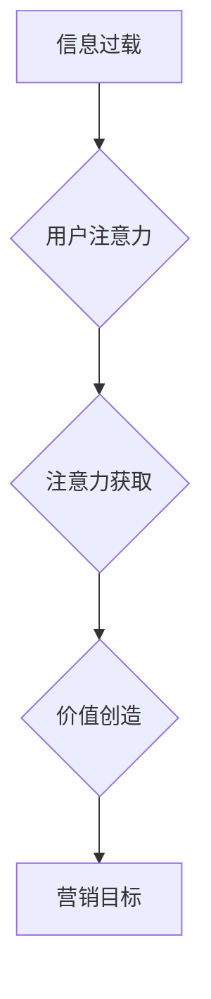

                 

## 1. 背景介绍

在数字时代，信息爆炸式增长，人们面临着前所未有的信息过载。传统广告投放策略，依靠大量曝光和重复轰炸，在信息洪流中逐渐失去效力。用户注意力变得稀缺，像一块宝贵的资源，需要被精准地捕捉和利用。

注意力经济的概念应运而生，它强调了在信息过载时代，用户注意力是至关重要的资源。广告投放不再仅仅是信息传递，而是需要赢得用户的注意力，才能实现营销目标。

## 2. 核心概念与联系

### 2.1 注意力经济

注意力经济是指在信息时代，用户注意力成为一种稀缺资源，而能够有效获取和利用用户注意力的产品和服务，将拥有巨大的价值。

**核心原理：**

* **信息过载：** 数字时代信息爆炸，用户每天接触的信息量巨大，难以有效处理。
* **注意力稀缺：** 人类注意力有限，无法同时关注所有信息，需要选择性地关注。
* **注意力价值：** 用户注意力是获取信息、做出决策和产生行动的关键，因此具有巨大的价值。

**架构图：**



### 2.2 传统广告投放策略

传统广告投放策略主要依靠以下方式：

* **大量曝光：** 通过重复播放广告，提高广告曝光率。
* **目标受众定位：** 根据用户年龄、性别、兴趣等特征，精准投放广告。
* **广告创意：** 设计吸引眼球、引发共鸣的广告创意。

**缺点：**

* **信息过载：** 用户对大量广告产生麻木，广告效果下降。
* **精准度不足：** 目标受众定位不够精准，浪费广告资源。
* **互动性差：** 传统广告缺乏互动性，难以与用户建立连接。

## 3. 核心算法原理 & 具体操作步骤

### 3.1 算法原理概述

注意力机制是一种模仿人类注意力机制的算法，它能够学习到哪些信息对任务更重要，并对这些信息给予更高的权重。

**核心思想：**

* **注意力分配：** 对输入信息进行加权，突出重要信息。
* **上下文依赖：** 考虑输入信息的上下文关系，提高理解能力。
* **可解释性：** 可以分析模型对哪些信息更关注，提高可解释性。

### 3.2 算法步骤详解

1. **输入数据：** 将输入数据（例如文本、图像）转换为向量表示。
2. **计算注意力权重：** 使用注意力机制计算每个输入元素的注意力权重，权重越高表示该元素越重要。
3. **加权求和：** 将输入元素与注意力权重相乘，并求和，得到加权后的输出向量。
4. **输出结果：** 将加权后的输出向量作为模型的输出。

### 3.3 算法优缺点

**优点：**

* **提高模型性能：** 通过关注重要信息，提高模型的准确性和效率。
* **增强可解释性：** 可以分析模型对哪些信息更关注，提高模型的可解释性。
* **适应多种任务：** 可以应用于文本分类、机器翻译、图像识别等多种任务。

**缺点：**

* **计算复杂度高：** 计算注意力权重需要大量的计算资源。
* **参数量大：** 注意力机制通常需要大量的参数，训练成本较高。
* **可解释性仍有局限性：** 虽然注意力机制可以分析模型对哪些信息更关注，但仍然难以完全解释模型的决策过程。

### 3.4 算法应用领域

注意力机制在人工智能领域有着广泛的应用，例如：

* **自然语言处理：** 文本分类、机器翻译、问答系统、文本摘要等。
* **计算机视觉：** 图像识别、目标检测、图像分割等。
* **语音识别：** 语音转文本、语音合成等。
* **推荐系统：** 用户个性化推荐、商品推荐等。

## 4. 数学模型和公式 & 详细讲解 & 举例说明

### 4.1 数学模型构建

注意力机制的核心是计算每个输入元素的注意力权重。常用的注意力机制模型包括：

* **Scaled Dot-Product Attention:**

$$
\text{Attention}(Q, K, V) = \text{softmax}\left(\frac{Q K^T}{\sqrt{d_k}}\right) V
$$

其中：

* $Q$：查询矩阵
* $K$：键矩阵
* $V$：值矩阵
* $d_k$：键向量的维度
* $\text{softmax}$：softmax函数

* **Multi-Head Attention:**

Multi-Head Attention 将Scaled Dot-Product Attention应用于多个头，并对多个头的输出进行融合。

### 4.2 公式推导过程

Scaled Dot-Product Attention 的公式推导过程如下：

1. 计算查询矩阵 $Q$ 和键矩阵 $K$ 的点积：

$$
QK^T
$$

2. 对点积结果进行缩放，以防止梯度爆炸：

$$
\frac{QK^T}{\sqrt{d_k}}
$$

3. 应用 softmax 函数，将点积结果转换为注意力权重：

$$
\text{softmax}\left(\frac{QK^T}{\sqrt{d_k}}\right)
$$

4. 将注意力权重与值矩阵 $V$ 进行加权求和，得到最终的输出：

$$
\text{Attention}(Q, K, V) = \text{softmax}\left(\frac{QK^T}{\sqrt{d_k}}\right) V
$$

### 4.3 案例分析与讲解

假设我们有一个文本序列 "The cat sat on the mat"，我们想要计算每个词的注意力权重。

1. 将文本序列转换为词嵌入向量。
2. 将词嵌入向量作为查询矩阵 $Q$，键矩阵 $K$ 和值矩阵 $V$。
3. 计算注意力权重，并将其可视化。

通过注意力权重可视化，我们可以看到模型对哪些词更关注，例如 "cat" 和 "mat" 可能会获得更高的注意力权重。

## 5. 项目实践：代码实例和详细解释说明

### 5.1 开发环境搭建

* Python 3.6+
* TensorFlow/PyTorch

### 5.2 源代码详细实现

```python
import tensorflow as tf

# 定义注意力机制
def scaled_dot_product_attention(query, key, value, mask=None):
    # 计算点积
    scores = tf.matmul(query, key, transpose_b=True) / tf.math.sqrt(tf.cast(key.shape[-1], tf.float32))
    # 应用 softmax 函数
    attention_weights = tf.nn.softmax(scores, axis=-1)
    # 加权求和
    context_vector = tf.matmul(attention_weights, value)
    return context_vector, attention_weights

# 示例代码
query = tf.random.normal((1, 3, 64))
key = tf.random.normal((1, 4, 64))
value = tf.random.normal((1, 4, 128))

context_vector, attention_weights = scaled_dot_product_attention(query, key, value)
```

### 5.3 代码解读与分析

* `scaled_dot_product_attention` 函数实现了 Scaled Dot-Product Attention 机制。
* `scores` 计算了查询向量和键向量的点积，并进行缩放以防止梯度爆炸。
* `attention_weights` 应用 softmax 函数将点积结果转换为注意力权重。
* `context_vector` 通过对值向量进行加权求和，得到最终的输出。

### 5.4 运行结果展示

运行上述代码，可以得到 `context_vector` 和 `attention_weights` 的输出结果。

## 6. 实际应用场景

### 6.1 广告投放优化

注意力机制可以用于优化广告投放策略，例如：

* **用户画像分析：** 通过分析用户的注意力行为，构建更精准的用户画像。
* **广告创意优化：** 设计更吸引用户的广告创意，提高广告点击率。
* **广告投放时间优化：** 根据用户的注意力分布，选择最佳的广告投放时间。

### 6.2 个性化推荐

注意力机制可以用于个性化推荐，例如：

* **商品推荐：** 根据用户的注意力行为，推荐更符合用户兴趣的商品。
* **内容推荐：** 根据用户的注意力分布，推荐更相关的新闻、视频、文章等内容。

### 6.3 内容创作

注意力机制可以用于内容创作，例如：

* **文章写作：** 通过分析用户的注意力行为，优化文章结构和内容，提高用户阅读体验。
* **视频制作：** 通过分析用户的注意力分布，优化视频剪辑和内容，提高用户观看时长。

### 6.4 未来应用展望

注意力机制在未来将有更广泛的应用，例如：

* **自动驾驶：** 帮助自动驾驶系统更加专注于道路上的重要信息。
* **医疗诊断：** 帮助医生更加精准地诊断疾病。
* **教育教学：** 帮助学生更加有效地学习知识。

## 7. 工具和资源推荐

### 7.1 学习资源推荐

* **书籍：**
    * 《深度学习》
    * 《Attention Is All You Need》
* **在线课程：**
    * Coursera: 深度学习
    * Udacity: 自然语言处理
* **博客文章：**
    * Jay Alammar: The Illustrated Transformer

### 7.2 开发工具推荐

* **TensorFlow:** 开源深度学习框架
* **PyTorch:** 开源深度学习框架
* **Hugging Face Transformers:** 预训练 Transformer 模型库

### 7.3 相关论文推荐

* **Attention Is All You Need:** https://arxiv.org/abs/1706.03762
* **BERT: Pre-training of Deep Bidirectional Transformers for Language Understanding:** https://arxiv.org/abs/1810.04805

## 8. 总结：未来发展趋势与挑战

### 8.1 研究成果总结

注意力机制在人工智能领域取得了显著的成果，例如在自然语言处理、计算机视觉等领域取得了突破性的进展。

### 8.2 未来发展趋势

* **更强大的注意力机制：** 研究更有效的注意力机制，提高模型性能和效率。
* **跨模态注意力：** 研究跨模态注意力机制，例如文本-图像、文本-音频等。
* **可解释性增强：** 研究更可解释的注意力机制，提高模型的可理解性和信任度。

### 8.3 面临的挑战

* **计算复杂度：** 现有注意力机制的计算复杂度较高，难以应用于大规模数据。
* **参数量：** 注意力机制通常需要大量的参数，训练成本较高。
* **可解释性：** 虽然注意力机制可以分析模型对哪些信息更关注，但仍然难以完全解释模型的决策过程。

### 8.4 研究展望

未来，注意力机制的研究将继续深入，探索更强大的、更可解释的注意力机制，并将其应用于更多领域，推动人工智能技术的发展。

## 9. 附录：常见问题与解答

* **什么是注意力机制？**

注意力机制是一种模仿人类注意力机制的算法，它能够学习到哪些信息对任务更重要，并对这些信息给予更高的权重。

* **注意力机制有哪些应用场景？**

注意力机制在人工智能领域有着广泛的应用，例如自然语言处理、计算机视觉、语音识别等。

* **如何理解注意力权重？**

注意力权重表示模型对每个输入元素的关注程度，权重越高表示该元素越重要。

* **注意力机制的计算复杂度如何？**

现有注意力机制的计算复杂度较高，难以应用于大规模数据。

* **如何提高注意力机制的可解释性？**

研究更可解释的注意力机制，例如可视化注意力权重、分析注意力机制的决策过程等。


作者：禅与计算机程序设计艺术 / Zen and the Art of Computer Programming 
<end_of_turn>

