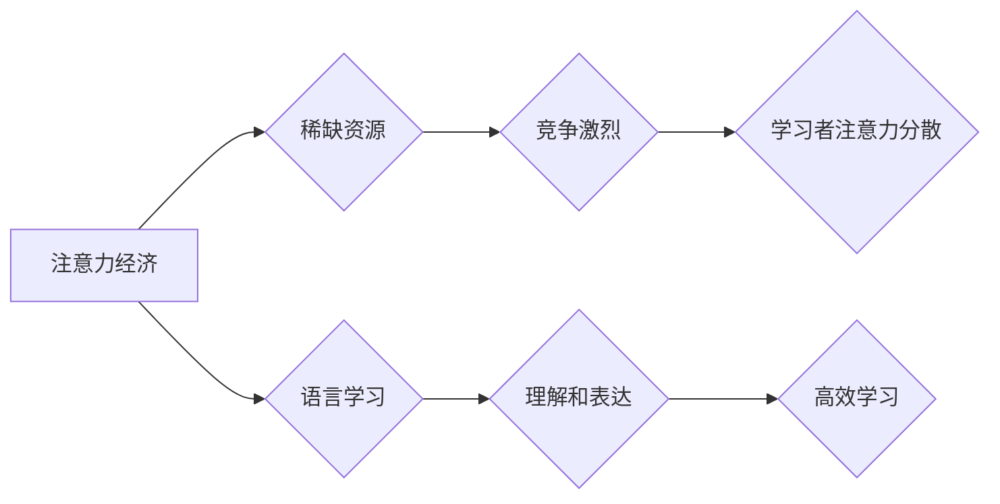

                 

## 1. 背景介绍

在信息爆炸的时代，人类的注意力资源变得越来越稀缺。我们每天被来自各种渠道的信息轰炸，从社交媒体的推送到电子邮件的提醒，从新闻网站的滚动条到广告的插播，无处不在的干扰让我们难以集中精力。这种“注意力经济”的现状深刻地影响着我们学习语言的方式。传统的语言学习方法往往依赖于大量的被动学习，例如阅读大量文本、听大量的音频，但这在注意力经济时代显得越来越无效。

传统的语言学习方法存在以下问题：

* **被动学习效率低:**  被动学习往往缺乏互动性和参与性，难以激发学习者的兴趣和动机，导致学习效果不佳。
* **缺乏个性化:**  传统的语言学习方法往往采用“一刀切”的教学模式，难以满足不同学习者个性化的需求。
* **学习过程枯燥乏味:**  传统的语言学习方法往往缺乏趣味性和娱乐性，学习过程枯燥乏味，难以保持学习者的持续学习动力。

## 2. 核心概念与联系

注意力经济的核心概念是“注意力”作为一种稀缺资源，而语言学习的核心概念是“理解和表达”。两者之间的联系在于，在注意力经济时代，高效地利用注意力资源成为了语言学习的关键。

**Mermaid 流程图：**



## 3. 核心算法原理 & 具体操作步骤

### 3.1  算法原理概述

注意力机制是一种模仿人类注意力机制的机器学习算法，它能够学习到输入数据中最重要的部分，并对这些部分给予更多的关注。在语言学习领域，注意力机制可以用于多种任务，例如机器翻译、文本摘要、问答系统等。

### 3.2  算法步骤详解

1. **输入数据:** 将需要学习的语言数据输入到注意力模型中。
2. **编码器:** 使用编码器将输入数据编码成一个固定长度的向量表示。
3. **注意力计算:** 计算每个词在编码器输出向量中的注意力权重。
4. **解码器:** 使用解码器将编码器输出向量和注意力权重作为输入，生成目标语言的输出。
5. **输出结果:** 输出目标语言的文本序列。

### 3.3  算法优缺点

**优点:**

* **提高学习效率:** 注意力机制能够帮助模型聚焦于输入数据中最重要的部分，从而提高学习效率。
* **提升学习效果:** 通过对重要信息的加权，注意力机制能够帮助模型更好地理解和表达语言。
* **增强模型泛化能力:** 注意力机制能够帮助模型学习到更抽象和通用的语言表示，从而增强模型的泛化能力。

**缺点:**

* **计算复杂度高:** 注意力机制的计算复杂度较高，需要更多的计算资源。
* **参数量大:** 注意力机制的参数量较大，需要更多的训练数据。
* **解释性差:** 注意力机制的内部工作机制相对复杂，难以解释模型的决策过程。

### 3.4  算法应用领域

注意力机制在语言学习领域有着广泛的应用，例如：

* **机器翻译:** 使用注意力机制可以提高机器翻译的准确性和流畅度。
* **文本摘要:** 使用注意力机制可以生成更准确和相关的文本摘要。
* **问答系统:** 使用注意力机制可以帮助问答系统更好地理解问题和找到答案。
* **对话系统:** 使用注意力机制可以使对话系统更加自然和人性化。

## 4. 数学模型和公式 & 详细讲解 & 举例说明

### 4.1  数学模型构建

注意力机制的核心是计算每个词在输入序列中的注意力权重。常用的注意力机制模型包括：

* **自注意力机制 (Self-Attention):**  计算每个词与输入序列中所有词的注意力权重。
* **交叉注意力机制 (Cross-Attention):** 计算两个序列中每个词之间的注意力权重。

### 4.2  公式推导过程

**自注意力机制的注意力权重计算公式:**

$$
\text{Attention}(Q, K, V) = \text{softmax}\left(\frac{Q K^T}{\sqrt{d_k}}\right) V
$$

其中：

* $Q$ 是查询矩阵，表示需要关注的词的表示。
* $K$ 是键矩阵，表示输入序列中所有词的表示。
* $V$ 是值矩阵，表示输入序列中所有词的表示。
* $d_k$ 是键向量的维度。
* $\text{softmax}$ 是一个归一化函数，将注意力权重归一化到[0, 1]之间。

**交叉注意力机制的注意力权重计算公式:**

$$
\text{Attention}(Q, K, V) = \text{softmax}\left(\frac{Q K^T}{\sqrt{d_k}}\right) V
$$

其中：

* $Q$ 是查询矩阵，表示需要关注的词的表示。
* $K$ 是键矩阵，表示另一个序列中所有词的表示。
* $V$ 是值矩阵，表示另一个序列中所有词的表示。
* $d_k$ 是键向量的维度。
* $\text{softmax}$ 是一个归一化函数，将注意力权重归一化到[0, 1]之间。

### 4.3  案例分析与讲解

例如，在机器翻译任务中，可以使用交叉注意力机制来计算源语言句子中每个词与目标语言句子中每个词之间的注意力权重。通过计算这些注意力权重，模型可以更好地理解源语言句子中的每个词在目标语言句子中的对应关系，从而提高翻译的准确性和流畅度。

## 5. 项目实践：代码实例和详细解释说明

### 5.1  开发环境搭建

为了实现注意力机制的语言学习应用，需要搭建一个合适的开发环境。常用的开发环境包括：

* **Python:** Python 是一个流行的编程语言，拥有丰富的机器学习库，例如 TensorFlow 和 PyTorch。
* **深度学习框架:** TensorFlow 和 PyTorch 是两个流行的深度学习框架，可以用于实现注意力机制的模型。
* **GPU:** GPU (图形处理单元) 可以加速深度学习模型的训练和推理。

### 5.2  源代码详细实现

以下是一个使用 TensorFlow 实现自注意力机制的简单代码示例：

```python
import tensorflow as tf

def scaled_dot_product_attention(query, key, value, mask=None):
  """计算自注意力机制的注意力权重。"""
  scores = tf.matmul(query, key, transpose_b=True) / tf.math.sqrt(tf.cast(key.shape[-1], tf.float32))
  if mask is not None:
    scores += (mask * -1e9)
  attention_weights = tf.nn.softmax(scores, axis=-1)
  context_vector = tf.matmul(attention_weights, value)
  return context_vector, attention_weights

# 定义输入数据
query = tf.random.normal([32, 10, 64])
key = tf.random.normal([32, 10, 64])
value = tf.random.normal([32, 10, 64])

# 计算注意力权重和上下文向量
context_vector, attention_weights = scaled_dot_product_attention(query, key, value)

# 打印结果
print(context_vector.shape)
print(attention_weights.shape)
```

### 5.3  代码解读与分析

这段代码实现了自注意力机制的注意力权重计算。首先，计算了查询向量与键向量的点积，并进行缩放。然后，根据掩码信息对点积进行调整，以避免模型关注不必要的词。最后，使用 softmax 函数将点积归一化到注意力权重，并使用注意力权重对值向量进行加权求和，得到上下文向量。

### 5.4  运行结果展示

运行这段代码后，会输出上下文向量的形状和注意力权重的形状。上下文向量的形状为 (32, 10, 64)，表示每个样本的每个词的上下文向量表示。注意力权重的形状为 (32, 10, 10)，表示每个样本每个词与其他词之间的注意力权重。

## 6. 实际应用场景

注意力机制在语言学习领域有着广泛的应用场景，例如：

### 6.1  机器翻译

注意力机制可以帮助机器翻译模型更好地理解源语言句子中的每个词在目标语言句子中的对应关系，从而提高翻译的准确性和流畅度。

### 6.2  文本摘要

注意力机制可以帮助文本摘要模型识别文本中最关键的信息，并生成更准确和相关的摘要。

### 6.3  问答系统

注意力机制可以帮助问答系统更好地理解问题和找到答案，从而提高问答系统的准确率。

### 6.4  未来应用展望

随着注意力机制的不断发展，其在语言学习领域的应用场景将会更加广泛。例如，注意力机制可以用于个性化语言学习、跨语言学习、多模态语言学习等领域。

## 7. 工具和资源推荐

### 7.1  学习资源推荐

* **论文:**

    * "Attention Is All You Need" (Vaswani et al., 2017)
    * "BERT: Pre-training of Deep Bidirectional Transformers for Language Understanding" (Devlin et al., 2018)
    * "XLNet: Generalized Autoregressive Pretraining for Language Understanding" (Yang et al., 2019)

* **在线课程:**

    * Coursera: "Deep Learning Specialization"
    * Udacity: "Deep Learning Nanodegree"

### 7.2  开发工具推荐

* **TensorFlow:** https://www.tensorflow.org/
* **PyTorch:** https://pytorch.org/

### 7.3  相关论文推荐

* **Transformer-XL: Attentive Language Models Beyond a Fixed-Length Context** (Dai et al., 2019)
* **RoBERTa: A Robustly Optimized BERT Pretraining Approach** (Liu et al., 2019)
* **T5: Text-to-Text Transfer Transformer** (Raffel et al., 2019)

## 8. 总结：未来发展趋势与挑战

### 8.1  研究成果总结

注意力机制在语言学习领域取得了显著的成果，例如机器翻译、文本摘要、问答系统等任务的性能得到了大幅提升。

### 8.2  未来发展趋势

未来，注意力机制的发展趋势包括：

* **更强大的模型架构:** 研究更强大的注意力机制模型架构，例如长短期记忆 (LSTM) 和循环神经网络 (RNN) 与注意力机制的结合。
* **更有效的训练方法:** 研究更有效的注意力机制训练方法，例如自监督学习和迁移学习。
* **更广泛的应用场景:** 将注意力机制应用到更多语言学习场景，例如个性化语言学习、跨语言学习、多模态语言学习等。

### 8.3  面临的挑战

注意力机制也面临着一些挑战，例如：

* **计算复杂度高:** 注意力机制的计算复杂度较高，需要更多的计算资源。
* **参数量大:** 注意力机制的参数量较大，需要更多的训练数据。
* **解释性差:** 注意力机制的内部工作机制相对复杂，难以解释模型的决策过程。

### 8.4  研究展望

未来，需要进一步研究注意力机制的理论基础、模型架构、训练方法和应用场景，以克服其面临的挑战，并将其应用于更多领域，推动语言学习的进步。

## 9. 附录：常见问题与解答

### 9.1  Q: 注意力机制和传统语言模型相比有什么优势？

**A:** 注意力机制能够更好地理解语言的上下文关系，从而提高语言学习的准确性和效率。

### 9.2  Q: 注意力机制的计算复杂度高吗？

**A:** 是的，注意力机制的计算复杂度较高，需要更多的计算资源。

### 9.3  Q: 如何选择合适的注意力机制模型？

**A:** 选择合适的注意力机制模型需要根据具体的应用场景和数据特点进行选择。

### 9.4  Q: 注意力机制的未来发展趋势是什么？

**A:** 未来，注意力机制的发展趋势包括更强大的模型架构、更有效的训练方法和更广泛的应用场景。


作者：禅与计算机程序设计艺术 / Zen and the Art of Computer Programming 
<end_of_turn>

