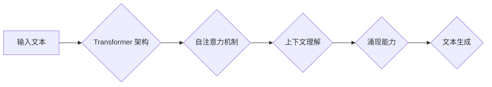

                 

## 涌现能力与上下文学习：大模型的核心优势结合应用

> 关键词：大模型、涌现能力、上下文学习、Transformer、深度学习、自然语言处理

### 1. 背景介绍

近年来，深度学习领域取得了令人瞩目的进展，其中大模型 (Large Language Models, LLMs) 作为一种新兴的计算模型，展现出强大的学习能力和泛化能力，在自然语言处理 (NLP)、计算机视觉、代码生成等领域取得了突破性成果。

大模型的训练通常依赖于海量文本数据，通过学习语言的统计规律和语义关系，能够生成流畅、连贯的文本，并完成复杂的语言理解和生成任务。例如，GPT-3、LaMDA、BERT 等大模型已经能够进行对话、翻译、写作、问答等多种任务，甚至展现出一些类似人类的创造力和推理能力。

然而，大模型的训练成本高昂，对计算资源和数据需求极大。如何更有效地利用大模型的潜力，并将其应用于实际场景，是当前研究的热点问题。

### 2. 核心概念与联系

**2.1 涌现能力**

涌现能力是指复杂系统中，由简单规则的相互作用而产生的新颖、不可预测的行为模式。在生物学中，涌现能力可以解释群体行为、生态系统演化等现象。在人工智能领域，涌现能力也被认为是大模型学习能力的关键因素之一。

大模型的庞大规模和复杂的结构，使得其能够学习到语言的丰富语义和语法规则，并通过这些规则的组合和重组，产生出新的、更复杂的表达方式。这种能力类似于人类的创造力和想象力，能够生成从未见过的新颖文本，并解决从未遇到过的语言问题。

**2.2 上下文学习**

上下文学习是指模型根据输入序列中的上下文信息，预测下一个元素或理解整个序列的含义。在自然语言处理中，上下文学习是理解语言的关键，因为它能够捕捉到语言的依赖关系和语义关联。

Transformer 架构的引入，使得上下文学习在深度学习领域取得了重大突破。Transformer 通过自注意力机制 (Self-Attention)，能够有效地捕捉输入序列中的长距离依赖关系，从而实现更准确的上下文理解。

**2.3 核心概念联系**

大模型的涌现能力和上下文学习能力密切相关。

* 上下文学习为大模型提供了理解语言的基础，使其能够捕捉到语言的语义和语法规则。
* 涌现能力则使得大模型能够通过学习到的规则，生成新的、更复杂的表达方式，并完成更复杂的语言任务。

**Mermaid 流程图**



### 3. 核心算法原理 & 具体操作步骤

**3.1 算法原理概述**

大模型的核心算法原理是深度学习，特别是 Transformer 架构。Transformer 架构通过自注意力机制和多头注意力机制，能够有效地捕捉输入序列中的长距离依赖关系，实现更准确的上下文理解。

**3.2 算法步骤详解**

1. **词嵌入:** 将输入文本中的每个词转换为向量表示，每个词的向量表示能够捕捉到该词的语义信息。
2. **编码器:** 使用多层 Transformer 块对输入文本进行编码，每个 Transformer 块包含自注意力层和前馈神经网络层。
3. **解码器:** 使用多层 Transformer 块对编码后的文本进行解码，生成输出文本。
4. **损失函数:** 使用交叉熵损失函数衡量模型的预测结果与真实结果之间的差异。
5. **反向传播:** 使用梯度下降算法优化模型参数，降低损失函数的值。

**3.3 算法优缺点**

**优点:**

* 能够捕捉长距离依赖关系，实现更准确的上下文理解。
* 训练效率高，能够在大型数据集上进行高效训练。
* 泛化能力强，能够应用于多种自然语言处理任务。

**缺点:**

* 训练成本高昂，对计算资源和数据需求极大。
* 模型参数量大，部署成本较高。
* 容易受到训练数据偏差的影响。

**3.4 算法应用领域**

* 自然语言理解：文本分类、情感分析、问答系统等。
* 自然语言生成：机器翻译、文本摘要、对话系统等。
* 代码生成：自动代码补全、代码翻译等。

### 4. 数学模型和公式 & 详细讲解 & 举例说明

**4.1 数学模型构建**

Transformer 架构的核心是自注意力机制，其数学模型可以表示为：

$$
Attention(Q, K, V) = softmax(\frac{QK^T}{\sqrt{d_k}})V
$$

其中：

* $Q$：查询矩阵
* $K$：键矩阵
* $V$：值矩阵
* $d_k$：键向量的维度
* $softmax$：softmax 函数

**4.2 公式推导过程**

自注意力机制通过计算查询向量 $Q$ 与键向量 $K$ 的点积，并使用 softmax 函数进行归一化，得到每个键向量的重要性权重。然后，将这些权重与值向量 $V$ 进行加权求和，得到最终的注意力输出。

**4.3 案例分析与讲解**

假设我们有一个句子 "The cat sat on the mat"，将其转换为词向量表示，得到 $Q$, $K$, $V$ 三个矩阵。

通过计算 $QK^T$，我们可以得到每个词对其他词的注意力权重。例如，"cat" 对 "sat" 的注意力权重较高，因为它们在语义上相关。

然后，使用 softmax 函数对注意力权重进行归一化，得到每个词对其他词的相对重要性。最后，将这些权重与值向量 $V$ 进行加权求和，得到每个词的上下文表示。

### 5. 项目实践：代码实例和详细解释说明

**5.1 开发环境搭建**

* Python 3.7+
* PyTorch 或 TensorFlow
* CUDA 和 cuDNN (可选，用于 GPU 训练)

**5.2 源代码详细实现**

```python
import torch
import torch.nn as nn

class Transformer(nn.Module):
    def __init__(self, vocab_size, embedding_dim, num_heads, num_layers):
        super(Transformer, self).__init__()
        self.embedding = nn.Embedding(vocab_size, embedding_dim)
        self.encoder_layers = nn.ModuleList([EncoderLayer(embedding_dim, num_heads) for _ in range(num_layers)])
        self.decoder_layers = nn.ModuleList([DecoderLayer(embedding_dim, num_heads) for _ in range(num_layers)])

    def forward(self, src, tgt):
        src = self.embedding(src)
        tgt = self.embedding(tgt)
        # ... (编码器和解码器逻辑)
```

**5.3 代码解读与分析**

* `Transformer` 类定义了 Transformer 模型的结构。
* `embedding` 层将词转换为向量表示。
* `encoder_layers` 和 `decoder_layers` 分别包含编码器和解码器的 Transformer 块。
* `forward` 方法定义了模型的输入和输出流程。

**5.4 运行结果展示**

训练好的 Transformer 模型可以用于多种自然语言处理任务，例如机器翻译、文本摘要等。

### 6. 实际应用场景

**6.1 自然语言理解**

* 文本分类：识别文本的主题、情感、意图等。
* 情感分析：分析文本中表达的情感倾向。
* 问答系统：根据给定的问题，从文本中找到答案。

**6.2 自然语言生成**

* 机器翻译：将文本从一种语言翻译成另一种语言。
* 文本摘要：生成文本的简短摘要。
* 对话系统：构建能够与人类进行自然对话的系统。

**6.3 代码生成**

* 自动代码补全：根据代码上下文，自动补全代码。
* 代码翻译：将代码从一种编程语言翻译成另一种编程语言。

**6.4 未来应用展望**

大模型的涌现能力和上下文学习能力，将推动人工智能技术在更多领域的发展，例如：

* 个性化教育：根据学生的学习情况，提供个性化的学习内容和辅导。
* 医疗诊断：辅助医生进行疾病诊断和治疗方案制定。
* 科学研究：加速科学发现和技术创新。

### 7. 工具和资源推荐

**7.1 学习资源推荐**

* **书籍:**
    * 《深度学习》 - Ian Goodfellow, Yoshua Bengio, Aaron Courville
    * 《Transformer 详解》 - Jay Alammar
* **在线课程:**
    * Coursera: Deep Learning Specialization
    * fast.ai: Practical Deep Learning for Coders

**7.2 开发工具推荐**

* **框架:** PyTorch, TensorFlow
* **库:** Hugging Face Transformers, OpenAI API

**7.3 相关论文推荐**

* Attention Is All You Need - Vaswani et al. (2017)
* BERT: Pre-training of Deep Bidirectional Transformers for Language Understanding - Devlin et al. (2018)
* GPT-3: Language Models are Few-Shot Learners - Brown et al. (2020)

### 8. 总结：未来发展趋势与挑战

**8.1 研究成果总结**

大模型在自然语言处理领域取得了显著的进展，展现出强大的学习能力和泛化能力。涌现能力和上下文学习是其核心优势，推动了人工智能技术的发展。

**8.2 未来发展趋势**

* 模型规模进一步扩大，训练效率和性能提升。
* 多模态大模型的开发，融合文本、图像、音频等多种数据类型。
* 更加安全、可靠、可解释的大模型研究。

**8.3 面临的挑战**

* 训练成本高昂，对计算资源和数据需求极大。
* 模型参数量大，部署成本较高。
* 容易受到训练数据偏差的影响，导致模型存在偏见和歧视。

**8.4 研究展望**

未来，大模型研究将继续朝着更加高效、安全、可靠、可解释的方向发展，并应用于更多领域，推动人工智能技术的发展和应用。

### 9. 附录：常见问题与解答

* **Q: 大模型的训练需要多少数据？**

A: 大模型的训练需要海量数据，通常需要数十亿甚至数千亿个词语。

* **Q: 大模型的训练需要多少计算资源？**

A: 大模型的训练需要大量的计算资源，通常需要数百甚至数千个GPU。

* **Q: 如何评估大模型的性能？**

A: 大模型的性能可以通过多种指标评估，例如准确率、困惑度、BLEU 等。

* **Q: 大模型存在哪些伦理问题？**

A: 大模型存在一些伦理问题，例如偏见、歧视、隐私泄露等。

作者：禅与计算机程序设计艺术 / Zen and the Art of Computer Programming


<end_of_turn>

