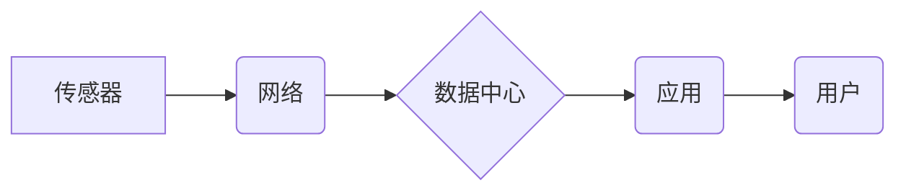

                 

## 物联网创业：连接一切的商业革命

> 关键词：物联网、IoT、传感器、数据分析、云计算、人工智能、商业模式、创业

### 1. 背景介绍

物联网（Internet of Things，IoT）正以惊人的速度发展，它将物理世界与数字世界紧密连接，为我们带来前所未有的便利和机遇。从智能家居到智慧城市，从精准农业到远程医疗，物联网正在深刻地改变着我们的生活方式和商业模式。

随着物联网技术的成熟，越来越多的创业者看到了其中的商机，涌入这个充满活力的领域。然而，物联网创业并非易事，它需要对技术、市场和商业模式有深入的理解。

### 2. 核心概念与联系

物联网的核心概念是通过传感器、网络和数据分析技术，将各种物理设备连接到互联网，实现数据采集、传输、处理和应用。

**物联网架构**



**核心概念解释:**

* **传感器:** 物联网的感知单元，负责收集物理世界的各种数据，例如温度、湿度、位置、运动等。
* **网络:** 连接传感器、数据中心和应用的桥梁，可以是无线网络、有线网络或混合网络。
* **数据中心:** 处理和存储来自传感器的海量数据，并进行分析和挖掘。
* **应用:** 基于数据分析的结果，提供各种增值服务，例如智能控制、预测维护、个性化推荐等。
* **用户:** 使用物联网应用的用户，可以是个人、企业或政府机构。

### 3. 核心算法原理 & 具体操作步骤

#### 3.1  算法原理概述

物联网应用中常用的算法包括数据采集、传输、处理和分析等环节。

* **数据采集算法:** 负责根据传感器类型和采集需求，设计合理的采集策略和算法，例如采样频率、数据格式等。
* **数据传输算法:** 负责将传感器采集的数据安全、高效地传输到数据中心，例如MQTT、CoAP等协议。
* **数据处理算法:** 负责对接收到的数据进行清洗、转换、聚合等处理，例如数据去噪、数据格式转换等。
* **数据分析算法:** 负责对处理后的数据进行分析和挖掘，例如机器学习、深度学习等算法，用于预测、分类、聚类等任务。

#### 3.2  算法步骤详解

以数据分析算法为例，其具体操作步骤如下：

1. **数据收集:** 从传感器收集原始数据。
2. **数据预处理:** 对原始数据进行清洗、转换、缺失值处理等操作，使其符合分析算法的输入要求。
3. **特征提取:** 从预处理后的数据中提取关键特征，例如温度、湿度、位置等。
4. **模型训练:** 使用机器学习算法，对提取的特征进行训练，建立预测模型。
5. **模型评估:** 使用测试数据对训练好的模型进行评估，例如准确率、召回率等指标。
6. **模型部署:** 将训练好的模型部署到数据中心，用于实时数据分析和预测。

#### 3.3  算法优缺点

物联网算法的优缺点取决于具体的算法类型和应用场景。

* **优点:**

    * **自动化:** 物联网算法可以自动化完成数据采集、处理和分析任务，提高效率和准确性。
    * **实时性:** 物联网算法可以实时处理数据，及时发现异常和趋势。
    * **个性化:** 物联网算法可以根据用户的需求和行为，提供个性化的服务。

* **缺点:**

    * **数据安全:** 物联网数据量大、敏感性高，需要采取有效的安全措施保护数据隐私。
    * **算法复杂度:** 一些物联网算法复杂度高，需要强大的计算能力和存储资源。
    * **算法可解释性:** 一些机器学习算法的决策过程难以解释，需要提高算法的可解释性。

#### 3.4  算法应用领域

物联网算法广泛应用于各个领域，例如：

* **智能家居:** 控制家电、安防监控、环境监测等。
* **智慧城市:** 交通管理、环境监测、公共安全等。
* **精准农业:** 监测作物生长、控制灌溉、预测产量等。
* **远程医疗:** 远程诊断、远程监测、远程手术等。

### 4. 数学模型和公式 & 详细讲解 & 举例说明

#### 4.1  数学模型构建

物联网数据分析中常用的数学模型包括线性回归、逻辑回归、决策树、支持向量机等。

* **线性回归:** 用于预测连续变量，例如温度、湿度等。
* **逻辑回归:** 用于预测分类变量，例如故障类型、用户行为等。
* **决策树:** 用于分类和预测，通过一系列规则将数据分类到不同的类别。
* **支持向量机:** 用于分类和回归，通过寻找最佳的分隔超平面将数据分类。

#### 4.2  公式推导过程

以线性回归为例，其目标是找到一条直线，使得预测值与实际值之间的误差最小。

**线性回归模型:**

$$y = \beta_0 + \beta_1x + \epsilon$$

其中:

* $y$ 是预测值
* $x$ 是输入变量
* $\beta_0$ 是截距
* $\beta_1$ 是斜率
* $\epsilon$ 是误差项

**最小二乘法:**

最小二乘法是一种常用的优化算法，其目标是找到使得误差平方和最小的参数值。

$$J(\beta_0, \beta_1) = \sum_{i=1}^{n}(y_i - \hat{y}_i)^2$$

其中:

* $J(\beta_0, \beta_1)$ 是误差平方和
* $n$ 是样本数量
* $y_i$ 是实际值
* $\hat{y}_i$ 是预测值

#### 4.3  案例分析与讲解

假设我们要预测房屋价格，输入变量是房屋面积，输出变量是房屋价格。我们可以使用线性回归模型，根据房屋面积和价格数据，训练出一个模型，并预测新房子的价格。

### 5. 项目实践：代码实例和详细解释说明

#### 5.1  开发环境搭建

物联网项目开发环境通常包括以下组件:

* **硬件平台:** 例如Raspberry Pi、Arduino等。
* **操作系统:** 例如Linux、Android等。
* **编程语言:** 例如Python、C++等。
* **开发工具:** 例如Eclipse、VS Code等。

#### 5.2  源代码详细实现

以Python语言为例，实现一个简单的温度传感器数据采集和传输的代码实例:

```python
import time
import Adafruit_DHT

# DHT11传感器引脚
DHT_PIN = 4

# DHT11传感器类型
sensor = Adafruit_DHT.DHT11

while True:
    # 读取温度和湿度数据
    humidity, temperature = Adafruit_DHT.read_retry(sensor, DHT_PIN)

    # 检查数据是否读取成功
    if humidity is not None and temperature is not None:
        print("温度: {:.1f}°C, 湿度: {:.1f}%".format(temperature, humidity))
        # 将数据发送到云平台
        # ...
    else:
        print("无法读取传感器数据")

    # 等待一段时间
    time.sleep(5)
```

#### 5.3  代码解读与分析

* 该代码使用Adafruit_DHT库读取DHT11传感器的温度和湿度数据。
* 使用while循环不断读取数据，并将其打印到控制台。
* 可以根据实际需求修改代码，将数据发送到云平台进行存储和分析。

#### 5.4  运行结果展示

运行该代码后，会在控制台输出当前温度和湿度的值。

### 6. 实际应用场景

物联网技术在各个行业都有广泛的应用场景，例如:

#### 6.1  智能家居

* 智能照明: 根据用户需求和环境光线自动调节灯光亮度。
* 智能空调: 根据用户设定和环境温度自动调节空调温度。
* 智能安防: 通过摄像头、传感器等设备，实现远程监控和报警。

#### 6.2  智慧城市

* 交通管理: 通过传感器和摄像头，实时监测交通流量，优化交通信号灯控制。
* 环境监测: 通过传感器监测空气质量、水质、噪音等环境指标。
* 公共安全: 通过摄像头和报警系统，提高城市安全水平。

#### 6.3  精准农业

* 农业监测: 通过传感器监测土壤湿度、温度、光照等数据，优化灌溉和施肥方案。
* 作物产量预测: 通过机器学习算法，预测作物产量，帮助农民制定生产计划。
* 病虫害防治: 通过传感器监测作物病虫害情况，及时采取防治措施。

#### 6.4  未来应用展望

物联网技术的发展将带来更多新的应用场景，例如:

* **工业物联网:** 提高工业生产效率和安全性。
* **医疗物联网:** 提供远程医疗、个性化医疗等服务。
* **教育物联网:** 打造智慧校园，提升教育质量。

### 7. 工具和资源推荐

#### 7.1  学习资源推荐

* **书籍:**
    * 《物联网编程》
    * 《物联网基础》
    * 《物联网应用开发》
* **在线课程:**
    * Coursera: 物联网课程
    * edX: 物联网课程
    * Udemy: 物联网课程

#### 7.2  开发工具推荐

* **硬件平台:**
    * Raspberry Pi
    * Arduino
    * ESP32
* **编程语言:**
    * Python
    * C++
    * Java
* **云平台:**
    * AWS IoT
    * Azure IoT
    * Google Cloud IoT

#### 7.3  相关论文推荐

* **物联网安全:**
    * "A Survey on Security Issues and Solutions in Internet of Things"
* **物联网数据分析:**
    * "Big Data Analytics in the Internet of Things: A Survey"
* **物联网应用:**
    * "Internet of Things: Applications and Challenges"

### 8. 总结：未来发展趋势与挑战

#### 8.1  研究成果总结

物联网技术发展迅速，取得了丰硕的成果，例如:

* **传感器技术:** 传感器小型化、低功耗、高精度等方面取得了突破。
* **网络技术:** 物联网网络架构更加完善，支持大规模设备连接和数据传输。
* **数据分析技术:** 机器学习、深度学习等算法应用于物联网数据分析，提高了数据挖掘和预测能力。

#### 8.2  未来发展趋势

物联网技术未来将朝着以下趋势发展:

* **边缘计算:** 将计算能力下沉到边缘设备，提高数据处理效率和实时性。
* **人工智能:** 将人工智能技术与物联网技术结合，实现智能感知、智能决策和智能控制。
* **5G网络:** 5G网络的高带宽、低延迟特性将为物联网应用提供更强大的支撑。

#### 8.3  面临的挑战

物联网技术发展也面临着一些挑战:

* **数据安全:** 物联网数据量大、敏感性高，需要加强数据安全保护。
* **隐私保护:** 物联网设备收集的用户数据需要得到妥善保护。
* **标准化:** 物联网行业缺乏统一的标准，需要加强标准化建设。

#### 8.4  研究展望

未来物联网研究将重点关注以下方面:

* **安全可靠性:** 研究更安全、更可靠的物联网网络架构和安全协议。
* **智能化:** 研究更智能的物联网应用，例如智能家居、智慧城市等。
* **可持续发展:** 研究低功耗、环保的物联网技术，促进物联网的可持续发展。

### 9. 附录：常见问题与解答

#### 9.1  常见问题

* **物联网和云计算的关系是什么？**

物联网和云计算是互补的技术，云计算为物联网提供数据存储、处理和分析能力。

* **物联网的应用场景有哪些？**

物联网的应用场景非常广泛，例如智能家居、智慧城市、精准农业、远程医疗等。

* **物联网技术有哪些发展趋势？**

物联网技术未来将朝着边缘计算、人工智能、5G网络等方向发展。

#### 9.2  解答

* **物联网和云计算的关系是什么？**

物联网和云计算是互补的技术，云计算为物联网提供数据存储、处理和分析能力。物联网设备收集到的数据可以通过网络传输到云平台进行存储和分析，云平台可以提供强大的计算能力和数据存储空间，帮助物联网应用实现更智能化和高效化。

* **物联网的应用场景有哪些？**

物联网的应用场景非常广泛，例如智能家居、智慧城市、精准农业、远程医疗等。

* **物联网技术有哪些发展趋势？**

物联网技术未来将朝着边缘计算、人工智能、5G网络等方向发展。

**边缘计算:** 将计算能力下沉到边缘设备，提高数据处理效率和实时性。

**人工智能:** 将人工智能技术与物联网技术结合，实现智能感知、智能决策和智能控制。

**5G网络:** 5G网络的高带宽、低延迟特性将为物联网应用提供更强大的支撑。


作者：禅与计算机程序设计艺术 / Zen and the Art of Computer Programming 
<end_of_turn>

