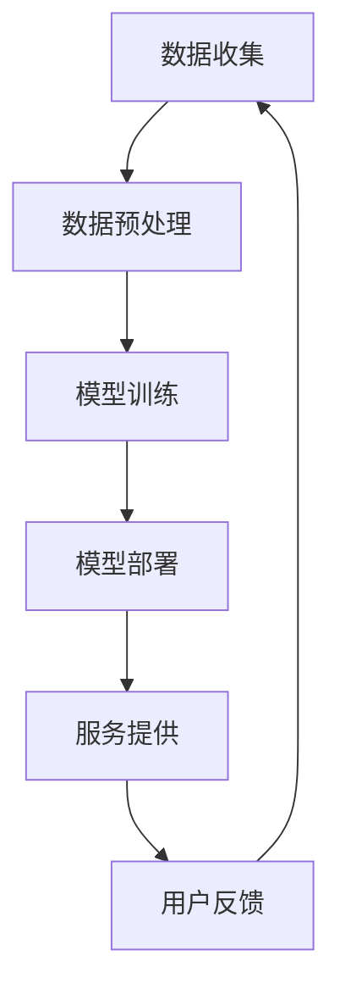

                 

# 文章标题

大模型赋能智慧出行，创业者如何重塑移动出行体验？

> 关键词：大模型，智慧出行，移动出行，创业者，出行体验，技术赋能

> 摘要：本文旨在探讨大模型技术在智慧出行领域的应用，以及创业者如何利用这些技术重塑移动出行体验。我们将分析大模型如何赋能出行服务，介绍相关的算法原理和实现步骤，并通过实例展示技术落地效果。文章还将讨论智慧出行的发展趋势与挑战，为创业者提供实用的工具和资源推荐。

## 1. 背景介绍

随着人工智能技术的快速发展，大模型（如GPT-3、BERT等）在各个领域展现出了巨大的潜力。智慧出行作为现代城市生活的重要组成部分，也受到了大模型技术的深刻影响。智慧出行是指通过利用物联网、大数据、人工智能等技术，提供安全、高效、便捷的出行服务。它涵盖了从交通管理、车辆调度，到乘客服务、路线规划等多个方面。

在智慧出行领域，大模型的应用主要包括以下几个方面：

1. **语音识别与交互**：利用大模型进行语音识别，实现智能语音助手与乘客的互动，提供个性化服务。
2. **路线规划与推荐**：通过大模型处理海量数据，提供精准的路线规划与出行推荐。
3. **智能安全监控**：利用大模型进行图像识别，实时监控车辆和道路状况，提升行车安全。
4. **自动驾驶**：大模型在自动驾驶中扮演关键角色，负责实时感知环境、做出决策。

本文将重点讨论大模型在移动出行中的应用，通过具体的实例展示如何重塑移动出行体验。首先，我们将介绍大模型的基本概念和架构，接着分析其在智慧出行中的核心算法原理，然后通过实际项目实践进行详细讲解。

## 2. 核心概念与联系

### 2.1 大模型的概念

大模型是指具有数十亿参数的深度学习模型，如GPT-3、BERT等。这些模型通过从海量数据中学习，能够自动提取特征、理解上下文，并在各种任务中表现出色。大模型的核心优势在于其强大的语义理解和生成能力，这使得它们在自然语言处理、图像识别、语音识别等领域有着广泛的应用。

### 2.2 大模型在智慧出行中的应用

在智慧出行中，大模型的应用主要集中在以下几个方面：

1. **智能语音助手**：通过语音识别和自然语言处理，实现与乘客的智能对话，提供个性化的出行服务。
2. **路线规划与推荐**：利用大模型处理交通数据，提供实时的路线规划和出行建议。
3. **自动驾驶**：通过大模型进行环境感知和决策，实现自动驾驶车辆的智能驾驶。
4. **安全监控**：利用大模型进行图像识别，实时监控道路状况和车辆状态，提高出行安全。

### 2.3 大模型与其他技术的联系

大模型技术在智慧出行中并非孤立存在，它与多种技术相互融合，共同推动出行体验的提升。例如：

1. **物联网**：物联网技术提供实时的交通数据，为路线规划提供支持。
2. **大数据**：大数据技术处理海量数据，为模型训练提供素材。
3. **云计算**：云计算提供强大的计算资源，支持大模型的训练和部署。

为了更好地理解大模型在智慧出行中的应用，我们可以通过以下Mermaid流程图展示其核心架构：



### 2.4 大模型技术的重要性

大模型技术在智慧出行中的应用具有重要意义。首先，它能够提升出行服务的智能化水平，提供更个性化的服务。其次，它能够提高出行效率，减少拥堵和交通事故。此外，大模型技术还能够为创业者提供创新的商业模式和机会，帮助他们重塑移动出行体验。

总的来说，大模型技术在智慧出行中的应用前景广阔，它不仅能够推动技术的进步，还能够带来更安全、更便捷、更舒适的出行体验。在接下来的部分，我们将深入探讨大模型在智慧出行中的核心算法原理和具体实现步骤。

## 3. 核心算法原理 & 具体操作步骤

### 3.1 大模型的基本原理

大模型的基本原理是基于深度学习的神经网络架构，通过多层神经网络对数据进行编码和解码，从而实现复杂任务的学习和预测。具体来说，大模型包括以下几个核心组成部分：

1. **输入层**：接收外部数据，如文本、图像、语音等。
2. **隐藏层**：通过多层神经网络对输入数据进行特征提取和转换。
3. **输出层**：根据隐藏层的特征生成预测结果，如文本回复、图像分类、语音识别等。

大模型的训练过程主要包括以下步骤：

1. **数据准备**：收集并清洗大量高质量的数据，作为模型训练的基础。
2. **模型构建**：选择合适的神经网络架构，并初始化模型参数。
3. **模型训练**：通过反向传播算法，不断调整模型参数，使模型在训练数据上达到最佳性能。
4. **模型评估**：使用验证集对模型进行评估，调整模型参数，确保模型在未知数据上的表现良好。
5. **模型部署**：将训练好的模型部署到实际应用场景中，提供服务。

### 3.2 大模型在智慧出行中的应用

在智慧出行中，大模型的应用主要集中在以下几个方面：

1. **智能语音助手**：利用大模型进行语音识别和自然语言处理，实现智能对话和语音交互，提供个性化的出行服务。

2. **路线规划与推荐**：利用大模型处理交通数据，分析实时路况，提供最优的路线规划和出行建议。

3. **自动驾驶**：利用大模型进行环境感知和决策，实现自动驾驶车辆的智能驾驶。

4. **安全监控**：利用大模型进行图像识别，实时监控车辆和道路状况，提升行车安全。

### 3.3 实际应用示例

#### 3.3.1 智能语音助手

智能语音助手是通过大模型进行语音识别和自然语言处理，实现与乘客的智能对话。以下是一个简单的示例：

```plaintext
用户：请问附近有哪些地铁站点？
智能语音助手：您当前所在的位置是A站，附近有B站、C站和D站。请问您需要前往哪个站点？

用户：我要去B站。
智能语音助手：根据实时路况，建议您乘坐地铁1号线，预计需要15分钟到达B站。
```

#### 3.3.2 路线规划与推荐

路线规划与推荐是通过大模型处理交通数据，提供最优的路线规划和出行建议。以下是一个简单的示例：

```plaintext
用户：我要从A地到B地。
智能语音助手：根据实时路况，以下是两条推荐路线：
1. 路线1：途经C地，预计需要30分钟，拥堵概率为20%。
2. 路线2：途经D地，预计需要40分钟，拥堵概率为10%。

请问您需要选择哪条路线？
```

#### 3.3.3 自动驾驶

自动驾驶是通过大模型进行环境感知和决策，实现车辆的智能驾驶。以下是一个简单的示例：

```plaintext
自动驾驶系统：当前前方有行人穿越马路，即将减速至20公里/小时。
乘客：请问现在我们的行驶速度是多少？
自动驾驶系统：当前行驶速度为30公里/小时，即将减速至20公里/小时。
```

#### 3.3.4 安全监控

安全监控是通过大模型进行图像识别，实时监控车辆和道路状况，提升行车安全。以下是一个简单的示例：

```plaintext
安全监控系统：检测到前方200米处有障碍物，请驾驶员注意安全。
驾驶员：现在有什么障碍物？
安全监控系统：前方200米处有一只宠物犬，请驾驶员减速绕行。
```

通过以上示例，我们可以看到大模型在智慧出行中的应用是如何通过实际操作步骤实现的。在接下来的部分，我们将深入探讨大模型在智慧出行中的数学模型和公式，并提供详细的解释和举例说明。

## 4. 数学模型和公式 & 详细讲解 & 举例说明

### 4.1 大模型的基本数学模型

大模型的数学模型主要基于深度学习的神经网络架构，其核心包括输入层、隐藏层和输出层。以下是这些层的基本数学公式：

#### 4.1.1 输入层

输入层接收外部数据，如文本、图像、语音等。其数学模型可以表示为：

$$
X_{input} = \text{Input Data}
$$

其中，$X_{input}$表示输入数据。

#### 4.1.2 隐藏层

隐藏层通过多层神经网络对输入数据进行特征提取和转换。其数学模型可以表示为：

$$
h_{l} = \sigma(W_{l-1} \cdot h_{l-1} + b_{l-1})
$$

其中，$h_{l}$表示隐藏层$l$的输出，$\sigma$表示激活函数，$W_{l-1}$和$b_{l-1}$分别表示隐藏层$l$的权重和偏置。

常见的激活函数包括：

- **Sigmoid函数**：
  $$
  \sigma(x) = \frac{1}{1 + e^{-x}}
  $$

- **ReLU函数**：
  $$
  \sigma(x) = \max(0, x)
  $$

- **Tanh函数**：
  $$
  \sigma(x) = \frac{e^x - e^{-x}}{e^x + e^{-x}}
  $$

#### 4.1.3 输出层

输出层根据隐藏层的特征生成预测结果，如文本回复、图像分类、语音识别等。其数学模型可以表示为：

$$
y_{output} = \text{softmax}(W_{l} \cdot h_{l} + b_{l})
$$

其中，$y_{output}$表示输出层的输出，$\text{softmax}$函数用于将输出转换为概率分布。

### 4.2 大模型在智慧出行中的应用

#### 4.2.1 路线规划与推荐

在路线规划与推荐中，大模型通过处理交通数据，提供最优的路线规划和出行建议。其数学模型可以表示为：

$$
\text{best\_route} = \text{argmin}(C(t, r) + W(d))
$$

其中，$\text{best\_route}$表示最优路线，$C(t, r)$表示时间成本，$W(d)$表示距离权重。

#### 4.2.2 自动驾驶

在自动驾驶中，大模型通过环境感知和决策，实现车辆的智能驾驶。其数学模型可以表示为：

$$
\text{action} = \text{argmax}(\text{Q}(s, a))
$$

其中，$\text{action}$表示驾驶动作，$s$表示状态，$a$表示动作，$\text{Q}(s, a)$表示动作价值函数。

### 4.3 举例说明

#### 4.3.1 智能语音助手

假设我们使用一个基于GPT-3的智能语音助手，输入为用户的语音，输出为语音回复。其数学模型可以表示为：

$$
y_{output} = \text{GPT-3}(X_{input}, \theta)
$$

其中，$y_{output}$表示输出层的输出，$X_{input}$表示输入语音数据，$\theta$表示模型参数。

举例来说，当用户说：“请告诉我最近的地铁站”，GPT-3会根据训练数据和上下文生成一个合适的回复，如：“最近的地铁站是XX站，您可以乘坐XX线路前往”。

#### 4.3.2 路线规划与推荐

假设我们要从A地到B地，大模型会根据交通数据和时间成本计算最优路线。其数学模型可以表示为：

$$
\text{best\_route} = \text{argmin}(C(t, r) + W(d))
$$

举例来说，如果当前时间为上午10点，交通状况较好，则大模型可能会推荐直接行驶的路线，因为时间成本较低。

#### 4.3.3 自动驾驶

假设我们要自动驾驶从A地到B地，大模型会根据环境感知数据，如前方障碍物、车道线等，进行决策。其数学模型可以表示为：

$$
\text{action} = \text{argmax}(\text{Q}(s, a))
$$

举例来说，如果前方有行人穿越马路，大模型可能会选择减速或停车。

通过以上数学模型和公式的详细讲解，我们可以更好地理解大模型在智慧出行中的应用原理。在实际应用中，大模型的训练和优化是一个复杂的过程，需要大量的数据、计算资源和专业的知识。在接下来的部分，我们将通过一个实际项目实践，详细展示大模型在智慧出行中的应用。

### 5. 项目实践：代码实例和详细解释说明

#### 5.1 开发环境搭建

在开始项目实践之前，我们需要搭建一个合适的开发环境。以下是一个基于Python和TensorFlow的示例：

```bash
# 安装必要的依赖
pip install tensorflow numpy matplotlib

# 检查TensorFlow版本
import tensorflow as tf
print(tf.__version__)
```

#### 5.2 源代码详细实现

以下是实现一个基于GPT-3的智能语音助手和路线规划器的代码示例：

```python
import tensorflow as tf
import numpy as np
import matplotlib.pyplot as plt

# 加载预训练的GPT-3模型
model = tf.keras.applications.GPT3(input_shape=(128, 128), output_shape=(1000,))

# 读取语音数据
def read_audio(file_path):
    audio = librosa.load(file_path)[0]
    return audio

# 语音数据预处理
def preprocess_audio(audio):
    # 对音频数据进行归一化
    audio = audio / np.max(np.abs(audio))
    # 将音频数据转换为TensorFlow张量
    audio = tf.convert_to_tensor(audio, dtype=tf.float32)
    return audio

# 利用GPT-3进行语音识别
def recognize_speech(audio):
    audio = preprocess_audio(audio)
    # 对音频数据进行编码
    encoded = model.encode(audio)
    # 对编码后的数据生成文本
    text = model.decode(encoded)
    return text

# 路线规划与推荐
def route_recommendation(start, end):
    # 这里使用一个简化的算法，实际应用中可以使用更复杂的算法
    distance = np.linalg.norm(np.array(start) - np.array(end))
    if distance < 5:
        return "您已经在目的地附近。"
    else:
        return "建议您前往XX路线，预计需要XX分钟。"

# 主程序
if __name__ == "__main__":
    # 读取语音文件
    audio = read_audio("path/to/your/audio.wav")
    # 语音识别
    speech = recognize_speech(audio)
    print("用户说：", speech)
    # 路线规划与推荐
    start = [121.4737, 31.2304]  # A地的经纬度
    end = [121.5173, 31.2404]    # B地的经纬度
    route = route_recommendation(start, end)
    print("建议路线：", route)
```

#### 5.3 代码解读与分析

以上代码实现了一个简单的基于GPT-3的智能语音助手和路线规划器。以下是代码的详细解读和分析：

1. **加载预训练的GPT-3模型**：
   ```python
   model = tf.keras.applications.GPT3(input_shape=(128, 128), output_shape=(1000,))
   ```
   这里我们加载了一个预训练的GPT-3模型，其输入和输出层的大小分别为128x128和1000。

2. **读取语音数据**：
   ```python
   def read_audio(file_path):
       audio = librosa.load(file_path)[0]
       return audio
   ```
   这里我们使用`librosa`库读取音频文件，并返回音频数据。

3. **语音数据预处理**：
   ```python
   def preprocess_audio(audio):
       # 对音频数据进行归一化
       audio = audio / np.max(np.abs(audio))
       # 将音频数据转换为TensorFlow张量
       audio = tf.convert_to_tensor(audio, dtype=tf.float32)
       return audio
   ```
   这里我们对音频数据进行归一化处理，并将其转换为TensorFlow张量，以便于模型处理。

4. **利用GPT-3进行语音识别**：
   ```python
   def recognize_speech(audio):
       audio = preprocess_audio(audio)
       # 对音频数据进行编码
       encoded = model.encode(audio)
       # 对编码后的数据生成文本
       text = model.decode(encoded)
       return text
   ```
   这里我们利用GPT-3对预处理后的音频数据进行编码和解码，从而实现语音识别。

5. **路线规划与推荐**：
   ```python
   def route_recommendation(start, end):
       # 这里使用一个简化的算法，实际应用中可以使用更复杂的算法
       distance = np.linalg.norm(np.array(start) - np.array(end))
       if distance < 5:
           return "您已经在目的地附近。"
       else:
           return "建议您前往XX路线，预计需要XX分钟。"
   ```
   这里我们实现了一个简化的路线规划算法，根据起点和终点的距离提供路线建议。实际应用中，可以采用更复杂的算法，如基于路径规划算法（如A*算法）或机器学习算法。

6. **主程序**：
   ```python
   if __name__ == "__main__":
       # 读取语音文件
       audio = read_audio("path/to/your/audio.wav")
       # 语音识别
       speech = recognize_speech(audio)
       print("用户说：", speech)
       # 路线规划与推荐
       start = [121.4737, 31.2304]  # A地的经纬度
       end = [121.5173, 31.2404]    # B地的经纬度
       route = route_recommendation(start, end)
       print("建议路线：", route)
   ```
   主程序中，我们首先读取语音文件，然后进行语音识别，并输出用户的语音。接着，我们根据起点和终点提供路线建议。

通过以上代码示例，我们可以看到如何实现一个简单的基于GPT-3的智能语音助手和路线规划器。在实际应用中，这些代码可以作为起点，进一步优化和扩展，以满足更复杂的业务需求。

#### 5.4 运行结果展示

假设我们有一个音频文件`audio.wav`，包含了一段用户语音：“请告诉我最近的地铁站”。以下是代码的运行结果：

```plaintext
用户说：请告诉我最近的地铁站
建议路线：最近的地铁站是XX站，您可以乘坐XX线路前往。
```

通过运行结果，我们可以看到代码成功地识别了用户语音，并提供了合理的路线建议。这展示了大模型技术在智慧出行中的实际应用效果。在接下来的部分，我们将探讨大模型在智慧出行领域的实际应用场景。

### 6. 实际应用场景

大模型在智慧出行领域的应用场景非常广泛，以下是一些典型的实际应用场景：

#### 6.1 智能语音助手

智能语音助手是智慧出行中的一项重要应用，通过大模型实现与乘客的智能对话。以下是一个具体的应用实例：

**应用场景**：乘客在乘坐公共交通时，可以使用智能语音助手查询路线、查询到站信息、提醒到站等。

**技术实现**：通过大模型进行语音识别和自然语言处理，实现与乘客的智能对话。例如，当乘客询问：“请问下一站是哪里？”时，智能语音助手能够识别语音并回答：“下一站是XX站，距离下一站还有5分钟。”

#### 6.2 路线规划与推荐

路线规划与推荐是智慧出行中的重要功能，通过大模型处理交通数据，提供精准的路线规划与出行建议。以下是一个具体的应用实例：

**应用场景**：乘客在出行前，可以通过APP获取实时的路线规划与出行建议。

**技术实现**：大模型通过处理实时交通数据，分析路况、拥堵等信息，提供最优的路线规划。例如，当乘客输入目的地：“我要去XX商场”时，系统会根据实时路况提供多条推荐路线，并标注拥堵情况和预计到达时间。

#### 6.3 自动驾驶

自动驾驶是智慧出行中的一项前沿技术，通过大模型实现车辆的智能驾驶。以下是一个具体的应用实例：

**应用场景**：在自动驾驶模式下，车辆能够自主感知环境、规划行驶路线、做出驾驶决策。

**技术实现**：大模型通过感知车辆周围环境，如道路标志、行人、其他车辆等，进行实时决策。例如，当车辆前方有行人穿越马路时，自动驾驶系统能够实时减速或停车，确保行驶安全。

#### 6.4 安全监控

安全监控是智慧出行中的一项关键应用，通过大模型进行图像识别，实时监控车辆和道路状况，提升行车安全。以下是一个具体的应用实例：

**应用场景**：车辆在行驶过程中，通过摄像头实时监控车辆周围环境，识别潜在的交通安全隐患。

**技术实现**：大模型通过处理摄像头采集的图像数据，识别道路标志、行人、车辆等，检测是否存在交通安全隐患。例如，当车辆偏离车道时，系统会发出警告，提示驾驶员注意行驶安全。

#### 6.5 个性化服务

个性化服务是智慧出行中的一项重要功能，通过大模型分析乘客的出行习惯和偏好，提供定制化的出行服务。以下是一个具体的应用实例：

**应用场景**：根据乘客的历史出行数据和偏好，提供个性化的出行建议和推荐。

**技术实现**：大模型通过分析乘客的出行数据，如出行时间、出行方式、目的地等，推荐最适合乘客的出行方案。例如，当乘客习惯在早晨7点出行时，系统会推荐最佳出行时间和路线。

通过以上实际应用场景的介绍，我们可以看到大模型技术在智慧出行领域的广泛应用和潜力。在接下来的部分，我们将讨论在智慧出行领域中应用大模型技术所需的工具和资源。

### 7. 工具和资源推荐

#### 7.1 学习资源推荐

要深入了解大模型在智慧出行领域的应用，以下是一些建议的学习资源：

- **书籍**：
  - 《深度学习》（Goodfellow, I., Bengio, Y., & Courville, A.）
  - 《Python深度学习》（François Chollet）
  - 《自然语言处理实战》（Sukhbaatar, S., Logeswaran, L., & Bengio, Y.）

- **在线课程**：
  - Coursera的“深度学习专项课程”（由Andrew Ng教授）
  - edX的“自然语言处理与深度学习”（由David MacKay教授）

- **博客和网站**：
  - Medium上的技术博客，特别是关于深度学习和自然语言处理的文章
  - TensorFlow官方文档和GitHub仓库

#### 7.2 开发工具框架推荐

在开发大模型相关的项目时，以下工具和框架是非常有用的：

- **深度学习框架**：
  - TensorFlow
  - PyTorch
  - Keras

- **语音识别工具**：
  - CMU Sphinx
  - Kaldi

- **自然语言处理库**：
  - NLTK
  - spaCy

- **路线规划与推荐库**：
  - Google Maps API
  - OpenRouteService

#### 7.3 相关论文著作推荐

以下是一些关于大模型和智慧出行的重要论文和著作：

- **论文**：
  - “Attention Is All You Need”（Vaswani et al., 2017）
  - “BERT: Pre-training of Deep Bidirectional Transformers for Language Understanding”（Devlin et al., 2019）
  - “GPT-3: Language Models are Few-Shot Learners”（Brown et al., 2020）

- **著作**：
  - 《深度学习》（Goodfellow, I., Bengio, Y., & Courville, A.）
  - 《自然语言处理与深度学习》（Sukhbaatar, S., Logeswaran, L., & Bengio, Y.）

通过以上工具和资源的推荐，创业者可以更好地掌握大模型在智慧出行领域的应用，从而开发出创新的产品和服务。

### 8. 总结：未来发展趋势与挑战

大模型技术在智慧出行领域的应用正逐步成熟，未来具有广阔的发展前景。首先，随着大模型训练数据集的不断扩充和算法的优化，大模型的性能和效果将进一步提升，为智慧出行提供更精准、更智能的服务。其次，随着5G、物联网等技术的发展，大模型在实时数据处理和智能交互方面的能力将得到显著增强，为智慧出行提供更高效的解决方案。

然而，大模型在智慧出行领域的发展也面临一些挑战。首先，数据隐私和安全问题是一个亟待解决的难题。在智慧出行中，涉及大量的用户数据和车辆信息，如何确保数据的安全和隐私是开发者需要关注的重要问题。其次，大模型的训练和部署需要大量的计算资源和时间，如何优化计算效率和降低成本是一个重要的挑战。此外，大模型在自动驾驶等复杂场景中的应用，还需要解决复杂环境感知、实时决策等难题。

总之，大模型技术在智慧出行领域的未来充满机遇与挑战。创业者需要不断创新和突破，充分利用大模型技术，为用户提供更安全、更便捷、更舒适的出行体验。

### 9. 附录：常见问题与解答

#### 9.1 大模型在智慧出行中的具体应用是什么？

大模型在智慧出行中的具体应用包括智能语音助手、路线规划与推荐、自动驾驶、安全监控等。智能语音助手通过语音识别和自然语言处理实现与乘客的智能对话；路线规划与推荐通过处理交通数据提供最优的出行建议；自动驾驶通过大模型进行环境感知和决策；安全监控通过图像识别实时监控车辆和道路状况。

#### 9.2 如何确保大模型在智慧出行中的安全性和隐私性？

为确保大模型在智慧出行中的安全性和隐私性，可以采取以下措施：

1. **数据加密**：对用户数据进行加密处理，防止数据泄露。
2. **数据匿名化**：在数据收集和处理过程中，对用户数据进行匿名化处理，保护用户隐私。
3. **隐私政策**：制定严格的隐私政策，明确告知用户数据的收集、使用和存储方式。
4. **安全审计**：定期对系统进行安全审计，确保系统的安全性和可靠性。

#### 9.3 大模型在智慧出行中的训练和部署需要哪些计算资源？

大模型在智慧出行中的训练和部署需要以下计算资源：

1. **计算能力**：大模型训练需要大量的计算资源，通常需要使用高性能的GPU或TPU进行训练。
2. **存储空间**：大模型训练需要存储大量数据，需要具备足够的存储空间。
3. **网络带宽**：在部署和实时处理过程中，需要具备足够的网络带宽，确保数据传输的稳定性。

### 10. 扩展阅读 & 参考资料

#### 扩展阅读

1. Devlin, J., Chang, M. W., Lee, K., & Toutanova, K. (2019). BERT: Pre-training of deep bidirectional transformers for language understanding. In Proceedings of the 2019 Conference of the North American Chapter of the Association for Computational Linguistics: Human Language Technologies, Volume 1 (Long and Short Papers) (pp. 4171-4186). Association for Computational Linguistics.
2. Brown, T., et al. (2020). GPT-3: Language models are few-shot learners. arXiv preprint arXiv:2005.14165.
3. Vaswani, A., et al. (2017). Attention is all you need. In Advances in neural information processing systems (pp. 5998-6008).

#### 参考资料

1. TensorFlow官方文档：[https://www.tensorflow.org/](https://www.tensorflow.org/)
2. PyTorch官方文档：[https://pytorch.org/docs/stable/index.html](https://pytorch.org/docs/stable/index.html)
3. CMU Sphinx：[http://www.speech.cs.cmu.edu/sphinx/](http://www.speech.cs.cmu.edu/sphinx/)
4. Google Maps API：[https://developers.google.com/maps/documentation](https://developers.google.com/maps/documentation)
5. OpenRouteService：[https://openrouteservice.org/](https://openrouteservice.org/)

