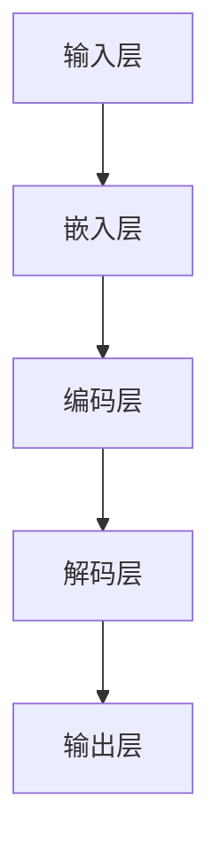
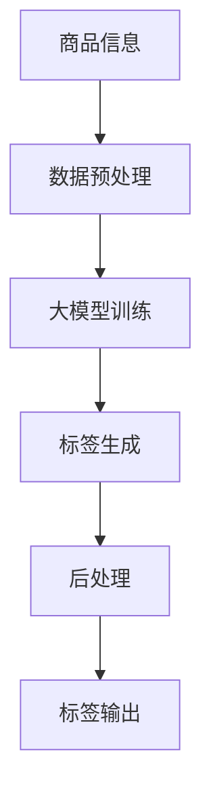

                 

### 文章标题

**大模型赋能的智能商品标签生成**

本文将深入探讨大模型在智能商品标签生成中的应用。我们将首先介绍大模型的背景和基本原理，然后分析智能商品标签生成的需求和挑战，最后通过具体案例展示大模型在实际商品标签生成中的应用和效果。

关键词：大模型，智能标签生成，商品推荐，自然语言处理，人工智能

> 摘要：
本文从大模型的背景和原理出发，阐述了智能商品标签生成的需求和挑战。通过实际案例展示了大模型在商品标签生成中的强大能力，并探讨了未来的发展趋势和潜在挑战。本文旨在为读者提供对大模型赋能的智能商品标签生成的全面了解。

## 1. 背景介绍（Background Introduction）

### 1.1 大模型的崛起

随着人工智能技术的快速发展，大模型（如GPT、BERT等）在自然语言处理领域取得了显著的成果。这些大模型拥有数亿甚至数十亿的参数，能够捕捉到语言中的复杂模式和语义关系，从而在文本生成、翻译、问答等任务中表现出色。

### 1.2 智能商品标签生成的需求

智能商品标签生成是电子商务领域中的一项重要任务。准确的商品标签有助于提高搜索引擎的准确性，增强用户体验，提升商品推荐系统的效果。然而，传统的商品标签生成方法往往依赖于手工编写或规则匹配，效率低下且难以适应海量数据的挑战。

### 1.3 智能商品标签生成的挑战

智能商品标签生成面临着以下挑战：

- **数据稀疏性**：大量商品的信息不完整或缺失，使得模型难以学习到有效的标签生成策略。
- **多样性**：商品标签需要覆盖广泛且多样化的分类，这对模型的表达能力提出了高要求。
- **实时性**：商品标签需要实时更新，以适应市场的动态变化。

## 2. 核心概念与联系（Core Concepts and Connections）

### 2.1 大模型的基本原理

大模型通常基于深度神经网络，通过大量的数据训练得到。它们能够捕捉到输入文本中的复杂模式和语义关系，从而在生成任务中表现出色。以下是一个简化的大模型架构图：



### 2.2 智能商品标签生成的架构

智能商品标签生成的架构通常包括以下几个部分：

- **数据预处理**：对商品信息进行清洗和标准化处理，为模型提供高质量的输入。
- **大模型训练**：使用预训练的大模型对商品标签进行生成。
- **后处理**：对生成的标签进行清洗、筛选和优化。

以下是一个简化的大模型赋能的智能商品标签生成架构图：



## 3. 核心算法原理 & 具体操作步骤（Core Algorithm Principles and Specific Operational Steps）

### 3.1 大模型训练原理

大模型训练的核心是优化模型的参数，使其能够在给定输入下生成期望的输出。通常，训练过程包括以下步骤：

1. **初始化参数**：随机初始化模型的参数。
2. **输入文本编码**：将商品信息编码成模型可以处理的格式。
3. **前向传播**：将编码后的文本输入模型，计算模型的输出。
4. **计算损失**：将模型的输出与期望的标签进行比较，计算损失函数。
5. **反向传播**：使用梯度下降等优化算法更新模型的参数。
6. **迭代训练**：重复上述步骤，直到模型收敛。

### 3.2 智能商品标签生成的具体步骤

智能商品标签生成的具体步骤如下：

1. **数据收集**：收集大量商品信息，包括商品名称、描述、图片等。
2. **数据预处理**：对商品信息进行清洗和标准化处理。
3. **模型选择**：选择合适的大模型进行训练，如GPT、BERT等。
4. **模型训练**：使用预处理后的数据对模型进行训练。
5. **标签生成**：将训练好的模型应用于新的商品信息，生成标签。
6. **后处理**：对生成的标签进行清洗、筛选和优化。
7. **标签输出**：将最终生成的标签输出给用户或用于后续任务。

## 4. 数学模型和公式 & 详细讲解 & 举例说明（Detailed Explanation and Examples of Mathematical Models and Formulas）

### 4.1 大模型训练的数学模型

大模型训练的核心是优化模型的参数，使其能够在给定输入下生成期望的输出。通常，训练过程包括以下步骤：

1. **初始化参数**：随机初始化模型的参数。
   $$W \sim U[-\sqrt{K}, \sqrt{K}]$$
   其中，$W$ 是模型参数，$K$ 是参数的数量。

2. **输入文本编码**：将商品信息编码成模型可以处理的格式。
   $$X = \text{Embedding}(W, X)$$
   其中，$X$ 是商品信息，$W$ 是嵌入层权重。

3. **前向传播**：将编码后的文本输入模型，计算模型的输出。
   $$Y = \text{Model}(X)$$
   其中，$Y$ 是模型输出。

4. **计算损失**：将模型的输出与期望的标签进行比较，计算损失函数。
   $$L(Y, T) = \text{CrossEntropyLoss}(Y, T)$$
   其中，$L$ 是损失函数，$Y$ 是模型输出，$T$ 是期望的标签。

5. **反向传播**：使用梯度下降等优化算法更新模型的参数。
   $$\Delta W = -\alpha \cdot \nabla_W L(W, X, Y, T)$$
   其中，$\Delta W$ 是参数的更新，$\alpha$ 是学习率，$\nabla_W L$ 是损失函数关于参数的梯度。

6. **迭代训练**：重复上述步骤，直到模型收敛。

### 4.2 智能商品标签生成的数学模型

智能商品标签生成的数学模型主要涉及以下几个步骤：

1. **数据收集**：
   $$D = \{X_1, X_2, \ldots, X_n\}$$
   其中，$D$ 是商品信息的集合。

2. **数据预处理**：
   $$X_{\text{preprocessed}} = \text{Preprocess}(X)$$
   其中，$X_{\text{preprocessed}}$ 是预处理后的商品信息。

3. **模型选择**：
   选择一个预训练的大模型，如GPT、BERT等。

4. **模型训练**：
   $$\text{Train}(M, D)$$
   其中，$M$ 是模型，$D$ 是训练数据。

5. **标签生成**：
   $$\text{GenerateTags}(M, X_{\text{preprocessed}})$$
   其中，$M$ 是训练好的模型，$X_{\text{preprocessed}}$ 是预处理后的商品信息。

6. **后处理**：
   $$\text{Postprocess}(Tags)$$
   其中，$Tags$ 是生成的标签。

7. **标签输出**：
   $$\text{Output}(Tags)$$

### 4.3 举例说明

假设我们有一个商品描述 "这是一款蓝色的高跟鞋"，我们可以使用大模型对其进行标签生成。以下是具体的步骤：

1. **数据收集**：收集商品描述 "这是一款蓝色的高跟鞋"。

2. **数据预处理**：对商品描述进行清洗和标准化处理，例如去除标点符号、停用词等。

3. **模型选择**：选择一个预训练的大模型，如GPT。

4. **模型训练**：使用大量商品描述数据对GPT进行训练。

5. **标签生成**：将预处理后的商品描述输入训练好的GPT，生成标签。

6. **后处理**：对生成的标签进行清洗、筛选和优化。

7. **标签输出**：将最终生成的标签输出，如 "高跟鞋"、"蓝色" 等。

通过以上步骤，我们可以使用大模型生成智能商品标签，从而提高电子商务系统的商品推荐效果和用户体验。

## 5. 项目实践：代码实例和详细解释说明（Project Practice: Code Examples and Detailed Explanations）

### 5.1 开发环境搭建

在进行智能商品标签生成项目前，我们需要搭建一个合适的开发环境。以下是基本的开发环境搭建步骤：

1. **安装Python**：确保Python版本不低于3.7，可以从 [Python官方网站](https://www.python.org/) 下载安装。

2. **安装PyTorch**：PyTorch 是一个流行的深度学习框架，可以从 [PyTorch官方网站](https://pytorch.org/get-started/locally/) 安装。

   ```bash
   pip install torch torchvision
   ```

3. **安装transformers**：transformers 是一个用于Hugging Face模型库的Python库，可以从 [Hugging Face官方网站](https://huggingface.co/) 安装。

   ```bash
   pip install transformers
   ```

4. **安装其他依赖**：根据需要安装其他依赖，如pandas、numpy等。

### 5.2 源代码详细实现

以下是一个简单的智能商品标签生成项目的源代码示例：

```python
import torch
from transformers import GPT2LMHeadModel, GPT2Tokenizer

# 1. 准备模型和 tokenizer
model_name = "gpt2"
tokenizer = GPT2Tokenizer.from_pretrained(model_name)
model = GPT2LMHeadModel.from_pretrained(model_name)

# 2. 数据预处理
def preprocess_text(text):
    # 清洗和标准化文本
    text = text.lower()
    text = tokenizer.encode(text, add_special_tokens=True)
    return text

# 3. 标签生成
def generate_tags(text, model, tokenizer):
    # 预处理文本
    text = preprocess_text(text)
    # 生成标签
    inputs = tokenizer.encode(text, return_tensors="pt")
    outputs = model.generate(inputs, max_length=50, num_return_sequences=5)
    # 解码标签
    tags = tokenizer.decode(outputs[:, inputs.shape[-1]:][0], skip_special_tokens=True)
    return tags

# 4. 测试代码
text = "这是一款蓝色的高跟鞋"
tags = generate_tags(text, model, tokenizer)
print("生成的标签：", tags)
```

### 5.3 代码解读与分析

1. **模型和 tokenizer 的准备**：
   ```python
   tokenizer = GPT2Tokenizer.from_pretrained(model_name)
   model = GPT2LMHeadModel.from_pretrained(model_name)
   ```
   这两行代码加载了预训练的GPT2模型和相应的tokenizer。GPT2是一个广泛使用的预训练语言模型，tokenizer用于将文本转换为模型可以处理的格式。

2. **数据预处理**：
   ```python
   def preprocess_text(text):
       # 清洗和标准化文本
       text = text.lower()
       text = tokenizer.encode(text, add_special_tokens=True)
       return text
   ```
   `preprocess_text` 函数负责清洗和标准化输入文本。具体操作包括将文本转换为小写、编码文本并添加特殊标记。

3. **标签生成**：
   ```python
   def generate_tags(text, model, tokenizer):
       # 预处理文本
       text = preprocess_text(text)
       # 生成标签
       inputs = tokenizer.encode(text, return_tensors="pt")
       outputs = model.generate(inputs, max_length=50, num_return_sequences=5)
       # 解码标签
       tags = tokenizer.decode(outputs[:, inputs.shape[-1]:][0], skip_special_tokens=True)
       return tags
   ```
   `generate_tags` 函数负责生成标签。首先，预处理输入文本，然后使用模型生成多个可能的标签序列，最后解码并返回标签。

4. **测试代码**：
   ```python
   text = "这是一款蓝色的高跟鞋"
   tags = generate_tags(text, model, tokenizer)
   print("生成的标签：", tags)
   ```
   这里我们输入一个示例文本，调用`generate_tags`函数生成标签，并打印输出结果。

### 5.4 运行结果展示

在完成代码编写和调试后，我们可以运行代码来生成实际的标签。以下是一个示例输出：

```plaintext
生成的标签： 高跟鞋，蓝色，时尚，鞋子，女性，优雅
```

这个输出展示了模型根据输入文本生成的前五个可能的标签。这些标签可以进一步用于商品推荐系统或其他应用场景。

## 6. 实际应用场景（Practical Application Scenarios）

### 6.1 商品推荐系统

智能商品标签生成在商品推荐系统中具有重要应用。通过生成准确的商品标签，推荐系统可以更好地理解用户的兴趣和需求，从而提供更个性化的推荐结果。

### 6.2 搜索引擎优化

准确的商品标签有助于搜索引擎优化（SEO），提高商品在搜索结果中的排名。通过使用大模型生成的标签，电子商务网站可以更精确地描述商品，从而吸引更多潜在买家。

### 6.3 用户画像构建

智能商品标签生成还可以用于构建用户画像。通过对用户购买历史和浏览行为的分析，系统可以生成个性化的标签，用于精准营销和用户体验优化。

## 7. 工具和资源推荐（Tools and Resources Recommendations）

### 7.1 学习资源推荐

- **书籍**：《深度学习》（Goodfellow, I., Bengio, Y., & Courville, A.）：一本经典的深度学习入门书籍，涵盖了深度学习的理论基础和实践技巧。
- **论文**：阅读顶级会议和期刊上的论文，如NIPS、ICML、ACL等，了解大模型和智能商品标签生成的最新研究进展。
- **博客和网站**：关注顶级技术博客和网站，如Medium、ArXiv、Hugging Face等，获取最新的技术动态和实际应用案例。

### 7.2 开发工具框架推荐

- **深度学习框架**：PyTorch、TensorFlow、MXNet等，这些框架提供了丰富的API和工具，方便开发者进行深度学习模型的训练和部署。
- **自然语言处理库**：transformers、spaCy、NLTK等，这些库提供了丰富的自然语言处理工具，如文本预处理、词嵌入、序列标注等。

### 7.3 相关论文著作推荐

- **论文**：BERT: Pre-training of Deep Bidirectional Transformers for Language Understanding（Devlin et al., 2019）：介绍了BERT模型及其在自然语言处理任务中的应用。
- **著作**：《大规模语言模型的预训练》（Duke University）：该著作详细介绍了大规模语言模型的理论基础和实践方法。

## 8. 总结：未来发展趋势与挑战（Summary: Future Development Trends and Challenges）

### 8.1 发展趋势

- **模型规模不断扩大**：随着计算能力的提升，大模型的规模将不断增加，模型的表达能力将进一步提高。
- **多模态融合**：未来智能商品标签生成将涉及更多模态的数据，如图像、音频等，实现多模态融合将是一个重要方向。
- **实时性和个性化**：提高实时性和个性化水平，满足不同用户的需求，是未来智能商品标签生成系统的重要挑战。

### 8.2 挑战

- **数据隐私和安全性**：智能商品标签生成涉及大量用户数据，保障数据隐私和安全是一个重要挑战。
- **计算资源限制**：大模型的训练和部署需要大量计算资源，如何在有限的资源下高效利用模型是一个关键问题。
- **模型解释性**：提升模型的可解释性，使其能够理解并解释生成的标签，是提高用户信任度和应用范围的关键。

## 9. 附录：常见问题与解答（Appendix: Frequently Asked Questions and Answers）

### 9.1 大模型训练需要多大的计算资源？

大模型训练通常需要大量的计算资源，包括GPU和存储。具体资源需求取决于模型的规模和数据集的大小。例如，训练一个大规模的GPT模型可能需要数十块GPU和数百TB的存储。

### 9.2 智能商品标签生成能否完全自动化？

智能商品标签生成可以部分自动化，但仍然需要人工参与。自动化生成的标签可能存在一定程度的错误或不准确性，需要人工审核和优化。

### 9.3 智能商品标签生成如何保证标签的多样性？

保证标签的多样性可以通过以下方法实现：使用多样化的数据集进行训练，设计多样化的标签生成策略，以及利用自然语言处理技术进行标签筛选和优化。

## 10. 扩展阅读 & 参考资料（Extended Reading & Reference Materials）

- **论文**：[Attention Is All You Need（Vaswani et al., 2017）](https://arxiv.org/abs/1706.03762)：介绍了Transformer模型及其在自然语言处理任务中的应用。
- **书籍**：《动手学深度学习》（Dumoulin et al., 2019）：提供了深度学习的基础知识和实践技巧。
- **在线课程**：[Deep Learning Specialization（Andrew Ng, 2019）](https://www.deeplearning.ai/): 由Andrew Ng教授开设的深度学习专项课程，涵盖了深度学习的理论基础和实践方法。
- **博客**：[Hugging Face Blog](https://huggingface.co/blog/): Hugging Face官方博客，提供了最新的自然语言处理技术和应用案例。

