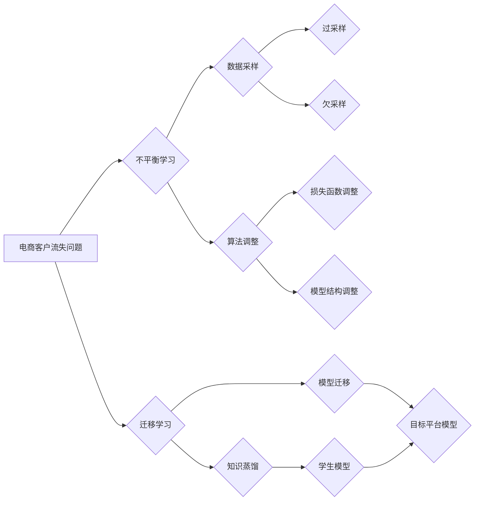

                 

## 1. 背景介绍

在当今数据驱动的商业环境中，客户流失已成为电商企业面临的重大挑战。客户流失不仅会导致收入减少，还会损害品牌声誉和市场份额。因此，准确预测客户流失风险并采取有效的干预措施至关重要。传统的客户流失预测模型通常基于历史数据，但这些模型往往忽略了数据的不平衡性问题，导致预测精度下降。

电商平台上的客户数据通常呈现出类别不平衡的特征，即流失客户的数量远少于保留客户的数量。这种不平衡性会导致模型训练过程中，模型过度拟合保留客户的特征，而对流失客户的特征学习不足，从而降低模型的预测准确性，尤其是在预测流失客户方面。

为了解决这个问题，本文将探讨在电商客户流失模型中应用不平衡学习和迁移学习技术，提高模型的预测精度和泛化能力。

## 2. 核心概念与联系

### 2.1 不平衡学习

不平衡学习是指在训练数据中，不同类别样本数量相差悬殊的情况下，训练机器学习模型的问题。在客户流失预测中，流失客户和保留客户的数量差距较大，属于典型的类别不平衡问题。

### 2.2 迁移学习

迁移学习是指利用已训练好的模型在新的任务或领域上进行训练，以提高模型的性能。在电商客户流失预测中，我们可以利用来自其他电商平台或业务领域的客户流失模型，将其迁移到目标电商平台，以减少模型训练所需的数据量和时间。

### 2.3 核心概念架构



## 3. 核心算法原理 & 具体操作步骤

### 3.1 算法原理概述

不平衡学习和迁移学习可以结合使用，以提高电商客户流失模型的预测精度。

**不平衡学习**主要通过以下两种方法来解决数据不平衡问题：

* **过采样:** 在训练数据中增加少数类样本的数量，例如使用SMOTE算法生成新的流失客户样本。
* **欠采样:** 在训练数据中减少多数类样本的数量，例如随机删除部分保留客户样本。

**迁移学习**则通过利用已训练好的模型的知识，来帮助模型更快地适应新的任务或领域。常见的迁移学习方法包括：

* **模型迁移:** 将预训练好的模型直接迁移到目标平台，并进行微调。
* **知识蒸馏:** 将预训练好的模型的知识“蒸馏”到学生模型中，学生模型在目标平台上进行训练。

### 3.2 算法步骤详解

**不平衡学习步骤:**

1. **数据预处理:** 对客户数据进行清洗、转换和特征工程，提取有价值的特征。
2. **数据平衡:** 使用过采样或欠采样方法，将训练数据平衡到不同类别样本数量相近。
3. **模型选择:** 选择合适的机器学习模型，例如逻辑回归、支持向量机或决策树。
4. **模型训练:** 使用平衡后的训练数据训练模型。
5. **模型评估:** 使用测试数据评估模型的预测精度，并进行调参优化。

**迁移学习步骤:**

1. **源域数据准备:** 收集来自其他电商平台或业务领域的客户流失数据作为源域数据。
2. **预训练模型选择:** 选择合适的预训练模型，例如BERT或GPT-3。
3. **模型迁移:** 将预训练模型迁移到目标平台，并进行微调。
4. **知识蒸馏:** 将预训练模型的知识“蒸馏”到学生模型中，学生模型在目标平台上进行训练。
5. **模型评估:** 使用测试数据评估模型的预测精度，并进行调参优化。

### 3.3 算法优缺点

**不平衡学习:**

* **优点:** 可以有效地解决数据不平衡问题，提高模型对少数类样本的预测精度。
* **缺点:** 过采样可能会导致过拟合，欠采样可能会丢失重要信息。

**迁移学习:**

* **优点:** 可以利用已训练好的模型的知识，减少模型训练所需的数据量和时间，提高模型的泛化能力。
* **缺点:** 需要找到合适的源域数据，源域数据与目标域数据之间存在差异可能会影响模型性能。

### 3.4 算法应用领域

不平衡学习和迁移学习在电商客户流失预测等领域具有广泛的应用前景。

* **电商客户流失预测:** 预测客户流失风险，并采取措施挽留客户。
* **欺诈检测:** 识别欺诈交易，防止损失。
* **信用风险评估:** 评估客户的信用风险，降低贷款风险。
* **医疗诊断:** 预测疾病风险，进行早期诊断和治疗。

## 4. 数学模型和公式 & 详细讲解 & 举例说明

### 4.1 数学模型构建

在电商客户流失预测中，我们可以使用逻辑回归模型来构建数学模型。逻辑回归模型将客户特征映射到一个概率值，该概率值表示客户流失的可能性。

### 4.2 公式推导过程

逻辑回归模型的数学公式如下：

$$
P(y=1|x) = \frac{1}{1 + e^{-(w^T x + b)}}
$$

其中：

* $P(y=1|x)$ 是给定特征 $x$ 时，客户流失的概率。
* $w$ 是模型参数向量。
* $x$ 是客户特征向量。
* $b$ 是模型偏置项。
* $e$ 是自然对数的底数。

### 4.3 案例分析与讲解

假设我们有一个电商平台，收集了客户的年龄、购买频率、平均消费金额等特征数据。我们可以使用逻辑回归模型来预测客户流失的可能性。

例如，如果一个客户的年龄为30岁，购买频率为每月2次，平均消费金额为1000元，那么我们可以将这些特征值代入逻辑回归模型的公式中，计算出该客户流失的概率。

## 5. 项目实践：代码实例和详细解释说明

### 5.1 开发环境搭建

为了实现电商客户流失预测模型，我们需要搭建一个开发环境。

* **操作系统:** Linux 或 Windows
* **编程语言:** Python
* **机器学习库:** scikit-learn
* **数据处理库:** pandas
* **可视化库:** matplotlib 或 seaborn

### 5.2 源代码详细实现

```python
import pandas as pd
from sklearn.model_selection import train_test_split
from sklearn.linear_model import LogisticRegression
from sklearn.metrics import accuracy_score

# 加载数据
data = pd.read_csv('customer_data.csv')

# 数据预处理
# ...

# 划分训练集和测试集
X_train, X_test, y_train, y_test = train_test_split(data.drop('churn', axis=1), data['churn'], test_size=0.2, random_state=42)

# 训练模型
model = LogisticRegression()
model.fit(X_train, y_train)

# 预测结果
y_pred = model.predict(X_test)

# 评估模型
accuracy = accuracy_score(y_test, y_pred)
print(f'模型准确率: {accuracy}')
```

### 5.3 代码解读与分析

* **数据加载:** 使用 pandas 库加载客户数据。
* **数据预处理:** 对数据进行清洗、转换和特征工程，例如处理缺失值、编码类别变量、提取特征。
* **数据划分:** 使用 train_test_split 函数将数据划分成训练集和测试集。
* **模型训练:** 使用 LogisticRegression 类创建逻辑回归模型，并使用 fit 方法训练模型。
* **模型预测:** 使用 predict 方法对测试集进行预测。
* **模型评估:** 使用 accuracy_score 函数计算模型的准确率。

### 5.4 运行结果展示

运行上述代码后，会输出模型的准确率。

## 6. 实际应用场景

### 6.1 客户流失预警

电商平台可以利用客户流失预测模型，对即将流失的客户进行预警，并采取措施挽留客户。例如，可以向即将流失的客户发送优惠券、促销信息或个性化推荐，以提高客户的粘性。

### 6.2 客户画像分析

电商平台可以利用客户流失预测模型，分析不同客户群体的流失特征，构建客户画像，并针对不同客户群体的需求进行个性化营销。

### 6.3 运营策略优化

电商平台可以利用客户流失预测模型，评估不同运营策略的效果，优化运营策略，提高客户留存率和收入。

### 6.4 未来应用展望

随着人工智能技术的不断发展，电商客户流失预测模型将更加智能化、精准化。未来，我们可以期待以下应用场景：

* **实时流失预测:** 利用实时数据流，对客户流失进行实时预测，并及时采取干预措施。
* **个性化流失干预:** 根据客户的个性化特征，制定个性化的流失干预方案。
* **多渠道流失预测:** 将来自不同渠道的数据整合起来，进行全面的客户流失预测。

## 7. 工具和资源推荐

### 7.1 学习资源推荐

* **书籍:**
    * 《机器学习》 - 周志华
    * 《深入理解机器学习》 -  李航
* **在线课程:**
    * Coursera: Machine Learning
    * edX: Artificial Intelligence
* **博客:**
    * Towards Data Science
    * Machine Learning Mastery

### 7.2 开发工具推荐

* **Python:** 
    * scikit-learn
    * pandas
    * matplotlib
    * seaborn
* **云平台:**
    * AWS
    * Azure
    * GCP

### 7.3 相关论文推荐

* **Imbalanced Learning: Foundations, Algorithms, and Applications**
* **Transfer Learning**
* **Deep Learning for Customer Churn Prediction**

## 8. 总结：未来发展趋势与挑战

### 8.1 研究成果总结

本文探讨了在电商客户流失模型中应用不平衡学习和迁移学习技术，提高模型的预测精度和泛化能力。通过分析核心概念、算法原理、代码实例以及实际应用场景，我们看到了这些技术的巨大潜力。

### 8.2 未来发展趋势

未来，电商客户流失预测模型将朝着以下方向发展：

* **更精准的预测:** 利用更先进的机器学习算法和深度学习模型，提高模型的预测精度。
* **更个性化的干预:** 根据客户的个性化特征，制定个性化的流失干预方案。
* **更全面的分析:** 将来自不同渠道的数据整合起来，进行全面的客户流失分析。

### 8.3 面临的挑战

尽管不平衡学习和迁移学习技术在电商客户流失预测领域具有巨大潜力，但仍面临一些挑战：

* **数据质量:** 客户数据质量直接影响模型的性能，需要不断提高数据质量。
* **模型解释性:** 深度学习模型的解释性较差，需要开发更易于解释的模型。
* **隐私保护:** 客户数据涉及隐私问题，需要采取措施保护客户隐私。

### 8.4 研究展望

未来，我们将继续研究不平衡学习和迁移学习技术在电商客户流失预测领域的应用，探索更精准、更个性化、更全面的客户流失预测模型。

## 9. 附录：常见问题与解答

### 9.1 什么是类别不平衡问题？

类别不平衡问题是指在训练数据中，不同类别样本数量相差悬殊的情况。

### 9.2 如何解决类别不平衡问题？

常用的解决类别不平衡问题的技术包括过采样和欠采样。

### 9.3 什么是迁移学习？

迁移学习是指利用已训练好的模型在新的任务或领域上进行训练，以提高模型的性能。


作者：禅与计算机程序设计艺术 / Zen and the Art of Computer Programming 
<end_of_turn>

