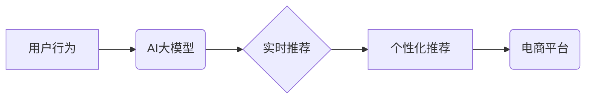

                 

## 电商平台中AI大模型的实时推荐技术

> 关键词：AI大模型、实时推荐、电商平台、协同过滤、深度学习、个性化推荐、模型部署

## 1. 背景介绍

在当今数据爆炸的时代，电商平台面临着巨大的用户规模和商品种类，如何精准地推荐用户感兴趣的商品，提升用户体验和转化率成为关键挑战。传统推荐系统主要依赖于基于内容的过滤和基于协同过滤的方法，但这些方法在面对海量数据和用户个性化需求时显得力不从心。

近年来，随着深度学习技术的快速发展，AI大模型在推荐系统领域展现出巨大的潜力。AI大模型能够学习用户行为、商品特征以及其他相关信息之间的复杂关系，从而提供更精准、个性化的推荐结果。实时推荐技术则进一步提升了推荐系统的效率和响应速度，能够根据用户实时行为动态调整推荐策略，提供更及时、更符合用户意图的推荐。

## 2. 核心概念与联系

### 2.1  AI大模型

AI大模型是指在海量数据上训练的深度学习模型，拥有强大的学习能力和泛化能力。常见的AI大模型架构包括Transformer、BERT、GPT等，这些模型能够学习复杂的语义关系和模式，在自然语言处理、图像识别、语音合成等领域取得了突破性进展。

### 2.2  实时推荐

实时推荐是指根据用户实时行为，即时生成推荐结果的技术。实时推荐系统需要具备高性能的计算能力和低延迟的响应速度，能够快速处理用户请求并提供个性化的推荐。

### 2.3  电商平台推荐系统

电商平台推荐系统旨在帮助用户发现感兴趣的商品，提高用户购物体验和转化率。推荐系统通常基于用户历史行为、商品特征、平台数据等信息，通过算法模型生成推荐列表。

**核心概念与联系流程图:**



## 3. 核心算法原理 & 具体操作步骤

### 3.1  算法原理概述

在电商平台中，常用的实时推荐算法包括：

* **协同过滤:** 基于用户对商品的评分或购买历史，预测用户对其他商品的兴趣。
* **内容过滤:** 基于商品的属性和描述，推荐与用户兴趣相符的商品。
* **深度学习:** 利用深度神经网络学习用户行为、商品特征以及其他相关信息之间的复杂关系，提供更精准的推荐。

### 3.2  算法步骤详解

**协同过滤算法步骤:**

1. **数据预处理:** 收集用户行为数据，例如购买历史、浏览记录、评分等，并进行清洗、转换和特征提取。
2. **相似度计算:** 计算用户之间的相似度或商品之间的相似度，常用的方法包括余弦相似度、皮尔逊相关系数等。
3. **推荐生成:** 根据用户与其他用户的相似度或用户与商品的相似度，预测用户对其他商品的兴趣，并生成推荐列表。

**深度学习算法步骤:**

1. **数据预处理:** 收集用户行为数据、商品特征数据以及其他相关数据，并进行清洗、转换和特征提取。
2. **模型构建:** 选择合适的深度学习模型架构，例如Transformer、BERT等，并根据数据特点进行模型参数调整。
3. **模型训练:** 利用训练数据训练深度学习模型，并通过评估指标优化模型参数。
4. **模型部署:** 将训练好的模型部署到线上环境，并根据用户实时行为进行预测和推荐。

### 3.3  算法优缺点

**协同过滤算法:**

* **优点:** 能够发现用户之间的隐性关系，推荐个性化商品。
* **缺点:** 数据稀疏性问题，冷启动问题，容易受到恶意用户的影响。

**深度学习算法:**

* **优点:** 能够学习复杂的用户行为模式，提供更精准的推荐。
* **缺点:** 需要大量的数据进行训练，模型训练时间长，部署成本高。

### 3.4  算法应用领域

协同过滤和深度学习算法广泛应用于电商平台的推荐系统，例如：

* **商品推荐:** 推荐用户可能感兴趣的商品。
* **用户画像:** 建立用户画像，了解用户的兴趣偏好和消费习惯。
* **个性化营销:** 根据用户画像进行个性化营销，提高营销效果。

## 4. 数学模型和公式 & 详细讲解 & 举例说明

### 4.1  数学模型构建

协同过滤算法常用的数学模型包括：

* **用户-商品评分矩阵:** 将用户和商品作为矩阵的行和列，用户对商品的评分作为矩阵元素。
* **协同过滤矩阵分解:** 将用户-商品评分矩阵分解成两个低维矩阵，分别表示用户特征和商品特征，通过矩阵乘法预测用户对商品的评分。

### 4.2  公式推导过程

**协同过滤矩阵分解公式:**

$$
R = U \cdot V^T
$$

其中:

* $R$ 是用户-商品评分矩阵。
* $U$ 是用户特征矩阵。
* $V^T$ 是商品特征矩阵的转置。

### 4.3  案例分析与讲解

假设有一个用户-商品评分矩阵，其中用户和商品分别为1到10，评分为1到5。

**用户特征矩阵:**

```
[0.2 0.5 0.1 0.8 0.3]
[0.1 0.3 0.7 0.2 0.9]
[0.4 0.6 0.2 0.1 0.5]
...
```

**商品特征矩阵:**

```
[0.3 0.1 0.8 0.2 0.5]
[0.2 0.7 0.4 0.9 0.1]
[0.5 0.3 0.2 0.6 0.8]
...
```

通过矩阵乘法，可以预测用户对商品的评分。

## 5. 项目实践：代码实例和详细解释说明

### 5.1  开发环境搭建

* Python 3.x
* TensorFlow/PyTorch
* Jupyter Notebook

### 5.2  源代码详细实现

```python
# 导入必要的库
import tensorflow as tf

# 定义用户-商品评分矩阵
ratings = tf.constant([[5, 4, 3, 2, 1],
                      [4, 5, 2, 1, 3],
                      [3, 2, 5, 4, 1]])

# 定义用户特征矩阵
user_features = tf.Variable(tf.random.normal([3, 2]))

# 定义商品特征矩阵
item_features = tf.Variable(tf.random.normal([5, 2]))

# 计算预测评分
predictions = tf.matmul(user_features, tf.transpose(item_features))

# 损失函数
loss = tf.reduce_mean(tf.square(predictions - ratings))

# 优化器
optimizer = tf.keras.optimizers.Adam()

# 训练模型
for epoch in range(100):
    with tf.GradientTape() as tape:
        loss_value = loss
    gradients = tape.gradient(loss_value, [user_features, item_features])
    optimizer.apply_gradients(zip(gradients, [user_features, item_features]))

# 打印预测评分
print(predictions)
```

### 5.3  代码解读与分析

* 代码首先定义了用户-商品评分矩阵、用户特征矩阵和商品特征矩阵。
* 然后使用矩阵乘法计算预测评分。
* 损失函数采用均方误差，优化器采用Adam优化器。
* 最后通过训练模型，更新用户特征矩阵和商品特征矩阵，从而提高预测评分的准确性。

### 5.4  运行结果展示

训练完成后，代码会输出预测评分矩阵，其中每个元素代表模型预测的用户对商品的评分。

## 6. 实际应用场景

实时推荐技术在电商平台的实际应用场景非常广泛，例如：

* **商品推荐:** 根据用户浏览历史、购物车内容、购买记录等信息，实时推荐用户可能感兴趣的商品。
* **个性化导航:** 根据用户位置、兴趣偏好等信息，实时推荐用户可能需要的服务或商品。
* **促销活动推荐:** 根据用户行为和平台数据，实时推荐用户参与的促销活动。

### 6.4  未来应用展望

随着人工智能技术的不断发展，实时推荐技术将更加智能化、个性化和精准化。未来，实时推荐技术可能应用于以下领域：

* **虚拟现实和增强现实:** 在虚拟现实和增强现实环境中，实时推荐技术可以根据用户的虚拟场景和行为，提供更加沉浸式的购物体验。
* **个性化教育:** 根据用户的学习进度和兴趣，实时推荐个性化的学习内容和资源。
* **智能医疗:** 根据用户的健康状况和需求，实时推荐合适的医疗服务和药物。

## 7. 工具和资源推荐

### 7.1  学习资源推荐

* **书籍:**
    * 《深度学习》
    * 《推荐系统实践》
* **在线课程:**
    * Coursera: 深度学习
    * Udacity: 机器学习工程师
* **博客和网站:**
    * TensorFlow 官方博客
    * PyTorch 官方博客
    * KDnuggets

### 7.2  开发工具推荐

* **TensorFlow:** 开源深度学习框架
* **PyTorch:** 开源深度学习框架
* **Spark:** 大数据处理框架
* **Hadoop:** 大数据处理框架

### 7.3  相关论文推荐

* **Collaborative Filtering for Implicit Feedback Datasets**
* **Deep Learning for Recommender Systems**
* **Neural Collaborative Filtering**

## 8. 总结：未来发展趋势与挑战

### 8.1  研究成果总结

AI大模型在电商平台的实时推荐技术领域取得了显著的成果，能够提供更加精准、个性化的推荐，提升用户体验和转化率。

### 8.2  未来发展趋势

* **模型更加复杂:** 未来，实时推荐模型将更加复杂，能够学习更加丰富的用户行为模式和商品特征。
* **数据更加丰富:** 未来，实时推荐系统将利用更加丰富的用户数据和商品数据，例如用户画像、商品评论、社交关系等。
* **个性化更加精准:** 未来，实时推荐将更加注重个性化，能够根据用户的实时行为和意图提供更加精准的推荐。

### 8.3  面临的挑战

* **数据隐私:** 实时推荐技术需要处理大量用户数据，如何保护用户隐私是一个重要的挑战。
* **模型解释性:** 深度学习模型的决策过程难以解释，如何提高模型的解释性是一个重要的研究方向。
* **实时性与效率:** 实时推荐系统需要具备高性能的计算能力和低延迟的响应速度，如何提高模型的实时性和效率是一个重要的技术挑战。

### 8.4  研究展望

未来，实时推荐技术将继续朝着更加智能化、个性化和精准化的方向发展，为用户提供更加丰富的购物体验和服务。


## 9. 附录：常见问题与解答

* **Q1: 实时推荐技术与传统推荐技术的区别是什么？**

**A1:** 传统推荐技术通常基于离线数据进行模型训练，而实时推荐技术则能够根据用户实时行为进行动态调整，提供更加及时和个性化的推荐。

* **Q2: 如何评估实时推荐系统的性能？**

**A2:** 实时推荐系统的性能可以评估指标包括点击率、转化率、用户满意度等。

* **Q3: 实时推荐技术有哪些应用场景？**

**A3:** 实时推荐技术广泛应用于电商平台、社交媒体、新闻资讯等领域，例如商品推荐、个性化导航、促销活动推荐等。


作者：禅与计算机程序设计艺术 / Zen and the Art of Computer Programming 
<end_of_turn>

