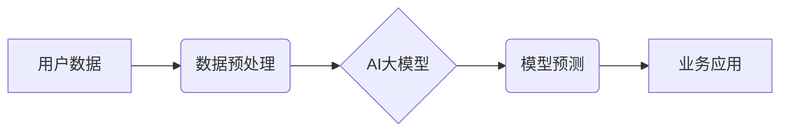

                 

## 电商平台中的AI大模型：从单点突破到全链路优化

> 关键词：电商平台、AI大模型、自然语言处理、推荐系统、个性化服务、供应链优化、机器学习、深度学习

## 1. 背景介绍

近年来，人工智能（AI）技术蓬勃发展，特别是大模型的涌现，为各行各业带来了革命性的变革。电商平台作为信息化和数字化程度极高的行业，也积极探索AI技术的应用，以提升用户体验、优化运营效率和增强竞争力。

传统的电商平台主要依靠规则引擎和人工干预来完成商品推荐、用户画像、客服服务等任务。然而，随着用户需求的不断变化和数据量的激增，传统的模式已难以满足电商平台的快速发展需求。AI大模型凭借其强大的学习能力和泛化能力，能够从海量数据中挖掘出隐藏的模式和规律，为电商平台提供更精准、更个性化的服务。

## 2. 核心概念与联系

**2.1 AI大模型概述**

AI大模型是指在海量数据上训练的具有强大泛化能力的深度学习模型。其规模庞大，参数数量众多，能够处理复杂的任务，并展现出令人惊叹的性能。

**2.2 电商平台应用场景**

AI大模型在电商平台的应用场景广泛，主要包括：

* **商品推荐:** 基于用户行为、商品属性和市场趋势，精准推荐用户感兴趣的商品。
* **用户画像:** 分析用户浏览历史、购买记录、评价反馈等数据，构建用户画像，实现精准营销和个性化服务。
* **客服服务:** 利用自然语言处理技术，构建智能客服系统，自动回复用户咨询，提高服务效率。
* **内容生成:** 生成商品描述、促销文案、广告创意等内容，提升营销效果。
* **供应链优化:** 预估需求、优化库存、提高物流效率等，降低运营成本。

**2.3 架构图**



## 3. 核心算法原理 & 具体操作步骤

**3.1 算法原理概述**

电商平台中的AI大模型通常基于深度学习算法，例如Transformer、BERT、GPT等。这些算法能够学习数据中的复杂模式和关系，并生成预测结果。

**3.2 算法步骤详解**

1. **数据收集和预处理:** 收集用户行为、商品信息、市场数据等相关数据，并进行清洗、转换、编码等预处理操作。
2. **模型选择和训练:** 根据具体应用场景选择合适的AI大模型，并利用训练数据进行模型训练。
3. **模型评估和优化:** 使用测试数据评估模型性能，并根据评估结果进行模型调参和优化。
4. **模型部署和应用:** 将训练好的模型部署到生产环境，并将其应用于实际业务场景。

**3.3 算法优缺点**

**优点:**

* 强大的学习能力，能够从海量数据中挖掘出隐藏的模式和规律。
* 泛化能力强，能够应用于不同的场景和任务。
* 持续学习和改进，随着数据量的增加，模型性能会不断提升。

**缺点:**

* 训练成本高，需要大量的计算资源和时间。
* 数据依赖性强，模型性能受训练数据质量的影响较大。
* 可解释性差，难以理解模型的决策过程。

**3.4 算法应用领域**

* **推荐系统:** 基于用户行为和商品属性，推荐用户感兴趣的商品。
* **搜索引擎:** 理解用户搜索意图，并返回最相关的搜索结果。
* **自然语言处理:** 处理文本数据，例如文本分类、情感分析、机器翻译等。
* **图像识别:**识别图像中的物体、场景和人物。

## 4. 数学模型和公式 & 详细讲解 & 举例说明

**4.1 数学模型构建**

在电商平台中，AI大模型通常采用神经网络模型，其数学模型可以表示为：

$$
y = f(W_1x_1 + W_2x_2 + ... + W_nx_n + b)
$$

其中：

* $y$ 是模型输出
* $x_1, x_2, ..., x_n$ 是输入特征
* $W_1, W_2, ..., W_n$ 是权重参数
* $b$ 是偏置项
* $f$ 是激活函数

**4.2 公式推导过程**

神经网络模型的训练过程是通过优化权重参数来最小化模型预测误差的过程。常用的优化算法包括梯度下降法、Adam算法等。

梯度下降法的核心思想是通过迭代更新权重参数，使得模型预测误差逐渐减小。具体步骤如下：

1. 初始化权重参数
2. 计算模型预测误差
3. 计算梯度，即权重参数对误差的偏导数
4. 更新权重参数，方向与梯度相反，大小与学习率成正比

**4.3 案例分析与讲解**

例如，在商品推荐场景中，AI大模型可以根据用户的浏览历史、购买记录、商品属性等特征，预测用户对特定商品的兴趣程度。模型的输出可以是一个评分，表示用户对该商品的喜好程度。

## 5. 项目实践：代码实例和详细解释说明

**5.1 开发环境搭建**

* Python 3.x
* TensorFlow 或 PyTorch 深度学习框架
* Jupyter Notebook 或 VS Code 开发环境

**5.2 源代码详细实现**

```python
import tensorflow as tf

# 定义模型结构
model = tf.keras.Sequential([
    tf.keras.layers.Embedding(input_dim=10000, output_dim=128),
    tf.keras.layers.LSTM(units=64),
    tf.keras.layers.Dense(units=1, activation='sigmoid')
])

# 编译模型
model.compile(optimizer='adam', loss='binary_crossentropy', metrics=['accuracy'])

# 训练模型
model.fit(x_train, y_train, epochs=10)

# 评估模型
loss, accuracy = model.evaluate(x_test, y_test)
print('Loss:', loss)
print('Accuracy:', accuracy)
```

**5.3 代码解读与分析**

* 代码首先定义了一个简单的深度学习模型，包含嵌入层、LSTM层和全连接层。
* 嵌入层将用户和商品的ID转换为稠密的向量表示。
* LSTM层能够捕捉用户行为序列中的时间依赖性。
* 全连接层将LSTM层的输出映射到预测结果。
* 模型使用Adam优化器、二元交叉熵损失函数和准确率作为评估指标。
* 代码最后展示了模型的训练和评估过程。

**5.4 运行结果展示**

训练完成后，可以将模型应用于实际场景，例如预测用户对特定商品的兴趣程度。

## 6. 实际应用场景

**6.1 商品推荐系统**

AI大模型可以根据用户的浏览历史、购买记录、评价反馈等数据，推荐用户感兴趣的商品。例如，亚马逊的推荐系统就利用AI大模型，为用户提供个性化的商品推荐。

**6.2 用户画像分析**

AI大模型可以分析用户的行为数据，构建用户画像，了解用户的兴趣爱好、消费习惯等信息。例如，淘宝的营销系统就利用用户画像，进行精准营销和个性化服务。

**6.3 智能客服系统**

AI大模型可以处理用户咨询，自动回复用户问题，提高客服效率。例如，京东的智能客服系统就利用AI大模型，为用户提供24小时在线服务。

**6.4 内容生成系统**

AI大模型可以生成商品描述、促销文案、广告创意等内容，提升营销效果。例如，拼多多就利用AI大模型，生成个性化的促销文案。

**6.5 供应链优化**

AI大模型可以预测需求、优化库存、提高物流效率等，降低运营成本。例如，阿里巴巴的供应链管理系统就利用AI大模型，优化物流配送路线。

**6.6 未来应用展望**

随着AI技术的不断发展，AI大模型在电商平台的应用场景将会更加广泛，例如：

* **虚拟试衣间:** 利用AI大模型，实现虚拟试衣间功能，让用户在家就能试穿衣服。
* **个性化商品设计:** 利用AI大模型，根据用户的喜好和需求，设计个性化的商品。
* **智能物流机器人:** 利用AI大模型，控制物流机器人，提高物流效率。

## 7. 工具和资源推荐

**7.1 学习资源推荐**

* **书籍:**
    * 深度学习
    * 自然语言处理
    * 机器学习实战
* **在线课程:**
    * Coursera
    * edX
    * Udacity

**7.2 开发工具推荐**

* **TensorFlow:** 开源深度学习框架
* **PyTorch:** 开源深度学习框架
* **Jupyter Notebook:** 数据分析和可视化工具
* **VS Code:** 代码编辑器

**7.3 相关论文推荐**

* Attention Is All You Need
* BERT: Pre-training of Deep Bidirectional Transformers for Language Understanding
* GPT-3: Language Models are Few-Shot Learners

## 8. 总结：未来发展趋势与挑战

**8.1 研究成果总结**

AI大模型在电商平台的应用取得了显著成果，例如商品推荐、用户画像、智能客服等方面都取得了突破。

**8.2 未来发展趋势**

* **模型规模和能力的提升:** 未来，AI大模型的规模和能力将会进一步提升，能够处理更复杂的任务，提供更精准的服务。
* **模型的可解释性和安全性:** 随着AI技术的应用越来越广泛，模型的可解释性和安全性将成为研究的重点。
* **模型的个性化定制:** 未来，AI大模型将更加个性化，能够根据用户的需求和喜好进行定制。

**8.3 面临的挑战**

* **数据质量和隐私问题:** AI大模型的训练需要海量数据，而数据质量和隐私问题是需要解决的挑战。
* **模型的训练成本:** 训练大型AI模型需要大量的计算资源和时间，成本较高。
* **模型的部署和维护:** 将AI模型部署到生产环境并进行维护也是一个挑战。

**8.4 研究展望**

未来，AI大模型在电商平台的应用将会更加广泛和深入，为用户提供更加个性化、智能化的服务。


## 9. 附录：常见问题与解答

**9.1 如何选择合适的AI大模型？**

选择合适的AI大模型需要根据具体的应用场景和数据特点进行选择。例如，对于文本分类任务，BERT模型效果较好；对于商品推荐任务，Transformer模型效果较好。

**9.2 如何解决数据质量和隐私问题？**

数据质量和隐私问题可以通过以下方式解决：

* 数据清洗和预处理
* 数据匿名化和加密
* 遵守数据隐私法规

**9.3 如何降低模型的训练成本？**

降低模型的训练成本可以通过以下方式实现：

* 使用云计算平台进行训练
* 采用模型压缩和剪枝技术
* 使用分布式训练技术


作者：禅与计算机程序设计艺术 / Zen and the Art of Computer Programming 
<end_of_turn>

