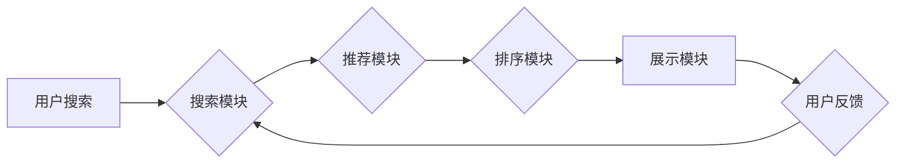

                 

## 电商平台搜索推荐系统的AI 大模型优化：提高系统性能、效率与准确率

> 关键词：电商平台、搜索推荐系统、AI 大模型、模型优化、性能提升、效率提升、准确率提升

## 1. 背景介绍

在当今数据爆炸的时代，电商平台搜索推荐系统已成为用户获取商品信息和完成购买的重要途径。传统的搜索推荐系统主要依赖于规则引擎和基于特征的机器学习算法，但随着用户行为数据量的激增和用户需求的多样化，这些传统方法逐渐难以满足用户的个性化需求和平台的快速发展。

近年来，深度学习技术的发展为电商平台搜索推荐系统带来了新的机遇。基于 Transformer 架构的 AI 大模型，例如 BERT、GPT 和 T5 等，凭借其强大的语义理解和文本生成能力，在搜索推荐任务中展现出显著的优势。

然而，AI 大模型的训练和部署也面临着诸多挑战，例如模型规模庞大、训练时间长、计算资源消耗高、推理速度慢等。因此，如何有效地优化 AI 大模型，提高其性能、效率和准确率，成为电商平台搜索推荐系统发展的重要课题。

## 2. 核心概念与联系

### 2.1  电商平台搜索推荐系统

电商平台搜索推荐系统旨在根据用户的搜索词或浏览历史，推荐与用户需求相匹配的商品。它通常由以下几个模块组成：

* **搜索模块:** 处理用户搜索词，并返回相关商品列表。
* **推荐模块:** 基于用户的历史行为和商品特征，推荐个性化商品列表。
* **排序模块:** 对推荐结果进行排序，将最相关的商品排在前面。
* **展示模块:** 将排序后的商品列表展示给用户。

### 2.2  AI 大模型

AI 大模型是指参数量巨大、训练数据量庞大的深度学习模型。它通常具有强大的泛化能力和学习能力，能够在各种自然语言处理任务中取得优异的性能。

### 2.3  模型优化

模型优化是指通过调整模型结构、训练参数和训练策略，提高模型性能、效率和准确率的过程。

**Mermaid 流程图**



## 3. 核心算法原理 & 具体操作步骤

### 3.1  算法原理概述

在电商平台搜索推荐系统中，常用的 AI 大模型包括 BERT、GPT 和 T5 等。这些模型基于 Transformer 架构，能够有效地捕捉文本中的语义关系和上下文信息。

BERT 模型通过 Masked Language Modeling (MLM) 和 Next Sentence Prediction (NSP) 两种预训练任务，学习语言的表示和理解能力。GPT 模型通过语言建模任务，学习生成流畅自然的文本。T5 模型将各种自然语言处理任务统一为文本到文本的转换任务，并通过预训练学习通用语言理解和生成能力。

### 3.2  算法步骤详解

1. **数据预处理:** 将电商平台的商品信息、用户行为数据等进行清洗、格式化和编码。
2. **模型选择:** 根据具体任务需求选择合适的 AI 大模型，例如 BERT、GPT 或 T5。
3. **模型微调:** 使用电商平台的数据对预训练好的 AI 大模型进行微调，使其能够更好地适应电商平台的搜索推荐任务。
4. **模型评估:** 使用测试数据评估模型的性能，例如准确率、召回率、NDCG 等。
5. **模型部署:** 将训练好的模型部署到线上环境，用于实时搜索推荐。

### 3.3  算法优缺点

**优点:**

* 强大的语义理解和文本生成能力
* 能够捕捉文本中的复杂语义关系和上下文信息
* 泛化能力强，能够应用于多种电商平台搜索推荐任务

**缺点:**

* 模型规模庞大，训练和部署成本高
* 训练时间长，需要大量的计算资源
* 推理速度慢，难以满足实时搜索推荐的需求

### 3.4  算法应用领域

* 商品搜索推荐
* 用户个性化推荐
* 商品分类和标签识别
* 商品描述生成
* 评论分析和情感识别

## 4. 数学模型和公式 & 详细讲解 & 举例说明

### 4.1  数学模型构建

在电商平台搜索推荐系统中，常用的数学模型包括协同过滤模型、内容推荐模型和混合推荐模型。

* **协同过滤模型:** 基于用户的历史行为数据，预测用户对商品的评分或偏好。
* **内容推荐模型:** 基于商品的特征信息，推荐与用户兴趣相匹配的商品。
* **混合推荐模型:** 将协同过滤模型和内容推荐模型相结合，提高推荐效果。

### 4.2  公式推导过程

协同过滤模型中常用的公式包括：

* **用户-商品评分预测:**

$$
\hat{r}_{u,i} = \mu + b_u + b_i + \sigma \cdot \frac{ \sum_{j \in N(u)} (r_{u,j} - \mu - b_u - b_j) \cdot (r_{i,j} - \mu - b_i - b_j)}{\sum_{j \in N(u)} (r_{u,j} - \mu - b_u - b_j)^2}
$$

其中：

* $\hat{r}_{u,i}$: 用户 $u$ 对商品 $i$ 的预测评分
* $\mu$: 全局平均评分
* $b_u$: 用户 $u$ 的偏差
* $b_i$: 商品 $i$ 的偏差
* $N(u)$: 用户 $u$ 评分过的商品集合
* $r_{u,j}$: 用户 $u$ 对商品 $j$ 的真实评分
* $\sigma$: 评分标准差

### 4.3  案例分析与讲解

假设用户 Alice 评分过商品 A、B 和 C，分别为 4、5 和 3 分。商品 A 和 B 的偏差分别为 0.5 和 0.2，商品 C 的偏差为 -0.3。全局平均评分为 4。

根据上述公式，可以预测用户 Alice 对商品 D 的评分。

## 5. 项目实践：代码实例和详细解释说明

### 5.1  开发环境搭建

* Python 3.7+
* TensorFlow 2.0+
* PyTorch 1.0+
* CUDA 10.0+

### 5.2  源代码详细实现

```python
# 使用 TensorFlow 构建 BERT 模型
import tensorflow as tf

# 加载预训练的 BERT 模型
bert_model = tf.keras.applications.BERTModel.from_pretrained('bert-base-uncased')

# 定义模型输入层
input_layer = tf.keras.layers.Input(shape=(None,))

# 将输入层传递给 BERT 模型
bert_output = bert_model(input_layer)

# 使用 Dense 层进行分类
output_layer = tf.keras.layers.Dense(1, activation='sigmoid')(bert_output)

# 创建模型
model = tf.keras.Model(inputs=input_layer, outputs=output_layer)

# 编译模型
model.compile(optimizer='adam', loss='binary_crossentropy', metrics=['accuracy'])

# 训练模型
model.fit(train_data, train_labels, epochs=10)

# 保存模型
model.save('bert_model.h5')
```

### 5.3  代码解读与分析

* 使用 TensorFlow 的 `BERTModel.from_pretrained()` 函数加载预训练的 BERT 模型。
* 定义一个输入层，接收文本序列作为输入。
* 将输入层传递给 BERT 模型，获取 BERT 的输出。
* 使用 Dense 层进行分类，输出商品推荐的概率。
* 创建模型，并使用 Adam 优化器、二元交叉熵损失函数和准确率作为评估指标进行训练。
* 将训练好的模型保存为 `bert_model.h5` 文件。

### 5.4  运行结果展示

训练完成后，可以使用测试数据评估模型的性能。

## 6. 实际应用场景

### 6.1  商品搜索推荐

AI 大模型可以根据用户的搜索词，推荐与用户需求相匹配的商品。例如，当用户搜索 "运动鞋" 时，AI 大模型可以推荐各种类型的运动鞋，并根据用户的历史购买记录和浏览行为，个性化推荐更符合用户需求的商品。

### 6.2  用户个性化推荐

AI 大模型可以根据用户的历史行为数据，学习用户的兴趣偏好，并推荐个性化的商品。例如，如果用户经常购买电子产品，AI 大模型可以推荐与电子产品相关的商品，例如手机、电脑、平板电脑等。

### 6.3  商品分类和标签识别

AI 大模型可以学习商品的特征信息，并自动识别商品的类别和标签。例如，AI 大模型可以识别服装、电子产品、家居用品等不同类型的商品。

### 6.4  未来应用展望

随着 AI 技术的不断发展，电商平台搜索推荐系统将更加智能化、个性化和精准化。未来，AI 大模型将应用于更多电商平台搜索推荐场景，例如：

* **跨境电商推荐:** 根据用户的地理位置和语言偏好，推荐跨境电商平台上的商品。
* **社交电商推荐:** 基于用户的社交关系和兴趣爱好，推荐社交电商平台上的商品。
* **虚拟现实电商推荐:** 利用虚拟现实技术，为用户提供沉浸式的商品体验，并根据用户的虚拟现实行为，推荐个性化的商品。

## 7. 工具和资源推荐

### 7.1  学习资源推荐

* **书籍:**
    * 深度学习
    * 自然语言处理
    * Transformer 模型
* **在线课程:**
    * Coursera
    * edX
    * Udacity
* **博客和论坛:**
    * TensorFlow Blog
    * PyTorch Blog
    * Stack Overflow

### 7.2  开发工具推荐

* **深度学习框架:** TensorFlow, PyTorch
* **自然语言处理库:** NLTK, spaCy, Gensim
* **云计算平台:** AWS, Azure, Google Cloud

### 7.3  相关论文推荐

* BERT: Pre-training of Deep Bidirectional Transformers for Language Understanding
* GPT: Generative Pre-Training
* T5: Text-to-Text Transfer Transformer

## 8. 总结：未来发展趋势与挑战

### 8.1  研究成果总结

AI 大模型在电商平台搜索推荐系统中取得了显著的成果，提高了推荐效果和用户体验。

### 8.2  未来发展趋势

* 模型规模和能力的进一步提升
* 模型训练效率和推理速度的加速
* 模型的可解释性和鲁棒性的增强
* 模型的个性化定制和联邦学习

### 8.3  面临的挑战

* 模型训练成本高
* 数据隐私和安全问题
* 模型的公平性和可解释性
* 模型的部署和维护

### 8.4  研究展望

未来，研究者将继续探索 AI 大模型在电商平台搜索推荐系统中的应用，并致力于解决上述挑战，推动电商平台搜索推荐系统的智能化发展。

## 9. 附录：常见问题与解答

* **Q1: 如何选择合适的 AI 大模型？**

**A1:** 选择合适的 AI 大模型需要根据具体任务需求和数据特点进行评估。例如，对于文本分类任务，BERT 模型效果较好；对于文本生成任务，GPT 模型效果较好。

* **Q2: 如何优化 AI 大模型的性能？**

**A2:** 可以通过调整模型结构、训练参数和训练策略来优化 AI 大模型的性能。例如，可以增加模型层数、调整学习率、使用数据增强等方法。

* **Q3: 如何解决 AI 大模型的训练成本问题？**

**A3:** 可以使用云计算平台进行模型训练，并采用模型压缩和量化等技术来降低模型规模和训练成本。


作者：禅与计算机程序设计艺术 / Zen and the Art of Computer Programming 
<end_of_turn>

