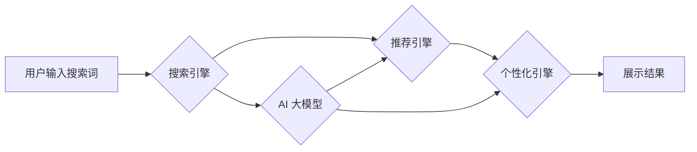

                 

## 电商平台搜索推荐系统的AI 大模型应用：提高系统性能、效率、准确率与实时性

> 关键词：电商平台、搜索推荐系统、AI 大模型、自然语言处理、深度学习、推荐算法、个性化推荐、实时性、性能优化

## 1. 背景介绍

随着电商平台的蓬勃发展，用户对商品搜索和推荐的需求日益增长。传统的搜索推荐系统主要依赖于基于规则的算法和特征工程，难以满足用户个性化需求和海量数据处理能力。近年来，人工智能（AI）技术，特别是深度学习模型的快速发展，为电商平台搜索推荐系统带来了新的机遇。

AI 大模型凭借其强大的学习能力和泛化能力，能够从海量数据中学习用户行为、商品特征和市场趋势，从而提供更精准、个性化和智能化的搜索和推荐服务。

## 2. 核心概念与联系

### 2.1  搜索推荐系统

电商平台搜索推荐系统是用户在平台上搜索商品并获得推荐结果的关键环节。它通常由以下几个模块组成：

* **搜索引擎:** 处理用户搜索词，并返回相关商品列表。
* **推荐引擎:** 基于用户历史行为、商品特征等信息，推荐用户可能感兴趣的商品。
* **个性化引擎:** 根据用户画像和偏好，对搜索结果和推荐结果进行个性化定制。
* **展示引擎:** 将搜索结果和推荐结果以用户友好的方式展示给用户。

### 2.2  AI 大模型

AI 大模型是指在海量数据上训练的深度学习模型，具有强大的泛化能力和学习能力。常见的AI 大模型类型包括：

* **Transformer模型:** 擅长处理自然语言文本，例如BERT、GPT-3等。
* **图神经网络:** 擅长处理关系数据，例如知识图谱嵌入、推荐系统等。
* **生成对抗网络(GAN):** 擅长生成新数据，例如图像、文本等。

### 2.3  AI 大模型在电商平台搜索推荐系统中的应用

AI 大模型可以应用于电商平台搜索推荐系统的各个模块，例如：

* **搜索引擎:** 使用Transformer模型对用户搜索词进行理解和语义分析，提高搜索结果的准确性和相关性。
* **推荐引擎:** 使用协同过滤、内容过滤、深度学习等算法，结合用户行为、商品特征等数据，构建个性化推荐模型。
* **个性化引擎:** 使用AI 大模型分析用户画像和偏好，对搜索结果和推荐结果进行个性化定制。
* **展示引擎:** 使用AI 大模型生成更吸引用户的商品展示内容，例如图片、文字、视频等。

**Mermaid 流程图**



## 3. 核心算法原理 & 具体操作步骤

### 3.1  算法原理概述

AI 大模型在电商平台搜索推荐系统中的应用主要基于以下核心算法原理：

* **深度学习:** 利用多层神经网络学习用户行为、商品特征和市场趋势，构建精准的推荐模型。
* **自然语言处理(NLP):** 对用户搜索词进行语义分析和理解，提高搜索结果的准确性和相关性。
* **协同过滤:** 基于用户历史行为和商品相似度，推荐用户可能感兴趣的商品。
* **内容过滤:** 基于商品特征和用户偏好，推荐用户可能感兴趣的商品。

### 3.2  算法步骤详解

**1. 数据收集和预处理:** 收集用户行为数据、商品信息数据、市场趋势数据等，并进行清洗、转换和特征工程。

**2. 模型训练:** 使用深度学习算法，例如Transformer模型、图神经网络等，对数据进行训练，构建推荐模型。

**3. 模型评估:** 使用测试数据对模型进行评估，并根据评估结果进行模型调优。

**4. 模型部署:** 将训练好的模型部署到线上环境，用于实时推荐。

**5. 结果分析和优化:** 分析推荐结果的准确率、覆盖率、点击率等指标，并根据分析结果进行模型优化和迭代。

### 3.3  算法优缺点

**优点:**

* **精准度高:** AI 大模型能够从海量数据中学习用户行为和商品特征，提供更精准的推荐结果。
* **个性化强:** AI 大模型能够根据用户画像和偏好，提供个性化的推荐服务。
* **实时性强:** AI 大模型能够实时更新推荐结果，满足用户对实时信息的需要。

**缺点:**

* **训练成本高:** AI 大模型的训练需要大量的计算资源和时间。
* **数据依赖性强:** AI 大模型的性能取决于训练数据的质量和数量。
* **解释性差:** AI 大模型的决策过程较为复杂，难以解释其推荐结果背后的逻辑。

### 3.4  算法应用领域

AI 大模型在电商平台搜索推荐系统中的应用不仅限于商品推荐，还可以应用于以下领域:

* **搜索结果排序:** 根据用户搜索词和历史行为，对搜索结果进行排序，提高用户体验。
* **商品分类:** 利用AI 大模型对商品进行分类，提高商品搜索的准确性。
* **用户画像构建:** 利用AI 大模型分析用户行为数据，构建用户画像，为个性化推荐提供支持。
* **市场趋势预测:** 利用AI 大模型分析市场数据，预测商品趋势，帮助商家制定营销策略。

## 4. 数学模型和公式 & 详细讲解 & 举例说明

### 4.1  数学模型构建

在电商平台搜索推荐系统中，常用的数学模型包括协同过滤模型、内容过滤模型和深度学习模型。

**协同过滤模型:**

协同过滤模型基于用户之间的相似性和商品之间的相似性，推荐用户可能感兴趣的商品。

* **用户-用户协同过滤:** 寻找与当前用户行为相似用户的商品推荐。
* **商品-商品协同过滤:** 寻找与当前用户感兴趣商品相似的商品推荐。

**内容过滤模型:**

内容过滤模型基于商品的特征和用户的偏好，推荐用户可能感兴趣的商品。

* **基于关键词匹配:** 根据用户搜索词和商品描述中的关键词进行匹配。
* **基于向量空间模型:** 将商品和用户表示为向量，计算向量之间的相似度进行推荐。

**深度学习模型:**

深度学习模型利用多层神经网络学习用户行为、商品特征和市场趋势，构建更精准的推荐模型。

* **神经网络协同过滤:** 将协同过滤模型与神经网络结合，提高推荐的准确性和个性化程度。
* **深度内容过滤:** 将内容过滤模型与深度学习结合，利用更丰富的商品特征进行推荐。

### 4.2  公式推导过程

**协同过滤模型的评分预测公式:**

$$
\hat{r}_{u,i} = \bar{r}_u + \frac{\sum_{j \in N(u)} (r_{u,j} - \bar{r}_u) \cdot s_{u,j}}{\sum_{j \in N(u)} s_{u,j}^2}
$$

其中:

* $\hat{r}_{u,i}$: 用户 $u$ 对商品 $i$ 的预测评分。
* $\bar{r}_u$: 用户 $u$ 的平均评分。
* $r_{u,j}$: 用户 $u$ 对商品 $j$ 的真实评分。
* $N(u)$: 用户 $u$ 评分过的商品集合。
* $s_{u,j}$: 用户 $u$ 和用户 $v$ 之间的相似度。

**内容过滤模型的相似度计算公式:**

$$
\text{similarity}(c_1, c_2) = \frac{\sum_{i=1}^{n} c_{1,i} \cdot c_{2,i}}{\sqrt{\sum_{i=1}^{n} c_{1,i}^2} \cdot \sqrt{\sum_{i=1}^{n} c_{2,i}^2}}
$$

其中:

* $c_1$ 和 $c_2$: 商品 $1$ 和商品 $2$ 的特征向量。
* $n$: 特征数量。

### 4.3  案例分析与讲解

**案例:** 假设有一个电商平台，用户 $A$ 对商品 $X$ 和商品 $Y$ 都给出了 5 分的评分，用户 $B$ 对商品 $Y$ 和商品 $Z$ 都给出了 4 分的评分。

**协同过滤模型:**

根据用户 $A$ 和用户 $B$ 的评分信息，可以计算出用户 $A$ 和用户 $B$ 之间的相似度。如果相似度较高，则可以推测用户 $A$ 可能也喜欢商品 $Z$。

**内容过滤模型:**

如果商品 $X$ 和商品 $Z$ 的特征向量相似，则可以推测用户 $A$ 可能也喜欢商品 $Z$。

## 5. 项目实践：代码实例和详细解释说明

### 5.1  开发环境搭建

* **操作系统:** Linux 或 macOS
* **编程语言:** Python
* **深度学习框架:** TensorFlow 或 PyTorch
* **数据存储:** MySQL 或 MongoDB

### 5.2  源代码详细实现

```python
# 使用 TensorFlow 构建协同过滤模型
import tensorflow as tf

# 定义模型结构
model = tf.keras.Sequential([
    tf.keras.layers.Embedding(input_dim=num_users, output_dim=embedding_dim),
    tf.keras.layers.Embedding(input_dim=num_items, output_dim=embedding_dim),
    tf.keras.layers.Multiply(),
    tf.keras.layers.Flatten(),
    tf.keras.layers.Dense(1, activation='linear')
])

# 编译模型
model.compile(optimizer='adam', loss='mse')

# 训练模型
model.fit(X_train, y_train, epochs=10)

# 预测评分
predictions = model.predict(X_test)
```

### 5.3  代码解读与分析

* **Embedding层:** 将用户和商品映射到低维向量空间。
* **Multiply层:** 将用户向量和商品向量相乘，得到用户对商品的评分预测。
* **Flatten层:** 将多维向量转换为一维向量。
* **Dense层:** 全连接层，输出用户对商品的评分预测。

### 5.4  运行结果展示

* **准确率:** 使用测试数据评估模型的准确率，例如RMSE、MAE等指标。
* **覆盖率:** 评估模型推荐结果的覆盖范围，例如推荐的商品数量和种类。
* **点击率:** 评估用户对推荐结果的点击率，例如CTR等指标。

## 6. 实际应用场景

### 6.1  个性化商品推荐

根据用户的历史购买记录、浏览记录、收藏记录等信息，推荐用户可能感兴趣的商品。

### 6.2  搜索结果优化

根据用户的搜索词和历史行为，对搜索结果进行排序和过滤，提高用户体验。

### 6.3  新品推荐

根据用户的兴趣偏好和市场趋势，推荐新品和爆款商品。

### 6.4  未来应用展望

* **多模态推荐:** 将文本、图像、视频等多模态数据融合，构建更精准的推荐模型。
* **实时推荐:** 利用实时数据流，实时更新推荐结果，满足用户对实时信息的需要。
* **个性化营销:** 利用AI 大模型分析用户画像，进行个性化营销推广。

## 7. 工具和资源推荐

### 7.1  学习资源推荐

* **书籍:**
    * Deep Learning by Ian Goodfellow, Yoshua Bengio, and Aaron Courville
    * Hands-On Machine Learning with Scikit-Learn, Keras & TensorFlow by Aurélien Géron
* **在线课程:**
    * TensorFlow官方教程
    * PyTorch官方教程
    * Coursera上的深度学习课程

### 7.2  开发工具推荐

* **深度学习框架:** TensorFlow, PyTorch
* **数据处理工具:** Pandas, NumPy
* **机器学习库:** Scikit-learn
* **云计算平台:** AWS, Azure, GCP

### 7.3  相关论文推荐

* **BERT:** Devlin, J., Chang, M. W., Lee, K., & Toutanova, K. (2018). BERT: Pre-training of deep bidirectional transformers for language understanding. arXiv preprint arXiv:1810.04805.
* **Transformer:** Vaswani, A., Shazeer, N., Parmar, N., Uszkoreit, J., Jones, L., Gomez, A. N., ... & Polosukhin, I. (2017). Attention is all you need. In Advances in neural information processing systems (pp. 5998-6008).

## 8. 总结：未来发展趋势与挑战

### 8.1  研究成果总结

AI 大模型在电商平台搜索推荐系统中的应用取得了显著成果，提高了推荐的准确率、个性化程度和实时性。

### 8.2  未来发展趋势

* **模型规模和能力的提升:** 随着计算资源的不断发展，AI 大模型的规模和能力将进一步提升，能够处理更复杂的数据和任务。
* **多模态融合:** 将文本、图像、视频等多模态数据融合，构建更精准的推荐模型。
* **解释性增强:** 研究更易于解释的AI 大模型，提高用户对推荐结果的信任度。
* **联邦学习:** 利用联邦学习技术，在保护用户隐私的前提下，训练更强大的推荐模型。

### 8.3  面临的挑战

* **数据质量和隐私:** AI 大模型的性能取决于训练数据的质量和数量，同时需要解决用户数据隐私保护问题。
* **模型解释性和可控性:** AI 大模型的决策过程较为复杂，难以解释其推荐结果背后的逻辑，需要研究更易于解释的模型。
* **计算资源和成本:** 训练大型AI 大模型需要大量的计算资源和时间，成本较高。

### 8.4  研究展望

未来，AI 大模型在电商平台搜索推荐系统中的应用将更加广泛和深入，为用户提供更精准、个性化和智能化的购物体验。


## 9. 附录：常见问题与解答

**1. AI 大模型的训练需要多少数据？**

AI 大模型的训练数据量取决于模型的规模和复杂度。一般来说，需要大量的训练数据才能训练出性能良好的模型。

**2. 如何解决用户数据隐私问题？**

可以使用联邦学习技术，在保护用户隐私的前提下，训练更强大的推荐模型。

**3. 如何评估AI 大模型的性能？**

常用的评估指标包括准确率、覆盖率、点击率等。

**4. 如何部署AI 大模型？**

可以使用云计算平台或本地服务器部署AI 大模型。

**5. 如何解释AI 大模型的推荐结果？**

目前，解释AI 大模型的推荐结果仍然是一个挑战。可以尝试使用可解释AI 技术，例如LIME、SHAP等，来解释模型的决策过程。


作者：禅与计算机程序设计艺术 / Zen and the Art of Computer Programming<end_of_turn>

