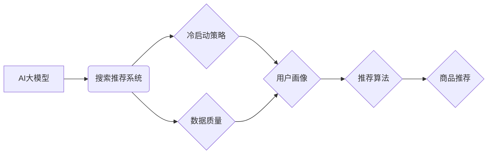

                 

## 电商平台的AI 大模型战略：搜索推荐系统是核心，冷启动策略与数据质量并重

> 关键词：电商平台、AI大模型、搜索推荐系统、冷启动策略、数据质量、推荐算法、深度学习、自然语言处理、用户画像

## 1. 背景介绍

在当今数据爆炸的时代，电商平台面临着激烈的竞争压力。如何精准地推荐商品给用户，提升用户体验和转化率，成为电商平台的核心竞争力。人工智能（AI）大模型的兴起为电商平台提供了强大的工具，能够有效地解决传统推荐算法面临的挑战，例如数据稀疏性、用户个性化需求等。

搜索推荐系统作为电商平台的核心功能之一，直接影响着用户购物体验和平台的商业效益。传统的搜索推荐系统主要依赖于基于规则的算法和协同过滤算法，但这些算法在面对海量数据和用户个性化需求时，存在着一定的局限性。

AI大模型的应用能够有效地提升搜索推荐系统的精准度和个性化程度。例如，基于深度学习的推荐算法能够学习用户行为和商品特征之间的复杂关系，提供更精准的商品推荐；自然语言处理（NLP）技术能够理解用户搜索意图，提供更相关的搜索结果。

## 2. 核心概念与联系

### 2.1  AI大模型

AI大模型是指在海量数据上训练的深度学习模型，具有强大的泛化能力和学习能力。常见的AI大模型包括BERT、GPT、Transformer等。

### 2.2  搜索推荐系统

搜索推荐系统是电商平台的核心功能之一，旨在根据用户的搜索行为和历史购买记录，推荐相关的商品。

### 2.3  冷启动问题

冷启动问题是指在推荐系统初期，由于缺乏用户行为和商品信息，导致推荐效果不佳的问题。

### 2.4  数据质量

数据质量是指数据准确性、完整性、一致性和及时性等方面的指标。数据质量直接影响着推荐系统的效果。

**核心概念与联系流程图**



## 3. 核心算法原理 & 具体操作步骤

### 3.1  算法原理概述

深度学习算法是AI大模型的核心，能够学习用户行为和商品特征之间的复杂关系，提供更精准的商品推荐。常见的深度学习推荐算法包括：

* **协同过滤算法:** 基于用户的历史行为和商品的相似度进行推荐。
* **内容基元推荐算法:** 基于商品的属性和描述进行推荐。
* **混合推荐算法:** 将协同过滤算法和内容基元推荐算法相结合，提升推荐效果。

### 3.2  算法步骤详解

以协同过滤算法为例，其具体操作步骤如下：

1. **数据预处理:** 将用户行为数据和商品信息进行清洗、转换和特征提取。
2. **用户-商品矩阵构建:** 将用户行为数据转换为用户-商品交互矩阵，其中每个元素表示用户对商品的评分或购买行为。
3. **相似度计算:** 计算用户之间的相似度和商品之间的相似度。常用的相似度计算方法包括余弦相似度、皮尔逊相关系数等。
4. **推荐生成:** 根据用户与其他用户的相似度和商品与其他商品的相似度，生成推荐列表。

### 3.3  算法优缺点

**优点:**

* 能够学习用户行为和商品特征之间的复杂关系，提供更精准的推荐。
* 能够处理海量数据，并进行实时更新。

**缺点:**

* 数据稀疏性问题: 当用户行为数据稀疏时，算法效果会下降。
* 冷启动问题: 在推荐系统初期，由于缺乏用户行为和商品信息，算法效果不佳。

### 3.4  算法应用领域

深度学习推荐算法广泛应用于电商平台、视频网站、音乐平台等领域，例如：

* **商品推荐:** 根据用户的历史购买记录和浏览行为，推荐相关的商品。
* **内容推荐:** 根据用户的兴趣爱好和阅读历史，推荐相关的文章、视频和音乐。
* **个性化广告推荐:** 根据用户的兴趣爱好和行为特征，推荐个性化的广告。

## 4. 数学模型和公式 & 详细讲解 & 举例说明

### 4.1  数学模型构建

协同过滤算法的数学模型可以表示为用户-商品交互矩阵，其中每个元素表示用户对商品的评分或购买行为。

假设用户集合为U，商品集合为I，则用户-商品交互矩阵为一个m x n的矩阵，其中m是用户数量，n是商品数量。

矩阵元素u<sub>ij</sub>表示用户u<sub>i</sub>对商品i<sub>j</sub>的评分或购买行为。

### 4.2  公式推导过程

用户相似度的计算可以使用余弦相似度公式：

$$
\text{相似度}(u_i, u_j) = \frac{u_i \cdot u_j}{||u_i|| ||u_j||}
$$

其中：

* u<sub>i</sub>和u<sub>j</sub>分别表示用户u<sub>i</sub>和u<sub>j</sub>的评分向量。
*  u<sub>i</sub> ⋅ u<sub>j</sub>表示用户u<sub>i</sub>和u<sub>j</sub>的点积。
* ||u<sub>i</sub>||和||u<sub>j</sub>||分别表示用户u<sub>i</sub>和u<sub>j</sub>的向量长度。

### 4.3  案例分析与讲解

假设有两个用户A和B，他们的评分向量分别为：

* A = [5, 4, 3, 2, 1]
* B = [4, 3, 2, 1, 5]

则用户A和B的余弦相似度为：

$$
\text{相似度}(A, B) = \frac{5 \cdot 4 + 4 \cdot 3 + 3 \cdot 2 + 2 \cdot 1 + 1 \cdot 5}{\sqrt{5^2 + 4^2 + 3^2 + 2^2 + 1^2} \sqrt{4^2 + 3^2 + 2^2 + 1^2 + 5^2}}
$$

通过计算，可以得到用户A和B的余弦相似度为0.8，说明用户A和B的兴趣爱好比较相似。

## 5. 项目实践：代码实例和详细解释说明

### 5.1  开发环境搭建

* Python 3.x
* TensorFlow 或 PyTorch
* Jupyter Notebook

### 5.2  源代码详细实现

```python
import numpy as np
from sklearn.metrics.pairwise import cosine_similarity

# 用户-商品交互矩阵
user_item_matrix = np.array([
    [5, 4, 3, 2, 1],
    [4, 3, 2, 1, 5],
    [3, 2, 1, 5, 4],
    [2, 1, 5, 4, 3],
    [1, 5, 4, 3, 2]
])

# 计算用户相似度
user_similarity = cosine_similarity(user_item_matrix)

# 获取用户A的相似用户
user_a_index = 0
similar_users = np.argsort(user_similarity[user_a_index])[::-1][1:]

# 推荐商品
recommended_items = []
for similar_user in similar_users:
    for item_index in range(user_item_matrix.shape[1]):
        if user_item_matrix[similar_user, item_index] > 0 and item_index not in recommended_items:
            recommended_items.append(item_index)

# 打印推荐结果
print(f"用户A的推荐商品: {recommended_items}")
```

### 5.3  代码解读与分析

* 代码首先定义了用户-商品交互矩阵，其中每个元素表示用户对商品的评分或购买行为。
* 然后使用Scikit-learn库中的`cosine_similarity`函数计算用户之间的相似度。
* 通过获取用户A的相似用户，并遍历其评分矩阵，可以得到用户A可能感兴趣的商品。

### 5.4  运行结果展示

运行上述代码，可以得到用户A的推荐商品列表。

## 6. 实际应用场景

### 6.1  电商平台商品推荐

电商平台可以利用AI大模型构建个性化商品推荐系统，根据用户的浏览历史、购买记录、兴趣爱好等信息，推荐相关的商品，提升用户购物体验和转化率。

### 6.2  视频网站内容推荐

视频网站可以利用AI大模型构建个性化内容推荐系统，根据用户的观看历史、点赞记录、评论内容等信息，推荐相关的视频，提升用户观看时长和用户粘性。

### 6.3  音乐平台音乐推荐

音乐平台可以利用AI大模型构建个性化音乐推荐系统，根据用户的播放历史、收藏歌曲、评论内容等信息，推荐相关的音乐，提升用户音乐体验和平台活跃度。

### 6.4  未来应用展望

AI大模型在搜索推荐系统领域的应用前景广阔，未来将朝着以下方向发展：

* **更精准的推荐:** 利用更先进的深度学习算法和更丰富的用户数据，提供更精准的商品推荐。
* **更个性化的推荐:** 结合用户画像、行为分析和情感识别等技术，提供更个性化的推荐。
* **更智能的推荐:** 利用自然语言处理技术理解用户搜索意图，提供更智能的推荐。
* **跨平台推荐:** 将用户数据和推荐模型跨平台共享，提供更全面的用户体验。

## 7. 工具和资源推荐

### 7.1  学习资源推荐

* **书籍:**
    * 深度学习
    * 自然语言处理
    * 推荐系统
* **在线课程:**
    * Coursera
    * edX
    * Udacity

### 7.2  开发工具推荐

* **Python:** 
    * TensorFlow
    * PyTorch
    * Scikit-learn
* **云平台:**
    * AWS
    * Azure
    * Google Cloud

### 7.3  相关论文推荐

* **BERT: Pre-training of Deep Bidirectional Transformers for Language Understanding**
* **Attention Is All You Need**
* **Collaborative Filtering for Implicit Feedback Datasets**

## 8. 总结：未来发展趋势与挑战

### 8.1  研究成果总结

AI大模型在搜索推荐系统领域的应用取得了显著成果，能够有效地提升推荐效果和用户体验。

### 8.2  未来发展趋势

未来，AI大模型在搜索推荐系统领域的应用将朝着更精准、更个性化、更智能的方向发展。

### 8.3  面临的挑战

* **数据质量问题:** 数据质量直接影响着推荐系统的效果，需要不断完善数据采集、清洗和处理流程。
* **冷启动问题:** 在推荐系统初期，由于缺乏用户行为和商品信息，算法效果不佳，需要开发有效的冷启动策略。
* **模型解释性问题:** AI大模型的决策过程较为复杂，缺乏可解释性，需要开发更易于理解的模型。

### 8.4  研究展望

未来，需要进一步研究以下问题:

* 如何利用更丰富的用户数据和更先进的深度学习算法，提升推荐效果。
* 如何开发更有效的冷启动策略，解决推荐系统初期效果不佳的问题。
* 如何提高AI大模型的解释性，使其决策过程更加透明。


## 9. 附录：常见问题与解答

**Q1: 如何解决数据稀疏性问题？**

**A1:** 可以采用以下方法解决数据稀疏性问题:

* **协同过滤算法的改进:** 使用矩阵分解、概率图模型等方法，对稀疏的交互矩阵进行填充。
* **内容基元推荐算法:** 利用商品的属性和描述信息进行推荐，减少对用户行为数据的依赖。
* **混合推荐算法:** 将协同过滤算法和内容基元推荐算法相结合，提升推荐效果。

**Q2: 如何解决冷启动问题？**

**A2:** 可以采用以下方法解决冷启动问题:

* **利用用户画像:** 根据用户的基本信息、兴趣爱好等进行推荐。
* **利用商品信息:** 根据商品的属性、描述信息等进行推荐。
* **利用社会关系:** 利用用户的社交关系进行推荐。
* **利用预训练模型:** 利用预训练的语言模型或推荐模型，对新用户和新商品进行初始化。

**Q3: 如何评估推荐系统的效果？**

**A3:** 可以使用以下指标评估推荐系统的效果:

* **点击率 (CTR):** 用户点击推荐商品的比例。
* **转化率 (CVR):** 用户点击推荐商品后购买商品的比例。
* **平均评分 (Average Rating):** 用户对推荐商品的平均评分。
* **用户满意度 (User Satisfaction):** 用户对推荐系统的满意度。


作者：禅与计算机程序设计艺术 / Zen and the Art of Computer Programming 
<end_of_turn>

