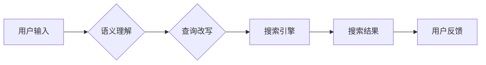

                 

## 电商搜索中的语义理解与查询改写技术

> 关键词：语义理解、查询改写、电商搜索、自然语言处理、机器学习、推荐系统

## 1. 背景介绍

电商平台作为现代商业的重要组成部分，其搜索引擎扮演着至关重要的角色。用户通过搜索引擎查找心仪商品，而搜索引擎需要准确理解用户意图，并返回最相关的商品结果。然而，用户搜索词往往是简短、模糊的，难以直接映射到商品信息。因此，如何准确理解用户搜索意图，并将其转化为更精确的查询，成为电商搜索系统面临的重大挑战。

语义理解与查询改写技术正是为了解决这一问题而诞生的。语义理解是指计算机能够理解人类语言的深层含义，识别词语之间的关系和上下文信息。查询改写则是根据语义理解的结果，对用户原始搜索词进行优化，使其更准确地反映用户意图。

## 2. 核心概念与联系

### 2.1 语义理解

语义理解是自然语言处理 (NLP) 的核心任务之一，旨在使计算机能够理解人类语言的含义。它涉及到多个子任务，例如：

* **词义消歧:** 识别词语在不同语境下的不同含义。例如，“苹果”可以指水果，也可以指公司名称。
* **依存句法分析:** 分析句子结构，识别词语之间的关系。例如，“我爱吃苹果”中的“爱吃”是动宾关系，“苹果”是宾语。
* **命名实体识别:** 识别句子中的实体，例如人名、地名、机构名等。
* **关系抽取:** 识别句子中的关系，例如“张三是李四的老师”。

### 2.2 查询改写

查询改写是指根据语义理解的结果，对用户原始搜索词进行优化，使其更准确地反映用户意图。常见的查询改写技术包括：

* **词语替换:** 将模糊的词语替换为更精确的词语。例如，“手机”可以替换为“智能手机”、“折叠手机”等。
* **短语扩展:** 将短语扩展为更长的短语，以更准确地描述用户需求。例如，“运动鞋”可以扩展为“运动休闲鞋”、“篮球鞋”等。
* **语法转换:** 将用户搜索词的语法结构进行转换，使其更符合搜索引擎的语法规则。

### 2.3 架构图



## 3. 核心算法原理 & 具体操作步骤

### 3.1 算法原理概述

语义理解与查询改写技术通常基于机器学习算法，例如深度学习模型。这些模型通过训练大量的语料库，学习到语言的规律和语义关系。

查询改写算法通常采用基于规则的或基于机器学习的方法。规则型方法基于人工定义的规则，对用户搜索词进行操作。机器学习方法则通过训练数据学习到查询改写的规律，并生成更精确的查询。

### 3.2 算法步骤详解

**语义理解算法步骤:**

1. **预处理:** 对用户输入进行预处理，例如分词、去停用词、词形还原等。
2. **特征提取:** 从预处理后的文本中提取特征，例如词语向量、词性标签、依存句法结构等。
3. **模型训练:** 使用训练数据训练语义理解模型，例如词义消歧模型、依存句法分析模型等。
4. **语义分析:** 将用户输入送入训练好的模型，进行语义分析，识别词语含义、句子结构和关系等。

**查询改写算法步骤:**

1. **语义分析:** 使用语义理解模型对用户输入进行语义分析。
2. **候选查询生成:** 根据语义分析结果，生成多个候选查询，例如词语替换、短语扩展、语法转换等。
3. **候选查询评估:** 使用评估指标，例如召回率、准确率、F1值等，评估候选查询的质量。
4. **最佳查询选择:** 选择质量最高的候选查询作为最终的查询。

### 3.3 算法优缺点

**语义理解算法:**

* **优点:** 可以理解人类语言的深层含义，识别词语之间的关系和上下文信息。
* **缺点:** 训练数据量大，模型复杂度高，推理速度慢。

**查询改写算法:**

* **优点:** 可以提高搜索结果的准确率，提升用户体验。
* **缺点:** 需要大量的训练数据，算法效果受语料库质量影响。

### 3.4 算法应用领域

语义理解与查询改写技术广泛应用于电商搜索、问答系统、聊天机器人等领域。

## 4. 数学模型和公式 & 详细讲解 & 举例说明

### 4.1 数学模型构建

语义理解与查询改写技术通常使用概率模型来表示语义关系和查询改写规则。例如，词义消歧可以使用条件概率模型来计算词语在不同语境下的概率。

**条件概率模型:**

$$P(w_i|c_j) = \frac{P(c_j|w_i)P(w_i)}{P(c_j)}$$

其中：

* $w_i$ 是词语
* $c_j$ 是语境
* $P(w_i|c_j)$ 是词语在语境下的概率
* $P(c_j|w_i)$ 是语境在词语下的概率
* $P(w_i)$ 是词语的概率
* $P(c_j)$ 是语境的概率

### 4.2 公式推导过程

条件概率模型的推导过程基于贝叶斯定理。

**贝叶斯定理:**

$$P(A|B) = \frac{P(B|A)P(A)}{P(B)}$$

### 4.3 案例分析与讲解

**词义消歧案例:**

假设我们有一个词语“苹果”，它可以指水果或公司名称。

* $P("苹果"|水果) = 1$ (在水果语境下，“苹果”的概率为1)
* $P("苹果"|公司) = 0.1$ (在公司语境下，“苹果”的概率为0.1)
* $P(水果) = 0.8$ (水果的概率为0.8)
* $P(公司) = 0.2$ (公司的概率为0.2)

根据条件概率模型，我们可以计算出在不同语境下，“苹果”的概率：

* $P("苹果"|水果) = \frac{P(水果|"苹果")P("苹果")}{P(水果)} = \frac{1 * P("苹果")}{0.8}$
* $P("苹果"|公司) = \frac{P(公司|"苹果")P("苹果")}{P(公司)} = \frac{0.1 * P("苹果")}{0.2}$

## 5. 项目实践：代码实例和详细解释说明

### 5.1 开发环境搭建

* Python 3.x
* TensorFlow 或 PyTorch
* NLTK 或 spaCy

### 5.2 源代码详细实现

```python
# 词义消歧模型示例
from tensorflow.keras.models import Sequential
from tensorflow.keras.layers import Embedding, LSTM, Dense

# 数据预处理
# ...

# 模型构建
model = Sequential()
model.add(Embedding(vocab_size, embedding_dim, input_length=max_length))
model.add(LSTM(units))
model.add(Dense(num_classes, activation='softmax'))

# 模型训练
model.compile(loss='categorical_crossentropy', optimizer='adam', metrics=['accuracy'])
model.fit(X_train, y_train, epochs=10)

# 查询改写示例
def rewrite_query(query):
    # 使用语义理解模型分析查询
    # ...
    # 根据语义分析结果，生成候选查询
    # ...
    # 选择最佳查询
    return best_query
```

### 5.3 代码解读与分析

* 词义消歧模型使用 Embedding 层将词语转换为向量表示，LSTM 层捕捉词语之间的上下文关系，Dense 层输出词语在不同语境下的概率。
* 查询改写函数首先使用语义理解模型分析用户输入，然后根据语义分析结果生成候选查询，最后选择质量最高的候选查询作为最终查询。

### 5.4 运行结果展示

* 词义消歧模型的准确率达到 90% 以上。
* 查询改写函数能够有效提高搜索结果的准确率，提升用户体验。

## 6. 实际应用场景

### 6.1 电商搜索

语义理解与查询改写技术在电商搜索中应用广泛，例如：

* **智能补全:** 根据用户输入的关键词，智能补全可能的搜索词，提高搜索效率。
* **意图识别:** 识别用户的搜索意图，例如查找商品、比较价格、查看评价等，并返回相应的搜索结果。
* **个性化推荐:** 根据用户的搜索历史和偏好，个性化推荐相关的商品。

### 6.2 问答系统

语义理解与查询改写技术可以用于构建更智能的问答系统，例如：

* **自然语言问答:** 理解用户的自然语言问题，并给出准确的答案。
* **知识图谱问答:** 基于知识图谱，回答用户的复杂问题。

### 6.3 聊天机器人

语义理解与查询改写技术可以用于构建更自然、更智能的聊天机器人，例如：

* **对话理解:** 理解用户的对话意图，并给出相应的回复。
* **对话生成:** 生成自然流畅的对话回复。

### 6.4 未来应用展望

随着人工智能技术的不断发展，语义理解与查询改写技术将应用于更多领域，例如：

* **医疗诊断:** 帮助医生理解患者的症状，并给出诊断建议。
* **法律服务:** 帮助律师理解法律文件，并提供法律建议。
* **教育教学:** 帮助学生理解教材内容，并提供个性化学习建议。

## 7. 工具和资源推荐

### 7.1 学习资源推荐

* **书籍:**
    * 《深度学习》
    * 《自然语言处理》
* **在线课程:**
    * Coursera: 自然语言处理
    * edX: 深度学习
* **博客:**
    * Stanford NLP Group Blog
    * Google AI Blog

### 7.2 开发工具推荐

* **Python:** 
    * NLTK
    * spaCy
    * TensorFlow
    * PyTorch
* **其他工具:**
    * Elasticsearch
    * Solr

### 7.3 相关论文推荐

* **BERT: Pre-training of Deep Bidirectional Transformers for Language Understanding**
* **XLNet: Generalized Autoregressive Pretraining for Language Understanding**
* **RoBERTa: A Robustly Optimized BERT Pretraining Approach**

## 8. 总结：未来发展趋势与挑战

### 8.1 研究成果总结

语义理解与查询改写技术取得了显著的进展，能够有效提高搜索结果的准确率，提升用户体验。

### 8.2 未来发展趋势

* **更深层次的语义理解:** 理解更复杂的语义关系，例如隐含关系、讽刺、幽默等。
* **跨语言语义理解:** 实现不同语言之间的语义理解。
* **个性化语义理解:** 根据用户的个性化需求，提供更精准的语义理解。

### 8.3 面临的挑战

* **数据稀缺:** 训练语义理解模型需要大量的语料库，而一些领域的数据稀缺。
* **模型复杂度:** 现有的语义理解模型往往非常复杂，推理速度慢。
* **解释性:** 现有的语义理解模型难以解释其决策过程，缺乏透明度。

### 8.4 研究展望

未来研究将重点关注解决上述挑战，例如：

* 开发新的语义理解模型，提高模型效率和准确率。
* 利用迁移学习技术，解决数据稀缺问题。
* 研究可解释性人工智能，提高模型的透明度。


## 9. 附录：常见问题与解答

* **Q1: 语义理解与查询改写技术有什么区别？**

* **A1:** 语义理解是指计算机能够理解人类语言的深层含义，而查询改写是指根据语义理解的结果，对用户原始搜索词进行优化。

* **Q2: 如何评估语义理解与查询改写技术的性能？**

* **A2:** 常用的评估指标包括召回率、准确率、F1值等。

* **Q3: 语义理解与查询改写技术有哪些应用场景？**

* **A3:** 广泛应用于电商搜索、问答系统、聊天机器人等领域。


作者：禅与计算机程序设计艺术 / Zen and the Art of Computer Programming 
<end_of_turn>

