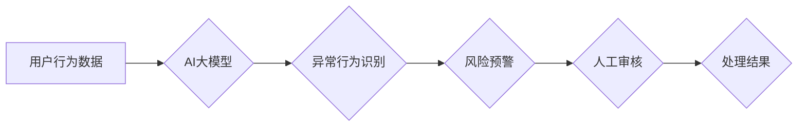

                 

## 电商搜索推荐中的AI大模型用户行为序列异常检测模型应用指南

> 关键词：电商搜索推荐、AI大模型、用户行为序列、异常检测、推荐系统、序列模型、深度学习

## 1. 背景介绍

在当今数据爆炸的时代，电商平台积累了海量的用户行为数据，这些数据蕴含着丰富的商业价值。用户行为序列分析，即对用户在电商平台上的浏览、搜索、购买等行为进行时间序贯分析，已成为提升电商搜索推荐精准度和用户体验的关键技术之一。然而，用户行为序列数据往往存在着复杂性和非线性特征，传统的统计模型难以有效捕捉其内在规律。

近年来，随着深度学习技术的快速发展，基于AI大模型的用户行为序列异常检测模型逐渐成为研究热点。这些模型能够学习用户行为序列的复杂模式，并识别出潜在的异常行为，例如恶意刷单、虚假交易等。异常行为的识别能够帮助电商平台防范风险、提升用户信任度，并为个性化推荐提供更精准的数据支撑。

## 2. 核心概念与联系

### 2.1 用户行为序列

用户行为序列是指用户在电商平台上进行的一系列行为，例如：

* **浏览行为:** 用户点击商品页面、查看商品详情等。
* **搜索行为:** 用户在搜索框输入关键词进行商品搜索。
* **加入购物车行为:** 用户将商品添加到购物车中。
* **购买行为:** 用户完成商品购买。

这些行为通常以时间顺序排列，形成一个序列数据。

### 2.2 异常检测

异常检测是指识别出与正常数据明显不同的数据点，这些数据点可能代表着异常事件或潜在风险。在电商平台中，异常检测可以用于识别以下行为：

* **恶意刷单:** 用户通过虚假订单来抬高商品排名或获取奖励。
* **虚假交易:** 用户通过虚假交易来获取退款或其他利益。
* **账号盗用:** 恶意用户盗用用户账号进行非法操作。

### 2.3 AI大模型

AI大模型是指具有海量参数和强大的学习能力的深度学习模型。这些模型能够学习复杂的数据模式，并进行各种智能任务，例如文本生成、图像识别、语音合成等。在用户行为序列异常检测领域，AI大模型可以用于学习用户行为序列的复杂特征，并识别出潜在的异常行为。

**核心概念与架构流程图:**



## 3. 核心算法原理 & 具体操作步骤

### 3.1 算法原理概述

基于AI大模型的用户行为序列异常检测模型通常采用以下几种算法原理：

* **循环神经网络 (RNN):** RNN能够处理序列数据，并学习序列中的时间依赖关系。
* **长短期记忆网络 (LSTM):** LSTM是一种改进的RNN，能够更好地捕捉长序列中的信息。
* **Transformer:** Transformer是一种基于注意力机制的序列模型，能够更有效地处理长序列数据。

这些模型通过训练学习用户行为序列的正常模式，并识别与正常模式相 deviate 的行为序列，从而实现异常检测。

### 3.2 算法步骤详解

1. **数据预处理:** 收集用户行为数据，并进行清洗、格式化、编码等预处理操作。
2. **特征提取:** 从用户行为数据中提取特征，例如商品类别、浏览时间、购买频率等。
3. **模型训练:** 使用选定的AI大模型算法，对预处理后的数据进行训练，学习用户行为序列的正常模式。
4. **异常检测:** 将新的用户行为序列输入到训练好的模型中，模型会输出异常概率。
5. **阈值设置:** 设置一个异常概率阈值，当用户行为序列的异常概率超过阈值时，则将其标记为异常行为。
6. **结果分析:** 分析异常行为的特征，并采取相应的措施，例如封禁账号、冻结资金等。

### 3.3 算法优缺点

**优点:**

* 能够学习复杂的用户行为模式。
* 识别能力强，能够发现隐含的异常行为。
* 可扩展性强，可以处理海量数据。

**缺点:**

* 训练成本高，需要大量的训练数据和计算资源。
* 模型解释性差，难以理解模型的决策过程。
* 对数据质量要求高，数据噪声会影响模型性能。

### 3.4 算法应用领域

* **电商平台:** 识别恶意刷单、虚假交易等异常行为。
* **金融机构:** 识别欺诈交易、账户盗用等异常行为。
* **医疗机构:** 识别医疗数据中的异常值，辅助诊断疾病。
* **工业控制:** 识别设备故障、异常操作等异常行为。

## 4. 数学模型和公式 & 详细讲解 & 举例说明

### 4.1 数学模型构建

假设用户行为序列为 $X = (x_1, x_2, ..., x_T)$，其中 $x_t$ 表示第 $t$ 个时间步的用户行为。

基于LSTM模型，我们可以构建以下数学模型：

* **隐藏状态:** $h_t = LSTM(x_t, h_{t-1})$
* **输出:** $y_t = softmax(W_y h_t + b_y)$

其中，$W_y$ 和 $b_y$ 是可训练的参数，$softmax$ 函数将输出转换为概率分布。

### 4.2 公式推导过程

LSTM模型的隐藏状态更新公式如下：

$$
\begin{aligned}
f_t &= \sigma(W_f [h_{t-1}, x_t] + b_f) \\
i_t &= \sigma(W_i [h_{t-1}, x_t] + b_i) \\
g_t &= \tanh(W_g [h_{t-1}, x_t] + b_g) \\
o_t &= \sigma(W_o [h_{t-1}, x_t] + b_o) \\
C_t &= f_t * C_{t-1} + i_t * g_t \\
h_t &= o_t * \tanh(C_t)
\end{aligned}
$$

其中，$\sigma$ 是 sigmoid 函数，$\tanh$ 是 hyperbolic tangent 函数，$f_t$, $i_t$, $g_t$, $o_t$ 分别是遗忘门、输入门、候选细胞状态和输出门。

### 4.3 案例分析与讲解

假设我们有一个电商平台的用户行为序列数据，其中包含用户的浏览记录、搜索记录和购买记录。我们可以使用LSTM模型训练一个异常检测模型，识别出恶意刷单的行为。

训练过程中，我们将正常用户的行为序列作为正样本，恶意刷单的行为序列作为负样本。模型会学习到正常用户行为的特征，并识别出与正常特征相 deviate 的行为序列，从而识别出恶意刷单的行为。

## 5. 项目实践：代码实例和详细解释说明

### 5.1 开发环境搭建

* **操作系统:** Linux/macOS
* **编程语言:** Python
* **深度学习框架:** TensorFlow/PyTorch
* **其他工具:** Jupyter Notebook、Git

### 5.2 源代码详细实现

```python
import tensorflow as tf

# 定义LSTM模型
model = tf.keras.Sequential([
    tf.keras.layers.LSTM(128, return_sequences=True, input_shape=(sequence_length, num_features)),
    tf.keras.layers.LSTM(64),
    tf.keras.layers.Dense(1, activation='sigmoid')
])

# 编译模型
model.compile(optimizer='adam', loss='binary_crossentropy', metrics=['accuracy'])

# 训练模型
model.fit(X_train, y_train, epochs=10, batch_size=32)

# 预测异常行为
predictions = model.predict(X_test)
```

### 5.3 代码解读与分析

* **定义LSTM模型:** 使用TensorFlow框架定义一个LSTM模型，包含两层LSTM层和一层全连接层。
* **编译模型:** 使用Adam优化器、二分类交叉熵损失函数和准确率作为评估指标编译模型。
* **训练模型:** 使用训练数据训练模型，设置训练轮数和批处理大小。
* **预测异常行为:** 使用训练好的模型预测测试数据，得到异常概率。

### 5.4 运行结果展示

训练完成后，我们可以使用测试数据评估模型的性能，例如计算准确率、召回率、F1-score等指标。

## 6. 实际应用场景

### 6.1 电商平台

* **刷单检测:** 识别恶意刷单行为，保护平台利益和用户权益。
* **欺诈交易检测:** 识别虚假交易行为，防止资金损失。
* **账号安全:** 检测账号盗用行为，保障用户账号安全。

### 6.2 金融机构

* **欺诈交易检测:** 识别信用卡欺诈、网络诈骗等异常交易行为。
* **账户安全:** 检测账户异常登录、资金转账等异常操作。
* **风险评估:** 基于用户行为序列，评估用户的信用风险。

### 6.3 其他领域

* **医疗诊断:** 识别医疗数据中的异常值，辅助医生诊断疾病。
* **工业控制:** 识别设备故障、异常操作等异常行为，保障生产安全。
* **网络安全:** 识别网络攻击、恶意软件等异常行为，保障网络安全。

### 6.4 未来应用展望

随着AI技术的不断发展，用户行为序列异常检测模型将应用于更多领域，例如：

* **个性化推荐:** 基于用户行为序列的异常检测，可以识别出用户偏好的商品和服务，提供更精准的个性化推荐。
* **用户画像:** 通过分析用户行为序列的异常特征，可以构建更精准的用户画像，帮助企业更好地了解用户需求。
* **行为预警:** 基于用户行为序列的异常检测，可以预警用户可能发生的风险行为，例如过度消费、沉迷游戏等。

## 7. 工具和资源推荐

### 7.1 学习资源推荐

* **书籍:**
    * 《深度学习》 - Ian Goodfellow, Yoshua Bengio, Aaron Courville
    * 《自然语言处理》 - Dan Jurafsky, James H. Martin
* **在线课程:**
    * Coursera: 深度学习 Specialization
    * Udacity: 自然语言处理 Nanodegree
* **博客和论坛:**
    * TensorFlow Blog
    * PyTorch Blog
    * Kaggle

### 7.2 开发工具推荐

* **深度学习框架:** TensorFlow, PyTorch
* **数据处理工具:** Pandas, NumPy
* **可视化工具:** Matplotlib, Seaborn
* **版本控制工具:** Git

### 7.3 相关论文推荐

* **Recurrent Neural Networks for Sequence Learning** - Sepp Hochreiter, Jürgen Schmidhuber
* **Long Short-Term Memory** - Geoffrey E. Hinton, John G. Hopfield, Joseph S. Osuna, Yoshua Bengio, Yann LeCun
* **Attention Is All You Need** - Ashish Vaswani, Noam Shazeer, Niki Parmar, Jakob Uszkoreit, Llion Jones, Aidan N Gomez, Łukasz Kaiser, Illia Polosukhin

## 8. 总结：未来发展趋势与挑战

### 8.1 研究成果总结

基于AI大模型的用户行为序列异常检测模型取得了显著的成果，能够有效识别出各种异常行为，并为电商平台、金融机构等领域提供重要的风险控制和安全保障。

### 8.2 未来发展趋势

* **模型性能提升:** 研究更强大的AI大模型算法，提高模型的识别精度和效率。
* **解释性增强:** 研究模型的决策过程，提高模型的解释性，帮助用户理解模型的判断依据。
* **场景化应用:** 将模型应用于更多场景，例如个性化推荐、用户画像、行为预警等。
* **数据安全与隐私保护:** 研究如何保护用户数据安全和隐私，确保模型的合法合规使用。

### 8.3 面临的挑战

* **数据质量:** 异常检测模型对数据质量要求较高，数据噪声和不完整性会影响模型性能。
* **计算资源:** 训练大型AI大模型需要大量的计算资源，成本较高。
* **模型解释性:** 现有的AI大模型模型解释性较差，难以理解模型的决策过程。
* **数据安全与隐私保护:** 如何保护用户数据安全和隐私，确保模型的合法合规使用是一个重要的挑战。

### 8.4 研究展望

未来，我们将继续致力于研究更强大的AI大模型算法，提高模型的识别精度和效率，并探索模型的场景化应用，为电商平台、金融机构等领域提供更精准的风险控制和安全保障。同时，我们将关注模型的解释性增强和数据安全与隐私保护，确保模型的合法合规使用。

## 9. 附录：常见问题与解答

**Q1: 如何选择合适的AI大模型算法？**

**A1:** 选择合适的AI大模型算法取决于具体应用场景和数据特点。

* **RNN:** 适用于时间序列数据较短的场景。
* **LSTM:** 适用于时间序列数据较长的场景，能够更好地捕捉长序列中的信息。
* **Transformer:** 适用于处理长序列数据，并具有更强的学习能力。

**Q2: 如何处理异常数据？**

**A2:** 异常数据会影响模型的训练效果，需要进行处理。

* **删除异常数据:** 如果异常数据量较少，可以将其删除。
* **填充异常数据:** 使用平均值、中位数等方法填充异常数据。
* **使用异常检测算法:** 使用专门的异常检测算法识别和处理异常数据。

**Q3: 如何评估模型的性能？**

**A3:** 可以使用以下指标评估模型的性能：

* **准确率:** 正确预测的样本数占总样本数的比例。
* **召回率:** 正确预测的正样本数占所有正样本数的比例。
* **F1-score:** 准确率和召回率的调和平均值。

**Q4: 如何保护用户数据安全和隐私？**

**A4:** 

* **数据匿名化:** 将用户数据进行匿名化处理，去除个人识别信息。
* **数据加密:** 使用加密技术保护用户数据，防止数据泄露。
* **数据最小化:** 只收集必要的用户数据，避免过度收集用户数据。
* **数据安全管理:** 建立完善的数据安全管理制度，确保数据安全。


作者：禅与计算机程序设计艺术 / Zen and the Art of Computer Programming<end_of_turn>

