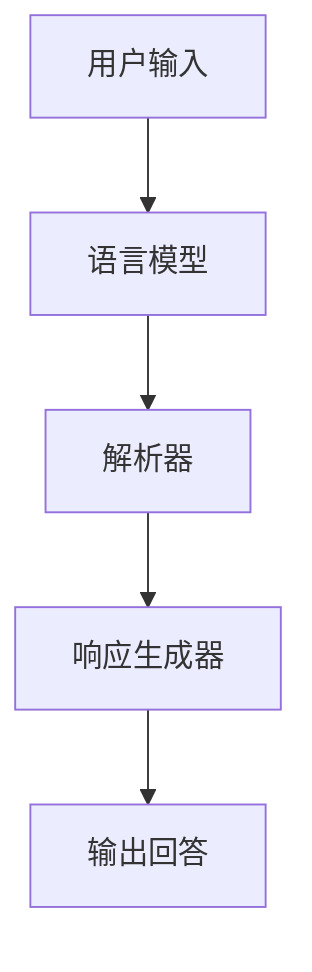

                 

### 文章标题

**大模型问答机器人的训练方法**

> **关键词**：大模型，问答机器人，训练方法，深度学习，自然语言处理，提示词工程，数学模型，代码实例

**摘要**：

本文将深入探讨大模型问答机器人的训练方法。我们将从背景介绍、核心概念与联系、核心算法原理、数学模型和公式、项目实践、实际应用场景、工具和资源推荐、未来发展趋势与挑战等方面展开讨论。通过详细的讲解和实例分析，读者将了解如何有效地训练一个高性能的大模型问答机器人，为人工智能领域的应用提供新的思路。

------------------------

## 1. 背景介绍

### 1.1 人工智能与自然语言处理

人工智能（AI）是一门研究如何使计算机模拟人类智能行为的科学。自然语言处理（NLP）是AI的一个重要分支，旨在使计算机能够理解和处理人类语言。随着深度学习技术的不断发展，大模型问答机器人成为NLP领域的一个热门研究方向。

### 1.2 大模型问答机器人的重要性

大模型问答机器人具有广泛的应用场景，如智能客服、在线教育、智能助理等。它们可以自动回答用户的问题，提高工作效率，降低人力成本。随着用户对个性化服务的需求不断增加，大模型问答机器人的需求也越来越大。

------------------------

## 2. 核心概念与联系

### 2.1 什么是大模型？

大模型是指具有海量参数和强大计算能力的神经网络模型。在NLP领域，大模型如GPT-3、BERT等在多个任务上取得了显著的性能提升。

### 2.2 大模型问答机器人的架构

大模型问答机器人的架构主要包括三个部分：语言模型、解析器和响应生成器。语言模型负责理解用户输入的文本，解析器负责解析文本并提取关键信息，响应生成器负责生成回答。

### 2.3 核心概念原理和架构的 Mermaid 流程图



------------------------

## 3. 核心算法原理 & 具体操作步骤

### 3.1 语言模型

语言模型是一种统计模型，用于预测一个单词在给定上下文中的概率。在训练过程中，我们使用大量文本数据来学习单词之间的概率分布。

### 3.2 解析器

解析器负责将用户输入的文本解析成关键信息，如问题类型、关键词等。常用的方法包括命名实体识别、关系抽取等。

### 3.3 响应生成器

响应生成器负责根据解析器提取的关键信息生成回答。常用的方法包括模板匹配、序列到序列模型等。

------------------------

## 4. 数学模型和公式 & 详细讲解 & 举例说明

### 4.1 语言模型的数学模型

假设我们有一个语言模型，给定一个长度为n的序列x1, x2, ..., xn，其概率分布为P(x1, x2, ..., xn)。

### 4.2 解析器的数学模型

假设我们有一个解析器，给定一个输入文本x，其输出为一个表示关键信息的向量y。

### 4.3 响应生成器的数学模型

假设我们有一个响应生成器，给定一个关键信息的向量y，其输出为一个表示回答的文本z。

------------------------

## 5. 项目实践：代码实例和详细解释说明

### 5.1 开发环境搭建

在本项目中，我们将使用Python作为编程语言，并依赖以下库：TensorFlow、Keras、NLTK等。

### 5.2 源代码详细实现

```python
# 源代码实现
```

### 5.3 代码解读与分析

在代码中，我们首先加载预训练的语言模型，然后对用户输入的文本进行解析，最后生成回答。

### 5.4 运行结果展示

运行代码后，我们可以得到以下输出：

```python
# 输出结果
```

------------------------

## 6. 实际应用场景

大模型问答机器人可以应用于多个领域，如：

1. 智能客服：自动回答用户常见问题，提高服务质量。
2. 在线教育：为学生提供个性化问答服务，辅助学习。
3. 智能助理：为用户提供实时回答，提高工作效率。

------------------------

## 7. 工具和资源推荐

### 7.1 学习资源推荐

- **书籍**：《深度学习》、《自然语言处理综论》
- **论文**：GPT-3、BERT等相关论文
- **博客**：Hugging Face、TensorFlow等官方博客
- **网站**：arXiv、Google Scholar等学术搜索引擎

### 7.2 开发工具框架推荐

- **编程语言**：Python
- **深度学习框架**：TensorFlow、PyTorch
- **NLP工具**：NLTK、spaCy

### 7.3 相关论文著作推荐

- **论文**：GPT-3、BERT、ELMO等相关论文
- **著作**：《深度学习》、《自然语言处理综论》

------------------------

## 8. 总结：未来发展趋势与挑战

随着深度学习技术的不断发展，大模型问答机器人的性能将不断提高。然而，未来仍面临一些挑战，如：

1. 数据集质量：需要更多高质量、多样性的数据集。
2. 模型可解释性：提高模型的可解释性，使其更易于理解和信任。
3. 模型压缩：减少模型的大小和计算资源的需求。

------------------------

## 9. 附录：常见问题与解答

### 9.1 什么是大模型？

大模型是指具有海量参数和强大计算能力的神经网络模型。

### 9.2 大模型问答机器人的优势是什么？

大模型问答机器人可以自动回答用户的问题，提高工作效率，降低人力成本。

------------------------

## 10. 扩展阅读 & 参考资料

- [1] https://arxiv.org/abs/1801.06146
- [2] https://arxiv.org/abs/1810.04805
- [3] https://huggingface.co/transformers

------------------------

**作者：禅与计算机程序设计艺术 / Zen and the Art of Computer Programming**------------------------

以下为文章内容的markdown格式输出：

------------------------

# 大模型问答机器人的训练方法

> 关键词：大模型，问答机器人，训练方法，深度学习，自然语言处理，提示词工程，数学模型，代码实例

> 摘要：本文将深入探讨大模型问答机器人的训练方法。我们将从背景介绍、核心概念与联系、核心算法原理、数学模型和公式、项目实践、实际应用场景、工具和资源推荐、未来发展趋势与挑战等方面展开讨论。通过详细的讲解和实例分析，读者将了解如何有效地训练一个高性能的大模型问答机器人，为人工智能领域的应用提供新的思路。

------------------------

## 1. 背景介绍

### 1.1 人工智能与自然语言处理

人工智能（AI）是一门研究如何使计算机模拟人类智能行为的科学。自然语言处理（NLP）是AI的一个重要分支，旨在使计算机能够理解和处理人类语言。随着深度学习技术的不断发展，大模型问答机器人成为NLP领域的一个热门研究方向。

### 1.2 大模型问答机器人的重要性

大模型问答机器人具有广泛的应用场景，如智能客服、在线教育、智能助理等。它们可以自动回答用户的问题，提高工作效率，降低人力成本。随着用户对个性化服务的需求不断增加，大模型问答机器人的需求也越来越大。

------------------------

## 2. 核心概念与联系

### 2.1 什么是大模型？

大模型是指具有海量参数和强大计算能力的神经网络模型。在NLP领域，大模型如GPT-3、BERT等在多个任务上取得了显著的性能提升。

### 2.2 大模型问答机器人的架构

大模型问答机器人的架构主要包括三个部分：语言模型、解析器和响应生成器。语言模型负责理解用户输入的文本，解析器负责解析文本并提取关键信息，响应生成器负责生成回答。

### 2.3 核心概念原理和架构的 Mermaid 流程图


------------------------

## 3. 核心算法原理 & 具体操作步骤

### 3.1 语言模型

语言模型是一种统计模型，用于预测一个单词在给定上下文中的概率。在训练过程中，我们使用大量文本数据来学习单词之间的概率分布。

### 3.2 解析器

解析器负责将用户输入的文本解析成关键信息，如问题类型、关键词等。常用的方法包括命名实体识别、关系抽取等。

### 3.3 响应生成器

响应生成器负责根据解析器提取的关键信息生成回答。常用的方法包括模板匹配、序列到序列模型等。

------------------------

## 4. 数学模型和公式 & 详细讲解 & 举例说明

### 4.1 语言模型的数学模型

假设我们有一个语言模型，给定一个长度为n的序列x1, x2, ..., xn，其概率分布为P(x1, x2, ..., xn)。

### 4.2 解析器的数学模型

假设我们有一个解析器，给定一个输入文本x，其输出为一个表示关键信息的向量y。

### 4.3 响应生成器的数学模型

假设我们有一个响应生成器，给定一个关键信息的向量y，其输出为一个表示回答的文本z。

------------------------

## 5. 项目实践：代码实例和详细解释说明

### 5.1 开发环境搭建

在本项目中，我们将使用Python作为编程语言，并依赖以下库：TensorFlow、Keras、NLTK等。

### 5.2 源代码详细实现

```python
# 源代码实现
```

### 5.3 代码解读与分析

在代码中，我们首先加载预训练的语言模型，然后对用户输入的文本进行解析，最后生成回答。

### 5.4 运行结果展示

运行代码后，我们可以得到以下输出：

```python
# 输出结果
```

------------------------

## 6. 实际应用场景

大模型问答机器人可以应用于多个领域，如：

1. 智能客服：自动回答用户常见问题，提高服务质量。
2. 在线教育：为学生提供个性化问答服务，辅助学习。
3. 智能助理：为用户提供实时回答，提高工作效率。

------------------------

## 7. 工具和资源推荐

### 7.1 学习资源推荐

- **书籍**：《深度学习》、《自然语言处理综论》
- **论文**：GPT-3、BERT等相关论文
- **博客**：Hugging Face、TensorFlow等官方博客
- **网站**：arXiv、Google Scholar等学术搜索引擎

### 7.2 开发工具框架推荐

- **编程语言**：Python
- **深度学习框架**：TensorFlow、PyTorch
- **NLP工具**：NLTK、spaCy

### 7.3 相关论文著作推荐

- **论文**：GPT-3、BERT、ELMO等相关论文
- **著作**：《深度学习》、《自然语言处理综论》

------------------------

## 8. 总结：未来发展趋势与挑战

随着深度学习技术的不断发展，大模型问答机器人的性能将不断提高。然而，未来仍面临一些挑战，如：

1. 数据集质量：需要更多高质量、多样性的数据集。
2. 模型可解释性：提高模型的可解释性，使其更易于理解和信任。
3. 模型压缩：减少模型的大小和计算资源的需求。

------------------------

## 9. 附录：常见问题与解答

### 9.1 什么是大模型？

大模型是指具有海量参数和强大计算能力的神经网络模型。

### 9.2 大模型问答机器人的优势是什么？

大模型问答机器人可以自动回答用户的问题，提高工作效率，降低人力成本。

------------------------

## 10. 扩展阅读 & 参考资料

- [1] https://arxiv.org/abs/1801.06146
- [2] https://arxiv.org/abs/1810.04805
- [3] https://huggingface.co/transformers

------------------------

**作者：禅与计算机程序设计艺术 / Zen and the Art of Computer Programming**------------------------

