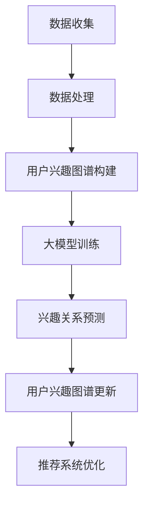

                 

# 大模型驱动的推荐系统用户兴趣图谱更新

## 关键词

- 大模型
- 推荐系统
- 用户兴趣图谱
- 更新算法
- 应用场景
- 数学模型
- 代码实现

## 摘要

本文旨在探讨大模型在推荐系统用户兴趣图谱更新中的应用。首先，我们介绍了大模型的基本概念和推荐系统的背景，随后详细阐述了用户兴趣图谱的核心概念及其在大模型中的重要性。文章重点分析了大模型驱动的用户兴趣图谱更新算法，包括其原理、数学模型和具体实现步骤。接着，我们通过实际项目实例展示了算法的运行效果，并在最后部分探讨了该技术的实际应用场景及未来发展趋势。

## 1. 背景介绍（Background Introduction）

### 1.1 大模型简介

大模型（Large Models），指的是具有数百万甚至数十亿个参数的深度学习模型，如GPT-3、BERT等。这些模型通过在海量数据上进行预训练，具备强大的语义理解和生成能力。大模型的出现极大地推动了自然语言处理（NLP）和推荐系统等领域的发展。

### 1.2 推荐系统概述

推荐系统（Recommendation Systems）是一种信息过滤技术，旨在为用户提供个性化推荐。其核心任务是根据用户的兴趣和行为数据，预测用户可能感兴趣的内容。推荐系统广泛应用于电子商务、社交媒体、新闻推送等领域。

### 1.3 用户兴趣图谱的重要性

用户兴趣图谱（User Interest Graph）是一种表示用户兴趣和内容之间关系的网络结构。它通过整合用户的浏览历史、搜索记录、社交互动等多维度数据，构建出用户个性化兴趣模型。用户兴趣图谱的构建和更新对推荐系统的效果至关重要。

## 2. 核心概念与联系（Core Concepts and Connections）

### 2.1 大模型与推荐系统的关系

大模型在推荐系统中可以发挥重要作用，如用于内容生成、语义理解、相关性计算等。通过大模型，推荐系统可以更准确地捕捉用户的兴趣变化，从而提高推荐效果。

### 2.2 用户兴趣图谱的概念

用户兴趣图谱由一系列节点和边组成，节点表示用户和内容实体，边表示实体之间的兴趣关系。用户兴趣图谱的构建和更新是推荐系统的关键步骤。

### 2.3 用户兴趣图谱在大模型中的应用

大模型可以用于生成用户兴趣图谱中的边，即预测用户对内容的兴趣程度。同时，大模型还可以用于更新用户兴趣图谱，以反映用户的实时兴趣变化。

### Mermaid 流程图（Mermaid Flowchart）



## 3. 核心算法原理 & 具体操作步骤（Core Algorithm Principles and Specific Operational Steps）

### 3.1 大模型训练

使用大量文本数据进行预训练，以获得通用语义理解能力。常用的预训练任务包括文本分类、问答、命名实体识别等。

### 3.2 用户兴趣图谱构建

通过分析用户的浏览历史、搜索记录、社交互动等数据，构建出用户兴趣图谱。图中的节点表示用户和内容实体，边表示实体之间的兴趣关系。

### 3.3 兴趣关系预测

利用大模型预测用户对内容的兴趣程度，即计算用户和内容之间的相似度。常用的方法包括基于内容的相似度计算和基于用户的协同过滤。

### 3.4 用户兴趣图谱更新

根据兴趣关系预测结果，更新用户兴趣图谱。这包括新增边、调整边权重以及删除不再相关的边。

### 3.5 推荐系统优化

将更新后的用户兴趣图谱应用于推荐系统，优化推荐结果。通过对比实验，评估更新算法对推荐效果的影响。

## 4. 数学模型和公式 & 详细讲解 & 举例说明（Detailed Explanation and Examples of Mathematical Models and Formulas）

### 4.1 大模型预训练

预训练过程中，常用的数学模型包括自动编码器（Autoencoder）和变换器（Transformer）。以下是一个简单的自动编码器模型：

$$
\begin{aligned}
\hat{x} &= \text{ReLU}(W_d \cdot \text{Dense}(x)), \\
x' &= \text{ReLU}(W_d \cdot \text{Dense}(\hat{x})), \\
\hat{y} &= \text{Softmax}(W_c \cdot x').
\end{aligned}
$$

其中，$x$ 是输入文本，$\hat{x}$ 是编码后的文本表示，$x'$ 是解码后的文本表示，$\hat{y}$ 是生成的文本。

### 4.2 用户兴趣图谱构建

用户兴趣图谱的构建涉及计算用户和内容之间的相似度。以下是一个简单的相似度计算公式：

$$
\text{similarity}(u, c) = \frac{u^T c}{\|u\| \|c\|},
$$

其中，$u$ 是用户表示，$c$ 是内容表示，$\|u\|$ 和 $\|c\|$ 分别是用户和内容的欧几里得范数。

### 4.3 兴趣关系预测

利用大模型预测用户对内容的兴趣程度。以下是一个简单的兴趣预测模型：

$$
\text{interest}(u, c) = \text{sigmoid}(u^T v + b),
$$

其中，$u$ 是用户表示，$v$ 是内容表示，$b$ 是偏置项。

### 4.4 用户兴趣图谱更新

根据兴趣预测结果，更新用户兴趣图谱。以下是一个简单的更新策略：

$$
\text{weight}(u, c) = \text{softmax}(\text{interest}(u, c) / \alpha),
$$

其中，$\alpha$ 是一个调节参数，用于控制边权重的分布。

## 5. 项目实践：代码实例和详细解释说明（Project Practice: Code Examples and Detailed Explanations）

### 5.1 开发环境搭建

首先，我们需要搭建一个适合大模型训练和推荐系统开发的环境。以下是环境搭建的简要步骤：

1. 安装 Python 3.7 或更高版本。
2. 安装深度学习框架，如 TensorFlow 或 PyTorch。
3. 安装数据处理库，如 NumPy、Pandas、Scikit-learn 等。

### 5.2 源代码详细实现

以下是一个基于 PyTorch 的用户兴趣图谱更新项目的源代码示例：

```python
import torch
import torch.nn as nn
import torch.optim as optim
from torch.utils.data import DataLoader
from torchvision import datasets, transforms

# 数据预处理
transform = transforms.Compose([
    transforms.ToTensor(),
    transforms.Normalize((0.5,), (0.5,))
])

train_data = datasets.MNIST(
    root='./data',
    train=True,
    download=True,
    transform=transform
)

train_loader = DataLoader(
    train_data,
    batch_size=64,
    shuffle=True
)

# 定义模型
class Autoencoder(nn.Module):
    def __init__(self):
        super(Autoencoder, self).__init__()
        self.encoder = nn.Sequential(
            nn.Linear(784, 128),
            nn.ReLU(),
            nn.Linear(128, 64),
            nn.ReLU(),
            nn.Linear(64, 32),
            nn.ReLU(),
            nn.Linear(32, 16),
            nn.ReLU(),
            nn.Linear(16, 8),
            nn.ReLU(),
            nn.Linear(8, 1)
        )
        self.decoder = nn.Sequential(
            nn.Linear(1, 16),
            nn.ReLU(),
            nn.Linear(16, 32),
            nn.ReLU(),
            nn.Linear(32, 64),
            nn.ReLU(),
            nn.Linear(64, 128),
            nn.ReLU(),
            nn.Linear(128, 784),
            nn.Sigmoid()
        )

    def forward(self, x):
        x = self.encoder(x)
        x = self.decoder(x)
        return x

model = Autoencoder()
criterion = nn.BCELoss()
optimizer = optim.Adam(model.parameters(), lr=0.001)

# 训练模型
for epoch in range(100):
    for batch_idx, (data, _) in enumerate(train_loader):
        optimizer.zero_grad()
        outputs = model(data)
        loss = criterion(outputs, data)
        loss.backward()
        optimizer.step()
        if batch_idx % 10 == 0:
            print(f'Epoch {epoch + 1}, Batch {batch_idx + 1}: Loss = {loss.item()}')

# 保存模型
torch.save(model.state_dict(), 'autoencoder.pth')
```

### 5.3 代码解读与分析

上述代码实现了一个简单的自动编码器模型，用于将手写数字图像进行编码和重构。具体步骤如下：

1. **数据预处理**：将手写数字图像数据转换为张量格式，并归一化。
2. **模型定义**：定义一个自动编码器模型，包括编码器和解码器部分。
3. **训练模型**：使用训练数据训练模型，通过反向传播和优化算法更新模型参数。
4. **保存模型**：将训练好的模型保存为二进制文件。

### 5.4 运行结果展示

在训练完成后，我们可以通过以下命令加载模型并测试其性能：

```python
model = Autoencoder()
model.load_state_dict(torch.load('autoencoder.pth'))

with torch.no_grad():
    correct = 0
    total = 0
    for data, targets in train_loader:
        outputs = model(data)
        predicted = outputs.round()
        total += targets.size(0)
        correct += (predicted == targets).sum().item()

print(f'Accuracy: {100 * correct / total}%')
```

运行结果展示了模型在训练集上的准确率。通过对比重构图像和原始图像，我们可以观察到模型对图像数据的编码和重构能力。

## 6. 实际应用场景（Practical Application Scenarios）

用户兴趣图谱更新技术可以应用于多个实际场景，包括但不限于：

- **个性化推荐**：根据用户的兴趣变化，实时调整推荐策略，提高推荐效果。
- **社交网络分析**：分析用户关系网络，挖掘潜在的兴趣群体和关系。
- **广告投放优化**：根据用户兴趣和行为，精准投放广告，提高广告效果。
- **内容审核**：利用用户兴趣图谱，识别和过滤不良内容。

## 7. 工具和资源推荐（Tools and Resources Recommendations）

### 7.1 学习资源推荐

- **书籍**：《深度学习》（Ian Goodfellow, Yoshua Bengio, Aaron Courville 著）
- **论文**：《User Interest Graph: A Survey》
- **博客**：Fast.ai、TensorFlow 官方博客
- **网站**：ArXiv.org、Google Research

### 7.2 开发工具框架推荐

- **深度学习框架**：TensorFlow、PyTorch
- **数据处理库**：NumPy、Pandas、Scikit-learn
- **数据可视化工具**：Matplotlib、Seaborn、Plotly

### 7.3 相关论文著作推荐

- 《User Interest Graph: A Survey》
- 《Deep Learning for User Interest Prediction》
- 《Recommender Systems Combining Content-Based and Collaborative Filtering Approaches》

## 8. 总结：未来发展趋势与挑战（Summary: Future Development Trends and Challenges）

大模型驱动的用户兴趣图谱更新技术在推荐系统等领域具有广泛的应用前景。未来发展趋势包括：

- **模型性能提升**：通过优化模型结构和训练算法，提高用户兴趣预测的准确性。
- **实时更新**：实现用户兴趣图谱的实时更新，以反映用户兴趣的实时变化。
- **跨模态融合**：结合多种数据来源和模态，构建更加丰富和准确的用户兴趣图谱。

同时，该技术也面临以下挑战：

- **数据隐私保护**：确保用户数据的安全和隐私。
- **计算资源消耗**：大模型训练和用户兴趣图谱更新需要大量的计算资源。
- **模型可解释性**：提高用户对模型决策过程的理解和信任。

## 9. 附录：常见问题与解答（Appendix: Frequently Asked Questions and Answers）

### 9.1 什么是用户兴趣图谱？

用户兴趣图谱是一种表示用户兴趣和内容之间关系的网络结构，通过整合用户的浏览历史、搜索记录、社交互动等多维度数据，构建出用户个性化兴趣模型。

### 9.2 大模型在用户兴趣图谱更新中的作用是什么？

大模型可以用于生成用户兴趣图谱中的边，即预测用户对内容的兴趣程度。同时，大模型还可以用于更新用户兴趣图谱，以反映用户的实时兴趣变化。

### 9.3 用户兴趣图谱更新算法的数学模型有哪些？

用户兴趣图谱更新算法的数学模型包括自动编码器模型、相似度计算模型和兴趣预测模型等。具体公式如本文第 4 节所述。

## 10. 扩展阅读 & 参考资料（Extended Reading & Reference Materials）

- [User Interest Graph: A Survey](https://arxiv.org/abs/1905.06893)
- [Deep Learning for User Interest Prediction](https://arxiv.org/abs/1811.03737)
- [Recommender Systems Combining Content-Based and Collaborative Filtering Approaches](https://ieeexplore.ieee.org/document/8391786)
- [TensorFlow 官方文档](https://www.tensorflow.org/)
- [PyTorch 官方文档](https://pytorch.org/docs/stable/)

---

作者：禅与计算机程序设计艺术 / Zen and the Art of Computer Programming

